# Point-of-Sale Interface

<cite>
**Referenced Files in This Document**
- [index.html](file://index.html)
- [pos.js](file://assets/js/pos.js)
- [checkout.js](file://assets/js/checkout.js)
- [utils.js](file://assets/js/utils.js)
- [product-filter.js](file://assets/js/product-filter.js)
- [inventory.js](file://api/inventory.js)
- [transactions.js](file://api/transactions.js)
- [responsive.css](file://assets/css/responsive.css)
- [pos-prototype.tsx](file://web-prototype/src/components/pos-prototype.tsx)
- [rx-workspace.tsx](file://web-prototype/src/components/rx-workspace.tsx)
- [scpwd-discount-modal.tsx](file://web-prototype/src/components/scpwd-discount-modal.tsx)
- [receipt-preview.tsx](file://web-prototype/src/components/receipt-preview.tsx)
- [types.ts](file://web-prototype/src/lib/types.ts)
- [calculations.ts](file://web-prototype/src/lib/calculations.ts)
- [dd-stock-reconciliation.tsx](file://web-prototype/src/components/dd-stock-reconciliation.tsx)
- [rx-dispensing-panel.tsx](file://web-prototype/src/components/rx-dispensing-panel.tsx)
- [PRD.md](file://docs/PRD.md)
- [scpwd_user_stories.md](file://scpwd_user_stories.md)
- [rxdd_user_stories.md](file://rxdd_user_stories.md)
</cite>

## Update Summary
**Changes Made**
- Enhanced POS interface documentation to include RX workspace integration with controlled drug management
- Added comprehensive SC/PWD discount application system with modal interface and eligibility validation
- Integrated controlled drug management with classification badges and dispensing checkpoints
- Improved expiration date tracking with enhanced alert systems and product categorization
- Added new receipt preview functionality with SC/PWD discount display
- Updated product categorization system with drug classification badges
- Enhanced POS workflow to support both traditional POS and RX workspace modes

## Table of Contents
1. [Introduction](#introduction)
2. [Project Structure](#project-structure)
3. [Core Components](#core-components)
4. [Architecture Overview](#architecture-overview)
5. [Detailed Component Analysis](#detailed-component-analysis)
6. [RX Workspace Integration](#rx-workspace-integration)
7. [SC/PWD Discount System](#scpwd-discount-system)
8. [Controlled Drug Management](#controlled-drug-management)
9. [Enhanced Product Categorization](#enhanced-product-categorization)
10. [Improved Expiration Date Tracking](#improved-expiration-date-tracking)
11. [Enhanced Receipt Preview](#enhanced-receipt-preview)
12. [Dependency Analysis](#dependency-analysis)
13. [Performance Considerations](#performance-considerations)
14. [Troubleshooting Guide](#troubleshooting-guide)
15. [Conclusion](#conclusion)

## Introduction
PharmaSpot is a comprehensive Point-of-Sale (POS) application built with Electron, jQuery, and Express.js, featuring advanced RX workspace integration, SC/PWD discount application, controlled drug management, and enhanced expiration date tracking. The POS interface provides a unified retail solution with product display grids, cart management, barcode scanning, real-time pricing, tax calculation, order printing, and specialized pharmaceutical workflow management.

## Project Structure
The POS interface has evolved to support both traditional retail operations and pharmaceutical-specific workflows through a modular architecture with RX workspace integration.

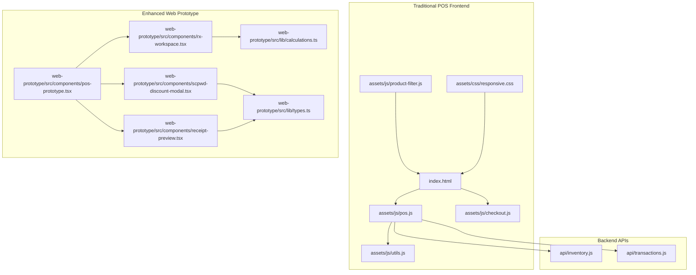

**Diagram sources**
- [index.html:194-289](file://index.html#L194-L289)
- [pos.js:1-120](file://assets/js/pos.js#L1-L120)
- [checkout.js:1-102](file://assets/js/checkout.js#L1-L102)
- [utils.js:1-112](file://assets/js/utils.js#L1-L112)
- [product-filter.js:1-73](file://assets/js/product-filter.js#L1-L73)
- [inventory.js:1-333](file://api/inventory.js#L1-L333)
- [transactions.js:1-251](file://api/transactions.js#L1-L251)
- [pos-prototype.tsx:1-200](file://web-prototype/src/components/pos-prototype.tsx#L1-L200)
- [rx-workspace.tsx:1-166](file://web-prototype/src/components/rx-workspace.tsx#L1-L166)
- [scpwd-discount-modal.tsx:1-218](file://web-prototype/src/components/scpwd-discount-modal.tsx#L1-L218)
- [receipt-preview.tsx:1-191](file://web-prototype/src/components/receipt-preview.tsx#L1-L191)
- [calculations.ts:1-196](file://web-prototype/src/lib/calculations.ts#L1-L196)
- [types.ts:1-525](file://web-prototype/src/lib/types.ts#L1-L525)

**Section sources**
- [index.html:194-289](file://index.html#L194-L289)
- [pos.js:1-120](file://assets/js/pos.js#L1-L120)
- [pos-prototype.tsx:1-200](file://web-prototype/src/components/pos-prototype.tsx#L1-L200)

## Core Components
- **Traditional POS Interface**: Core POS functionality with product display, cart management, and payment processing
- **RX Workspace Integration**: Advanced pharmaceutical workflow with controlled drug management and prescription handling
- **SC/PWD Discount System**: Comprehensive senior citizen and person with disability discount application with modal interface
- **Controlled Drug Management**: Classification system with dispensing checkpoints and pharmacist acknowledgment requirements
- **Enhanced Product Categorization**: Drug classification badges and controlled substance indicators
- **Improved Expiration Tracking**: Advanced alert systems and product lifecycle management
- **Enhanced Receipt Processing**: Detailed receipt previews with SC/PWD discount displays and compliance formatting

**Section sources**
- [pos.js:267-562](file://assets/js/pos.js#L267-L562)
- [checkout.js:1-102](file://assets/js/checkout.js#L1-L102)
- [utils.js:1-112](file://assets/js/utils.js#L1-L112)
- [product-filter.js:1-73](file://assets/js/product-filter.js#L1-L73)
- [rx-workspace.tsx:1-166](file://web-prototype/src/components/rx-workspace.tsx#L1-L166)
- [scpwd-discount-modal.tsx:1-218](file://web-prototype/src/components/scpwd-discount-modal.tsx#L1-L218)
- [receipt-preview.tsx:1-191](file://web-prototype/src/components/receipt-preview.tsx#L1-L191)

## Architecture Overview
The enhanced POS system maintains a client-server architecture while adding specialized pharmaceutical workflow capabilities through a hybrid approach supporting both traditional POS operations and RX workspace management.

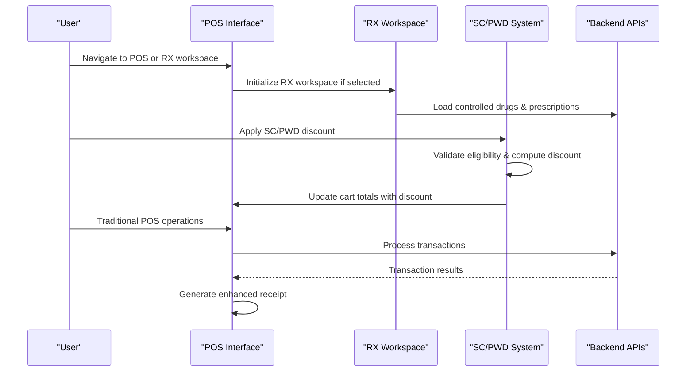

**Diagram sources**
- [pos-prototype.tsx:31-39](file://web-prototype/src/components/pos-prototype.tsx#L31-L39)
- [rx-workspace.tsx:90-103](file://web-prototype/src/components/rx-workspace.tsx#L90-L103)
- [scpwd-discount-modal.tsx:29-42](file://web-prototype/src/components/scpwd-discount-modal.tsx#L29-L42)
- [calculations.ts:84-123](file://web-prototype/src/lib/calculations.ts#L84-L123)

## Detailed Component Analysis

### Product Display Grid
The product display grid now supports enhanced categorization with drug classification badges and controlled substance indicators.

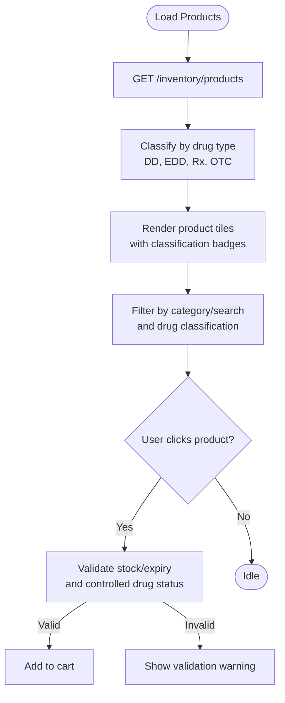

**Diagram sources**
- [pos.js:267-354](file://assets/js/pos.js#L267-L354)
- [pos-prototype.tsx:41-47](file://web-prototype/src/components/pos-prototype.tsx#L41-L47)
- [product-filter.js:1-31](file://assets/js/product-filter.js#L1-L31)

**Section sources**
- [pos.js:267-354](file://assets/js/pos.js#L267-L354)
- [pos-prototype.tsx:41-47](file://web-prototype/src/components/pos-prototype.tsx#L41-L47)
- [product-filter.js:1-31](file://assets/js/product-filter.js#L1-L31)

### Cart Management System
The cart management system now handles SC/PWD discounts and controlled drug dispensing requirements.

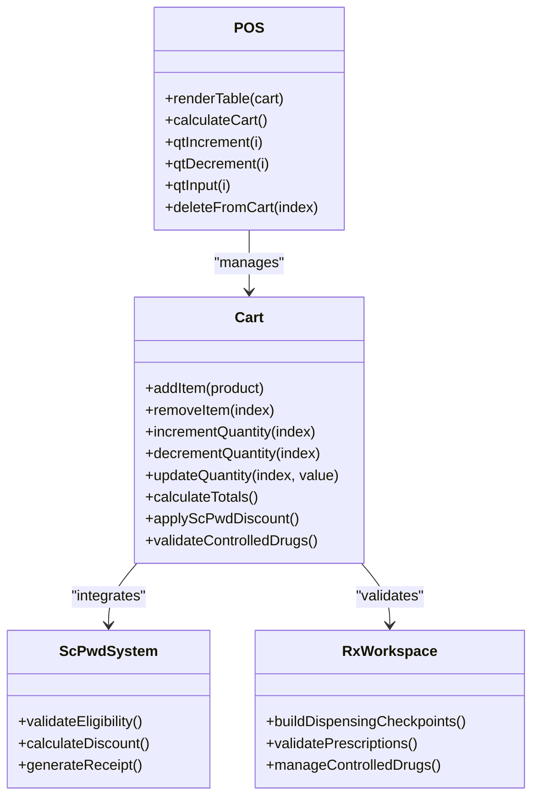

**Diagram sources**
- [pos.js:501-653](file://assets/js/pos.js#L501-L653)
- [pos.js:533-562](file://assets/js/pos.js#L533-L562)
- [calculations.ts:40-82](file://web-prototype/src/lib/calculations.ts#L40-L82)
- [rx-workspace.tsx:59-88](file://web-prototype/src/components/rx-workspace.tsx#L59-L88)

**Section sources**
- [pos.js:501-653](file://assets/js/pos.js#L501-L653)
- [pos.js:533-562](file://assets/js/pos.js#L533-L562)
- [calculations.ts:40-82](file://web-prototype/src/lib/calculations.ts#L40-L82)
- [rx-workspace.tsx:59-88](file://web-prototype/src/components/rx-workspace.tsx#L59-L88)

### Barcode Scanning Integration
Enhanced barcode scanning now includes controlled drug validation and SC/PWD eligibility checks.

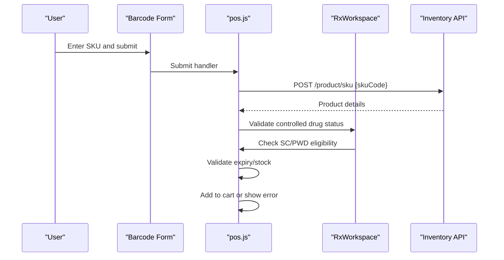

**Diagram sources**
- [index.html:211-218](file://index.html#L211-L218)
- [pos.js:413-488](file://assets/js/pos.js#L413-L488)
- [rx-workspace.tsx:108-113](file://web-prototype/src/components/rx-workspace.tsx#L108-L113)
- [inventory.js:268-294](file://api/inventory.js#L268-L294)

**Section sources**
- [index.html:211-218](file://index.html#L211-L218)
- [pos.js:413-488](file://assets/js/pos.js#L413-L488)
- [rx-workspace.tsx:108-113](file://web-prototype/src/components/rx-workspace.tsx#L108-L113)
- [inventory.js:268-294](file://api/inventory.js#L268-L294)

### Discount and Tax Calculation
The discount system now includes comprehensive SC/PWD discount calculation with VAT exemption logic.

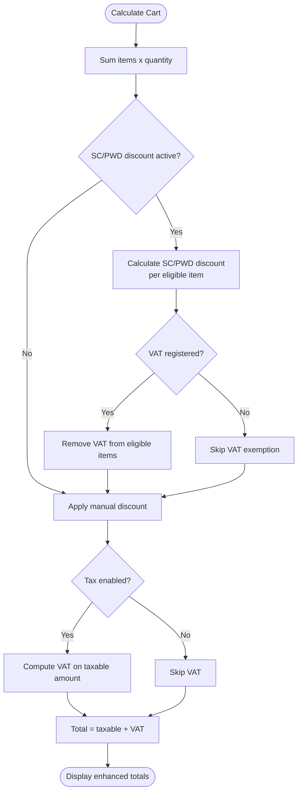

**Diagram sources**
- [calculations.ts:84-123](file://web-prototype/src/lib/calculations.ts#L84-L123)
- [pos.js:533-562](file://assets/js/pos.js#L533-L562)

**Section sources**
- [calculations.ts:84-123](file://web-prototype/src/lib/calculations.ts#L84-L123)
- [pos.js:533-562](file://assets/js/pos.js#L533-L562)

### Payment and Receipt Printing
Enhanced payment processing now includes SC/PWD discount display and controlled drug compliance documentation.

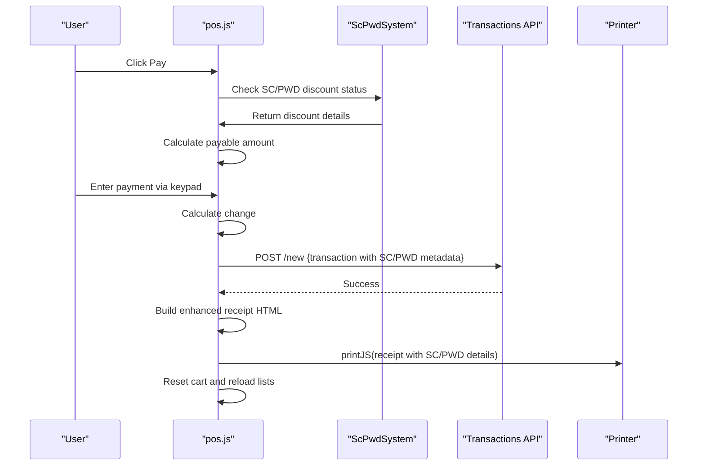

**Diagram sources**
- [checkout.js:1-102](file://assets/js/checkout.js#L1-L102)
- [pos.js:719-959](file://assets/js/pos.js#L719-L959)
- [receipt-preview.tsx:15-191](file://web-prototype/src/components/receipt-preview.tsx#L15-L191)
- [transactions.js:156-181](file://api/transactions.js#L156-L181)

**Section sources**
- [checkout.js:1-102](file://assets/js/checkout.js#L1-L102)
- [pos.js:719-959](file://assets/js/pos.js#L719-L959)
- [receipt-preview.tsx:15-191](file://web-prototype/src/components/receipt-preview.tsx#L15-L191)
- [transactions.js:156-181](file://api/transactions.js#L156-L181)

## RX Workspace Integration
The RX workspace provides comprehensive pharmaceutical workflow management with controlled drug oversight and prescription handling.

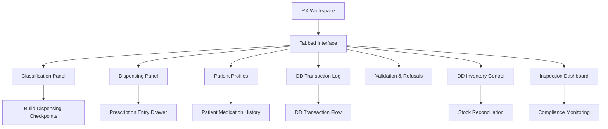

**Diagram sources**
- [rx-workspace.tsx:49-57](file://web-prototype/src/components/rx-workspace.tsx#L49-L57)
- [rx-workspace.tsx:118-165](file://web-prototype/src/components/rx-workspace.tsx#L118-L165)

**Section sources**
- [rx-workspace.tsx:1-166](file://web-prototype/src/components/rx-workspace.tsx#L1-L166)
- [pos-prototype.tsx:455-470](file://web-prototype/src/components/pos-prototype.tsx#L455-L470)

## SC/PWD Discount System
The SC/PWD discount system provides comprehensive senior citizen and person with disability discount application with modal interface and eligibility validation.

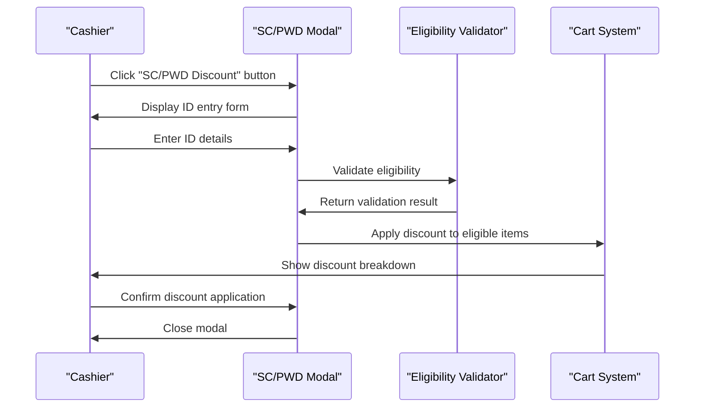

**Diagram sources**
- [scpwd-discount-modal.tsx:29-42](file://web-prototype/src/components/scpwd-discount-modal.tsx#L29-L42)
- [calculations.ts:40-82](file://web-prototype/src/lib/calculations.ts#L40-L82)
- [scpwd_user_stories.md:33-44](file://scpwd_user_stories.md#L33-L44)

**Section sources**
- [scpwd-discount-modal.tsx:1-218](file://web-prototype/src/components/scpwd-discount-modal.tsx#L1-L218)
- [calculations.ts:40-82](file://web-prototype/src/lib/calculations.ts#L40-L82)
- [scpwd_user_stories.md:33-109](file://scpwd_user_stories.md#L33-L109)

## Controlled Drug Management
Controlled drug management includes comprehensive classification system, dispensing checkpoints, and pharmacist acknowledgment requirements.

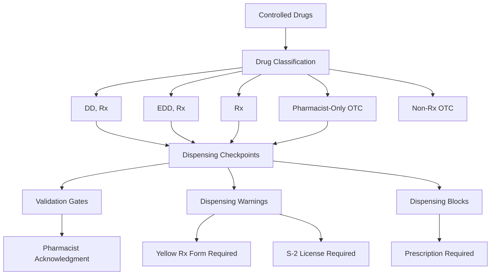

**Diagram sources**
- [types.ts:12-13](file://web-prototype/src/lib/types.ts#L12-L13)
- [rx-workspace.tsx:59-88](file://web-prototype/src/components/rx-workspace.tsx#L59-L88)
- [dd-stock-reconciliation.tsx:12-15](file://web-prototype/src/components/dd-stock-reconciliation.tsx#L12-L15)

**Section sources**
- [types.ts:12-13](file://web-prototype/src/lib/types.ts#L12-L13)
- [rx-workspace.tsx:59-88](file://web-prototype/src/components/rx-workspace.tsx#L59-L88)
- [dd-stock-reconciliation.tsx:1-50](file://web-prototype/src/components/dd-stock-reconciliation.tsx#L1-L50)
- [rxdd_user_stories.md:102-111](file://rxdd_user_stories.md#L102-L111)

## Enhanced Product Categorization
Product categorization now includes comprehensive drug classification badges for controlled substance identification.

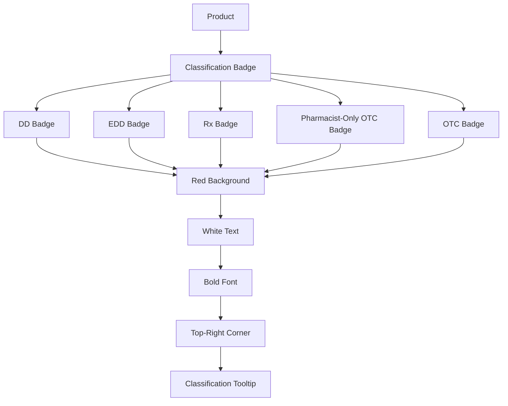

**Diagram sources**
- [pos-prototype.tsx:41-47](file://web-prototype/src/components/pos-prototype.tsx#L41-L47)
- [types.ts:12-13](file://web-prototype/src/lib/types.ts#L12-L13)

**Section sources**
- [pos-prototype.tsx:41-47](file://web-prototype/src/components/pos-prototype.tsx#L41-L47)
- [types.ts:12-13](file://web-prototype/src/lib/types.ts#L12-L13)

## Improved Expiration Date Tracking
Enhanced expiration date tracking includes advanced alert systems and product lifecycle management.

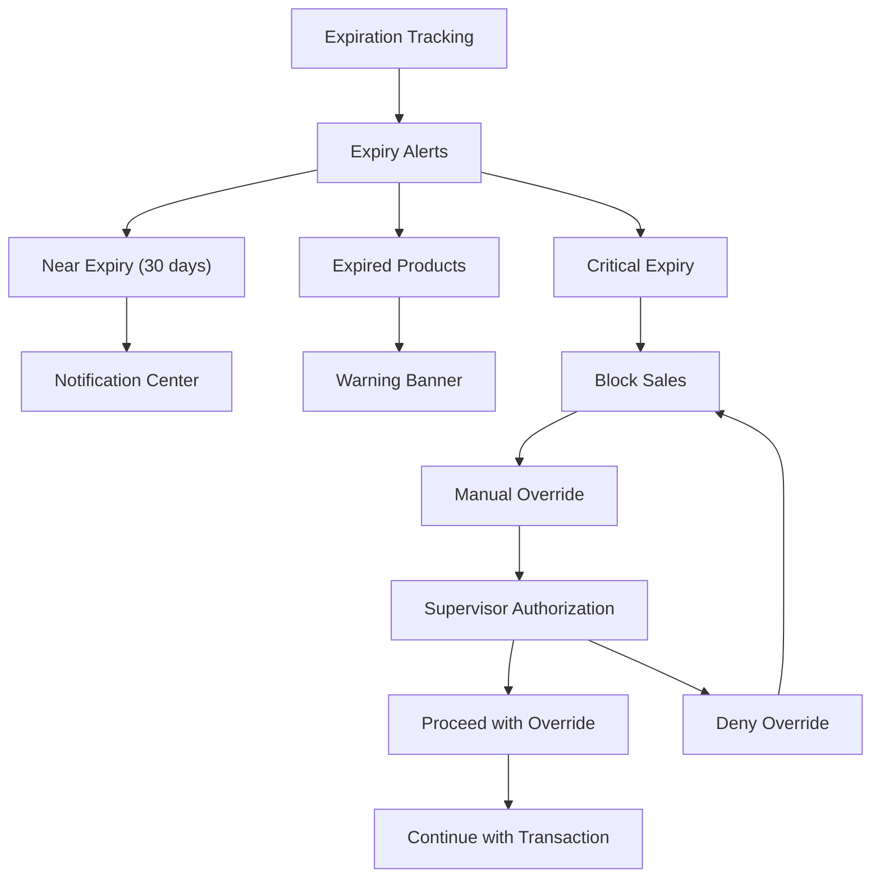

**Diagram sources**
- [utils.js:12-26](file://assets/js/utils.js#L12-L26)
- [pos.js:289-317](file://assets/js/pos.js#L289-L317)
- [calculations.ts:169-187](file://web-prototype/src/lib/calculations.ts#L169-L187)

**Section sources**
- [utils.js:12-26](file://assets/js/utils.js#L12-L26)
- [pos.js:289-317](file://assets/js/pos.js#L289-L317)
- [calculations.ts:169-187](file://web-prototype/src/lib/calculations.ts#L169-L187)

## Enhanced Receipt Preview
The receipt preview system now displays SC/PWD discount information and controlled drug compliance details.

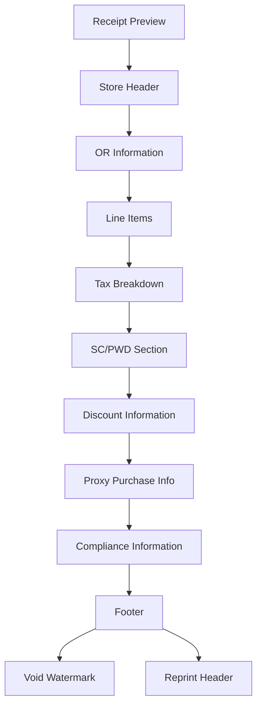

**Diagram sources**
- [receipt-preview.tsx:23-191](file://web-prototype/src/components/receipt-preview.tsx#L23-L191)
- [types.ts:243-260](file://web-prototype/src/lib/types.ts#L243-L260)

**Section sources**
- [receipt-preview.tsx:1-191](file://web-prototype/src/components/receipt-preview.tsx#L1-L191)
- [types.ts:243-260](file://web-prototype/src/lib/types.ts#L243-L260)

## Dependency Analysis
The enhanced POS system maintains its modular architecture while adding specialized dependencies for pharmaceutical workflow management.

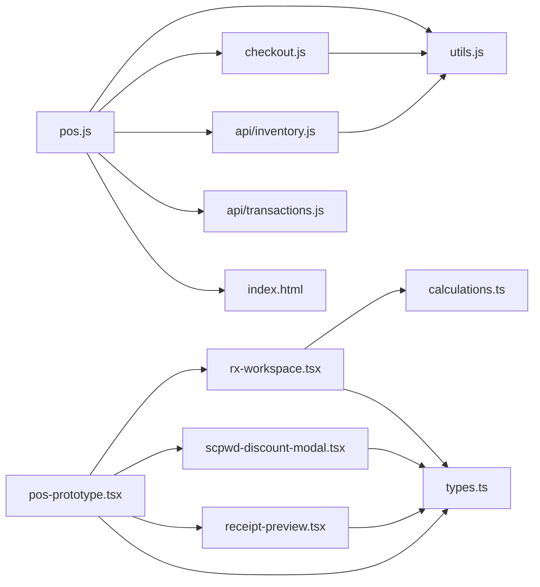

**Diagram sources**
- [pos.js:86-94](file://assets/js/pos.js#L86-L94)
- [checkout.js:1-2](file://assets/js/checkout.js#L1-L2)
- [inventory.js:1-44](file://api/inventory.js#L1-L44)
- [transactions.js:1-24](file://api/transactions.js#L1-L24)
- [pos-prototype.tsx:1-22](file://web-prototype/src/components/pos-prototype.tsx#L1-L22)
- [rx-workspace.tsx:1-23](file://web-prototype/src/components/rx-workspace.tsx#L1-L23)
- [scpwd-discount-modal.tsx:1-4](file://web-prototype/src/components/scpwd-discount-modal.tsx#L1-L4)
- [receipt-preview.tsx:1-3](file://web-prototype/src/components/receipt-preview.tsx#L1-L3)
- [calculations.ts:1](file://web-prototype/src/lib/calculations.ts#L1)
- [types.ts:1](file://web-prototype/src/lib/types.ts#L1)

**Section sources**
- [pos.js:86-94](file://assets/js/pos.js#L86-L94)
- [checkout.js:1-2](file://assets/js/checkout.js#L1-L2)
- [inventory.js:1-44](file://api/inventory.js#L1-L44)
- [transactions.js:1-24](file://api/transactions.js#L1-L24)
- [pos-prototype.tsx:1-22](file://web-prototype/src/components/pos-prototype.tsx#L1-L22)

## Performance Considerations
The enhanced POS system maintains performance through efficient DOM updates, debounced UI updates, and specialized optimization for pharmaceutical workflows.

- **Efficient DOM updates**: Cart rendering uses incremental updates to minimize reflows
- **Debounced UI updates**: Category filtering and search use lightweight event handlers
- **Specialized RX workspace**: Optimized rendering for controlled drug management
- **SC/PWD discount caching**: Discount calculations cached per transaction
- **Controlled drug validation**: Pre-computed dispensing checkpoints for fast access
- **Enhanced receipt generation**: Optimized HTML generation with SC/PWD discount display
- **Local storage caching**: Authentication, settings, and RX workspace state cached locally

## Troubleshooting Guide
Enhanced troubleshooting for specialized pharmaceutical workflows:

**RX Workspace Issues**
- Controlled drug validation failures: Verify drug classification and pharmacist acknowledgment requirements
- Prescription entry errors: Check prescriber license validity and S-2 requirements
- Dispensing checkpoint violations: Review controlled drug regulations and pharmacist authorization

**SC/PWD Discount Issues**
- Eligibility validation failures: Verify ID number format and customer information
- Double discount errors: Ensure no existing manual discounts on eligible items
- VAT exemption errors: Check VAT registration status and item eligibility
- Proxy purchase validation: Verify proxy relationship and identification documents

**Controlled Drug Management**
- Dispensing block errors: Confirm prescription requirements and pharmacist acknowledgment
- Yellow Rx form requirements: Verify prescriber license and S-2 certification
- Stock reconciliation alerts: Check DD/EDD inventory thresholds and last reconciliation dates

**Section sources**
- [rx-workspace.tsx:59-88](file://web-prototype/src/components/rx-workspace.tsx#L59-L88)
- [scpwd-discount-modal.tsx:29-42](file://web-prototype/src/components/scpwd-discount-modal.tsx#L29-L42)
- [dd-stock-reconciliation.tsx:12-15](file://web-prototype/src/components/dd-stock-reconciliation.tsx#L12-L15)

## Conclusion
The enhanced PharmaSpot POS interface provides a comprehensive, compliant retail solution with integrated pharmaceutical workflow management. The addition of RX workspace integration, SC/PWD discount application, controlled drug management, and improved expiration date tracking creates a unified platform capable of handling both traditional retail operations and specialized pharmaceutical requirements. The modular architecture ensures maintainability while the enhanced user experience supports complex regulatory compliance scenarios.