# Printer Management System

<cite>
**Referenced Files in This Document**
- [thermal_printer_user_stories.md](file://thermal_printer_user_stories.md)
- [PRD.md](file://docs/PRD.md)
- [printer-settings.tsx](file://web-prototype/src/components/printer-settings.tsx)
- [printer-status.tsx](file://web-prototype/src/components/printer-status.tsx)
- [reprint-queue.tsx](file://web-prototype/src/components/reprint-queue.tsx)
- [print-failure-modal.tsx](file://web-prototype/src/components/print-failure-modal.tsx)
- [receipt-preview.tsx](file://web-prototype/src/components/receipt-preview.tsx)
- [pos-prototype.tsx](file://web-prototype/src/components/pos-prototype.tsx)
- [use-pos-store.ts](file://web-prototype/src/lib/use-pos-store.ts)
- [types.ts](file://web-prototype/src/lib/types.ts)
- [db.ts](file://web-prototype/src/lib/db.ts)
- [globals.css](file://web-prototype/src/app/globals.css)
- [TECH_STACK.md](file://docs/TECH_STACK.md)
- [printer-config.ts](file://web-prototype/src/lib/printer/printer-config.ts)
- [print-queue.ts](file://web-prototype/src/lib/printer/print-queue.ts)
- [printer-service.ts](file://web-prototype/src/lib/printer/printer-service.ts)
- [escpos-commands.ts](file://web-prototype/src/lib/printer/escpos-commands.ts)
- [receipt-content.ts](file://web-prototype/src/lib/printer/receipt-content.ts)
- [web-serial-service.ts](file://web-prototype/src/lib/printer/web-serial-service.ts)
- [web-bluetooth-service.ts](file://web-prototype/src/lib/printer/web-bluetooth-service.ts)
- [lan-bridge-service.ts](file://web-prototype/src/lib/printer/lan-bridge-service.ts)
- [bridge-server.js](file://bridge/bridge-server.js)
</cite>

## Table of Contents
1. [Introduction](#introduction)
2. [System Architecture](#system-architecture)
3. [Core Components](#core-components)
4. [Printer Configuration Management](#printer-configuration-management)
5. [Receipt Printing Workflow](#receipt-printing-workflow)
6. [Reprint Management System](#reprint-management-system)
7. [Printer Status Monitoring](#printer-status-monitoring)
8. [Audit and Compliance](#audit-and-compliance)
9. [Technical Implementation Details](#technical-implementation-details)
10. [Deployment and Integration](#deployment-and-integration)
11. [Troubleshooting Guide](#troubleshooting-guide)
12. [Conclusion](#conclusion)

## Introduction

The Printer Management System is a comprehensive thermal printer solution designed for pharmaceutical POS systems, specifically tailored for BIR (Bureau of Internal Revenue) compliance in the Philippines. This system manages multiple thermal printer profiles, handles official receipt printing, supports reprint functionality, and maintains detailed audit trails for regulatory compliance.

The system integrates seamlessly with the broader PharmaSpot POS ecosystem, providing both desktop and web-based printer management capabilities. It supports various printer connection types including USB, Bluetooth, and LAN networks, with ESC/POS command compatibility for broad hardware vendor support.

**Updated** The printer subsystem has been significantly expanded with a complete ESC/POS command generation layer (`web-prototype/src/lib/printer/`). Receipt content is now built as raw `Uint8Array` byte streams for all receipt variants (normal, void, reprint, x-reading, z-reading, daily-summary). Three connection backends are implemented: Web Serial API for USB, Web Bluetooth API for Bluetooth, and a LAN bridge HTTP service for network printers. A separate Node.js bridge server (`bridge/bridge-server.js`) forwards ESC/POS commands over raw TCP to LAN printers.

**Updated** Printer profiles now support role-based defaults with `defaultForOr` and `defaultForReport` fields. The `resolvePrinterForRole()` function in `printer-config.ts` automatically selects the best available printer for a given role (OR receipt or report). The `applyPrinterRoleDefault()` function ensures only one printer is marked default per role.

**Updated** The print queue is now durable, persisting jobs to an IndexedDB `reprintQueue` store. Each job contains Base64-encoded ESC/POS commands, the target printer profile ID, and status tracking. Jobs expire after 5 minutes. The `completeSale` flow in `use-pos-store.ts` automatically resolves the default OR printer, builds receipt commands, attempts to print, and queues the job on failure.

## System Architecture

The Printer Management System follows a modular React-based architecture with clear separation of concerns:

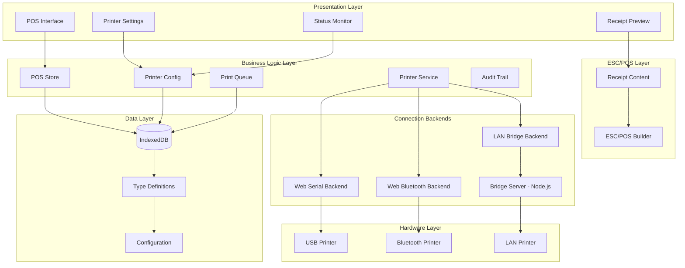

**Diagram sources**
- [pos-prototype.tsx:94-595](file://web-prototype/src/components/pos-prototype.tsx#L94-L595)
- [printer-settings.tsx:6-481](file://web-prototype/src/components/printer-settings.tsx#L6-L481)
- [use-pos-store.ts:73-764](file://web-prototype/src/lib/use-pos-store.ts#L73-L764)
- [printer-config.ts:1-107](file://web-prototype/src/lib/printer/printer-config.ts#L1-L107)
- [print-queue.ts:1-92](file://web-prototype/src/lib/printer/print-queue.ts#L1-L92)
- [printer-service.ts:1-79](file://web-prototype/src/lib/printer/printer-service.ts#L1-L79)

The architecture ensures scalability, maintainability, and regulatory compliance through:

- **Modular Component Design**: Each printer-related functionality is encapsulated in dedicated React components
- **Centralized State Management**: Uses a comprehensive store pattern for managing POS and printer states
- **Type Safety**: Extensive TypeScript definitions ensure data integrity across the system
- **Offline-First Approach**: Built on IndexedDB for reliable operation without network connectivity
- **Regulatory Compliance**: Built-in BIR compliance features and audit trail capabilities

## Core Components

### Printer Profile Management

The system manages multiple printer profiles with comprehensive configuration options:

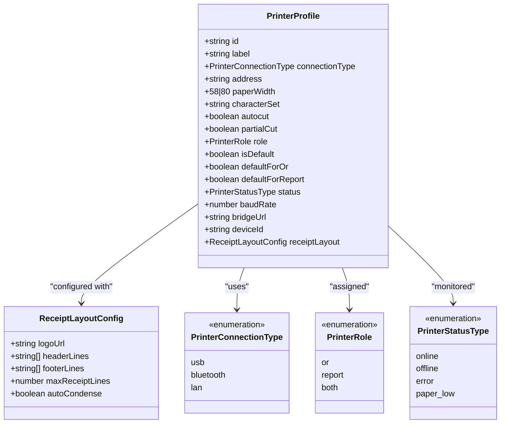

**Diagram sources**
- [types.ts:339-358](file://web-prototype/src/lib/types.ts#L339-L358)
- [types.ts:367-373](file://web-prototype/src/lib/types.ts#L367-L373)
- [types.ts:335-337](file://web-prototype/src/lib/types.ts#L335-L337)

### Print Job Lifecycle

The system implements a comprehensive print job management lifecycle:

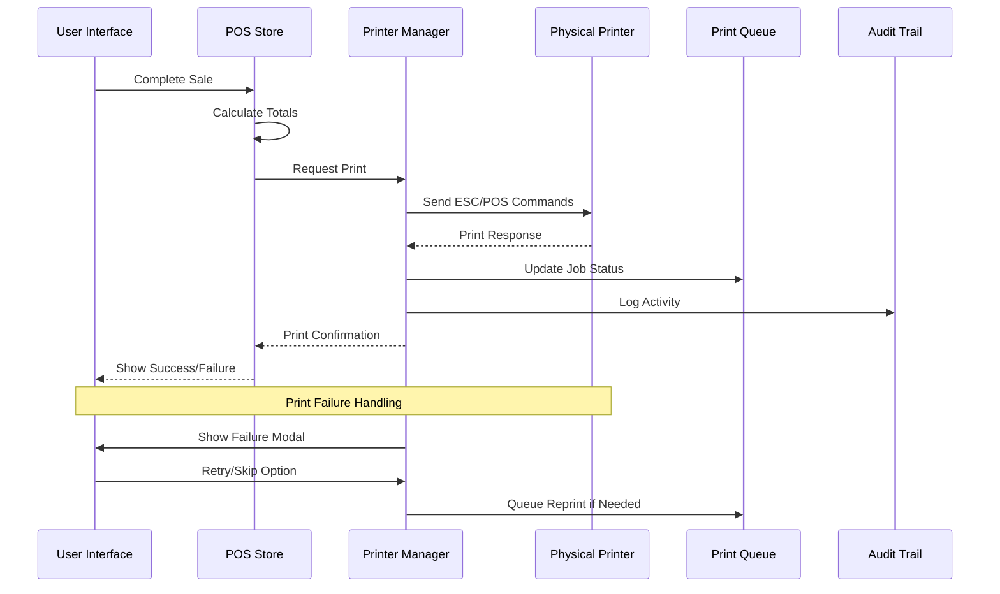

**Diagram sources**
- [use-pos-store.ts:261-358](file://web-prototype/src/lib/use-pos-store.ts#L261-L358)
- [print-failure-modal.tsx:11-75](file://web-prototype/src/components/print-failure-modal.tsx#L11-L75)
- [reprint-queue.tsx:25-95](file://web-prototype/src/components/reprint-queue.tsx#L25-L95)

**Section sources**
- [printer-settings.tsx:79-134](file://web-prototype/src/components/printer-settings.tsx#L79-L134)
- [types.ts:338-350](file://web-prototype/src/lib/types.ts#L338-L350)

## Printer Configuration Management

### Multi-Printer Profile Support

The system supports multiple printer configurations with role-based assignment:

| Printer Role | Description | Typical Use Case |
|--------------|-------------|------------------|
| OR Printer | Handles official receipt printing | Cash registers, customer counters |
| Report Printer | Prints BIR reports and summaries | Back office, management area |
| Both | Supports both receipt and report printing | Central locations with multiple functions |

### Connection Type Configuration

The system accommodates various printer connection methods:

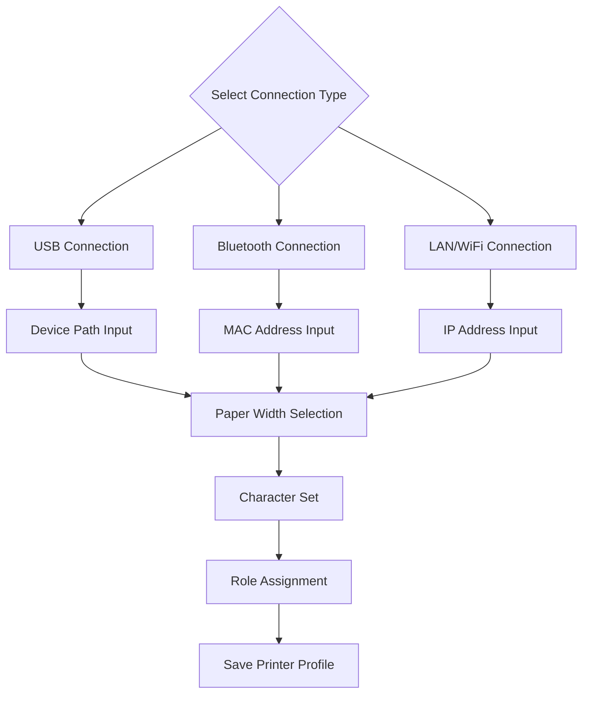

**Diagram sources**
- [printer-settings.tsx:164-248](file://web-prototype/src/components/printer-settings.tsx#L164-L248)
- [printer-settings.tsx:201-209](file://web-prototype/src/components/printer-settings.tsx#L201-L209)

**Section sources**
- [printer-settings.tsx:164-248](file://web-prototype/src/components/printer-settings.tsx#L164-L248)
- [printer-settings.tsx:272-306](file://web-prototype/src/components/printer-settings.tsx#L272-L306)

## Receipt Printing Workflow

### Official Receipt Generation

The system generates BIR-compliant official receipts with comprehensive field coverage:

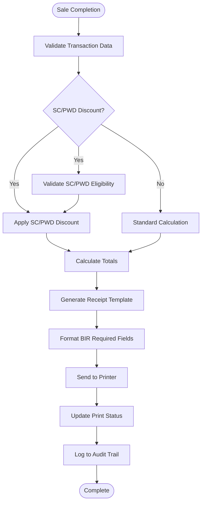

**Diagram sources**
- [receipt-preview.tsx:15-191](file://web-prototype/src/components/receipt-preview.tsx#L15-L191)
- [use-pos-store.ts:261-358](file://web-prototype/src/lib/use-pos-store.ts#L261-L358)

### Receipt Template Structure

The receipt template includes all mandatory BIR fields:

| Field Category | Required Information | Example Content |
|----------------|---------------------|-----------------|
| Business Header | Store name, address, TIN | "PharmaSpot Drug Store 123 Main Street, Quezon City TIN: 123-456-789-000" |
| Receipt Details | OR number, date/time | "OR #: 000049920 Date: 04/25/2026 14:30" |
| Line Items | Product, quantity, price, amount | "Biogesic 500mg x 2 ₱30.00" |
| Tax Breakdown | Subtotal, VAT, exempt sales | "Subtotal: ₱1,492.50 VAT Amount (12%): ₱159.91" |
| Payment Details | Method, amount tendered, change | "Cash Amount Tendered: ₱1,500.00 Change: ₱7.50" |
| SC/PWD Information | Discount details, signature | "SC Discount Applied Customer: Juan dela Cruz Discount Amount: ₱250.00" |

**Section sources**
- [receipt-preview.tsx:41-170](file://web-prototype/src/components/receipt-preview.tsx#L41-L170)
- [thermal_printer_user_stories.md:251-258](file://thermal_printer_user_stories.md#L251-L258)

## Reprint Management System

### Reprint Queue Architecture

The system implements a sophisticated reprint queue with status tracking and expiration handling:

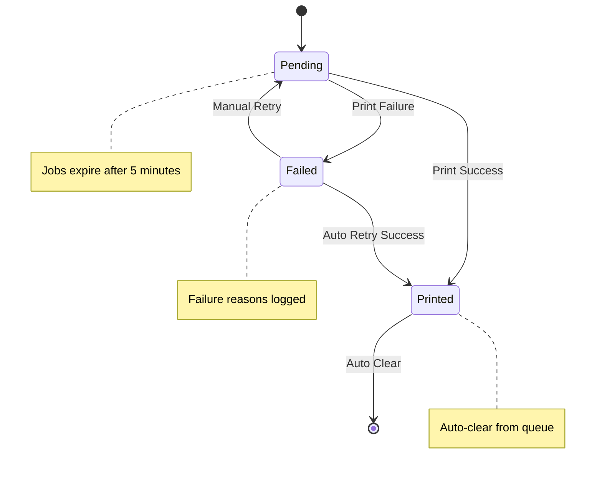

**Diagram sources**
- [reprint-queue.tsx:25-95](file://web-prototype/src/components/reprint-queue.tsx#L25-L95)
- [types.ts:457-464](file://web-prototype/src/lib/types.ts#L457-L464)

### Reprint Authorization Workflow

The system enforces proper authorization for reprint requests:

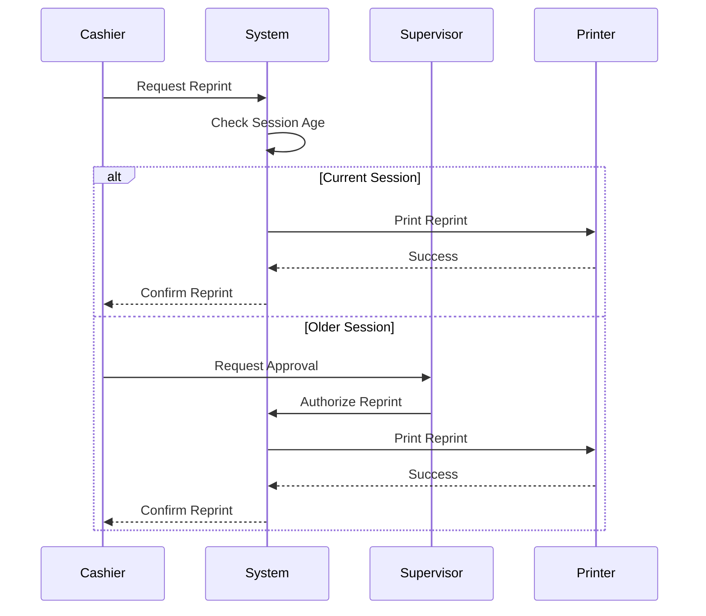

**Diagram sources**
- [thermal_printer_user_stories.md:255-258](file://thermal_printer_user_stories.md#L255-L258)
- [reprint-queue.tsx:25-95](file://web-prototype/src/components/reprint-queue.tsx#L25-L95)

**Section sources**
- [reprint-queue.tsx:17-23](file://web-prototype/src/components/reprint-queue.tsx#L17-L23)
- [thermal_printer_user_stories.md:255-258](file://thermal_printer_user_stories.md#L255-L258)

## Printer Status Monitoring

### Status Indicator Component

The system provides comprehensive printer status monitoring with interactive cycling:

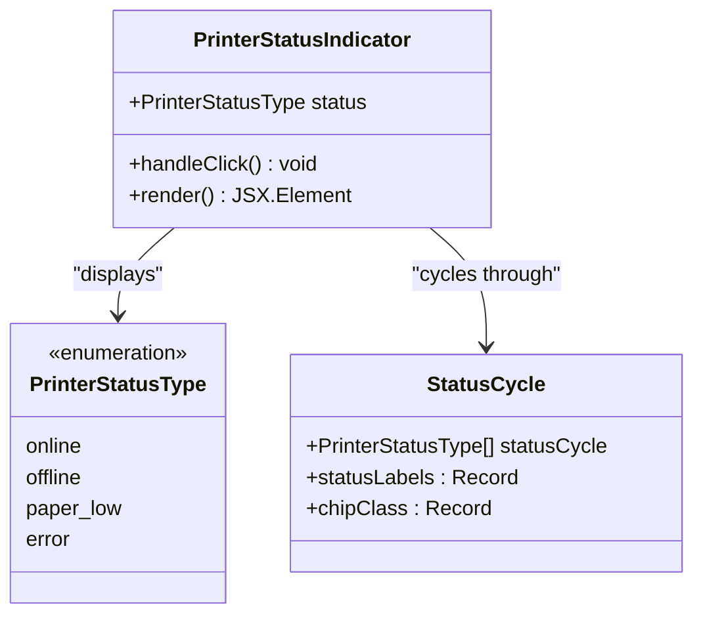

**Diagram sources**
- [printer-status.tsx:26-53](file://web-prototype/src/components/printer-status.tsx#L26-L53)
- [types.ts:336](file://web-prototype/src/lib/types.ts#L336)

### Status Cycle Behavior

The status indicator cycles through printer states for demonstration purposes:

| Status | Visual Indicator | Meaning |
|--------|------------------|---------|
| Online | Green dot | Printer ready for operations |
| Offline | Gray dot with spinner | Printer disconnected/reconnecting |
| Paper Low | Yellow dot | Low paper condition detected |
| Error | Red dot | Printer error requiring attention |

**Section sources**
- [printer-status.tsx:10-25](file://web-prototype/src/components/printer-status.tsx#L10-L25)
- [printer-status.tsx:26-53](file://web-prototype/src/components/printer-status.tsx#L26-L53)

## Audit and Compliance

### Comprehensive Audit Trail

The system maintains detailed audit records for all printer-related activities:

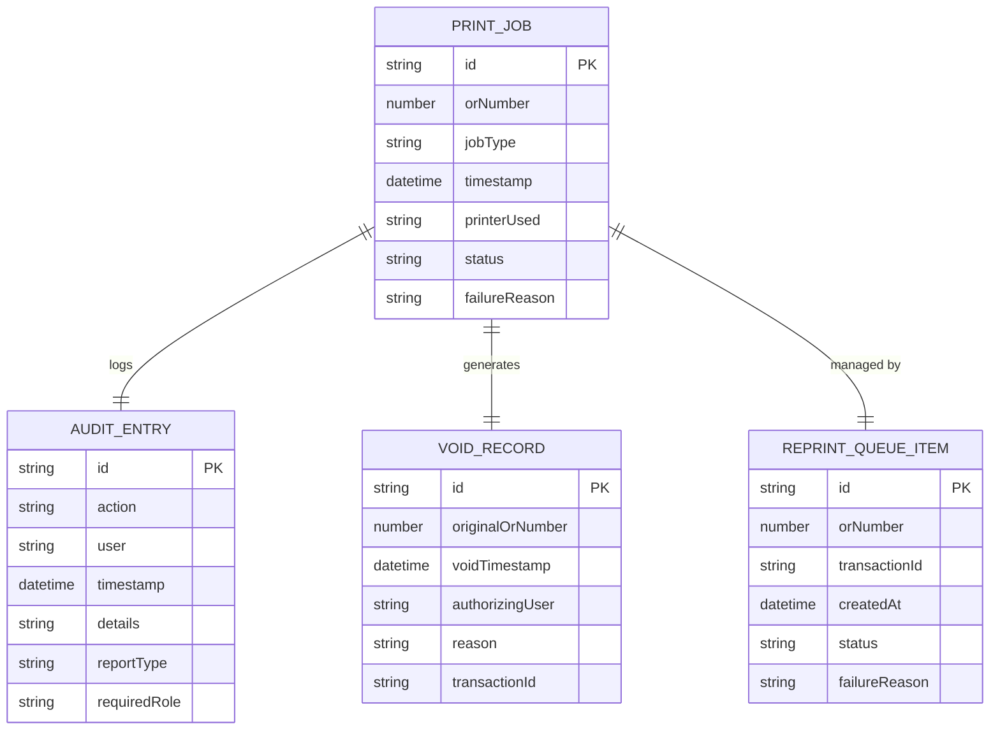

**Diagram sources**
- [types.ts:477-485](file://web-prototype/src/lib/types.ts#L477-L485)
- [types.ts:445-453](file://web-prototype/src/lib/types.ts#L445-L453)
- [types.ts:466-473](file://web-prototype/src/lib/types.ts#L466-L473)

### Compliance Features

The system includes built-in compliance features for BIR regulations:

| Compliance Area | Implementation | Benefits |
|----------------|----------------|----------|
| Official Receipt Headers | Mandatory BIR fields included | Legal compliance |
| Reprint Tracking | Clear "REPRINT" marking | Audit trail integrity |
| Void Documentation | Complete void details | Regulatory transparency |
| Print Failure Logging | Detailed failure reasons | Operational accountability |
| Multi-Printer Support | Role-based printer assignment | Flexible deployment |

**Section sources**
- [audit-trail.tsx:25-33](file://web-prototype/src/components/audit-trail.tsx#L25-L33)
- [thermal_printer_user_stories.md:339-347](file://thermal_printer_user_stories.md#L339-L347)

## Technical Implementation Details

### Data Persistence Layer

The system uses IndexedDB for local data persistence with schema version 5:

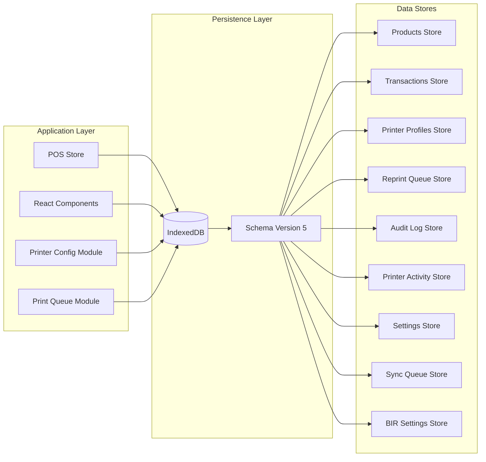

**Diagram sources**
- [db.ts:31-73](file://web-prototype/src/lib/db.ts#L31-L73)
- [db.ts:96-143](file://web-prototype/src/lib/db.ts#L96-L143)

### Type Safety Architecture

The system implements comprehensive TypeScript definitions:

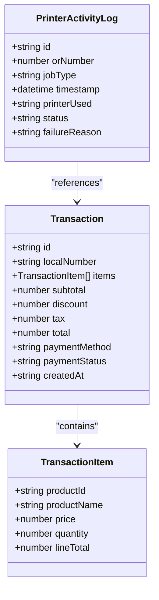

**Diagram sources**
- [types.ts:262-284](file://web-prototype/src/lib/types.ts#L262-L284)
- [types.ts:477-485](file://web-prototype/src/lib/types.ts#L477-L485)

**Section sources**
- [db.ts:99-115](file://web-prototype/src/lib/db.ts#L99-L115)
- [types.ts:262-284](file://web-prototype/src/lib/types.ts#L262-L284)

## Deployment and Integration

### Technology Stack

The system leverages a modern technology stack optimized for reliability and performance:

| Layer | Technology | Version | Purpose |
|-------|------------|---------|---------|
| Frontend | React | 18.x | Component-based UI |
| State Management | Custom Hook Pattern | - | Centralized state |
| Persistence | IndexedDB | - | Local data storage |
| Styling | CSS Modules | - | Scoped styling |
| Build Tools | Next.js | 14.x | Production builds |
| Testing | React Testing Library | - | Component testing |

### Integration Patterns

The system supports multiple integration approaches:

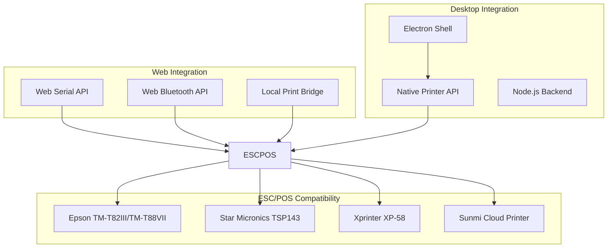

**Diagram sources**
- [TECH_STACK.md:9-12](file://docs/TECH_STACK.md#L9-L12)
- [thermal_printer_user_stories.md:349-351](file://thermal_printer_user_stories.md#L349-L351)

**Section sources**
- [TECH_STACK.md:9-12](file://docs/TECH_STACK.md#L9-L12)
- [TECH_STACK.md:53-54](file://docs/TECH_STACK.md#L53-L54)

## Troubleshooting Guide

### Common Issues and Solutions

| Issue | Symptoms | Solution |
|-------|----------|----------|
| Printer Offline | Status shows offline, prints fail | Check cable/connections, restart printer |
| Paper Jam | Error messages, print failures | Clear paper, check paper sensor |
| No Response | Printer doesn't react to commands | Verify connection type, check firewall |
| Incorrect Text Encoding | Garbled characters on receipt | Set proper character set in printer settings |
| Wrong Paper Size | Text cutoff or misalignment | Configure correct paper width (58mm/80mm) |
| Reprint Not Working | Reprint queue shows failed | Check authorization requirements, retry manually |

### Diagnostic Commands

The system provides diagnostic capabilities through the status indicator component, allowing developers to simulate different printer states for testing purposes.

**Section sources**
- [printer-status.tsx:30-33](file://web-prototype/src/components/printer-status.tsx#L30-L33)
- [print-failure-modal.tsx:16-25](file://web-prototype/src/components/print-failure-modal.tsx#L16-L25)

## Conclusion

The Printer Management System represents a comprehensive solution for thermal printer management in pharmaceutical POS environments. Its architecture emphasizes regulatory compliance, operational reliability, and user experience while maintaining flexibility for various deployment scenarios.

**Updated** The system now includes a complete ESC/POS command generation layer with real thermal printer output via Web Serial, Web Bluetooth, and LAN bridge backends. Printer profiles support role-based defaults (`defaultForOr`, `defaultForReport`), and the durable print queue persists jobs to IndexedDB for retry after failures. The LAN Printer Bridge server enables network printer access from the browser.

Key strengths of the system include:

- **Regulatory Compliance**: Built-in BIR compliance features ensure legal adherence
- **Multi-Hardware Support**: ESC/POS compatibility across major printer vendors via Web Serial, Web Bluetooth, and LAN bridge
- **Durable Print Queue**: Jobs are persisted to IndexedDB with automatic expiry and retry
- **Role-Based Defaults**: Separate default printers for OR receipts and reports
- **Robust Error Handling**: Comprehensive print failure management with user-friendly fallbacks
- **Audit Trail**: Complete documentation of all printer activities for compliance purposes
- **Scalable Architecture**: Modular design supporting multiple printers and connection types

The system's integration with the broader PharmaSpot ecosystem demonstrates its capability to serve as a foundation for enterprise-grade POS solutions while maintaining the flexibility needed for diverse deployment scenarios.