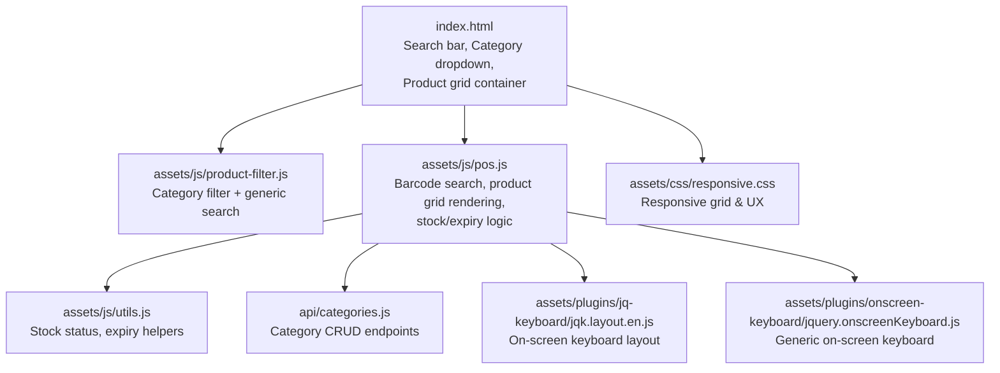
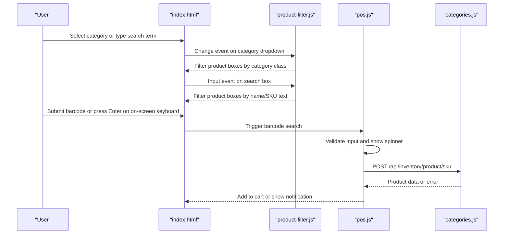
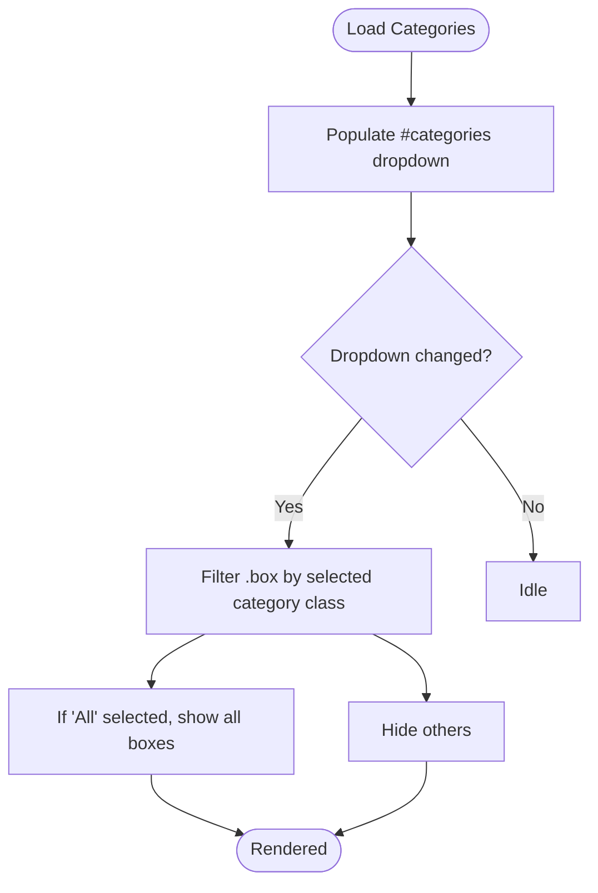
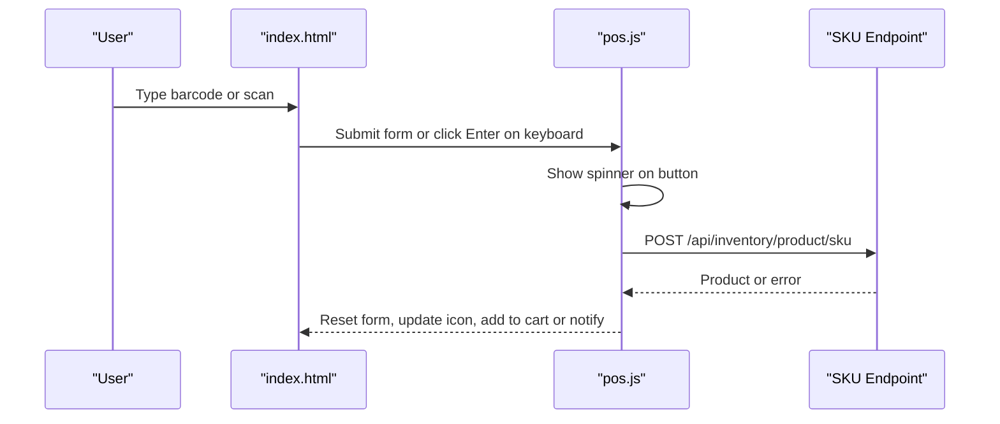
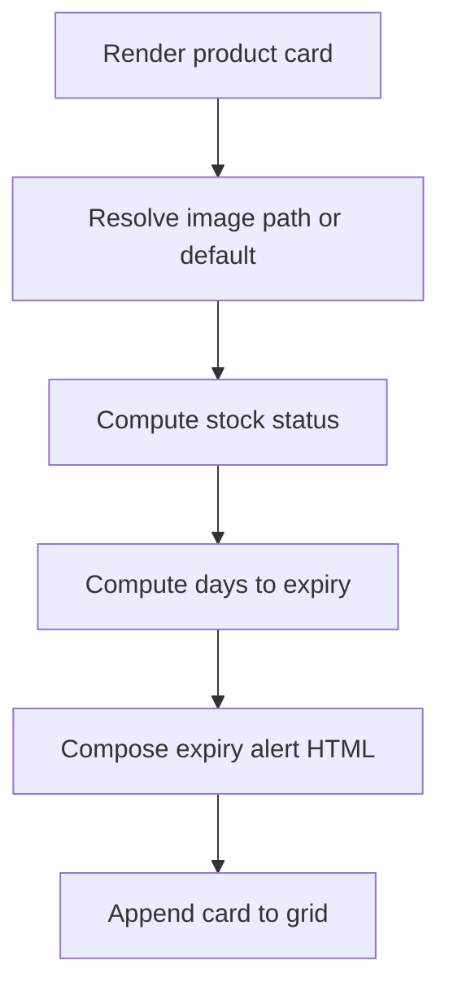
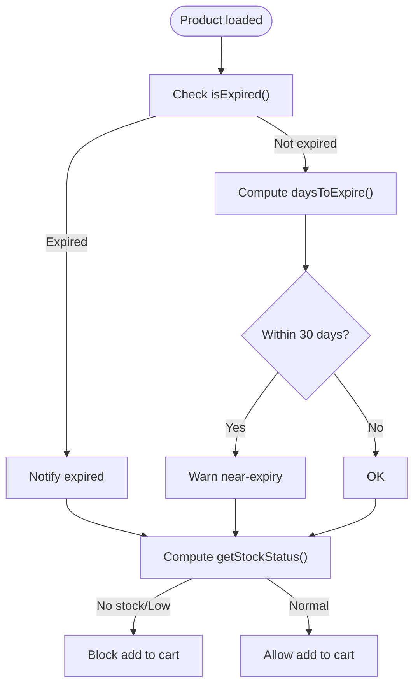
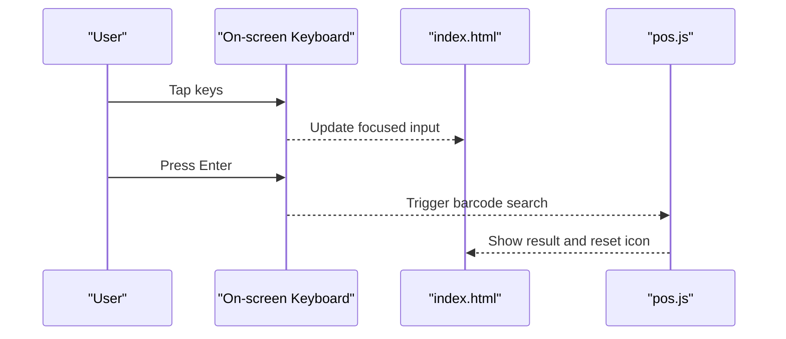
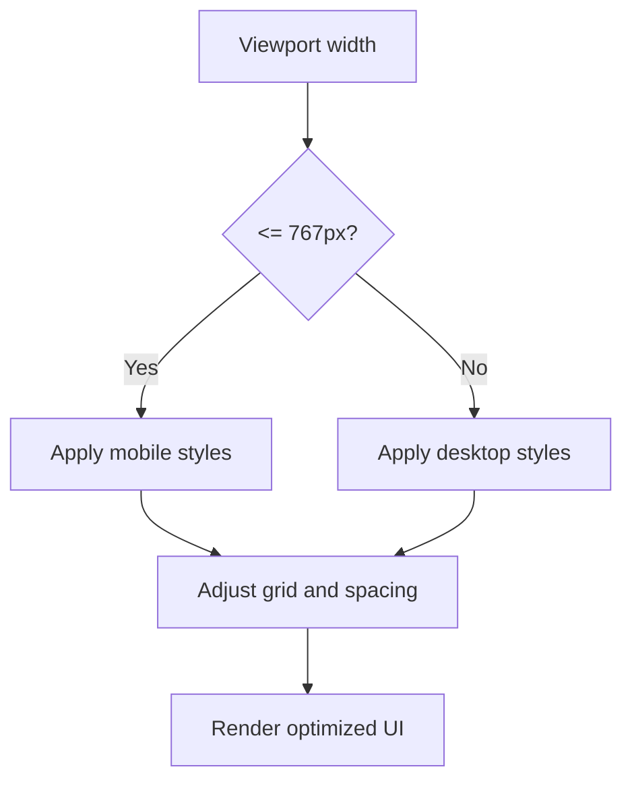
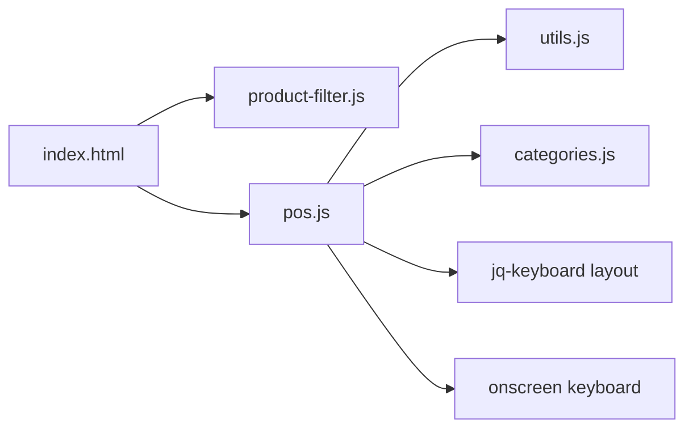

# Product Filtering System

<cite>
**Referenced Files in This Document**
- [index.html](file://index.html)
- [pos.js](file://assets/js/pos.js)
- [product-filter.js](file://assets/js/product-filter.js)
- [utils.js](file://assets/js/utils.js)
- [categories.js](file://api/categories.js)
- [responsive.css](file://assets/css/responsive.css)
- [jq-keyboard layout](file://assets/plugins/jq-keyboard/jqk.layout.en.js)
- [onscreen keyboard](file://assets/plugins/onscreen-keyboard/jquery.onscreenKeyboard.js)
- [utils.test.js](file://tests/utils.test.js)
</cite>

## Table of Contents
1. [Introduction](#introduction)
2. [Project Structure](#project-structure)
3. [Core Components](#core-components)
4. [Architecture Overview](#architecture-overview)
5. [Detailed Component Analysis](#detailed-component-analysis)
6. [Dependency Analysis](#dependency-analysis)
7. [Performance Considerations](#performance-considerations)
8. [Troubleshooting Guide](#troubleshooting-guide)
9. [Conclusion](#conclusion)
10. [Appendices](#appendices)

## Introduction
This document describes the PharmaSpot product filtering and search system. It covers category-based filtering with dynamic dropdown menus, product search via name/SKU, barcode scanning, and SKU lookup. It also documents the product display logic (grid layout, image handling, stock status indicators), expiration date filtering and alerts, low-stock notifications, product availability validation, search bar integration with keyboard input and barcode scanner support, responsive design and mobile optimization, and accessibility features. Finally, it provides examples of filter customization and search algorithm improvements.

## Project Structure
The filtering and search system spans HTML templates, client-side JavaScript logic, shared utilities, and API endpoints for categories.

**Diagram sources**
- [index.html](file://index.html)
- [product-filter.js](file://assets/js/product-filter.js)
- [pos.js](file://assets/js/pos.js)
- [utils.js](file://assets/js/utils.js)
- [categories.js](file://api/categories.js)
- [responsive.css](file://assets/css/responsive.css)
- [jq-keyboard layout](file://assets/plugins/jq-keyboard/jqk.layout.en.js)
- [onscreen keyboard](file://assets/plugins/onscreen-keyboard/jquery.onscreenKeyboard.js)

**Section sources**
- [index.html](file://index.html)
- [pos.js](file://assets/js/pos.js)
- [product-filter.js](file://assets/js/product-filter.js)
- [utils.js](file://assets/js/utils.js)
- [categories.js](file://api/categories.js)
- [responsive.css](file://assets/css/responsive.css)
- [jq-keyboard layout](file://assets/plugins/jq-keyboard/jqk.layout.en.js)
- [onscreen keyboard](file://assets/plugins/onscreen-keyboard/jquery.onscreenKeyboard.js)

## Core Components
- Category-based filtering and product grid rendering
  - Dynamic category dropdown population and filtering
  - Product grid with category classes and click-to-add-to-cart behavior
- Search functionality
  - Text-based search by product name and SKU
  - Barcode scanning via form submission and on-screen keyboard enter key
- Expiration and stock handling
  - Expiration alerts and warnings
  - Low-stock and out-of-stock validation
- Responsive design and accessibility
  - Mobile-first responsive grid and UI adjustments
  - Keyboard navigation and assistive input support

**Section sources**
- [index.html](file://index.html)
- [pos.js](file://assets/js/pos.js)
- [product-filter.js](file://assets/js/product-filter.js)
- [utils.js](file://assets/js/utils.js)
- [responsive.css](file://assets/css/responsive.css)

## Architecture Overview
The system integrates UI markup, client-side logic, and backend APIs. The product grid is rendered dynamically from inventory data, filtered by category and free-text search, and validated for stock/expires status. Barcode scanning triggers a server-side SKU lookup.

**Diagram sources**
- [index.html](file://index.html)
- [product-filter.js](file://assets/js/product-filter.js)
- [pos.js](file://assets/js/pos.js)
- [categories.js](file://api/categories.js)

## Detailed Component Analysis

### Category-Based Filtering and Dynamic Dropdown Menus
- Category dropdown population
  - Loads categories from the Category API and populates both the product modal and the main filter dropdown.
- Category filter application
  - On change, filters visible product boxes by the selected category class; selecting “All” shows all items.
- Product grid rendering
  - Each product card is assigned a category class enabling fast jQuery-based visibility toggling.

**Diagram sources**
- [pos.js](file://assets/js/pos.js)
- [product-filter.js](file://assets/js/product-filter.js)

**Section sources**
- [pos.js](file://assets/js/pos.js)
- [product-filter.js](file://assets/js/product-filter.js)

### Search Functionality: Name/SKU Matching and Barcode Scanning
- Free-text search
  - Live filtering of product cards by product name and SKU while typing.
- Barcode scanning
  - Form submission triggers a POST to the SKU endpoint; spinner indicates processing; success adds to cart, expired/out-of-stock conditions are handled with notifications.
- Keyboard integration
  - On-screen keyboard supports numeric and alphabetic entry; Enter key triggers barcode search when input is focused.

**Diagram sources**
- [pos.js](file://assets/js/pos.js)
- [index.html](file://index.html)
- [jq-keyboard layout](file://assets/plugins/jq-keyboard/jqk.layout.en.js)
- [onscreen keyboard](file://assets/plugins/onscreen-keyboard/jquery.onscreenKeyboard.js)

**Section sources**
- [pos.js](file://assets/js/pos.js)
- [index.html](file://index.html)
- [jq-keyboard layout](file://assets/plugins/jq-keyboard/jqk.layout.en.js)
- [onscreen keyboard](file://assets/plugins/onscreen-keyboard/jquery.onscreenKeyboard.js)

### Product Display Logic: Grid Layout, Images, and Stock Status Indicators
- Grid layout
  - Product cards are placed in a responsive grid container; each card is a column with category class for filtering.
- Image handling
  - Uses default image fallback when product image is missing or file does not exist.
- Stock status indicators
  - Displays stock counts or N/A depending on stock mode; low stock/out-of-stock highlighted with danger text.
- Expiration indicators
  - Renders expiry alerts and warnings for near-expiry and expired items.

**Diagram sources**
- [pos.js](file://assets/js/pos.js)
- [utils.js](file://assets/js/utils.js)

**Section sources**
- [pos.js](file://assets/js/pos.js)
- [utils.js](file://assets/js/utils.js)

### Expiration Date Filtering, Low-Stock Alerts, and Availability Validation
- Expiration checks
  - Items expiring today or earlier are flagged as expired; items with 30 days or fewer remaining trigger near-expiry warnings.
- Low-stock detection
  - Stock status computed against minimum stock threshold; values ≤ 0 treated as no/low stock.
- Availability validation
  - Prevents adding expired or out-of-stock items to cart and notifies the user accordingly.

**Diagram sources**
- [utils.js](file://assets/js/utils.js)
- [pos.js](file://assets/js/pos.js)

**Section sources**
- [utils.js](file://assets/js/utils.js)
- [pos.js](file://assets/js/pos.js)
- [utils.test.js](file://tests/utils.test.js)

### Search Bar Integration: Keyboard Input and Barcode Scanner Support
- Text input search
  - Real-time filtering of product cards as the user types.
- On-screen keyboard
  - Numeric and alphabetic layouts; Enter key submits barcode when input is focused.
- Barcode scanner
  - Dedicated input with submit button; spinner feedback during lookup.

**Diagram sources**
- [pos.js](file://assets/js/pos.js)
- [jq-keyboard layout](file://assets/plugins/jq-keyboard/jqk.layout.en.js)
- [onscreen keyboard](file://assets/plugins/onscreen-keyboard/jquery.onscreenKeyboard.js)

**Section sources**
- [pos.js](file://assets/js/pos.js)
- [jq-keyboard layout](file://assets/plugins/jq-keyboard/jqk.layout.en.js)
- [onscreen keyboard](file://assets/plugins/onscreen-keyboard/jquery.onscreenKeyboard.js)

### Responsive Product Grid Layout, Mobile Optimization, and Accessibility
- Responsive grid
  - CSS media queries adjust spacing, widths, and visibility for small screens.
- Mobile optimization
  - Adjustments for narrow widths, reduced sidebar presence, and compact layouts.
- Accessibility
  - Semantic markup and focusable inputs; spinner icons indicate loading states.

**Diagram sources**
- [responsive.css](file://assets/css/responsive.css)
- [index.html](file://index.html)

**Section sources**
- [responsive.css](file://assets/css/responsive.css)
- [index.html](file://index.html)

### Examples of Filter Customization and Search Algorithm Improvements
- Category filter customization
  - Extend category dropdown population to support hierarchical categories or multi-select filters.
  - Add pre-selected category filters on page load based on user preferences.
- Search algorithm enhancements
  - Normalize search terms (lowercase, trim whitespace) and tokenize for partial matches.
  - Implement fuzzy search for typos and approximate SKU/name matches.
  - Debounce input events to reduce frequent re-rendering during rapid typing.
  - Add sorting options (price, name, stock) alongside filtering.
- Expiry and stock improvements
  - Group-by-expiry for quick visibility of soon-to-expire items.
  - Threshold-based alerts (e.g., “Critical stock” for values below a configurable minimum).
- Accessibility enhancements
  - Add ARIA attributes for live regions to announce search/filter results.
  - Keyboard shortcuts for quick category switching and search clearing.

[No sources needed since this section provides general guidance]

## Dependency Analysis
The filtering and search system depends on:
- UI templates for inputs and containers
- Client-side logic for filtering, rendering, and validation
- Shared utilities for stock and expiry computations
- Category API for dropdown population
- Optional on-screen keyboard plugins for touch devices

**Diagram sources**
- [index.html](file://index.html)
- [product-filter.js](file://assets/js/product-filter.js)
- [pos.js](file://assets/js/pos.js)
- [utils.js](file://assets/js/utils.js)
- [categories.js](file://api/categories.js)
- [jq-keyboard layout](file://assets/plugins/jq-keyboard/jqk.layout.en.js)
- [onscreen keyboard](file://assets/plugins/onscreen-keyboard/jquery.onscreenKeyboard.js)

**Section sources**
- [index.html](file://index.html)
- [pos.js](file://assets/js/pos.js)
- [product-filter.js](file://assets/js/product-filter.js)
- [utils.js](file://assets/js/utils.js)
- [categories.js](file://api/categories.js)
- [jq-keyboard layout](file://assets/plugins/jq-keyboard/jqk.layout.en.js)
- [onscreen keyboard](file://assets/plugins/onscreen-keyboard/jquery.onscreenKeyboard.js)

## Performance Considerations
- Debounce search input to avoid excessive DOM updates during typing.
- Virtualize the product grid for large inventories to limit DOM nodes.
- Cache category and product lists to minimize repeated network requests.
- Precompute stock/expiry states during initial render to avoid repeated calculations per keystroke.

[No sources needed since this section provides general guidance]

## Troubleshooting Guide
- Category filter not working
  - Verify category dropdown is populated and product cards have correct category classes.
  - Confirm the change handler is attached and jQuery selectors match the expected IDs.
- Search not filtering
  - Ensure the search input selector matches and the matcher targets product name and SKU elements.
- Barcode scanning fails
  - Check SKU endpoint availability and network connectivity; confirm spinner resets after response.
- Stock/expiry alerts incorrect
  - Validate date parsing and thresholds; ensure default image fallback is applied when images are missing.

**Section sources**
- [product-filter.js](file://assets/js/product-filter.js)
- [pos.js](file://assets/js/pos.js)
- [utils.js](file://assets/js/utils.js)
- [utils.test.js](file://tests/utils.test.js)

## Conclusion
PharmaSpot’s product filtering and search system combines a responsive grid, category-based filtering, real-time text search, and robust barcode scanning with strong stock and expiry validations. The modular design allows straightforward enhancements such as debounced search, fuzzy matching, and improved accessibility.

[No sources needed since this section summarizes without analyzing specific files]

## Appendices

### API Definitions
- Category API
  - GET /api/categories/all: Retrieve all categories
  - POST /api/categories/category: Create a category
  - PUT /api/categories/category: Update a category
  - DELETE /api/categories/category/:categoryId: Delete a category

**Section sources**
- [categories.js](file://api/categories.js)

### UI Elements and Interactions
- Category dropdown: #categories
- Search input: #search
- Product grid container: #parent
- Barcode input: #skuCode
- Barcode form: #searchBarCode

**Section sources**
- [index.html](file://index.html)
- [pos.js](file://assets/js/pos.js)
- [product-filter.js](file://assets/js/product-filter.js)