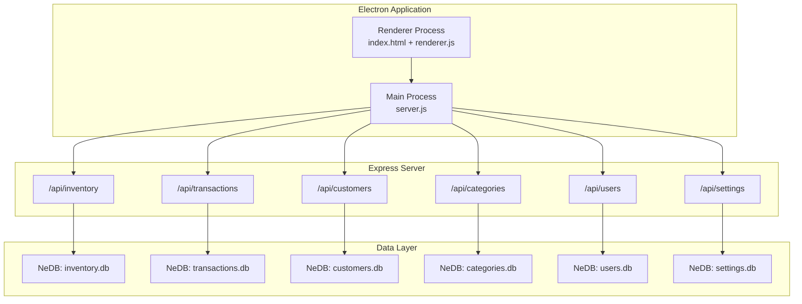
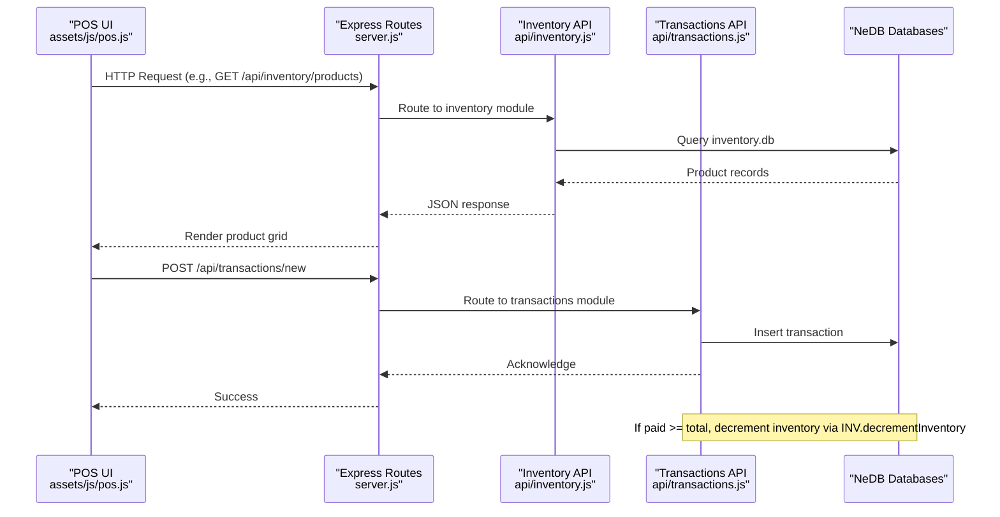
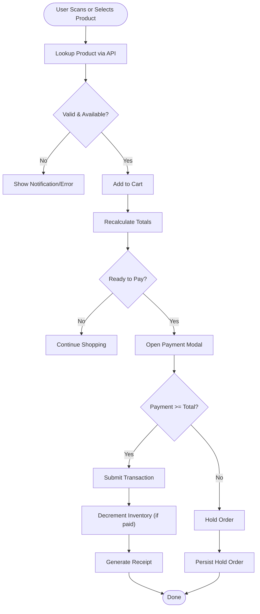
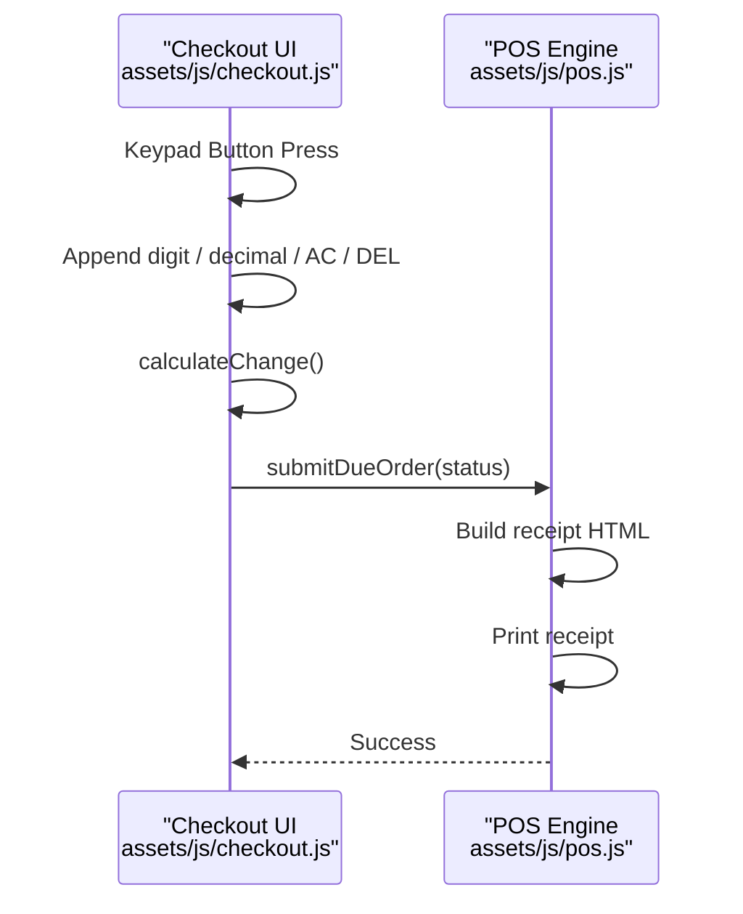
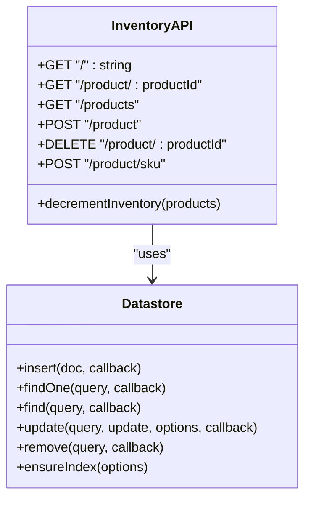
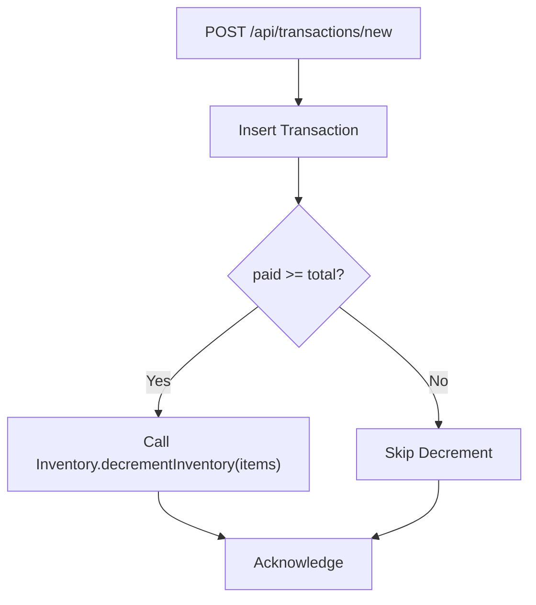
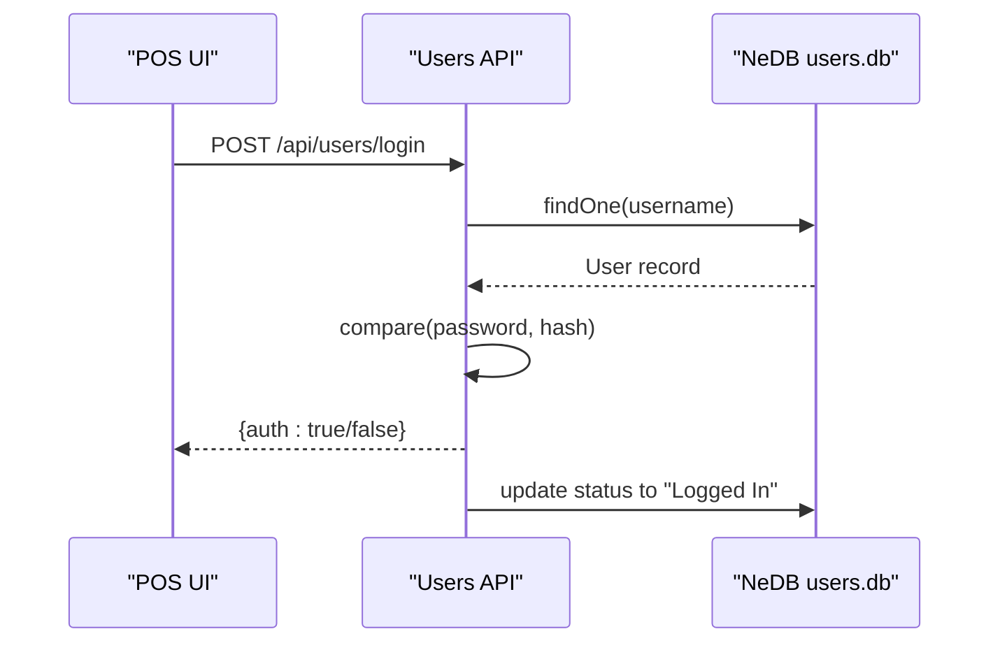
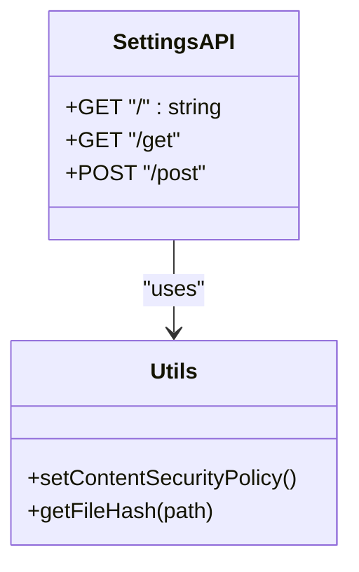
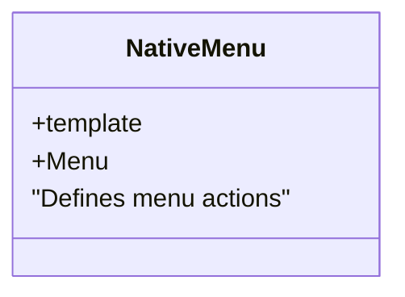
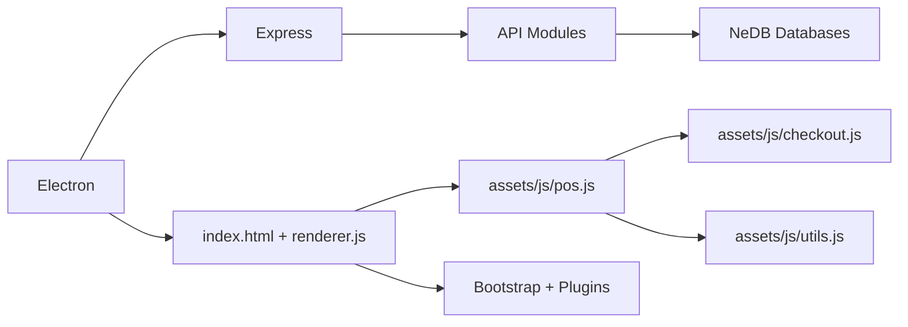

# RX Workspace

<cite>
**Referenced Files in This Document**
- [README.md](file://README.md)
- [package.json](file://package.json)
- [server.js](file://server.js)
- [index.html](file://index.html)
- [renderer.js](file://renderer.js)
- [assets/js/pos.js](file://assets/js/pos.js)
- [assets/js/checkout.js](file://assets/js/checkout.js)
- [assets/js/utils.js](file://assets/js/utils.js)
- [assets/js/native_menu/menu.js](file://assets/js/native_menu/menu.js)
- [api/inventory.js](file://api/inventory.js)
- [api/transactions.js](file://api/transactions.js)
- [api/customers.js](file://api/customers.js)
- [api/categories.js](file://api/categories.js)
- [api/users.js](file://api/users.js)
- [api/settings.js](file://api/settings.js)
</cite>

## Table of Contents
1. [Introduction](#introduction)
2. [Project Structure](#project-structure)
3. [Core Components](#core-components)
4. [Architecture Overview](#architecture-overview)
5. [Detailed Component Analysis](#detailed-component-analysis)
6. [Dependency Analysis](#dependency-analysis)
7. [Performance Considerations](#performance-considerations)
8. [Troubleshooting Guide](#troubleshooting-guide)
9. [Conclusion](#conclusion)

## Introduction
RX Workspace is a cross-platform Point of Sale (POS) system tailored for pharmacies, built with Electron and Express. It enables multi-terminal operation, real-time inventory management, customer tracking, transaction logging, and secure payment processing. The application supports barcode scanning, tax calculation, low-stock alerts, expiry monitoring, and receipt printing. It also provides administrative controls for users, categories, and system settings.

## Project Structure
The project follows a hybrid desktop application architecture:
- Electron main process initializes the application and hosts a local Express server.
- Renderer process serves the HTML UI and client-side JavaScript logic.
- API modules encapsulate business logic for inventory, transactions, customers, categories, users, and settings.
- Assets include bundled CSS/JS, plugins, and static resources.

**Diagram sources**
- [server.js:1-68](file://server.js#L1-L68)
- [api/inventory.js:1-333](file://api/inventory.js#L1-L333)
- [api/transactions.js:1-251](file://api/transactions.js#L1-L251)
- [api/customers.js:1-151](file://api/customers.js#L1-L151)
- [api/categories.js:1-124](file://api/categories.js#L1-L124)
- [api/users.js:1-311](file://api/users.js#L1-L311)
- [api/settings.js:1-192](file://api/settings.js#L1-L192)

**Section sources**
- [README.md:1-91](file://README.md#L1-L91)
- [package.json:1-147](file://package.json#L1-L147)
- [server.js:1-68](file://server.js#L1-L68)
- [index.html:1-899](file://index.html#L1-L899)

## Core Components
- Electron Server and Routing
  - Initializes Express, applies CORS and rate limiting middleware, and mounts API routes for inventory, customers, categories, settings, users, and transactions.
  - Provides a restart mechanism to reload server modules during development.
- Client-Side POS Engine
  - Implements product browsing, cart management, barcode scanning, payment processing, tax calculation, and receipt generation.
  - Integrates with NeDB databases via API endpoints for persistence.
- Native Menu Integration
  - Adds desktop-native menus for backup/restore, logout, and navigation shortcuts.
- Utility Functions
  - Handles date validation, stock status computation, file filtering, and Content Security Policy injection.

**Section sources**
- [server.js:1-68](file://server.js#L1-L68)
- [assets/js/pos.js:1-800](file://assets/js/pos.js#L1-L800)
- [assets/js/checkout.js:1-102](file://assets/js/checkout.js#L1-L102)
- [assets/js/utils.js:1-112](file://assets/js/utils.js#L1-L112)
- [assets/js/native_menu/menu.js:1-153](file://assets/js/native_menu/menu.js#L1-L153)

## Architecture Overview
The system uses a layered architecture:
- Presentation Layer: Electron-rendered HTML/CSS/JS with jQuery and Bootstrap.
- Business Logic Layer: Express routes handling CRUD operations and domain logic.
- Data Access Layer: NeDB embedded databases per module.
- IPC and Security: Electron remote and CSP enforcement for safe rendering.

**Diagram sources**
- [server.js:40-45](file://server.js#L40-L45)
- [api/inventory.js:302-333](file://api/inventory.js#L302-L333)
- [api/transactions.js:163-181](file://api/transactions.js#L163-L181)

## Detailed Component Analysis

### POS Client Engine
Responsibilities:
- Initialize UI, load settings, categories, products, and customers.
- Handle barcode scanning and product lookup.
- Manage shopping cart, quantity adjustments, discounts, taxes, and totals.
- Trigger payment modal and print receipts.
- Integrate with native menu actions.

Key behaviors:
- Loads data from API endpoints and renders product cards with stock/expiry indicators.
- Validates product availability and expiry before adding to cart.
- Computes subtotal, VAT, and grand total based on settings.
- Submits transactions to the backend and triggers inventory updates when applicable.

**Diagram sources**
- [assets/js/pos.js:424-503](file://assets/js/pos.js#L424-L503)
- [assets/js/pos.js:702-724](file://assets/js/pos.js#L702-L724)
- [assets/js/pos.js:730-800](file://assets/js/pos.js#L730-L800)
- [api/transactions.js:163-181](file://api/transactions.js#L163-L181)
- [api/inventory.js:302-333](file://api/inventory.js#L302-L333)

**Section sources**
- [assets/js/pos.js:196-365](file://assets/js/pos.js#L196-L365)
- [assets/js/pos.js:424-503](file://assets/js/pos.js#L424-L503)
- [assets/js/pos.js:544-573](file://assets/js/pos.js#L544-L573)
- [assets/js/pos.js:702-724](file://assets/js/pos.js#L702-L724)
- [assets/js/pos.js:730-800](file://assets/js/pos.js#L730-L800)

### Payment and Checkout
Responsibilities:
- Keypad input handling for payment amounts and reference numbers.
- Real-time change calculation.
- Payment method selection (Cash/Card).
- Submission of payments and order completion.

**Diagram sources**
- [assets/js/checkout.js:10-86](file://assets/js/checkout.js#L10-L86)
- [assets/js/pos.js:730-800](file://assets/js/pos.js#L730-L800)

**Section sources**
- [assets/js/checkout.js:1-102](file://assets/js/checkout.js#L1-L102)
- [assets/js/pos.js:730-800](file://assets/js/pos.js#L730-L800)

### Inventory Management API
Responsibilities:
- CRUD operations for products.
- Unique ID generation for new products.
- Image upload handling with validation and cleanup.
- Decrement inventory quantities upon successful payment.

**Diagram sources**
- [api/inventory.js:1-333](file://api/inventory.js#L1-L333)

**Section sources**
- [api/inventory.js:53-69](file://api/inventory.js#L53-L69)
- [api/inventory.js:124-240](file://api/inventory.js#L124-L240)
- [api/inventory.js:296-333](file://api/inventory.js#L296-L333)

### Transactions API
Responsibilities:
- Retrieve all transactions, on-hold orders, and customer orders.
- Filter transactions by date range, user, till, and status.
- Create and update transactions.
- Decrement inventory when payment covers total.

**Diagram sources**
- [api/transactions.js:163-181](file://api/transactions.js#L163-L181)
- [api/inventory.js:302-333](file://api/inventory.js#L302-L333)

**Section sources**
- [api/transactions.js:46-154](file://api/transactions.js#L46-L154)
- [api/transactions.js:163-181](file://api/transactions.js#L163-L181)

### Users and Authentication
Responsibilities:
- User login with bcrypt password verification.
- Permission-based UI visibility.
- Default admin initialization.
- Logout status update.

**Diagram sources**
- [api/users.js:95-131](file://api/users.js#L95-L131)
- [api/users.js:268-311](file://api/users.js#L268-L311)

**Section sources**
- [api/users.js:95-131](file://api/users.js#L95-L131)
- [api/users.js:268-311](file://api/users.js#L268-L311)

### Settings and Configuration
Responsibilities:
- Store and retrieve application settings (store name, currency, tax, quick billing).
- Upload and manage logo image.
- Enforce Content Security Policy via computed hashes.

**Diagram sources**
- [api/settings.js:1-192](file://api/settings.js#L1-L192)
- [assets/js/utils.js:91-99](file://assets/js/utils.js#L91-L99)

**Section sources**
- [api/settings.js:71-80](file://api/settings.js#L71-L80)
- [api/settings.js:90-190](file://api/settings.js#L90-L190)
- [assets/js/utils.js:91-99](file://assets/js/utils.js#L91-L99)

### Native Menu Integration
Responsibilities:
- Provide desktop-native menus for New Items, Backup/Restore, Logout, Navigation, and Help.
- Trigger UI actions via IPC-like handlers.

**Diagram sources**
- [assets/js/native_menu/menu.js:14-153](file://assets/js/native_menu/menu.js#L14-L153)

**Section sources**
- [assets/js/native_menu/menu.js:14-153](file://assets/js/native_menu/menu.js#L14-L153)

## Dependency Analysis
External libraries and modules:
- Electron: Desktop runtime and IPC.
- Express: HTTP server and routing.
- NeDB: Embedded document database.
- jQuery: DOM manipulation and UI interactions.
- Bootstrap: UI components and styling.
- Additional plugins: DataTables, jqKeyboard, OnScreen Keyboard, jsPDF, html2canvas, jsbarcode, validator, lodash, bcrypt, multer, sanitize-filename, moment, print-js, notiflix.

**Diagram sources**
- [package.json:18-54](file://package.json#L18-L54)
- [server.js:1-10](file://server.js#L1-L10)
- [index.html:7-8](file://index.html#L7-L8)

**Section sources**
- [package.json:18-54](file://package.json#L18-L54)
- [server.js:1-10](file://server.js#L1-L10)
- [index.html:7-8](file://index.html#L7-L8)

## Performance Considerations
- Database Indexing: Ensure unique indexes on identifiers to optimize lookups.
- Batch Operations: Use series processing for inventory decrements to maintain consistency.
- Asset Bundling: Minimize CSS/JS bundles and enable compression for faster loads.
- Rate Limiting: Built-in rate limiter protects against abuse; tune thresholds as needed.
- Memory Management: Avoid caching large datasets; fetch only required records.
- Network Efficiency: Debounce UI events (e.g., search) to reduce API calls.

## Troubleshooting Guide
Common issues and resolutions:
- Authentication Failures
  - Verify username/password correctness and default admin initialization.
  - Check bcrypt hashing and compare outcomes.
- Product Not Found or Out of Stock
  - Confirm barcode validity and product availability.
  - Review stock flags and minimum stock thresholds.
- Payment Mismatches
  - Ensure tax settings and currency formatting align with expectations.
  - Validate keypad input handling and change calculation.
- Inventory Not Decremented
  - Confirm transaction paid amount meets or exceeds total.
  - Check for errors in inventory decrement logic.
- File Upload Errors
  - Validate supported image types and size limits.
  - Ensure upload directory permissions and cleanup logic.

**Section sources**
- [api/users.js:95-131](file://api/users.js#L95-L131)
- [assets/js/pos.js:424-503](file://assets/js/pos.js#L424-L503)
- [assets/js/checkout.js:35-46](file://assets/js/checkout.js#L35-L46)
- [api/transactions.js:176-178](file://api/transactions.js#L176-L178)
- [api/inventory.js:124-141](file://api/inventory.js#L124-L141)

## Conclusion
RX Workspace delivers a robust, modular POS solution for pharmacies with strong desktop integration, secure authentication, and comprehensive transaction management. Its layered architecture, embedded databases, and native menu support provide a scalable foundation for further enhancements such as auto-updates, backups, and advanced reporting.