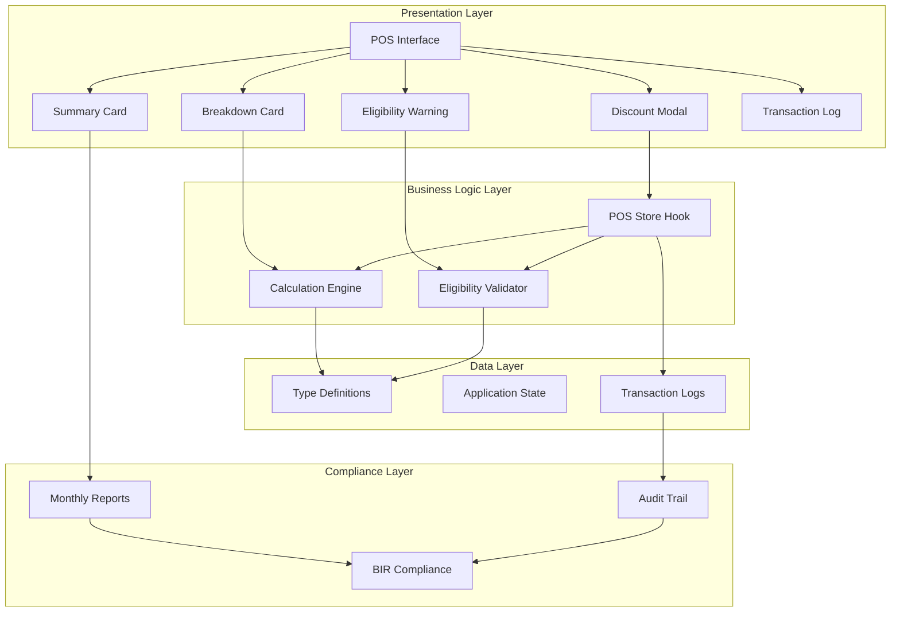
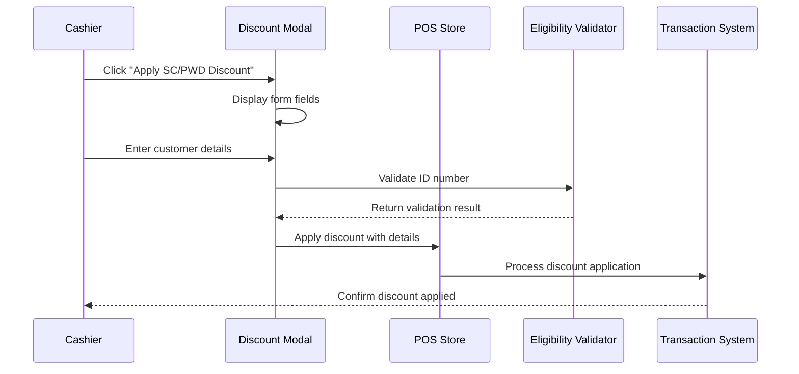
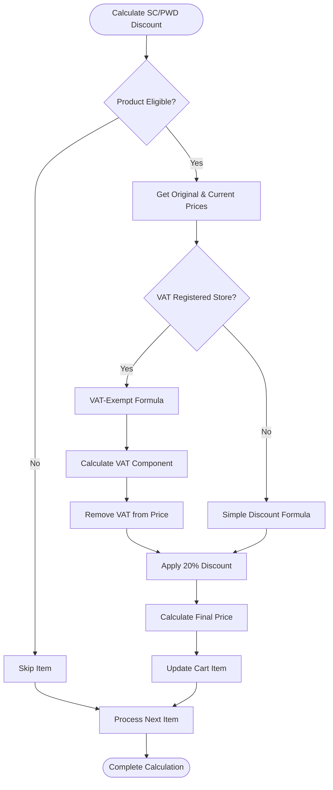
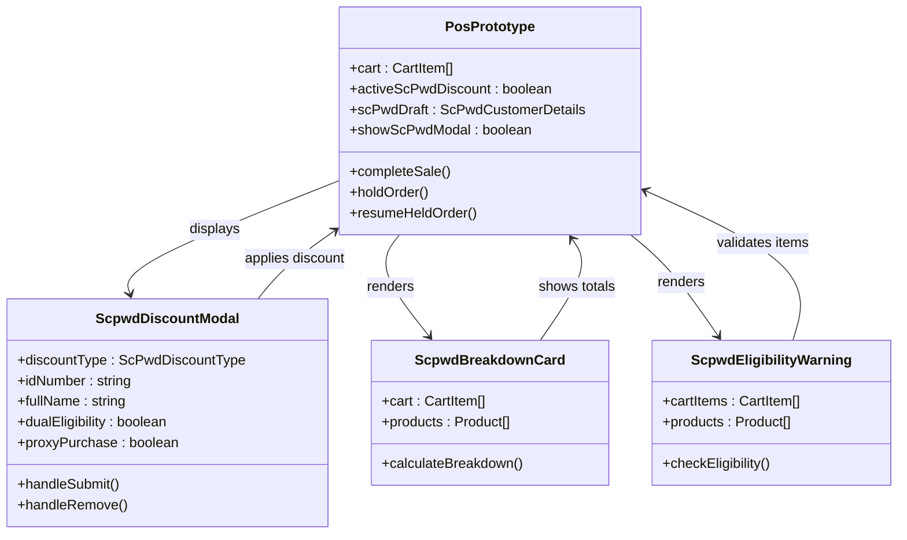
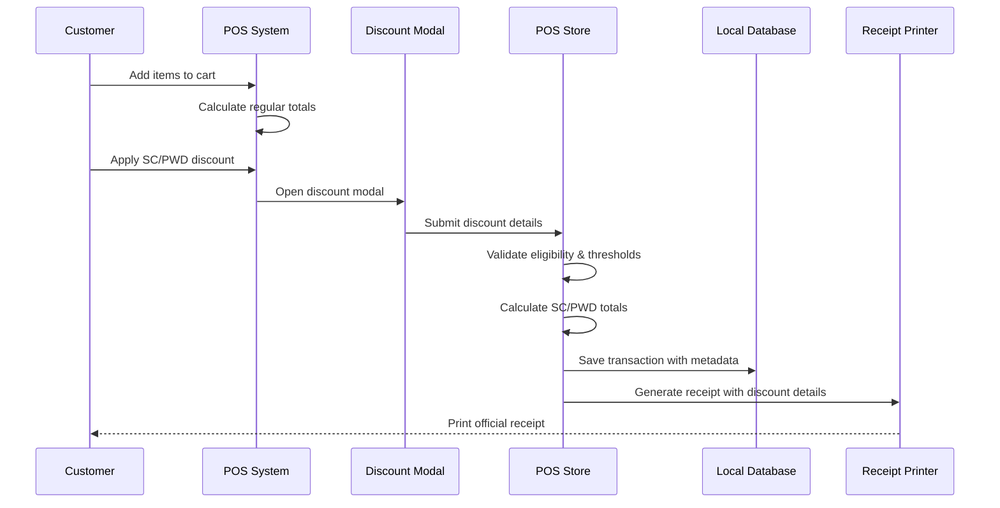

# SC/PWD Discount System

<cite>
**Referenced Files in This Document**
- [scpwd-discount-modal.tsx](file://web-prototype/src/components/scpwd-discount-modal.tsx)
- [scpwd-eligibility-warning.tsx](file://web-prototype/src/components/scpwd-eligibility-warning.tsx)
- [scpwd-breakdown-card.tsx](file://web-prototype/src/components/scpwd-breakdown-card.tsx)
- [scpwd-summary-card.tsx](file://web-prototype/src/components/scpwd-summary-card.tsx)
- [scpwd-transaction-log.tsx](file://web-prototype/src/components/scpwd-transaction-log.tsx)
- [calculations.ts](file://web-prototype/src/lib/calculations.ts)
- [types.ts](file://web-prototype/src/lib/types.ts)
- [use-pos-store.ts](file://web-prototype/src/lib/use-pos-store.ts)
- [pos-prototype.tsx](file://web-prototype/src/components/pos-prototype.tsx)
- [scpwd_user_stories.md](file://scpwd_user_stories.md)
- [PRD.md](file://docs/PRD.md)
</cite>

## Table of Contents
1. [Introduction](#introduction)
2. [System Architecture](#system-architecture)
3. [Core Components](#core-components)
4. [Discount Calculation Engine](#discount-calculation-engine)
5. [User Interface Components](#user-interface-components)
6. [Data Flow and Processing](#data-flow-and-processing)
7. [Integration Points](#integration-points)
8. [Audit and Compliance Features](#audit-and-compliance-features)
9. [Performance Considerations](#performance-considerations)
10. [Troubleshooting Guide](#troubleshooting-guide)
11. [Conclusion](#conclusion)

## Introduction

The SC/PWD (Senior Citizens/Persons with Disability) Discount System is a comprehensive compliance-focused feature integrated into the PharmaSpot Point of Sale system. This system ensures adherence to Philippine laws governing senior citizen and PWD benefits, specifically implementing the Expanded Senior Citizens Act of 2010 (RA 9994) and the Expanded Benefits and Privileges of Persons with Disability Act (RA 10754).

The system provides automated discount computation, eligibility validation, audit trail logging, and BIR (Bureau of Internal Revenue) compliant reporting. It enforces strict rules to prevent double discounting, manages proxy purchases, and maintains detailed transaction logs for regulatory compliance.

## System Architecture

The SC/PWD Discount System follows a modular architecture with clear separation of concerns:

**Diagram sources**
- [pos-prototype.tsx:94-595](file://web-prototype/src/components/pos-prototype.tsx#L94-L595)
- [use-pos-store.ts:70-671](file://web-prototype/src/lib/use-pos-store.ts#L70-L671)
- [calculations.ts:1-196](file://web-prototype/src/lib/calculations.ts#L1-L196)

## Core Components

### Discount Application Modal

The primary interface for applying SC/PWD discounts to transactions. The modal captures essential customer information and handles dual eligibility scenarios.

**Diagram sources**
- [scpwd-discount-modal.tsx:14-50](file://web-prototype/src/components/scpwd-discount-modal.tsx#L14-L50)
- [use-pos-store.ts:438-463](file://web-prototype/src/lib/use-pos-store.ts#L438-L463)

### Calculation Engine

The heart of the system responsible for accurate discount computation following BIR regulations.

**Diagram sources**
- [calculations.ts:15-82](file://web-prototype/src/lib/calculations.ts#L15-L82)

**Section sources**
- [scpwd-discount-modal.tsx:1-218](file://web-prototype/src/components/scpwd-discount-modal.tsx#L1-L218)
- [use-pos-store.ts:438-463](file://web-prototype/src/lib/use-pos-store.ts#L438-L463)

## Discount Calculation Engine

### VAT-Registered Store Formula
For VAT-registered stores, the system follows BIR RR 7-2010 requirements:

**Formula**: `(Price ÷ 1.12) × 0.80`

Where:
- 1.12 represents 100% + 12% VAT
- 0.80 represents 80% after 20% discount on VAT-exempt amount

### Non-VAT Store Formula
For non-VAT registered stores or VAT-exempt items:

**Formula**: `Price × 0.80`

### Implementation Details

The calculation engine processes each cart item individually to ensure accuracy:

1. **Eligibility Check**: Verifies product is not excluded from SC/PWD benefits
2. **VAT Component Extraction**: Calculates VAT portion for VAT-registered stores
3. **Discount Application**: Applies 20% discount on VAT-exempt amount
4. **Final Price Calculation**: Computes the final discounted price per item

**Section sources**
- [calculations.ts:15-82](file://web-prototype/src/lib/calculations.ts#L15-L82)
- [scpwd_user_stories.md:10-20](file://scpwd_user_stories.md#L10-L20)

## User Interface Components

### POS Integration

The SC/PWD discount system integrates seamlessly with the main POS interface:

**Diagram sources**
- [pos-prototype.tsx:355-378](file://web-prototype/src/components/pos-prototype.tsx#L355-L378)
- [scpwd-discount-modal.tsx:14-50](file://web-prototype/src/components/scpwd-discount-modal.tsx#L14-L50)
- [scpwd-breakdown-card.tsx:15-69](file://web-prototype/src/components/scpwd-breakdown-card.tsx#L15-L69)

### Real-time Validation

The system provides immediate feedback on discount applicability:

- **Eligibility Validation**: Automatically identifies non-eligible items
- **Dual Eligibility Prompt**: Handles customers with both SC and PWD IDs
- **Proxy Purchase Support**: Manages purchases made by authorized representatives

**Section sources**
- [pos-prototype.tsx:355-378](file://web-prototype/src/components/pos-prototype.tsx#L355-L378)
- [scpwd-eligibility-warning.tsx:11-28](file://web-prototype/src/components/scpwd-eligibility-warning.tsx#L11-L28)

## Data Flow and Processing

### Transaction Processing Pipeline

**Diagram sources**
- [use-pos-store.ts:261-358](file://web-prototype/src/lib/use-pos-store.ts#L261-L358)
- [scpwd-discount-modal.tsx:29-42](file://web-prototype/src/components/scpwd-discount-modal.tsx#L29-L42)

### State Management

The system maintains comprehensive state for audit and compliance purposes:

- **Transaction Metadata**: Stores customer details, discount amounts, and VAT adjustments
- **Eligibility Tracking**: Monitors product eligibility status
- **Usage Analytics**: Tracks discount application frequency and patterns

**Section sources**
- [use-pos-store.ts:261-358](file://web-prototype/src/lib/use-pos-store.ts#L261-L358)
- [types.ts:254-284](file://web-prototype/src/lib/types.ts#L254-L284)

## Integration Points

### BIR Compliance Integration

The SC/PWD system integrates with broader BIR compliance features:

- **X-Reading and Z-Reading Reports**: Includes SC/PWD discount totals
- **eJournal Export**: Flags SC/PWD transactions with appropriate categorization
- **Monthly Deductibles Report**: Provides figures for tax deduction claims

### Multi-Store Support

The system supports centralized management across multiple POS terminals:

- **Consistent Discount Application**: Same rules apply across all terminals
- **Shared Transaction Logs**: Centralized audit trail for all locations
- **Regional Threshold Management**: Configurable daily usage limits per location

**Section sources**
- [PRD.md:31-43](file://docs/PRD.md#L31-L43)
- [use-pos-store.ts:482-500](file://web-prototype/src/lib/use-pos-store.ts#L482-L500)

## Audit and Compliance Features

### Transaction Logging

Every SC/PWD transaction generates a detailed log entry:

| Field | Description | Regulatory Requirement |
|-------|-------------|----------------------|
| OR Number | Official Receipt identifier | BIR RR 16-2018 |
| Customer Name | Full name as provided | BIR RR 16-2018 |
| ID Type | SC or PWD designation | RA 9994/RA 10754 |
| ID Number | OSCA/PWD ID number | RA 9994/RA 10754 |
| TIN | Tax Identification Number | BIR RR 16-2018 |
| Discount Amount | Total SC/PWD discount | BIR RR 7-2010 |
| VAT Exempted | Amount removed from VAT | BIR RR 7-2010 |
| Proxy Flag | Indicates representative purchase | Legal requirement |

### Daily Monitoring

The system implements automated monitoring for potential abuse:

- **Daily Threshold Alerts**: Notifies when usage exceeds configurable limits
- **Duplicate ID Detection**: Prevents same ID reuse within 24 hours
- **Surveillance Mode**: Requires supervisor override for suspicious patterns

**Section sources**
- [scpwd-transaction-log.tsx:14-103](file://web-prototype/src/components/scpwd-transaction-log.tsx#L14-L103)
- [use-pos-store.ts:465-480](file://web-prototype/src/lib/use-pos-store.ts#L465-L480)

## Performance Considerations

### Computational Efficiency

The discount calculation engine is optimized for real-time performance:

- **Single-Pass Processing**: Calculates discount while iterating through cart items
- **Memoized Calculations**: Caches frequently accessed product data
- **Minimal DOM Manipulation**: Updates only affected UI components

### Memory Management

- **State Cleanup**: Automatic clearing of discount drafts after transaction completion
- **Efficient Data Structures**: Uses Maps and Arrays optimized for cart operations
- **Lazy Loading**: Eligibility warnings only calculated when needed

## Troubleshooting Guide

### Common Issues and Solutions

**Issue**: Discount not applying to items
- **Cause**: Items marked as non-eligible
- **Solution**: Verify product SC/PWD eligibility setting

**Issue**: Error when applying dual eligibility
- **Cause**: Missing chosen discount type
- **Solution**: Select either SC or PWD discount before applying

**Issue**: Duplicate ID warning appears
- **Cause**: Same ID used within 24 hours
- **Solution**: Enter supervisor override details or use different ID

**Issue**: Manual discount disabled
- **Cause**: SC/PWD discount already active
- **Solution**: Remove SC/PWD discount before applying manual discount

### Validation Rules

The system enforces several validation rules:

1. **No Double Discounting**: SC/PWD discount cannot be combined with manual discounts
2. **Eligibility Requirements**: Only eligible products receive discounts
3. **ID Verification**: Daily usage thresholds prevent abuse
4. **Proxy Requirements**: Representative purchases require proper documentation

**Section sources**
- [scpwd_user_stories.md:99-109](file://scpwd_user_stories.md#L99-L109)
- [use-pos-store.ts:465-480](file://web-prototype/src/lib/use-pos-store.ts#L465-L480)

## Conclusion

The SC/PWD Discount System represents a comprehensive solution for pharmaceutical retail compliance with Philippine laws governing senior citizens and persons with disabilities. Through its robust architecture, the system ensures accurate discount application, maintains detailed audit trails, and provides extensive reporting capabilities for regulatory compliance.

Key strengths include:

- **Legal Compliance**: Implementation follows RA 9994, RA 10754, and BIR regulations
- **Operational Efficiency**: Streamlined discount application process
- **Audit Readiness**: Comprehensive logging and reporting capabilities
- **Scalability**: Supports multi-terminal deployments with centralized management
- **User Experience**: Intuitive interface with real-time validation feedback

The system successfully balances regulatory requirements with practical retail operations, providing pharmacy owners with confidence that their SC/PWD discount practices meet all legal obligations while maintaining operational excellence.