# Utility Functions

<cite>
**Referenced Files in This Document**
- [utils.js](file://assets/js/utils.js)
- [utils.test.js](file://tests/utils.test.js)
- [pos.js](file://assets/js/pos.js)
- [checkout.js](file://assets/js/checkout.js)
- [inventory.js](file://api/inventory.js)
- [users.js](file://api/users.js)
- [index.html](file://index.html)
- [menu.js](file://assets/js/native_menu/menu.js)
- [menuController.js](file://assets/js/native_menu/menuController.js)
- [package.json](file://package.json)
</cite>

## Table of Contents
1. [Introduction](#introduction)
2. [Project Structure](#project-structure)
3. [Core Components](#core-components)
4. [Architecture Overview](#architecture-overview)
5. [Detailed Component Analysis](#detailed-component-analysis)
6. [Dependency Analysis](#dependency-analysis)
7. [Performance Considerations](#performance-considerations)
8. [Troubleshooting Guide](#troubleshooting-guide)
9. [Conclusion](#conclusion)

## Introduction
This document describes the PharmaSpot utility functions library and related security, validation, formatting, file handling, and notification features used across the Electron + Express application. It focuses on:
- Security: Content Security Policy generation and insertion
- Validation: Input sanitization and validation via validator.js and DOMPurify
- Formatting: Currency display, date formatting, and number localization
- File handling: Image validation, path construction, and local storage operations
- Business logic: Stock status calculation, expiration date checks, and notifications
- Authentication and permissions: User authentication helpers and permission checking
- Helpers: DOM manipulation utilities, AJAX request formatting, and cross-platform compatibility

## Project Structure
The utility functions are primarily implemented in a shared module and consumed by the Electron renderer process and backend APIs.

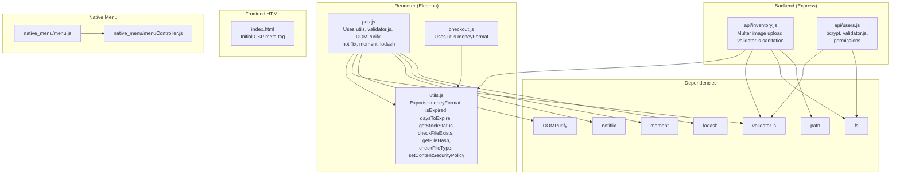

**Diagram sources**
- [utils.js:1-112](file://assets/js/utils.js#L1-L112)
- [pos.js:86-98](file://assets/js/pos.js#L86-L98)
- [checkout.js:1-102](file://assets/js/checkout.js#L1-L102)
- [inventory.js:1-44](file://api/inventory.js#L1-L44)
- [users.js:1-20](file://api/users.js#L1-L20)
- [index.html:1-10](file://index.html#L1-L10)
- [menu.js:1-153](file://assets/js/native_menu/menu.js#L1-L153)
- [menuController.js:1-346](file://assets/js/native_menu/menuController.js#L1-L346)

**Section sources**
- [utils.js:1-112](file://assets/js/utils.js#L1-L112)
- [pos.js:86-98](file://assets/js/pos.js#L86-L98)
- [checkout.js:1-102](file://assets/js/checkout.js#L1-L102)
- [inventory.js:1-44](file://api/inventory.js#L1-L44)
- [users.js:1-20](file://api/users.js#L1-L20)
- [index.html:1-10](file://index.html#L1-L10)
- [menu.js:1-153](file://assets/js/native_menu/menu.js#L1-L153)
- [menuController.js:1-346](file://assets/js/native_menu/menuController.js#L1-L346)

## Core Components
- Security: Content Security Policy (CSP) generation and injection
- Validation: Input sanitization and validation helpers
- Formatting: Currency, dates, and number localization
- File handling: Image validation, hashing, path construction, and local storage
- Business logic: Stock status and expiration checks
- Notifications: User feedback and alerts
- Authentication and permissions: Login flow and permission flags
- Helpers: DOM manipulation, AJAX formatting, and cross-platform compatibility

**Section sources**
- [utils.js:1-112](file://assets/js/utils.js#L1-L112)
- [pos.js:86-98](file://assets/js/pos.js#L86-L98)
- [checkout.js:1-102](file://assets/js/checkout.js#L1-L102)
- [inventory.js:10-39](file://api/inventory.js#L10-L39)
- [users.js:95-131](file://api/users.js#L95-L131)

## Architecture Overview
The renderer process initializes the CSP using a utility function, then applies input validation and sanitization before rendering receipts and lists. Backend APIs enforce input sanitation and file upload restrictions.

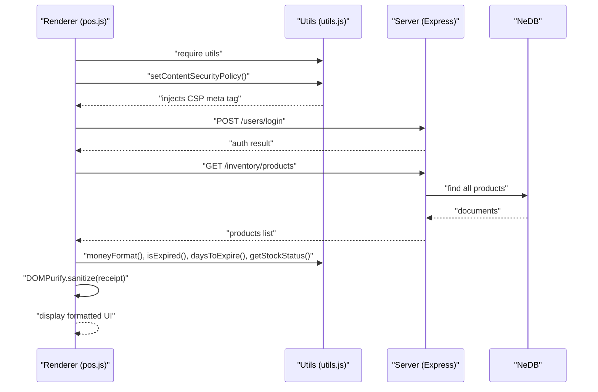

**Diagram sources**
- [pos.js:86-98](file://assets/js/pos.js#L86-L98)
- [utils.js:91-99](file://assets/js/utils.js#L91-L99)
- [users.js:95-131](file://api/users.js#L95-L131)
- [inventory.js:111-115](file://api/inventory.js#L111-L115)

## Detailed Component Analysis

### Security: Content Security Policy
- Purpose: Dynamically compute hashes of bundled assets and inject a CSP meta tag into the document head.
- Implementation highlights:
  - Reads bundle paths and computes SHA-256 hashes using Node’s crypto module.
  - Constructs a CSP string including default-src, img-src, script-src, style-src, font-src, base-uri, form-action, and connect-src.
  - Injects the CSP via a dynamically created meta tag appended to document.head.
- Usage:
  - Called during renderer initialization to harden the app against XSS.

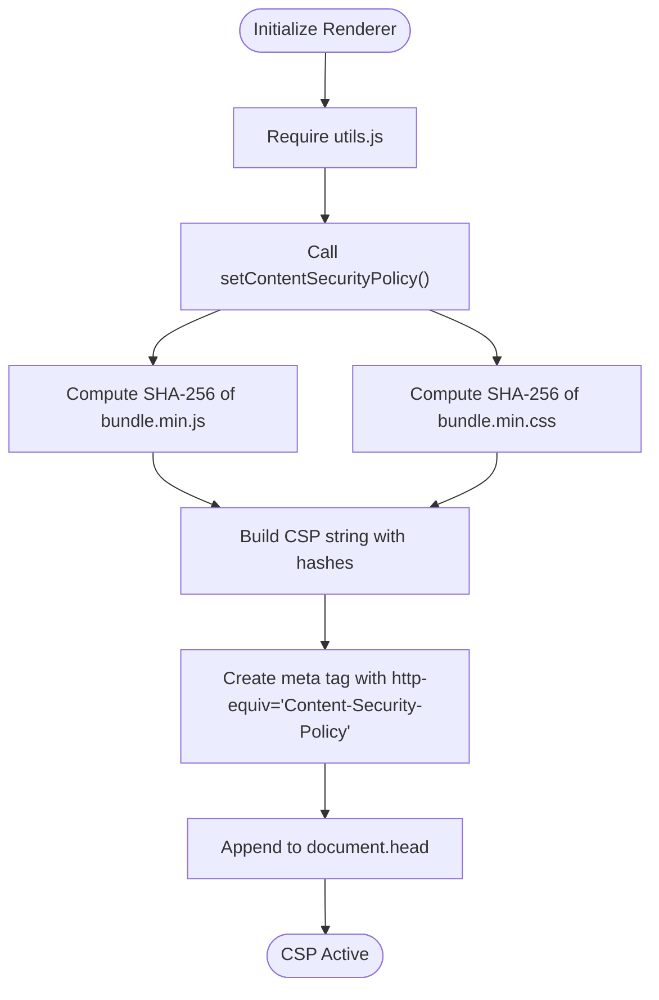

**Diagram sources**
- [utils.js:91-99](file://assets/js/utils.js#L91-L99)
- [pos.js:96-97](file://assets/js/pos.js#L96-L97)

**Section sources**
- [utils.js:91-99](file://assets/js/utils.js#L91-L99)
- [pos.js:96-97](file://assets/js/pos.js#L96-L97)

### Input Validation and Sanitization
- Validator.js usage:
  - Escapes and validates user inputs on the backend (e.g., usernames, product fields).
  - Unescapes values safely for frontend display where appropriate.
- DOMPurify usage:
  - Sanitizes dynamic HTML content (e.g., receipts, product names, prices) before rendering to prevent DOM-based XSS.
- Frontend validation helpers:
  - jQuery plugins for numeric-only input fields and serialization of forms.

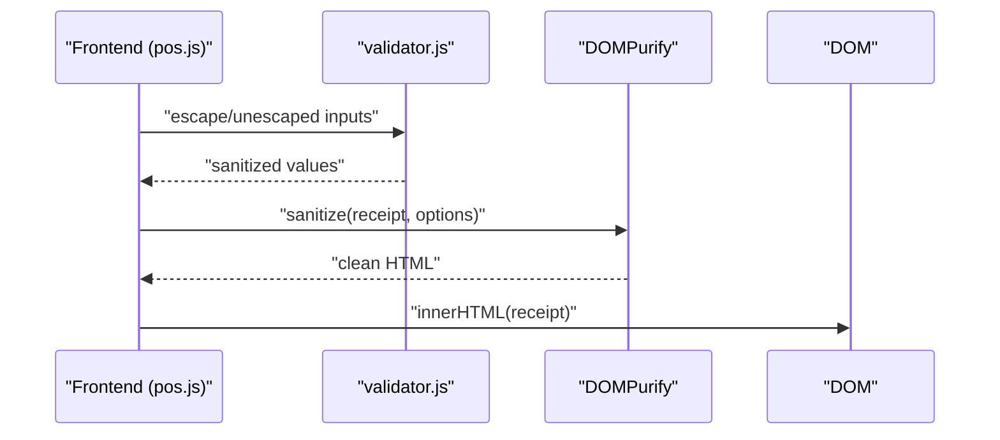

**Diagram sources**
- [pos.js:724-729](file://assets/js/pos.js#L724-L729)
- [pos.js](file://assets/js/pos.js#L931)
- [pos.js](file://assets/js/pos.js#L2446)

**Section sources**
- [pos.js:724-729](file://assets/js/pos.js#L724-L729)
- [pos.js](file://assets/js/pos.js#L931)
- [pos.js](file://assets/js/pos.js#L2446)
- [inventory.js:179-193](file://api/inventory.js#L179-L193)
- [users.js:96-130](file://api/users.js#L96-L130)

### Data Formatting Utilities
- Currency display:
  - moneyFormat(amount, locale): Uses Intl.NumberFormat for locale-aware formatting.
- Date formatting and expiration:
  - isExpired(dueDate): Compares today vs. due date using moment.
  - daysToExpire(dueDate): Computes days until expiry respecting DATE_FORMAT.
- Localization:
  - Locale parameter in moneyFormat enables regional number formatting.

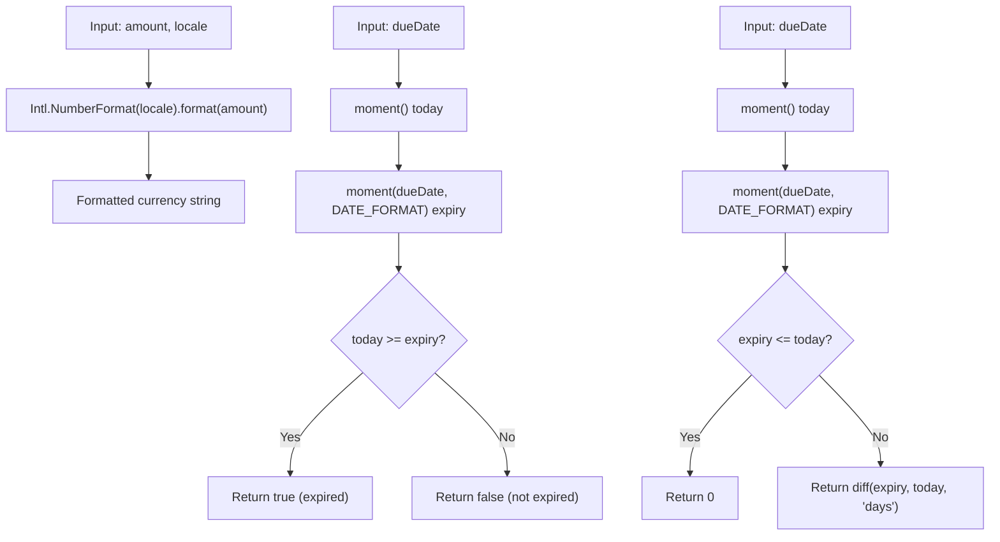

**Diagram sources**
- [utils.js:7-26](file://assets/js/utils.js#L7-L26)
- [utils.js:12-26](file://assets/js/utils.js#L12-L26)

**Section sources**
- [utils.js:7-26](file://assets/js/utils.js#L7-L26)
- [utils.test.js:18-23](file://tests/utils.test.js#L18-L23)
- [utils.test.js:33-51](file://tests/utils.test.js#L33-L51)
- [utils.test.js:56-74](file://tests/utils.test.js#L56-L74)

### File Handling Utilities
- Existence check:
  - checkFileExists(filePath): Uses fs.statSync to verify file existence.
- Type validation:
  - checkFileType(fileType, validFileTypes): Validates MIME type against allowed list.
- Hashing:
  - getFileHash(filePath): Reads file and computes SHA-256.
- Path construction:
  - Paths built using Node’s path module for cross-platform compatibility.
- Local storage:
  - Electron Store used for persisting settings and auth state.

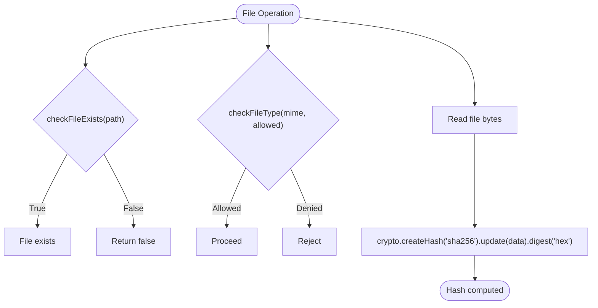

**Diagram sources**
- [utils.js:56-73](file://assets/js/utils.js#L56-L73)
- [utils.js:65-67](file://assets/js/utils.js#L65-L67)
- [utils.js:69-73](file://assets/js/utils.js#L69-L73)
- [pos.js:322-324](file://assets/js/pos.js#L322-L324)
- [pos.js:812-815](file://assets/js/pos.js#L812-L815)
- [checkout.js:16-17](file://assets/js/checkout.js#L16-L17)

**Section sources**
- [utils.js:56-73](file://assets/js/utils.js#L56-L73)
- [pos.js:322-324](file://assets/js/pos.js#L322-L324)
- [pos.js:812-815](file://assets/js/pos.js#L812-L815)
- [checkout.js:16-17](file://assets/js/checkout.js#L16-L17)
- [inventory.js:10-39](file://api/inventory.js#L10-L39)

### Stock Status Calculation and Expiration Checks
- Stock status:
  - getStockStatus(currentStock, minimumStock): Returns 0 (no stock), -1 (low), or 1 (normal).
- Expiration:
  - isExpired(dueDate): True if today is same or after expiry.
  - daysToExpire(dueDate): Days remaining, capped at 0 if expired.
- Notifications:
  - Notiflix used to warn about expiring items and report expired stock.

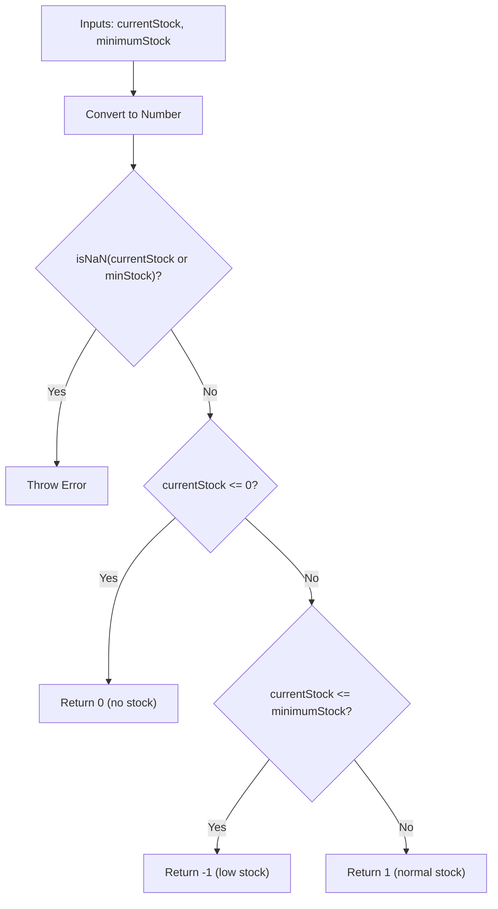

**Diagram sources**
- [utils.js:36-52](file://assets/js/utils.js#L36-L52)

**Section sources**
- [utils.js:36-52](file://assets/js/utils.js#L36-L52)
- [pos.js:288-305](file://assets/js/pos.js#L288-L305)
- [pos.js:1684-1713](file://assets/js/pos.js#L1684-L1713)

### Notification Systems
- Initialization:
  - Notiflix configured globally with position, animation, and message length settings.
- Usage:
  - Failure/warning/info/success reports for user feedback.
  - Confirmation dialogs for destructive actions.

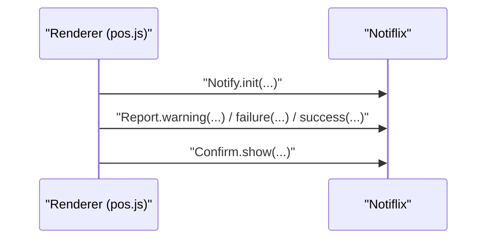

**Diagram sources**
- [pos.js:79-85](file://assets/js/pos.js#L79-L85)
- [pos.js:288-305](file://assets/js/pos.js#L288-L305)

**Section sources**
- [pos.js:79-85](file://assets/js/pos.js#L79-L85)
- [pos.js:288-305](file://assets/js/pos.js#L288-L305)

### Permission Checking and Authentication Helpers
- Permissions:
  - Permission flags stored per user (e.g., perm_products, perm_categories).
  - UI visibility toggled based on user permissions.
- Authentication:
  - Login endpoint compares hashed passwords using bcrypt.
  - On success, auth and user data persisted via Electron Store.
  - Logout updates user status and clears storage.

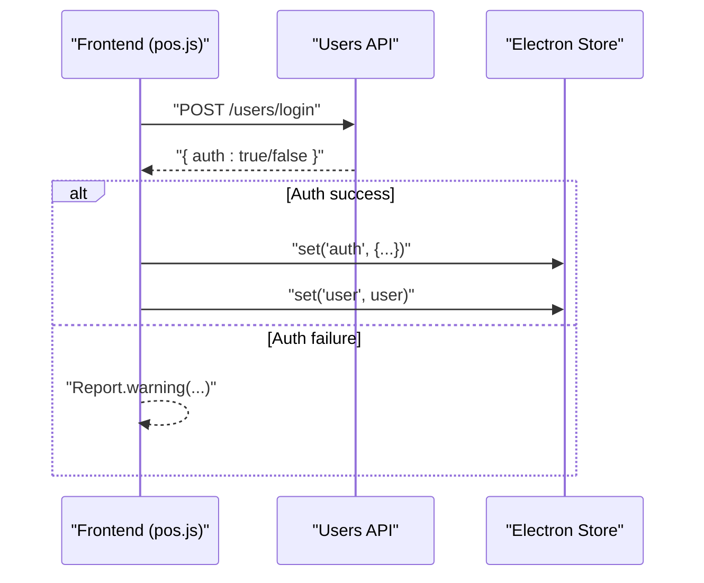

**Diagram sources**
- [users.js:95-131](file://api/users.js#L95-L131)
- [pos.js:2492-2514](file://assets/js/pos.js#L2492-L2514)

**Section sources**
- [users.js:95-131](file://api/users.js#L95-L131)
- [pos.js:2492-2514](file://assets/js/pos.js#L2492-L2514)
- [pos.js:251-265](file://assets/js/pos.js#L251-L265)

### Helper Functions: DOM Manipulation, AJAX, Cross-Platform Compatibility
- DOM helpers:
  - jQuery plugins for numeric-only input, form serialization, and cart operations.
- AJAX formatting:
  - Consistent JSON stringify, content-type, and cache/process flags across requests.
- Cross-platform:
  - Path construction using Node’s path module.
  - Platform-specific menus and IPC communication via Electron.

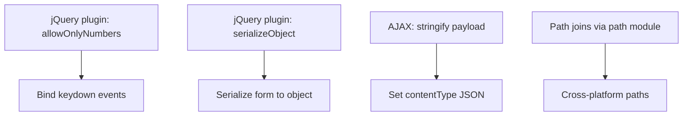

**Diagram sources**
- [pos.js:152-166](file://assets/js/pos.js#L152-L166)
- [pos.js:169-183](file://assets/js/pos.js#L169-L183)
- [pos.js:922-954](file://assets/js/pos.js#L922-L954)
- [pos.js:1960-1970](file://assets/js/pos.js#L1960-L1970)

**Section sources**
- [pos.js:152-166](file://assets/js/pos.js#L152-L166)
- [pos.js:169-183](file://assets/js/pos.js#L169-L183)
- [pos.js:922-954](file://assets/js/pos.js#L922-L954)
- [pos.js:1960-1970](file://assets/js/pos.js#L1960-L1970)

### Example Usage and Customization
- Currency formatting:
  - Use moneyFormat(value, locale) to format amounts with regional separators.
  - Customize locale for different markets.
- Expiration and stock:
  - Use isExpired and daysToExpire to drive alerts and UI warnings.
  - Use getStockStatus to color-code stock indicators.
- File handling:
  - Validate uploaded images with checkFileType and enforce size limits.
  - Compute hashes for integrity checks or backups.
- Security:
  - Ensure setContentSecurityPolicy runs early to protect the app.
  - Sanitize all dynamic HTML with DOMPurify before insertion.
- Authentication:
  - Toggle UI elements based on user permission flags.
  - Persist auth state using Electron Store and reload the app on settings changes.

**Section sources**
- [utils.js:7-11](file://assets/js/utils.js#L7-L11)
- [utils.js:12-26](file://assets/js/utils.js#L12-L26)
- [utils.js:36-52](file://assets/js/utils.js#L36-L52)
- [utils.js:56-73](file://assets/js/utils.js#L56-L73)
- [utils.js:91-99](file://assets/js/utils.js#L91-L99)
- [pos.js:288-305](file://assets/js/pos.js#L288-L305)
- [pos.js:724-729](file://assets/js/pos.js#L724-L729)
- [pos.js](file://assets/js/pos.js#L931)
- [pos.js:2492-2514](file://assets/js/pos.js#L2492-L2514)
- [checkout.js:16-17](file://assets/js/checkout.js#L16-L17)

## Dependency Analysis
External libraries and their roles:
- validator.js: Input sanitation and escaping on backend and safe unescaping on frontend.
- DOMPurify: Sanitization of dynamic HTML content.
- notiflix: User notifications and confirmation dialogs.
- moment: Date parsing and comparisons.
- lodash: Utility functions (e.g., escaping) used in receipt rendering.
- fs/path/crypto: File operations, path construction, and hashing.
- express/multer: Backend routes and image upload filtering.

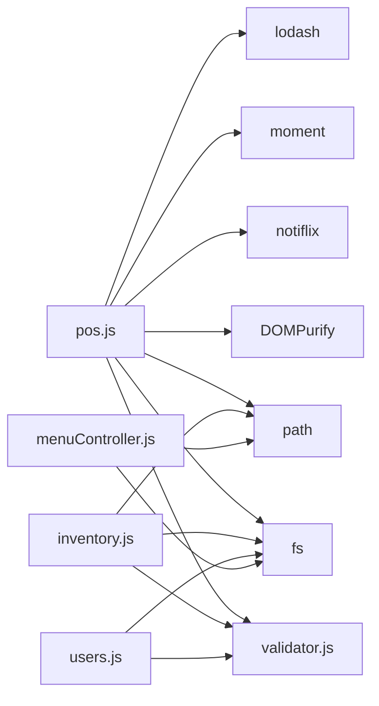

**Diagram sources**
- [package.json:18-54](file://package.json#L18-L54)
- [pos.js:6-18](file://assets/js/pos.js#L6-L18)
- [inventory.js:17-19](file://api/inventory.js#L17-L19)
- [users.js:7-8](file://api/users.js#L7-L8)
- [menuController.js:23-26](file://assets/js/native_menu/menuController.js#L23-L26)

**Section sources**
- [package.json:18-54](file://package.json#L18-L54)
- [pos.js:6-18](file://assets/js/pos.js#L6-L18)
- [inventory.js:17-19](file://api/inventory.js#L17-L19)
- [users.js:7-8](file://api/users.js#L7-L8)
- [menuController.js:23-26](file://assets/js/native_menu/menuController.js#L23-L26)

## Performance Considerations
- Prefer client-side caching for frequently accessed data (e.g., product lists) to reduce network overhead.
- Minimize DOM updates by batching UI changes (e.g., DataTable redraws).
- Use efficient loops and avoid repeated DOM queries; cache jQuery selectors.
- Sanitization adds CPU overhead; apply only to dynamic HTML and avoid redundant sanitization.

## Troubleshooting Guide
- CSP not applied:
  - Ensure setContentSecurityPolicy is called before any dynamic content is rendered.
  - Verify bundle paths exist and hashes are computed correctly.
- Validation errors on backend:
  - Confirm validator.escape is applied to all incoming fields.
  - Check multer fileFilter and size limits.
- File operations fail:
  - Verify file paths constructed with path.join and that directories exist.
  - Handle fs.statSync exceptions gracefully.
- Authentication issues:
  - Confirm bcrypt compare matches stored hash.
  - Check Electron Store keys and IPC reload behavior.

**Section sources**
- [utils.js:91-99](file://assets/js/utils.js#L91-L99)
- [inventory.js:28-39](file://api/inventory.js#L28-L39)
- [users.js:95-131](file://api/users.js#L95-L131)
- [pos.js:2492-2514](file://assets/js/pos.js#L2492-L2514)

## Conclusion
The PharmaSpot utility functions library centralizes security, validation, formatting, and file handling concerns. By combining CSP injection, robust input sanitation, locale-aware formatting, and secure file operations, the system strengthens defense-in-depth. Together with permission-based UI controls and consistent notification patterns, it delivers a reliable, maintainable foundation for the POS application.