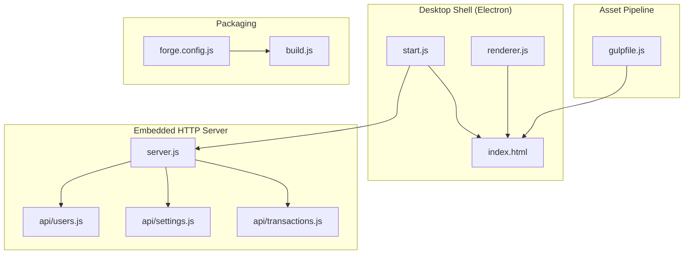
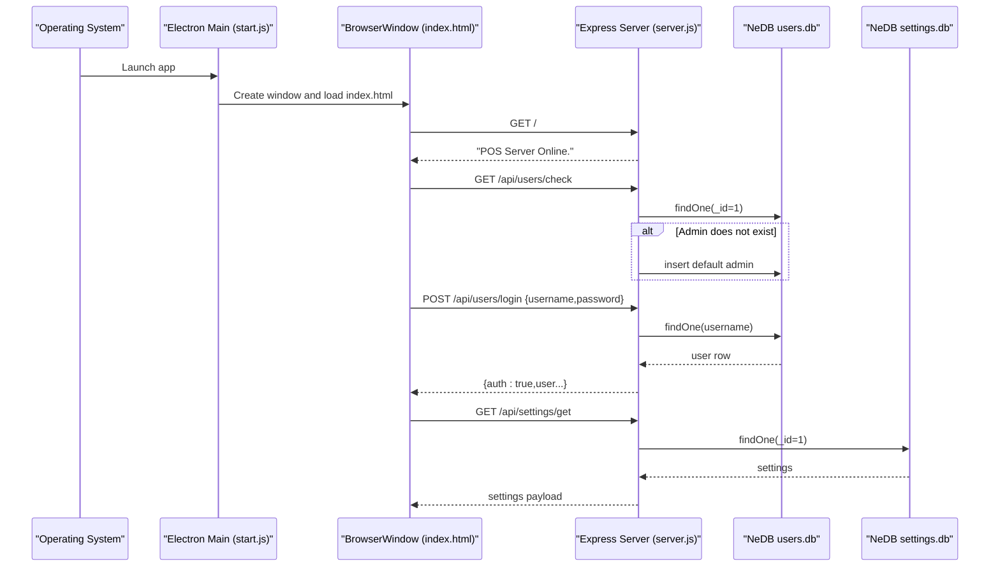
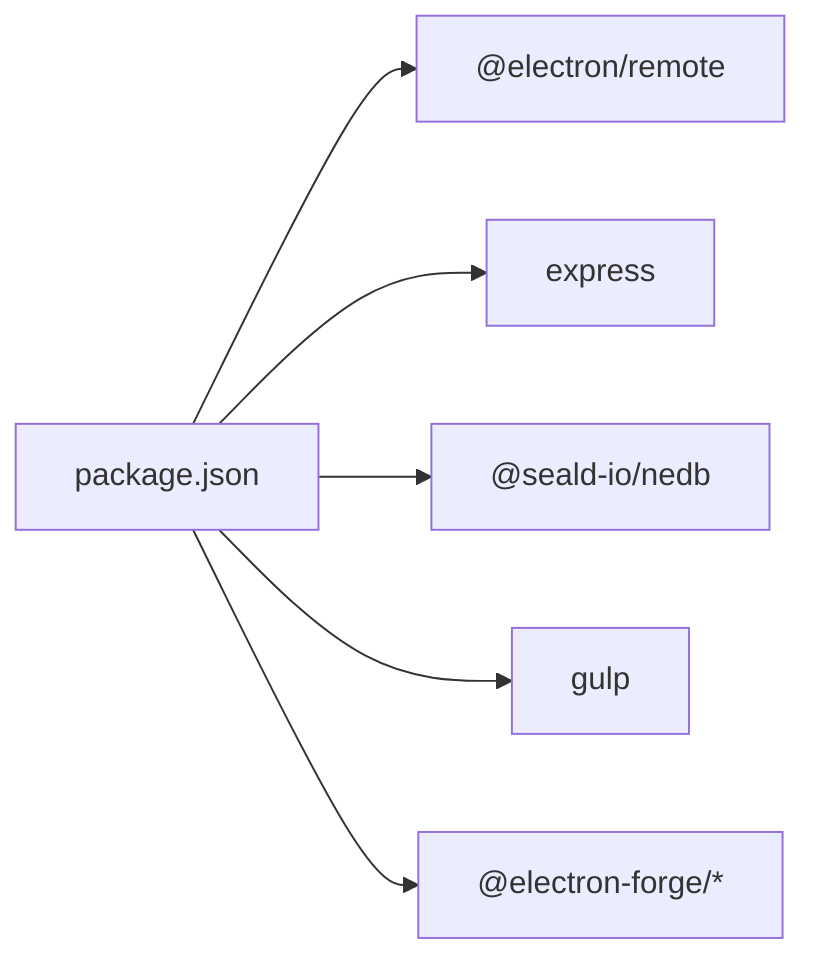

# Getting Started

<cite>
**Referenced Files in This Document**
- [README.md](file://README.md)
- [package.json](file://package.json)
- [start.js](file://start.js)
- [server.js](file://server.js)
- [forge.config.js](file://forge.config.js)
- [build.js](file://build.js)
- [gulpfile.js](file://gulpfile.js)
- [index.html](file://index.html)
- [renderer.js](file://renderer.js)
- [api/users.js](file://api/users.js)
- [api/settings.js](file://api/settings.js)
- [api/transactions.js](file://api/transactions.js)
- [installers/setupEvents.js](file://installers/setupEvents.js)
- [app.config.js](file://app.config.js)
- [docs/TECH_STACK.md](file://docs/TECH_STACK.md)
</cite>

## Table of Contents
1. [Introduction](#introduction)
2. [Project Structure](#project-structure)
3. [Core Components](#core-components)
4. [Architecture Overview](#architecture-overview)
5. [Detailed Component Analysis](#detailed-component-analysis)
6. [Dependency Analysis](#dependency-analysis)
7. [Performance Considerations](#performance-considerations)
8. [Troubleshooting Guide](#troubleshooting-guide)
9. [Conclusion](#conclusion)
10. [Appendices](#appendices)

## Introduction
This guide helps you get PharmaSpot POS running quickly—whether you are installing the packaged application for end users or setting up a development environment. It covers:
- End-user installation and first run
- Developer setup and local development
- Default login credentials and initial setup
- Differences between production deployment and development
- System requirements verification
- Initial database setup and basic system verification
- Troubleshooting common issues

## Project Structure
PharmaSpot POS is a cross-platform desktop application built with Electron. The desktop shell launches an embedded HTTP server (Express) that serves the UI and exposes APIs. Assets are bundled via Gulp for production.

**Diagram sources**
- [start.js:1-107](file://start.js#L1-L107)
- [server.js:1-68](file://server.js#L1-L68)
- [api/users.js:1-311](file://api/users.js#L1-L311)
- [api/settings.js:1-192](file://api/settings.js#L1-L192)
- [api/transactions.js:1-251](file://api/transactions.js#L1-L251)
- [gulpfile.js:1-80](file://gulpfile.js#L1-L80)
- [forge.config.js:1-71](file://forge.config.js#L1-L71)
- [build.js:1-20](file://build.js#L1-L20)

**Section sources**
- [docs/TECH_STACK.md:1-64](file://docs/TECH_STACK.md#L1-L64)
- [README.md:61-77](file://README.md#L61-L77)

## Core Components
- Desktop shell and lifecycle: Electron main process initializes the window, context menu, and handles Squirrel installer events.
- Embedded HTTP server: Express routes serve the UI and expose APIs for inventory, customers, categories, settings, users, and transactions.
- Asset pipeline: Gulp concatenates/minifies CSS/JS and synchronizes with BrowserSync during development.
- Packaging: Electron Forge builds platform-specific installers and publishes releases.

Key defaults and behaviors:
- Default HTTP port is 3210 (overridable via PORT).
- Databases are embedded NeDB files under %APPDATA%/<APPNAME>/server/databases/.
- Default admin account is created automatically if missing.

**Section sources**
- [start.js:1-107](file://start.js#L1-L107)
- [server.js:10-50](file://server.js#L10-L50)
- [api/users.js:268-311](file://api/users.js#L268-L311)
- [docs/TECH_STACK.md:14-48](file://docs/TECH_STACK.md#L14-L48)

## Architecture Overview
The Electron app loads index.html and communicates with the embedded Express server. APIs are mounted under /api/* and backed by NeDB.

**Diagram sources**
- [start.js:51-53](file://start.js#L51-L53)
- [index.html:15-30](file://index.html#L15-L30)
- [server.js:36-49](file://server.js#L36-L49)
- [api/users.js:95-131](file://api/users.js#L95-L131)
- [api/users.js:268-311](file://api/users.js#L268-L311)
- [api/settings.js:71-80](file://api/settings.js#L71-L80)

## Detailed Component Analysis

### End-User Installation (Windows and Other Platforms)
- Download the latest release from the Releases page.
- Unzip the package to a folder of your choice.
- Run the PharmaSpot executable.
- Log in with the default admin credentials.

Default credentials:
- Username: admin
- Password: admin

Initial setup:
- On first login, the system checks for the default admin user and creates it if missing.
- Navigate to Settings to configure application mode (standalone, terminal, server), server IP, till number, and hardware identification number.
- Optionally upload a logo via Settings.

Notes:
- Windows installers are generated via Squirrel/WIX; the app also supports generic ZIP archives.
- On Windows, Squirrel events are handled to create/remove desktop/start menu shortcuts.

**Section sources**
- [README.md:61-69](file://README.md#L61-L69)
- [README.md:61-69](file://README.md#L61-L69)
- [api/users.js:268-311](file://api/users.js#L268-L311)
- [index.html:763-800](file://index.html#L763-L800)
- [installers/setupEvents.js:1-65](file://installers/setupEvents.js#L1-L65)

### Developer Setup and Environment
- Prerequisites: Node.js and npm/yarn installed.
- Clone the repository.
- Install dependencies.
- Start the development server and bundler:
  - Electron Forge dev server
  - Gulp watcher for CSS/JS
- Run tests with Jest.

Scripts and commands:
- npm start (Electron Forge)
- gulp (watch and bundle)
- npm run test (Jest)

Development specifics:
- Live reload is enabled when not packaged.
- The embedded server listens on port 3210 by default.

**Section sources**
- [README.md:70-77](file://README.md#L70-L77)
- [package.json:93-102](file://package.json#L93-L102)
- [gulpfile.js:68-80](file://gulpfile.js#L68-L80)
- [start.js:99-104](file://start.js#L99-L104)
- [server.js:10-50](file://server.js#L10-L50)

### Production Deployment vs. Development
- Development: Electron runs the app locally with live reload and asset watchers. The server binds to localhost and port 3210.
- Production: Electron Forge packages the app into platform-specific installers (ZIP, Squirrel/SI, WIX, deb, rpm, dmg). The packaged app behaves like the end-user installation.

Packaging details:
- Makers: ZIP, Squirrel/SI, WIX (Windows), deb/rpm (Linux), dmg (macOS).
- Publishers: GitHub releases.
- Hooks remove problematic binaries on Linux post-prune.

**Section sources**
- [forge.config.js:21-38](file://forge.config.js#L21-L38)
- [forge.config.js:54-69](file://forge.config.js#L54-L69)
- [build.js:7-15](file://build.js#L7-L15)
- [docs/TECH_STACK.md:9-11](file://docs/TECH_STACK.md#L9-L11)

### Initial Database Setup and First-Time Configuration
- Default admin user creation:
  - Endpoint checks for user ID 1; if absent, inserts a default admin with full permissions.
- Settings initialization:
  - Application settings are stored in settings.db with a single record (_id=1).
  - Configure store info, taxes, currency, and optionally upload a logo.
- Transaction and inventory databases:
  - Transactions and inventory are stored in separate NeDB files under the app data directory.

Verification steps:
- Confirm server is online at the default port.
- Verify admin login succeeds.
- Retrieve settings and confirm initial values.

**Section sources**
- [api/users.js:268-311](file://api/users.js#L268-L311)
- [api/settings.js:71-80](file://api/settings.js#L71-L80)
- [api/settings.js:90-190](file://api/settings.js#L90-L190)
- [api/transactions.js:46-50](file://api/transactions.js#L46-L50)
- [server.js:47-50](file://server.js#L47-L50)

### System Requirements Verification
- Desktop OS: Windows, Linux, macOS (as makers are configured).
- Node.js and npm: Required for development; not required for end-user execution of packaged apps.
- Ports: Ensure port 3210 is available (or set PORT environment variable).
- Filesystem: Write access to %APPDATA%/<APPNAME>/server/databases/ for NeDB files.

**Section sources**
- [forge.config.js:21-38](file://forge.config.js#L21-L38)
- [server.js:10-10](file://server.js#L10-L10)
- [docs/TECH_STACK.md:35-42](file://docs/TECH_STACK.md#L35-L42)

## Dependency Analysis
High-level dependencies:
- Electron (main process, window lifecycle)
- Express (HTTP server and API routes)
- NeDB (@seald-io/nedb) for embedded persistence
- Gulp/BrowserSync for asset bundling and development workflow
- Electron Forge for packaging and publishing

**Diagram sources**
- [package.json:18-54](file://package.json#L18-L54)
- [package.json:115-145](file://package.json#L115-L145)

**Section sources**
- [package.json:18-54](file://package.json#L18-L54)
- [package.json:115-145](file://package.json#L115-L145)

## Performance Considerations
- Asset bundling: Use Gulp to concatenate/minify CSS/JS for production to reduce load times.
- Rate limiting: Express rate limit middleware protects the server under load.
- Database locality: NeDB files are local; keep the app on a fast drive for responsiveness.
- Packaging: ASAR packaging improves distribution and startup speed.

[No sources needed since this section provides general guidance]

## Troubleshooting Guide
Common issues and resolutions:
- Cannot start the app on Windows:
  - Ensure the system allows running downloaded executables.
  - If using ZIP, extract and run the executable directly.
- Port already in use:
  - Set the PORT environment variable to another value before starting.
- Login fails immediately:
  - Verify the default admin exists (it is auto-created on first access).
  - Check that the password matches the default credential.
- Assets not loading in development:
  - Ensure Gulp watcher is running and that the bundle files exist.
- Packaging errors on Linux:
  - The Forge hook removes problematic node-gyp bins post-prune; re-run make if needed.

**Section sources**
- [server.js:10-14](file://server.js#L10-L14)
- [server.js:47-50](file://server.js#L47-L50)
- [api/users.js:268-311](file://api/users.js#L268-L311)
- [gulpfile.js:68-80](file://gulpfile.js#L68-L80)
- [forge.config.js:54-69](file://forge.config.js#L54-L69)

## Conclusion
You now have the essentials to install PharmaSpot POS as an end user, set up a developer environment, log in with default credentials, and understand how the embedded server and databases work. Use the packaged installers for production and Electron Forge for building distributables. If you encounter issues, verify ports, credentials, and asset bundling.

[No sources needed since this section summarizes without analyzing specific files]

## Appendices

### Step-by-Step End-User (Windows)
1. Download the latest release.
2. Unzip to a folder.
3. Run the PharmaSpot executable.
4. Log in with admin/admin.
5. Go to Settings and configure application mode, server IP, till number, and MAC address.
6. Optionally upload a logo.

**Section sources**
- [README.md:61-69](file://README.md#L61-L69)
- [index.html:763-800](file://index.html#L763-L800)

### Step-by-Step End-User (Other Platforms)
- Follow the same steps as Windows, using the appropriate ZIP or installer for your platform (ZIP, deb, rpm, dmg).

**Section sources**
- [forge.config.js:21-38](file://forge.config.js#L21-L38)

### Step-by-Step Developer (Clone and Run)
1. Clone the repository.
2. Install dependencies.
3. Start Electron Forge and Gulp:
   - npm start
   - gulp
4. Open the app in the Electron window.
5. Run tests with npm test.

**Section sources**
- [README.md:70-77](file://README.md#L70-L77)
- [package.json:93-102](file://package.json#L93-L102)
- [gulpfile.js:68-80](file://gulpfile.js#L68-L80)

### Default Credentials and Initial Setup
- Default admin login: admin/admin
- Initial setup: Settings modal for application mode, server IP, till number, and hardware ID; optional logo upload.

**Section sources**
- [README.md:65-69](file://README.md#L65-L69)
- [api/users.js:268-311](file://api/users.js#L268-L311)
- [index.html:763-800](file://index.html#L763-L800)

### Production Deployment Commands
- Package: npm run package
- Make installers: npm run make
- Publish: npm run publish

**Section sources**
- [package.json:97-101](file://package.json#L97-L101)
- [forge.config.js:40-51](file://forge.config.js#L40-L51)

### Embedded Server and API Surface
- Server: Express on port 3210
- APIs: /api/inventory, /api/customers, /api/categories, /api/settings, /api/users, /api/transactions

**Section sources**
- [server.js:40-45](file://server.js#L40-L45)
- [docs/TECH_STACK.md:24-34](file://docs/TECH_STACK.md#L24-L34)

### Update Server Configuration
- Update server URL is configured in app.config.js.

**Section sources**
- [app.config.js:1-8](file://app.config.js#L1-L8)