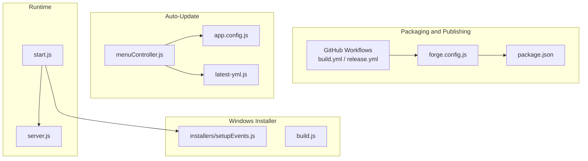
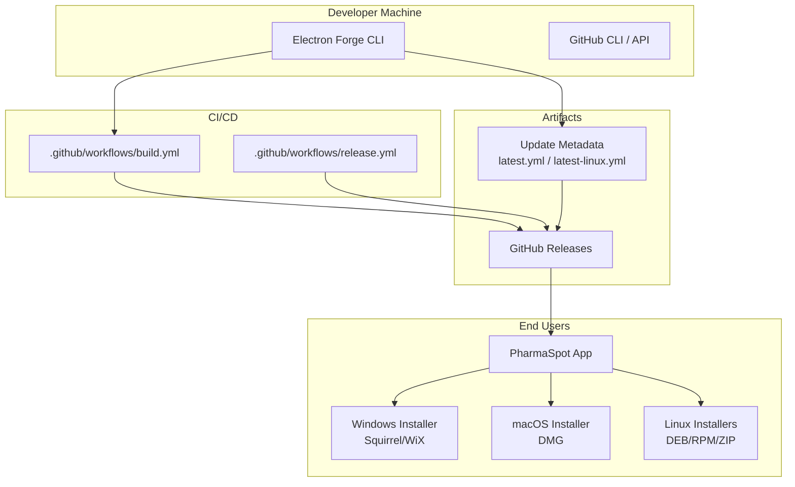
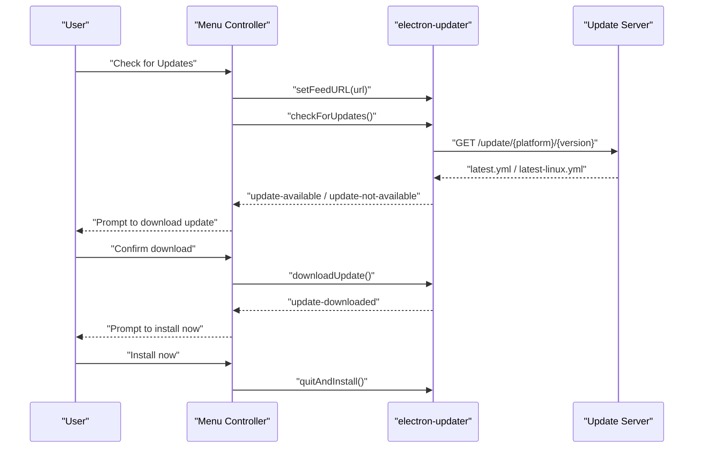
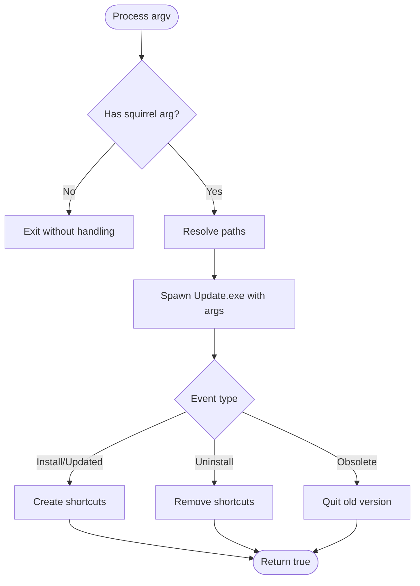
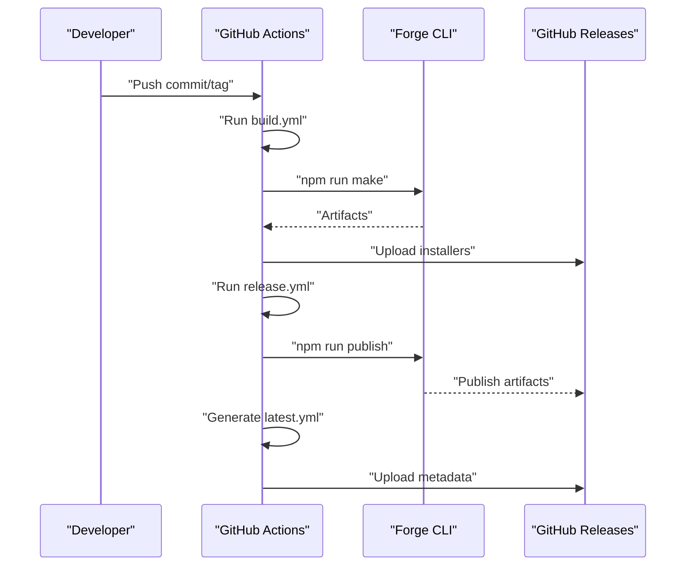
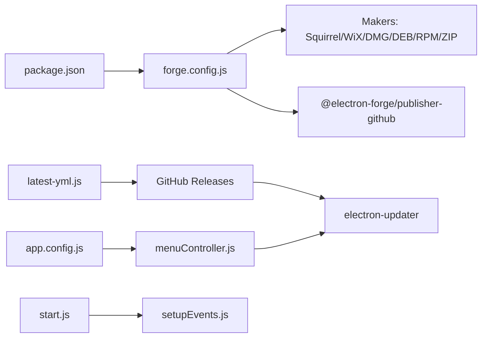

# Distribution Strategies

<cite>
**Referenced Files in This Document**
- [forge.config.js](file://forge.config.js)
- [package.json](file://package.json)
- [start.js](file://start.js)
- [installers/setupEvents.js](file://installers/setupEvents.js)
- [build.js](file://build.js)
- [latest-yml.js](file://latest-yml.js)
- [menuController.js](file://assets/js/native_menu/menuController.js)
- [app.config.js](file://app.config.js)
- [server.js](file://server.js)
- [docs/TECH_STACK.md](file://docs/TECH_STACK.md)
- [.github/workflows/build.yml](file://.github/workflows/build.yml)
- [.github/workflows/release.yml](file://.github/workflows/release.yml)
</cite>

## Table of Contents
1. [Introduction](#introduction)
2. [Project Structure](#project-structure)
3. [Core Components](#core-components)
4. [Architecture Overview](#architecture-overview)
5. [Detailed Component Analysis](#detailed-component-analysis)
6. [Dependency Analysis](#dependency-analysis)
7. [Performance Considerations](#performance-considerations)
8. [Troubleshooting Guide](#troubleshooting-guide)
9. [Conclusion](#conclusion)

## Introduction
This document describes PharmaSpot POS distribution strategies and deployment methods. It covers supported distribution channels, installer types and their use cases, the auto-update mechanism, update checking behavior, and enterprise deployment considerations. It also outlines security and compliance topics relevant to distributing desktop applications across Windows, macOS, and Linux environments.

## Project Structure
PharmaSpot POS is an Electron-based desktop application packaged with Electron Forge and published to GitHub Releases. The repository includes:
- Packaging and publishing configuration for multiple platforms
- Installer event handling for Windows Squirrel-based installers
- Auto-update implementation using electron-updater
- CI/CD workflows for building and releasing installers
- A dedicated script to generate platform-specific update metadata

**Diagram sources**
- [forge.config.js:1-71](file://forge.config.js#L1-L71)
- [package.json:1-147](file://package.json#L1-L147)
- [.github/workflows/build.yml:1-61](file://.github/workflows/build.yml#L1-L61)
- [.github/workflows/release.yml:1-69](file://.github/workflows/release.yml#L1-L69)
- [menuController.js:1-132](file://assets/js/native_menu/menuController.js#L1-L132)
- [app.config.js:1-8](file://app.config.js#L1-L8)
- [latest-yml.js:1-96](file://latest-yml.js#L1-L96)
- [installers/setupEvents.js:1-65](file://installers/setupEvents.js#L1-L65)
- [build.js:1-20](file://build.js#L1-L20)
- [start.js:1-107](file://start.js#L1-L107)
- [server.js](file://server.js)

**Section sources**
- [forge.config.js:1-71](file://forge.config.js#L1-L71)
- [package.json:1-147](file://package.json#L1-L147)
- [.github/workflows/build.yml:1-61](file://.github/workflows/build.yml#L1-L61)
- [.github/workflows/release.yml:1-69](file://.github/workflows/release.yml#L1-L69)

## Core Components
- Packaging and makers: Electron Forge makers produce installers for Windows (Squirrel/WiX), macOS (DMG), and Linux (DEB/RPM). A generic ZIP artifact is also produced.
- Publisher: GitHub publisher uploads artifacts to GitHub Releases.
- Windows installer events: Squirrel event handlers manage shortcuts and lifecycle events.
- Auto-update: electron-updater checks a generic feed URL and prompts users to download and install updates.
- CI/CD: GitHub Actions builds installers on multiple OS matrices and publishes to GitHub Releases.
- Update metadata: A generator script creates platform-specific update metadata files consumed by electron-updater.

**Section sources**
- [forge.config.js:21-51](file://forge.config.js#L21-L51)
- [installers/setupEvents.js:5-64](file://installers/setupEvents.js#L5-L64)
- [menuController.js:52-132](file://assets/js/native_menu/menuController.js#L52-L132)
- [.github/workflows/build.yml:10-61](file://.github/workflows/build.yml#L10-L61)
- [.github/workflows/release.yml:14-69](file://.github/workflows/release.yml#L14-L69)
- [latest-yml.js:18-96](file://latest-yml.js#L18-L96)

## Architecture Overview
The distribution architecture integrates packaging, publishing, and update delivery across platforms.

**Diagram sources**
- [forge.config.js:21-51](file://forge.config.js#L21-L51)
- [.github/workflows/build.yml:10-61](file://.github/workflows/build.yml#L10-L61)
- [.github/workflows/release.yml:14-69](file://.github/workflows/release.yml#L14-L69)
- [latest-yml.js:18-96](file://latest-yml.js#L18-L96)

## Detailed Component Analysis

### Distribution Channels
- Direct downloads: GitHub Releases hosts installers for Windows, macOS, and Linux. The repository is configured to publish artifacts automatically on tagged releases.
- App stores: No explicit app store publishers are configured in the repository. Distribution via official app stores would require separate publisher configurations and signing workflows.
- Enterprise deployment: Windows WiX installer and Linux DEB/RPM packages support enterprise distribution via internal repositories or MDM tools. ZIP archives are available for manual distribution.
- OEM partnerships: The cross-platform installers produced by Forge facilitate OEM bundling across Windows, macOS, and Linux.

**Section sources**
- [forge.config.js:40-51](file://forge.config.js#L40-L51)
- [.github/workflows/release.yml:14-69](file://.github/workflows/release.yml#L14-L69)

### Installer Types and Use Cases
- MSI (WiX): Windows installer generated via WiX maker. Suitable for enterprise environments requiring administrative installs and policy-driven deployments.
- EXE (Squirrel): Squirrel-based Windows installer with event handling for shortcuts and updates. Good for standard user installs and automatic update scenarios.
- DMG (macOS): Disk image installer for macOS. Standard for Mac distribution and user-friendly for single-click installs.
- DEB (Linux): Debian package for Debian/Ubuntu-based distributions. Ideal for enterprise APT repositories.
- RPM (Linux): Red Hat package for Fedora/CentOS/RHEL-based distributions. Suitable for enterprise YUM/DNF repositories.
- ZIP (Cross-platform): Generic archive for manual distribution or custom enterprise repositories.

**Section sources**
- [forge.config.js:21-38](file://forge.config.js#L21-L38)
- [docs/TECH_STACK.md:9-12](file://docs/TECH_STACK.md#L9-L12)

### Auto-Update Mechanism
- Feed configuration: The updater targets a generic feed URL constructed from a configurable base URL and the current app version.
- Update checking: The updater checks for updates without auto-downloading. When an update is available, the UI prompts the user to download and install.
- Update notifications: Dialogs inform users about available updates, downloaded updates, and errors. Users can choose to install immediately or defer.
- Platform-specific metadata: The generator script produces update metadata files consumed by electron-updater on each platform.

**Diagram sources**
- [menuController.js:52-132](file://assets/js/native_menu/menuController.js#L52-L132)
- [app.config.js:1-8](file://app.config.js#L1-8)
- [latest-yml.js:18-96](file://latest-yml.js#L18-L96)

**Section sources**
- [menuController.js:52-132](file://assets/js/native_menu/menuController.js#L52-L132)
- [app.config.js:1-8](file://app.config.js#L1-L8)
- [latest-yml.js:18-96](file://latest-yml.js#L18-L96)

### Windows Installer Events and Silent Installation
- Squirrel events: The handler manages install, update, uninstall, and obsolete events, including shortcut creation/removal.
- Silent installation: The repository does not define silent switches in the packaging configuration. Administrators can leverage WiX command-line parameters or Squirrel’s command-line options when invoking the installer externally.

**Diagram sources**
- [installers/setupEvents.js:5-64](file://installers/setupEvents.js#L5-L64)

**Section sources**
- [installers/setupEvents.js:5-64](file://installers/setupEvents.js#L5-L64)
- [build.js:7-15](file://build.js#L7-L15)

### CI/CD and Release Automation
- Build jobs: Cross-platform builds run on macOS, Ubuntu, and Windows runners. Linux prerequisites and maker backends are installed conditionally.
- Release job: On tag pushes or manual dispatch, installers are published to GitHub Releases. Update metadata is generated for Linux and uploaded alongside artifacts.

**Diagram sources**
- [.github/workflows/build.yml:10-61](file://.github/workflows/build.yml#L10-L61)
- [.github/workflows/release.yml:14-69](file://.github/workflows/release.yml#L14-L69)

**Section sources**
- [.github/workflows/build.yml:10-61](file://.github/workflows/build.yml#L10-L61)
- [.github/workflows/release.yml:14-69](file://.github/workflows/release.yml#L14-L69)

### Enterprise Deployment Considerations
- Windows: Use WiX installer for enterprise deployments. Configure administrative install switches and integrate with MDM/SCCM as needed.
- Linux: Distribute DEB/RPM packages via internal APT/YUM repositories. ZIP archives support manual distribution or custom enterprise repositories.
- macOS: Use DMG for user-friendly distribution; integrate with MDM solutions for enterprise rollout.
- Silent installation: Configure installer switches externally when invoking the installer. The repository does not preset silent flags in packaging configuration.
- Batch deployment: Package managers and MDM tools can automate installation across fleets using the provided installers.

**Section sources**
- [forge.config.js:21-38](file://forge.config.js#L21-L38)
- [build.js:7-15](file://build.js#L7-L15)

### Security and Compliance Considerations
- Digital signatures: The repository does not configure code signing for installers. To enable signing, configure appropriate certificate settings in the packaging configuration and CI/CD workflows.
- Update integrity: The updater consumes platform-specific metadata files. Ensure the update server enforces HTTPS and validates metadata authenticity.
- Data protection: The embedded server persists data under the application data directory. Ensure secure permissions and backups are part of enterprise hardening.
- Compliance: For regulated environments, ensure audit logs, secure update channels, and signed binaries align with organizational policies.

**Section sources**
- [docs/TECH_STACK.md:35-54](file://docs/TECH_STACK.md#L35-L54)
- [latest-yml.js:18-96](file://latest-yml.js#L18-L96)

## Dependency Analysis
The distribution pipeline depends on packaging configuration, CI/CD workflows, and runtime update logic.

**Diagram sources**
- [package.json:1-147](file://package.json#L1-L147)
- [forge.config.js:21-51](file://forge.config.js#L21-L51)
- [latest-yml.js:18-96](file://latest-yml.js#L18-L96)
- [menuController.js:52-132](file://assets/js/native_menu/menuController.js#L52-L132)
- [app.config.js:1-8](file://app.config.js#L1-L8)
- [start.js:1-107](file://start.js#L1-L107)
- [installers/setupEvents.js:1-65](file://installers/setupEvents.js#L1-L65)

**Section sources**
- [package.json:1-147](file://package.json#L1-L147)
- [forge.config.js:21-51](file://forge.config.js#L21-L51)
- [latest-yml.js:18-96](file://latest-yml.js#L18-L96)
- [menuController.js:52-132](file://assets/js/native_menu/menuController.js#L52-L132)
- [app.config.js:1-8](file://app.config.js#L1-L8)
- [start.js:1-107](file://start.js#L1-L107)
- [installers/setupEvents.js:1-65](file://installers/setupEvents.js#L1-L65)

## Performance Considerations
- Update bandwidth: Provide compressed installers and efficient metadata to minimize download times.
- CI/CD parallelization: Matrix builds across platforms reduce total build time.
- Artifact caching: Node module caching in CI improves reliability and speed.

[No sources needed since this section provides general guidance]

## Troubleshooting Guide
- Update check failures: The updater surfaces errors and offers a retry option. Verify the update server URL and network connectivity.
- Installer shortcuts: On Windows, Squirrel events manage shortcuts. If shortcuts are missing, re-run the installer or inspect event handling.
- Metadata generation: Ensure the metadata generator runs after build completion and that the output directory exists.

**Section sources**
- [menuController.js:106-126](file://assets/js/native_menu/menuController.js#L106-L126)
- [installers/setupEvents.js:5-64](file://installers/setupEvents.js#L5-L64)
- [latest-yml.js:76-96](file://latest-yml.js#L76-L96)

## Conclusion
PharmaSpot POS supports robust cross-platform distribution via Electron Forge, GitHub Releases, and electron-updater. The repository provides installers for Windows, macOS, and Linux, with CI/CD automation for building and publishing. While the updater is implemented, digital signing and enterprise silent install switches are not configured by default and should be added to meet enterprise and compliance requirements.