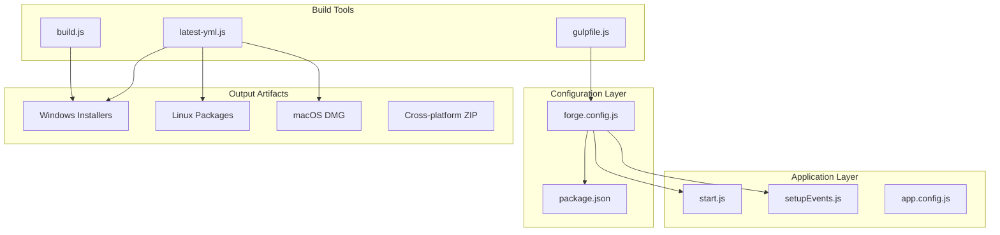
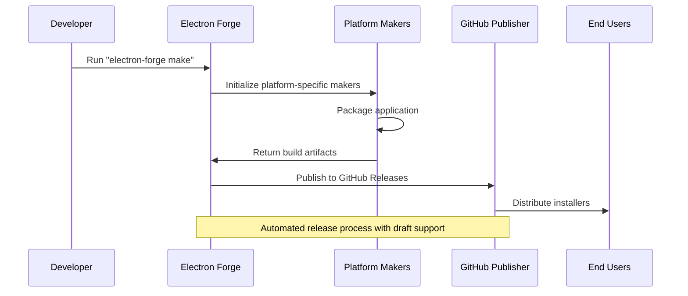
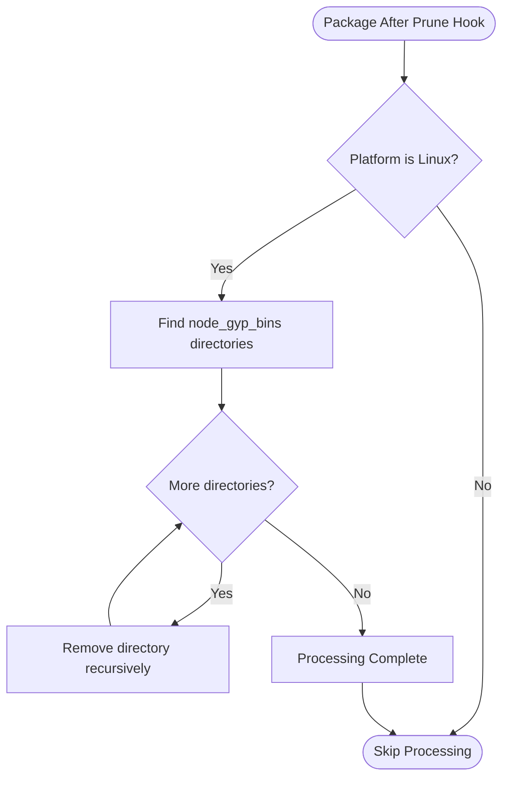
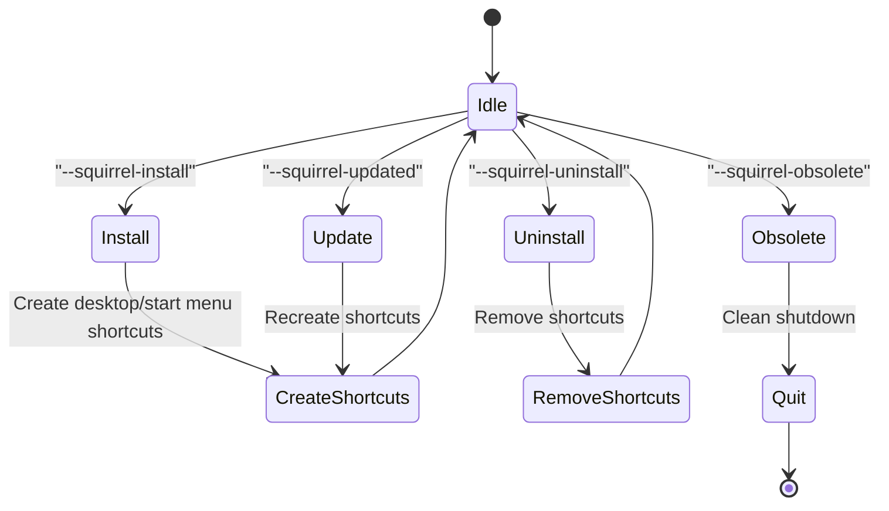
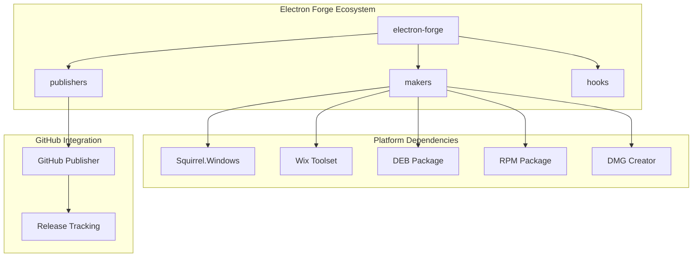

# Electron Forge Configuration

<cite>
**Referenced Files in This Document**
- [forge.config.js](file://forge.config.js)
- [package.json](file://package.json)
- [start.js](file://start.js)
- [installers/setupEvents.js](file://installers/setupEvents.js)
- [build.js](file://build.js)
- [latest-yml.js](file://latest-yml.js)
- [gulpfile.js](file://gulpfile.js)
- [app.config.js](file://app.config.js)
</cite>

## Table of Contents
1. [Introduction](#introduction)
2. [Project Structure](#project-structure)
3. [Core Components](#core-components)
4. [Architecture Overview](#architecture-overview)
5. [Detailed Component Analysis](#detailed-component-analysis)
6. [Dependency Analysis](#dependency-analysis)
7. [Performance Considerations](#performance-considerations)
8. [Troubleshooting Guide](#troubleshooting-guide)
9. [Conclusion](#conclusion)

## Introduction

PharmaSpot POS is an Electron-based Point of Sale application for pharmacies that utilizes Electron Forge for cross-platform application packaging and distribution. This documentation provides comprehensive coverage of the Electron Forge configuration, including packager settings, rebuild configurations, platform-specific makers, and GitHub publishing automation.

The application targets Windows, Linux, and macOS platforms with specialized packaging approaches for each operating system. The configuration emphasizes security through ASAR packaging, efficient distribution via GitHub releases, and platform-specific installation experiences.

## Project Structure

The Electron Forge configuration is organized within a modular structure that separates concerns between packaging, building, and distribution:

**Diagram sources**
- [forge.config.js:1-71](file://forge.config.js#L1-L71)
- [package.json:1-147](file://package.json#L1-L147)
- [start.js:1-107](file://start.js#L1-L107)

**Section sources**
- [forge.config.js:1-71](file://forge.config.js#L1-L71)
- [package.json:1-147](file://package.json#L1-L147)

## Core Components

### Packager Configuration

The packager configuration controls how Electron Forge packages the application for distribution across different platforms.

**Key Settings:**
- **Icon Specification**: Centralized icon path for Windows builds
- **ASAR Packaging**: Enabled for security and performance benefits
- **Ignore Patterns**: Comprehensive exclusion rules for build optimization

**Section sources**
- [forge.config.js:7-19](file://forge.config.js#L7-L19)

### Rebuild Configuration

The rebuild configuration serves as a placeholder for native module rebuilding during the packaging process. Currently configured as an empty object, allowing Electron Forge to use default rebuild behavior.

**Section sources**
- [forge.config.js:20](file://forge.config.js#L20)

### Maker Configurations

Electron Forge supports multiple packaging formats through dedicated makers for each platform:

**Windows:**
- Squirrel.Windows for native Windows installation experience
- WiX for MSI installer creation with localization support

**Linux:**
- DEB package for Debian/Ubuntu distributions
- RPM package for Red Hat/Fedora distributions

**macOS:**
- DMG format with ULFO compression for optimal disk usage

**Cross-platform:**
- ZIP archives for universal distribution

**Section sources**
- [forge.config.js:21-38](file://forge.config.js#L21-L38)

### Publisher Configuration

GitHub publishing enables automated release distribution with draft publication support for manual review before public release.

**Section sources**
- [forge.config.js:40-51](file://forge.config.js#L40-L51)

## Architecture Overview

The Electron Forge configuration implements a comprehensive build and distribution pipeline that handles platform-specific requirements while maintaining code consistency:

**Diagram sources**
- [forge.config.js:21-51](file://forge.config.js#L21-L51)

## Detailed Component Analysis

### Linux-Specific Hook Configuration

The configuration includes a critical hook for resolving native module compilation issues on Linux systems:

**Diagram sources**
- [forge.config.js:54-69](file://forge.config.js#L54-L69)

**Hook Implementation Details:**
- Uses glob pattern matching to locate native module build directories
- Removes problematic `node_gyp_bins` directories that cause packaging failures
- Executes only on Linux platforms to avoid cross-platform conflicts

**Section sources**
- [forge.config.js:54-69](file://forge.config.js#L54-L69)

### Windows Installation Event Handling

The application includes comprehensive Squirrel.Windows event handling for seamless installation and updates:

**Diagram sources**
- [installers/setupEvents.js:5-64](file://installers/setupEvents.js#L5-L64)

**Section sources**
- [installers/setupEvents.js:1-65](file://installers/setupEvents.js#L1-L65)

### Application Startup and Configuration

The main application entry point integrates with the Squirrel event system and establishes the core application framework:

**Section sources**
- [start.js:1-107](file://start.js#L1-L107)

### Build Artifact Generation

The build system generates platform-specific metadata files for automatic update distribution:

**Section sources**
- [latest-yml.js:1-96](file://latest-yml.js#L1-L96)

## Dependency Analysis

The Electron Forge configuration relies on several key dependencies for cross-platform compatibility and distribution:

**Diagram sources**
- [package.json:115-127](file://package.json#L115-L127)
- [forge.config.js:21-51](file://forge.config.js#L21-L51)

**Section sources**
- [package.json:115-127](file://package.json#L115-L127)
- [package.json:123](file://package.json#L123)

## Performance Considerations

### Build Optimization Strategies

The configuration implements several performance optimization techniques:

**ASAR Packaging Benefits:**
- Enhanced security through code obfuscation
- Improved startup performance through single-file bundling
- Reduced file system overhead during runtime

**Ignore Pattern Optimization:**
- Excludes development files and build artifacts
- Reduces package size and build time
- Prevents accidental inclusion of sensitive data

**Platform-Specific Optimizations:**
- Linux hook eliminates problematic native module directories
- Cross-platform ZIP archives for universal distribution
- Compressed DMG format for macOS optimization

## Troubleshooting Guide

### Common Packaging Issues

**Linux Native Module Compilation Failures:**
- **Symptom**: Packaging fails with native module errors
- **Solution**: The hook automatically removes problematic `node_gyp_bins` directories
- **Prevention**: Ensure all native dependencies are properly declared in package.json

**Windows Installer Issues:**
- **Symptom**: Squirrel.Windows installation problems
- **Solution**: Verify Squirrel event handling in setupEvents.js
- **Prevention**: Test installation on clean Windows environments

**GitHub Release Distribution Problems:**
- **Symptom**: Automatic publishing fails
- **Solution**: Check GitHub credentials and repository permissions
- **Prevention**: Use draft releases for manual review before public distribution

### Configuration Validation Steps

**Verification Checklist:**
1. Confirm all platform-specific makers are properly configured
2. Validate icon paths exist and are accessible
3. Test ignore patterns to ensure correct file filtering
4. Verify GitHub repository credentials and permissions
5. Validate platform-specific build requirements are met

**Section sources**
- [forge.config.js:54-69](file://forge.config.js#L54-L69)
- [installers/setupEvents.js:1-65](file://installers/setupEvents.js#L1-L65)

## Conclusion

The Electron Forge configuration for PharmaSpot POS demonstrates a mature approach to cross-platform application packaging and distribution. The configuration successfully addresses platform-specific challenges while maintaining code simplicity and developer productivity.

Key strengths of the configuration include:
- Comprehensive platform support with specialized packaging approaches
- Robust error handling through hooks and event systems
- Automated distribution via GitHub releases with draft support
- Performance optimizations through ASAR packaging and selective file inclusion

The configuration provides a solid foundation for pharmaceutical POS applications requiring reliable cross-platform deployment with minimal maintenance overhead.