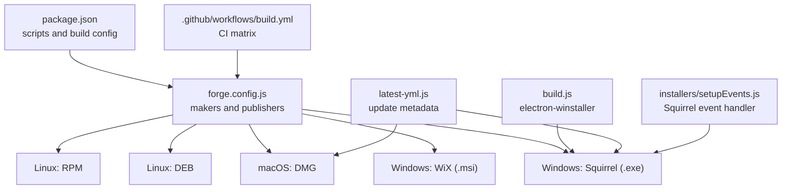
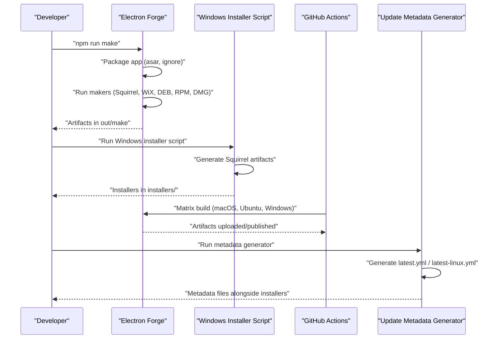
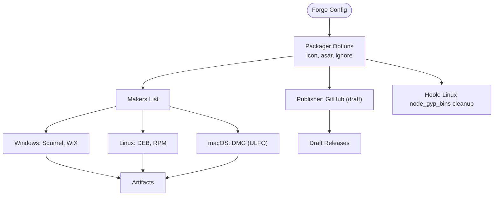
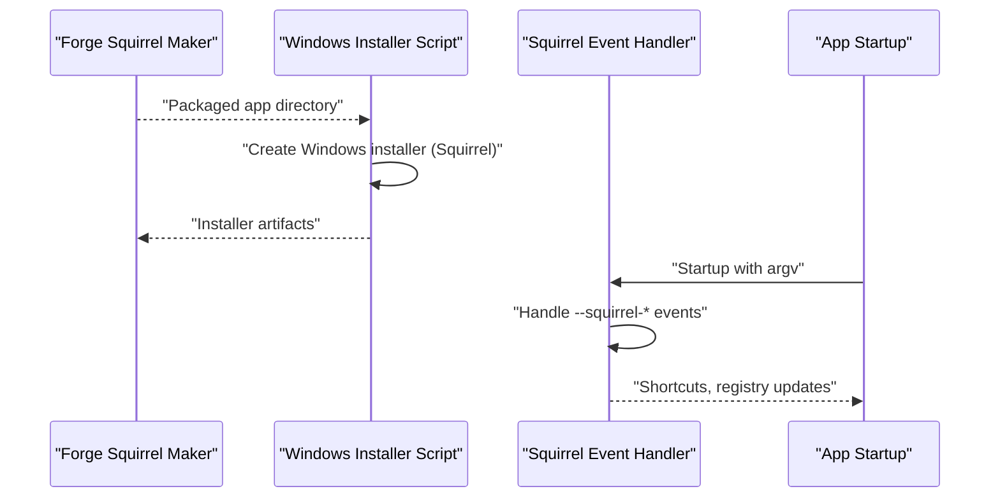
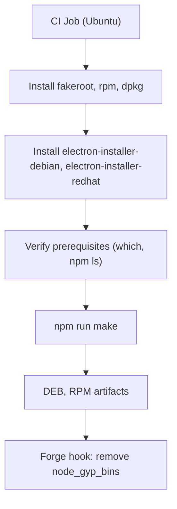
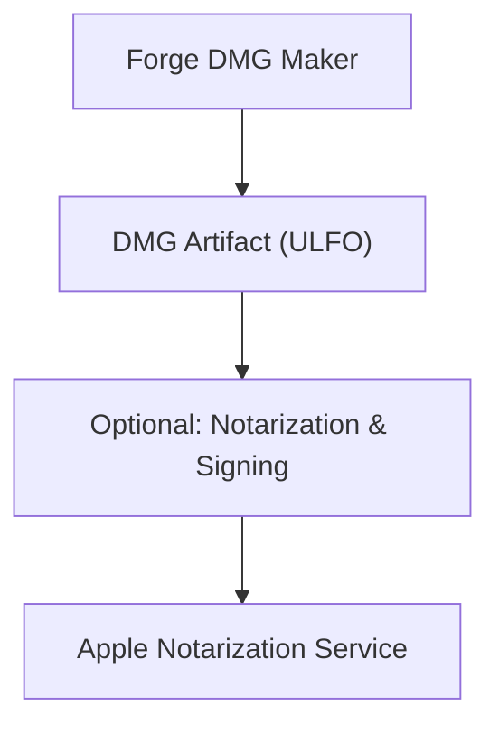
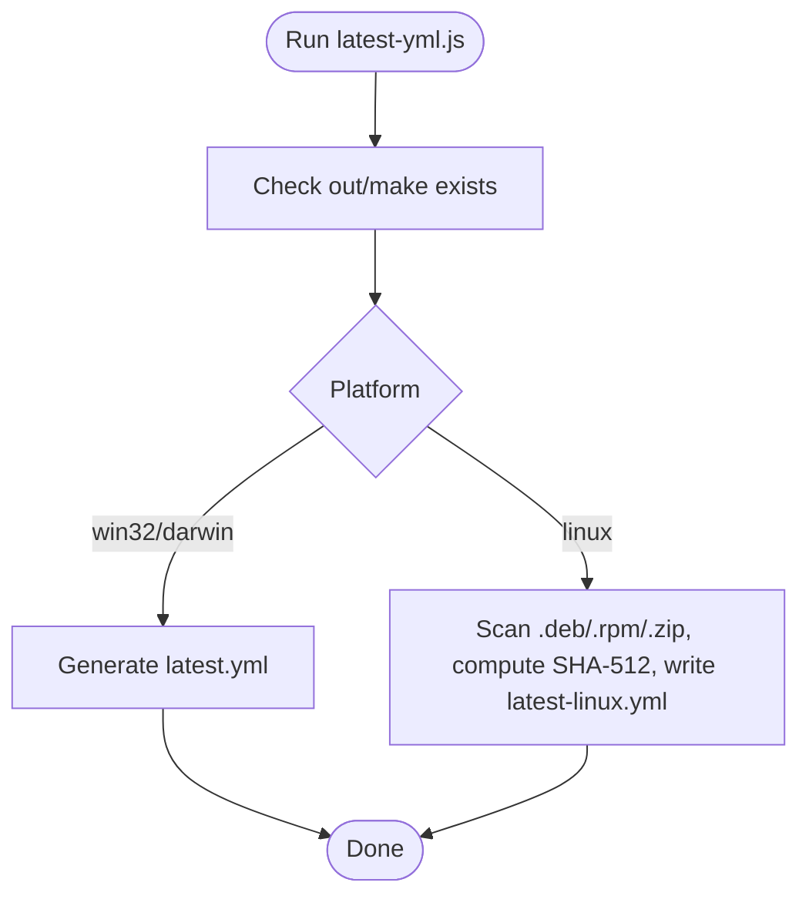
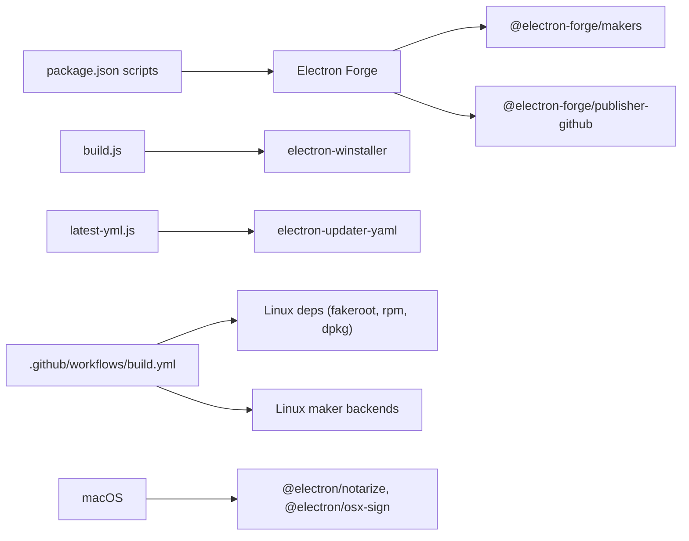

# Multi-Platform Builds

<cite>
**Referenced Files in This Document**
- [package.json](file://package.json)
- [forge.config.js](file://forge.config.js)
- [build.js](file://build.js)
- [installers/setupEvents.js](file://installers/setupEvents.js)
- [.github/workflows/build.yml](file://.github/workflows/build.yml)
- [latest-yml.js](file://latest-yml.js)
- [README.md](file://README.md)
- [start.js](file://start.js)
- [server.js](file://server.js)
</cite>

## Table of Contents
1. [Introduction](#introduction)
2. [Project Structure](#project-structure)
3. [Core Components](#core-components)
4. [Architecture Overview](#architecture-overview)
5. [Detailed Component Analysis](#detailed-component-analysis)
6. [Dependency Analysis](#dependency-analysis)
7. [Performance Considerations](#performance-considerations)
8. [Troubleshooting Guide](#troubleshooting-guide)
9. [Conclusion](#conclusion)
10. [Appendices](#appendices)

## Introduction
This document explains the multi-platform build processes for PharmaSpot POS across Windows (Squirrel, WiX), Linux (DEB, RPM), and macOS (DMG). It covers build targets, platform-specific requirements, configuration differences, script execution, environment setup, cross-compilation considerations, troubleshooting, optimization techniques, deployment preparation, and code signing/certification topics surfaced by the repository.

## Project Structure
The build system relies on Electron Forge makers and publishers, plus a dedicated Windows installer script and GitHub Actions workflow for CI builds. Key files:
- Electron Forge configuration defines makers for each platform and a GitHub publisher.
- A Windows-specific installer script generates Squirrel-compatible artifacts.
- A GitHub Actions workflow orchestrates cross-platform builds and verifies prerequisites.
- A helper script generates platform-specific update metadata for Electron Updater.

**Diagram sources**
- [forge.config.js:21-38](file://forge.config.js#L21-L38)
- [build.js:7-15](file://build.js#L7-L15)
- [.github/workflows/build.yml:10-61](file://.github/workflows/build.yml#L10-L61)
- [latest-yml.js:18-34](file://latest-yml.js#L18-L34)
- [installers/setupEvents.js:5-64](file://installers/setupEvents.js#L5-L64)

**Section sources**
- [package.json:93-101](file://package.json#L93-L101)
- [forge.config.js:6-71](file://forge.config.js#L6-L71)
- [build.js:1-20](file://build.js#L1-L20)
- [.github/workflows/build.yml:1-61](file://.github/workflows/build.yml#L1-L61)
- [latest-yml.js:1-96](file://latest-yml.js#L1-L96)

## Core Components
- Electron Forge configuration
  - Defines packager options, ignore patterns, and makers for each target platform.
  - Configures GitHub publisher for release publishing.
  - Includes a hook to remove problematic Linux binaries during packaging.
- Windows installer script
  - Generates Squirrel-based Windows installers using electron-winstaller.
- GitHub Actions workflow
  - Runs builds on macOS, Ubuntu, and Windows runners.
  - Installs Linux packaging dependencies and verifies prerequisites.
  - Executes the Forge “make” command to produce installers.
- Update metadata generator
  - Produces latest.yml for Windows/macOS and latest-linux.yml for Linux artifacts.
- Squirrel event handler
  - Implements Windows Squirrel installer lifecycle events (install, update, uninstall).

**Section sources**
- [forge.config.js:6-71](file://forge.config.js#L6-L71)
- [build.js:7-15](file://build.js#L7-L15)
- [.github/workflows/build.yml:37-61](file://.github/workflows/build.yml#L37-L61)
- [latest-yml.js:18-74](file://latest-yml.js#L18-L74)
- [installers/setupEvents.js:5-64](file://installers/setupEvents.js#L5-L64)

## Architecture Overview
The build pipeline integrates local scripts and CI to produce platform-specific installers and update metadata.

**Diagram sources**
- [package.json:99](file://package.json#L99)
- [forge.config.js:21-38](file://forge.config.js#L21-L38)
- [build.js:7-15](file://build.js#L7-L15)
- [.github/workflows/build.yml:56-61](file://.github/workflows/build.yml#L56-L61)
- [latest-yml.js:76-90](file://latest-yml.js#L76-L90)

## Detailed Component Analysis

### Electron Forge Configuration
- Packager configuration
  - Icon set for Windows.
  - ASAR enabled.
  - Ignore patterns exclude dev/test files and build config.
- Makers
  - Zip (generic).
  - Windows: Squirrel and WiX.
  - Linux: DEB and RPM.
  - macOS: DMG with ULFO format.
- Publisher
  - GitHub publisher configured to create draft releases.
- Hook
  - Removes node_gyp_bins directories on Linux to fix packaging issues.

**Diagram sources**
- [forge.config.js:7-38](file://forge.config.js#L7-L38)
- [forge.config.js:40-51](file://forge.config.js#L40-L51)
- [forge.config.js:54-69](file://forge.config.js#L54-L69)

**Section sources**
- [forge.config.js:7-38](file://forge.config.js#L7-L38)
- [forge.config.js:40-51](file://forge.config.js#L40-L51)
- [forge.config.js:54-69](file://forge.config.js#L54-L69)

### Windows Build Targets
- Squirrel (.exe)
  - Implemented via @electron-forge/maker-squirrel.
  - Event handling for install/update/uninstall managed by installers/setupEvents.js.
- WiX (.msi)
  - Implemented via @electron-forge/maker-wix with language and manufacturer settings.
- Dedicated Windows installer script
  - Uses electron-winstaller to generate Squirrel artifacts from packaged output.
  - Produces setup executable and related files.

**Diagram sources**
- [forge.config.js:26](file://forge.config.js#L26)
- [forge.config.js:27](file://forge.config.js#L27)
- [build.js:7-15](file://build.js#L7-L15)
- [installers/setupEvents.js:5-64](file://installers/setupEvents.js#L5-L64)
- [start.js:3-6](file://start.js#L3-L6)

**Section sources**
- [forge.config.js:26](file://forge.config.js#L26)
- [forge.config.js:27](file://forge.config.js#L27)
- [build.js:7-15](file://build.js#L7-L15)
- [installers/setupEvents.js:5-64](file://installers/setupEvents.js#L5-L64)
- [start.js:3-6](file://start.js#L3-L6)

### Linux Build Targets
- DEB and RPM
  - Makers configured via @electron-forge/maker-deb and @electron-forge/maker-rpm.
  - Linux prerequisites installed in CI: fakeroot, rpm, dpkg.
  - Additional Linux maker backends installed for Debian/RedHat packaging.
- Packaging hook
  - Forge hook removes node_gyp_bins directories on Linux to avoid packaging unnecessary binaries.

**Diagram sources**
- [.github/workflows/build.yml:37-54](file://.github/workflows/build.yml#L37-L54)
- [forge.config.js:30-33](file://forge.config.js#L30-L33)
- [forge.config.js:54-69](file://forge.config.js#L54-L69)

**Section sources**
- [.github/workflows/build.yml:37-54](file://.github/workflows/build.yml#L37-L54)
- [forge.config.js:30-33](file://forge.config.js#L30-L33)
- [forge.config.js:54-69](file://forge.config.js#L54-L69)

### macOS Build Target
- DMG
  - Maker configured via @electron-forge/maker-dmg with ULFO compression.
- Notarization and signing
  - The repository includes notarization and OS X signing utilities in devDependencies, indicating support for Apple’s notarization and signing workflows.

**Diagram sources**
- [forge.config.js:36](file://forge.config.js#L36)
- [package.json:123-146](file://package.json#L123-L146)

**Section sources**
- [forge.config.js:36](file://forge.config.js#L36)
- [package.json:123-146](file://package.json#L123-L146)

### Update Metadata Generation
- Purpose
  - Generate latest.yml for Windows/macOS and latest-linux.yml for Linux installers.
- Behavior
  - Computes SHA-512 for Linux artifacts and writes platform-specific YAML metadata.
  - Uses electron-updater-yaml to generate channel metadata for Windows/macOS.

**Diagram sources**
- [latest-yml.js:76-90](file://latest-yml.js#L76-L90)
- [latest-yml.js:18-74](file://latest-yml.js#L18-L74)

**Section sources**
- [latest-yml.js:18-74](file://latest-yml.js#L18-L74)
- [latest-yml.js:76-90](file://latest-yml.js#L76-L90)

### Cross-Compilation Considerations
- Electron Forge supports building installers on macOS for Linux targets by installing Linux packaging tools and backends in CI.
- The repository demonstrates cross-compilation via CI matrix targeting macOS, Ubuntu, and Windows runners.

**Section sources**
- [.github/workflows/build.yml:13-16](file://.github/workflows/build.yml#L13-L16)
- [.github/workflows/build.yml:37-54](file://.github/workflows/build.yml#L37-L54)

### Deployment Preparation Steps
- GitHub publisher
  - Draft releases are created via @electron-forge/publisher-github.
- Update metadata
  - latest.yml and latest-linux.yml generated for Electron Updater feeds.
- CI orchestration
  - GitHub Actions job runs npm run make and publishes artifacts.

**Section sources**
- [forge.config.js:40-51](file://forge.config.js#L40-L51)
- [latest-yml.js:18-74](file://latest-yml.js#L18-L74)
- [.github/workflows/build.yml:56-61](file://.github/workflows/build.yml#L56-L61)

### Code Signing and Platform Certification
- Windows
  - Squirrel installer generation via electron-winstaller.
  - Squirrel event handler manages install/update/uninstall lifecycle.
- macOS
  - Notarization and OS X signing utilities present in devDependencies.
- Linux
  - No explicit signing configuration in the repository; typical distribution signing practices apply outside this codebase.

**Section sources**
- [build.js:7-15](file://build.js#L7-L15)
- [installers/setupEvents.js:5-64](file://installers/setupEvents.js#L5-L64)
- [package.json:123-146](file://package.json#L123-L146)

## Dependency Analysis
- Internal dependencies
  - Forge makers and publishers are declared in forge.config.js.
  - Scripts in package.json trigger Forge and Windows installer.
- External dependencies
  - CI installs Linux packaging tools and maker backends.
  - Notarization/signing utilities included for macOS.

**Diagram sources**
- [package.json:93-101](file://package.json#L93-L101)
- [forge.config.js:21-38](file://forge.config.js#L21-L38)
- [forge.config.js:40-51](file://forge.config.js#L40-L51)
- [build.js:1-20](file://build.js#L1-L20)
- [latest-yml.js:1-96](file://latest-yml.js#L1-L96)
- [.github/workflows/build.yml:37-54](file://.github/workflows/build.yml#L37-L54)
- [package.json:123-146](file://package.json#L123-L146)

**Section sources**
- [package.json:93-101](file://package.json#L93-L101)
- [forge.config.js:21-38](file://forge.config.js#L21-L38)
- [forge.config.js:40-51](file://forge.config.js#L40-L51)
- [build.js:1-20](file://build.js#L1-L20)
- [latest-yml.js:1-96](file://latest-yml.js#L1-L96)
- [.github/workflows/build.yml:37-54](file://.github/workflows/build.yml#L37-L54)
- [package.json:123-146](file://package.json#L123-L146)

## Performance Considerations
- ASAR packaging reduces filesystem overhead and improves startup performance.
- Ignoring non-essential files during packaging minimizes artifact size.
- CI caching of Node modules speeds up repeated builds.
- Removing node_gyp_bins on Linux avoids bloating packages with unused binaries.

**Section sources**
- [forge.config.js:9](file://forge.config.js#L9)
- [forge.config.js:10-18](file://forge.config.js#L10-L18)
- [forge.config.js:54-69](file://forge.config.js#L54-L69)
- [.github/workflows/build.yml:26-33](file://.github/workflows/build.yml#L26-L33)

## Troubleshooting Guide
- Linux packaging failures
  - Ensure fakeroot, rpm, and dpkg are installed and electron-installer-debian/electron-installer-redhat are available.
  - Confirm Forge hook executes to remove node_gyp_bins.
- Windows Squirrel lifecycle
  - Verify installers/setupEvents.js handles Squirrel events and creates/removes shortcuts appropriately.
- macOS notarization
  - Use the presence of notarization/signing utilities as a signal that Apple notarization is supported; configure credentials and entitlements externally.
- Update metadata generation
  - Ensure out/make exists and contains platform-specific installers before running latest-yml.js.

**Section sources**
- [.github/workflows/build.yml:37-54](file://.github/workflows/build.yml#L37-L54)
- [forge.config.js:54-69](file://forge.config.js#L54-L69)
- [installers/setupEvents.js:5-64](file://installers/setupEvents.js#L5-L64)
- [package.json:123-146](file://package.json#L123-L146)
- [latest-yml.js:76-90](file://latest-yml.js#L76-L90)

## Conclusion
PharmaSpot POS employs Electron Forge to produce platform-specific installers with a consistent configuration across Windows (Squirrel, WiX), Linux (DEB, RPM), and macOS (DMG). The repository includes a dedicated Windows installer script, CI-driven cross-compilation, update metadata generation, and placeholders for macOS notarization. Following the environment setup and troubleshooting guidance herein ensures reliable multi-platform builds and deployments.

## Appendices
- Environment setup checklist
  - Install Node.js and dependencies.
  - On Linux, install fakeroot, rpm, dpkg and the Linux maker backends.
  - Configure GitHub token for publishing if using the GitHub publisher.
  - Prepare macOS notarization credentials and certificates if enabling Apple notarization.

**Section sources**
- [.github/workflows/build.yml:21-35](file://.github/workflows/build.yml#L21-L35)
- [.github/workflows/build.yml:37-54](file://.github/workflows/build.yml#L37-L54)
- [forge.config.js:40-51](file://forge.config.js#L40-L51)
- [README.md:70-77](file://README.md#L70-L77)