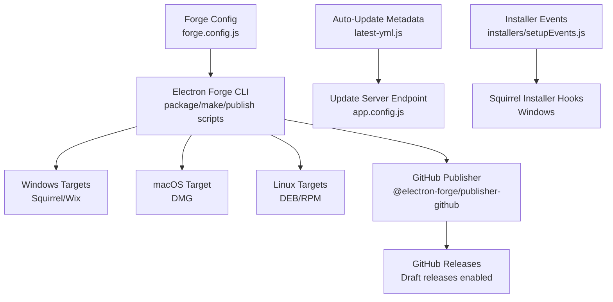
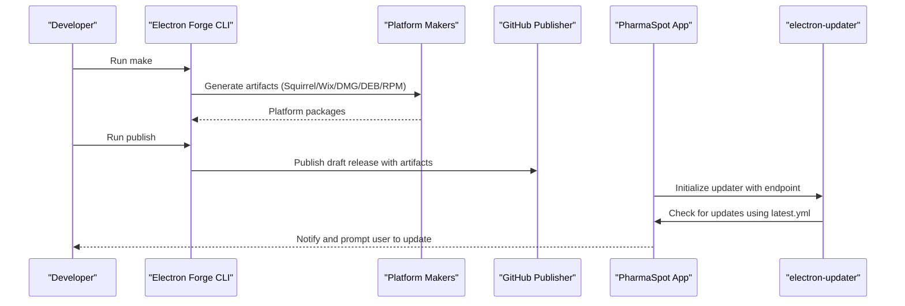
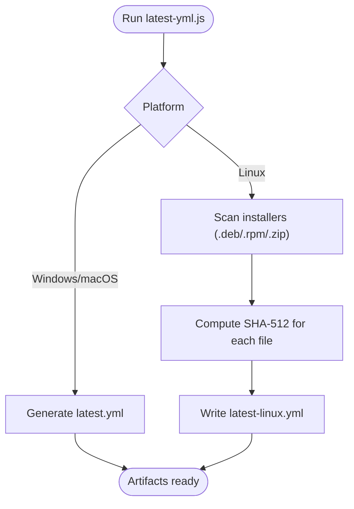
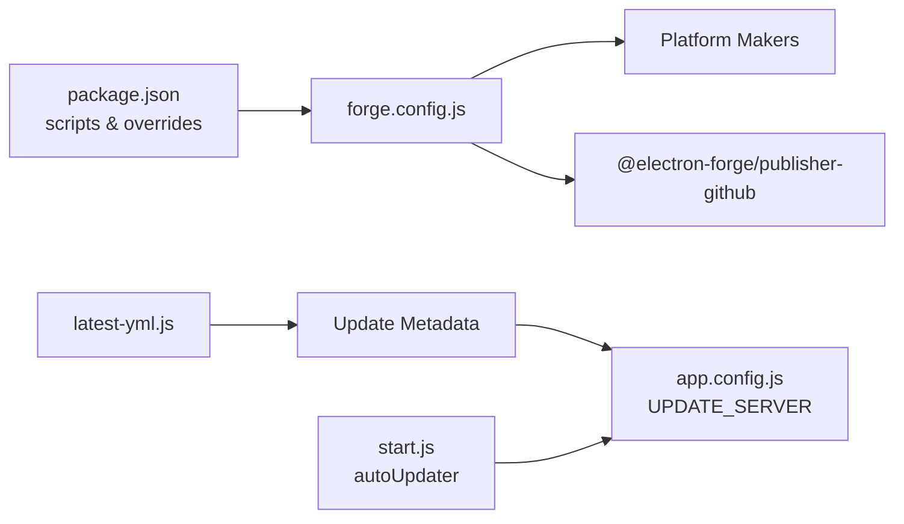

# Packaging and Deployment

<cite>
**Referenced Files in This Document**
- [forge.config.js](file://forge.config.js)
- [package.json](file://package.json)
- [build.js](file://build.js)
- [start.js](file://start.js)
- [installers/setupEvents.js](file://installers/setupEvents.js)
- [app.config.js](file://app.config.js)
- [latest-yml.js](file://latest-yml.js)
- [.github/dependabot.yml](file://.github/dependabot.yml)
- [server.js](file://server.js)
- [api/transactions.js](file://api/transactions.js)
- [api/inventory.js](file://api/inventory.js)
</cite>

## Table of Contents
1. [Introduction](#introduction)
2. [Project Structure](#project-structure)
3. [Core Components](#core-components)
4. [Architecture Overview](#architecture-overview)
5. [Detailed Component Analysis](#detailed-component-analysis)
6. [Dependency Analysis](#dependency-analysis)
7. [Performance Considerations](#performance-considerations)
8. [Troubleshooting Guide](#troubleshooting-guide)
9. [Conclusion](#conclusion)
10. [Appendices](#appendices)

## Introduction
This document explains the packaging and deployment processes for PharmaSpot POS, focusing on Electron Forge configuration, build targets, platform-specific packaging, release automation, version management, distribution strategies, installer creation, auto-update mechanisms, and update deployment. It also outlines continuous integration considerations, automated testing, code signing, security, and post-installation setup procedures.

## Project Structure
The packaging and deployment pipeline centers around Electron Forge with platform-specific makers and a GitHub publisher. Build artifacts are generated via Forge’s make command and published to GitHub Releases. Auto-updates rely on YAML metadata produced by a dedicated generator script and configured update server endpoints.

**Diagram sources**
- [forge.config.js:1-71](file://forge.config.js#L1-L71)
- [package.json:93-102](file://package.json#L93-L102)
- [latest-yml.js:1-96](file://latest-yml.js#L1-L96)
- [app.config.js:1-8](file://app.config.js#L1-L8)
- [installers/setupEvents.js:1-65](file://installers/setupEvents.js#L1-L65)

**Section sources**
- [forge.config.js:1-71](file://forge.config.js#L1-L71)
- [package.json:93-102](file://package.json#L93-L102)

## Core Components
- Electron Forge configuration defines packaging options, ignored paths, platform makers, and publishers.
- Package scripts orchestrate development, packaging, building, and publishing.
- Platform-specific installers:
  - Windows: Squirrel and WiX.
  - macOS: DMG.
  - Linux: DEB and RPM.
- GitHub publisher drafts releases.
- Auto-update metadata generator produces platform-specific YAML files.
- Update server endpoint configured in application configuration.
- Squirrel event handler manages Windows installer lifecycle.

**Section sources**
- [forge.config.js:6-71](file://forge.config.js#L6-L71)
- [package.json:115-145](file://package.json#L115-L145)
- [latest-yml.js:18-96](file://latest-yml.js#L18-L96)
- [app.config.js:2-6](file://app.config.js#L2-L6)
- [installers/setupEvents.js:4-65](file://installers/setupEvents.js#L4-L65)

## Architecture Overview
The build and release pipeline integrates Forge, platform makers, and GitHub publishing. Auto-updates are driven by YAML metadata served from a configured update server.

**Diagram sources**
- [package.json:98-101](file://package.json#L98-L101)
- [forge.config.js:21-51](file://forge.config.js#L21-L51)
- [latest-yml.js:76-96](file://latest-yml.js#L76-L96)
- [app.config.js:2-6](file://app.config.js#L2-L6)

## Detailed Component Analysis

### Electron Forge Configuration
- Packaging options:
  - Icon for Windows builds.
  - ASAR packaging enabled.
  - Ignored paths exclude development and test assets.
- Platform makers:
  - Zip (generic).
  - Windows: Squirrel and WiX.
  - Linux: DEB and RPM.
  - macOS: DMG.
- Publishers:
  - GitHub publisher targeting repository owner/name with draft releases enabled.
- Hook:
  - Post-prune cleanup for Linux node_gyp_bins directories to reduce artifact size and avoid packaging unnecessary binaries.

**Section sources**
- [forge.config.js:7-19](file://forge.config.js#L7-L19)
- [forge.config.js:21-38](file://forge.config.js#L21-L38)
- [forge.config.js:40-51](file://forge.config.js#L40-L51)
- [forge.config.js:54-69](file://forge.config.js#L54-L69)

### Build Scripts and Commands
- Scripts:
  - start: Launch in development mode.
  - package: Package using Forge.
  - make: Build platform-specific installers.
  - publish: Publish to GitHub.
  - test: Run Jest tests.
- Additional Windows installer builder script exists for legacy or alternate workflows.

**Section sources**
- [package.json:93-102](file://package.json#L93-L102)
- [build.js:1-20](file://build.js#L1-L20)

### Platform-Specific Packaging
- Windows:
  - Squirrel-based installer via Forge maker.
  - WiX installer via Forge maker.
  - Squirrel event handling for install/uninstall/update shortcuts.
- macOS:
  - DMG target with ULFO format.
- Linux:
  - DEB and RPM targets.
  - Post-prune hook removes node_gyp_bins to optimize package size.

**Section sources**
- [forge.config.js:25-37](file://forge.config.js#L25-L37)
- [forge.config.js:54-69](file://forge.config.js#L54-L69)
- [installers/setupEvents.js:32-63](file://installers/setupEvents.js#L32-L63)

### Release Automation and Distribution
- GitHub publisher configuration sets owner and repository name and enables draft releases.
- Draft releases allow manual review prior to public availability.
- Version is managed in package.json and reflected in generated metadata.

**Section sources**
- [forge.config.js:40-51](file://forge.config.js#L40-L51)
- [package.json:4](file://package.json#L4)

### Auto-Update Mechanism and Update Deployment
- Update server endpoint configured in application configuration.
- Auto-update metadata generator:
  - Produces latest.yml for Windows/macOS using a helper.
  - Produces latest-linux.yml for Linux with SHA-512 hashes for .deb/.rpm/.zip.
  - Reads artifacts from the Forge output directory.
- Application triggers updates using electron-updater and quit-and-install flow.

**Diagram sources**
- [latest-yml.js:18-96](file://latest-yml.js#L18-L96)

**Section sources**
- [app.config.js:2-6](file://app.config.js#L2-L6)
- [latest-yml.js:18-96](file://latest-yml.js#L18-L96)
- [start.js:83-85](file://start.js#L83-L85)

### Installer Creation and Windows Squirrel Integration
- Squirrel event handler:
  - Processes install, updated, uninstall, and obsolete events.
  - Creates and removes desktop/start menu shortcuts.
  - Quits the app after handling events.
- Legacy Windows installer builder script supports MSI-free creation and setup executable naming.

**Section sources**
- [installers/setupEvents.js:4-65](file://installers/setupEvents.js#L4-L65)
- [build.js:7-15](file://build.js#L7-L15)

### Continuous Integration and Automated Testing
- Dependabot configuration is present but lacks ecosystem specification; consider specifying package ecosystems for targeted updates.
- Test script exists for Jest; integrate CI workflows to run tests on push and pull requests.

**Section sources**
- [.github/dependabot.yml:1-12](file://.github/dependabot.yml#L1-L12)
- [package.json:101](file://package.json#L101)

### Security Considerations and Code Signing
- Current configuration does not define code signing options for any platform.
- Recommendations:
  - Windows: Sign executables and installers using trusted certificates and enable publisher certificate verification.
  - macOS: Notarize and staple DMG artifacts.
  - Linux: Consider signature verification for repositories if distributing via package managers.
  - General: Enforce HTTPS for update endpoints and validate update signatures where applicable.

[No sources needed since this section provides general guidance]

### Post-Installation Setup Procedures
- Windows:
  - Squirrel creates desktop and start menu shortcuts automatically.
  - Uninstall removes shortcuts.
- macOS/Linux:
  - Standard installation procedures apply; ensure proper permissions and PATH configurations if needed.

**Section sources**
- [installers/setupEvents.js:40-51](file://installers/setupEvents.js#L40-L51)

## Dependency Analysis
The packaging and deployment stack relies on Forge makers and publishers, update metadata generation, and runtime update checks.

**Diagram sources**
- [package.json:93-102](file://package.json#L93-L102)
- [forge.config.js:21-51](file://forge.config.js#L21-L51)
- [latest-yml.js:76-96](file://latest-yml.js#L76-L96)
- [app.config.js:2-6](file://app.config.js#L2-L6)
- [start.js:83-85](file://start.js#L83-L85)

**Section sources**
- [package.json:93-102](file://package.json#L93-L102)
- [forge.config.js:21-51](file://forge.config.js#L21-L51)
- [latest-yml.js:76-96](file://latest-yml.js#L76-L96)
- [app.config.js:2-6](file://app.config.js#L2-L6)
- [start.js:83-85](file://start.js#L83-L85)

## Performance Considerations
- ASAR packaging reduces bundle size and improves load times.
- Post-prune hook removes unnecessary node_gyp_bins on Linux to minimize artifact size.
- Avoid bundling development and test assets to keep production packages lean.

**Section sources**
- [forge.config.js:9](file://forge.config.js#L9)
- [forge.config.js:54-69](file://forge.config.js#L54-L69)

## Troubleshooting Guide
- Linux packaging issues:
  - Ensure post-prune hook runs to remove node_gyp_bins directories.
- Windows installer shortcuts:
  - Verify Squirrel event handler executes and creates/removes shortcuts.
- Auto-update failures:
  - Confirm latest.yml/latest-linux.yml exists in the expected output directory.
  - Verify UPDATE_SERVER endpoint serves metadata and artifacts securely.
- GitHub publishing:
  - Ensure draft releases are set appropriately and artifacts are attached.

**Section sources**
- [forge.config.js:54-69](file://forge.config.js#L54-L69)
- [installers/setupEvents.js:32-63](file://installers/setupEvents.js#L32-L63)
- [latest-yml.js:76-96](file://latest-yml.js#L76-L96)
- [app.config.js:2-6](file://app.config.js#L2-L6)

## Conclusion
PharmaSpot POS leverages Electron Forge for cross-platform packaging, GitHub for release distribution, and a dedicated metadata generator for reliable auto-updates. The current configuration focuses on Windows (Squirrel/WiX), macOS (DMG), and Linux (DEB/RPM). Enhancing security with code signing and integrating CI workflows would further strengthen the deployment pipeline.

## Appendices

### Version Management and Release Strategy
- Version is maintained in package.json and propagated to installers and metadata.
- Draft releases allow controlled rollout prior to public availability.

**Section sources**
- [package.json:4](file://package.json#L4)
- [forge.config.js:47](file://forge.config.js#L47)

### Update Server Configuration
- Update server endpoint configured in application configuration; ensure HTTPS and accessibility.

**Section sources**
- [app.config.js:2-6](file://app.config.js#L2-L6)

### Server and API Context
- Local HTTP server and APIs support the desktop application runtime; ensure proper port management and security headers.

**Section sources**
- [server.js:1-68](file://server.js#L1-L68)
- [api/transactions.js:1-251](file://api/transactions.js#L1-L251)
- [api/inventory.js:1-333](file://api/inventory.js#L1-L333)