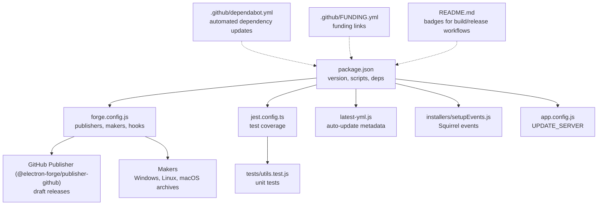
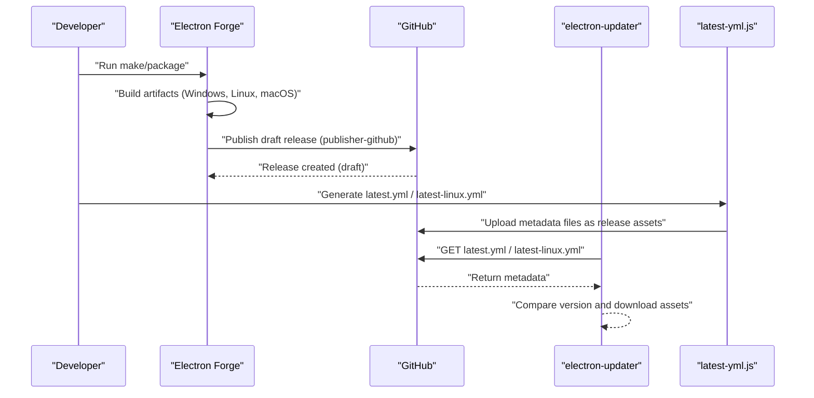
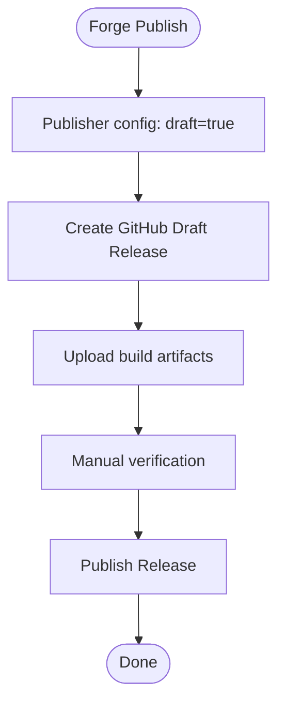
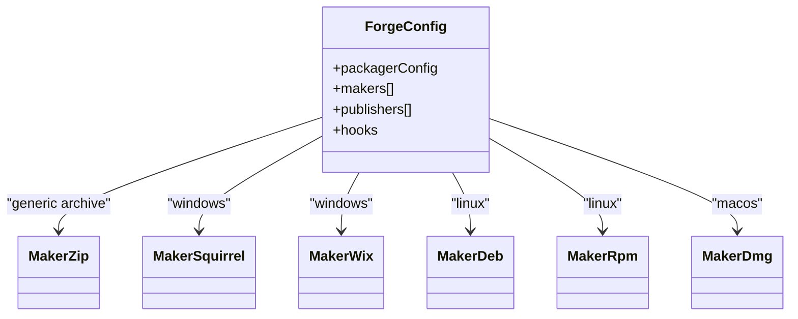
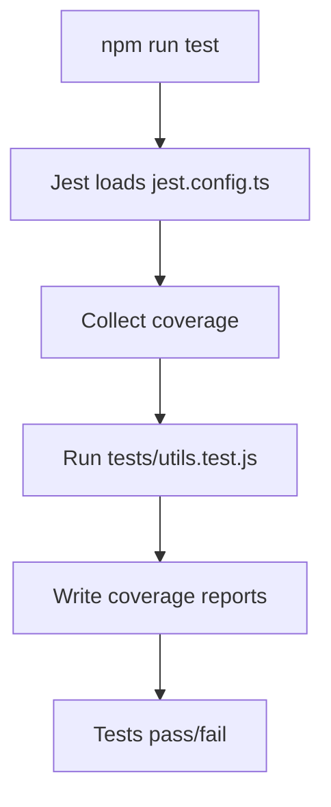
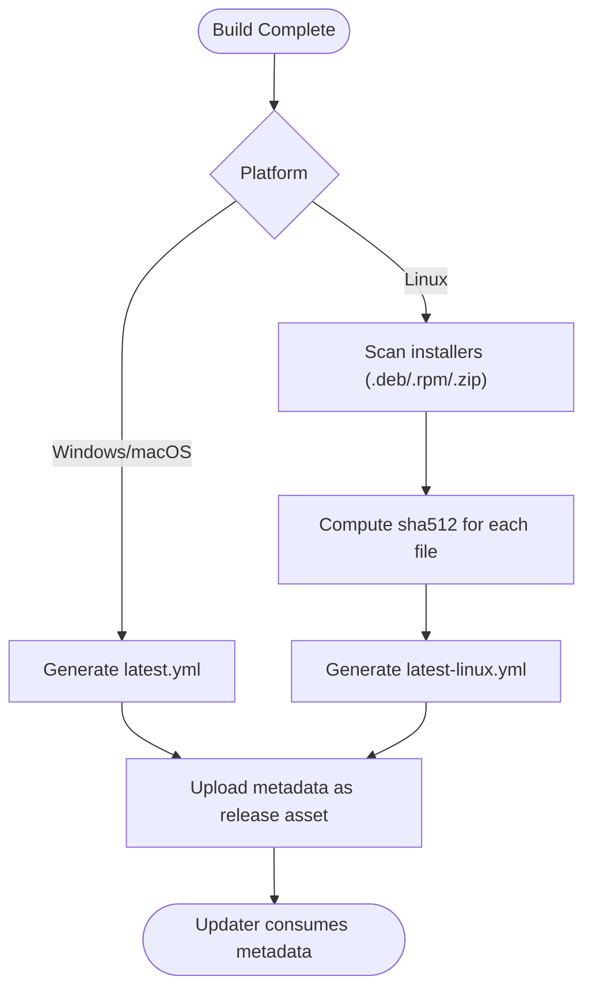
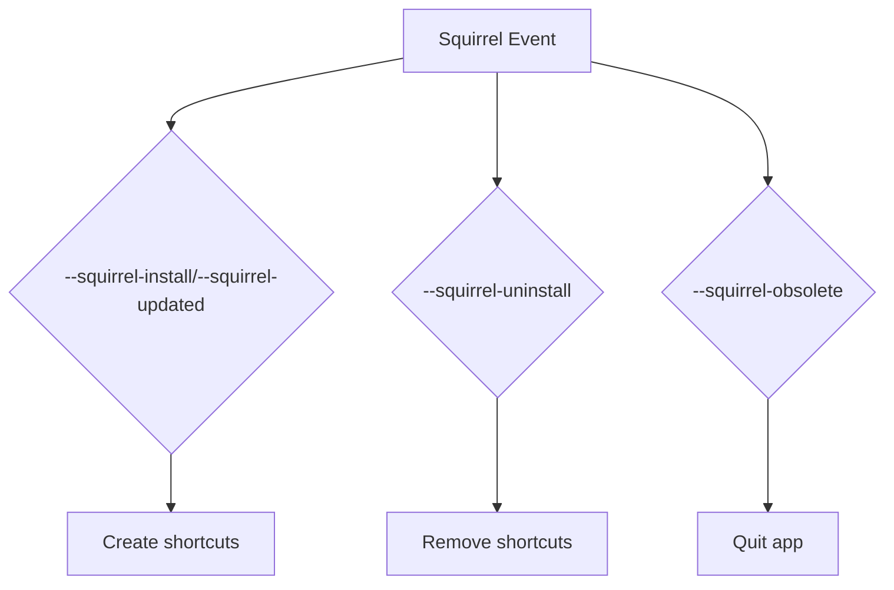
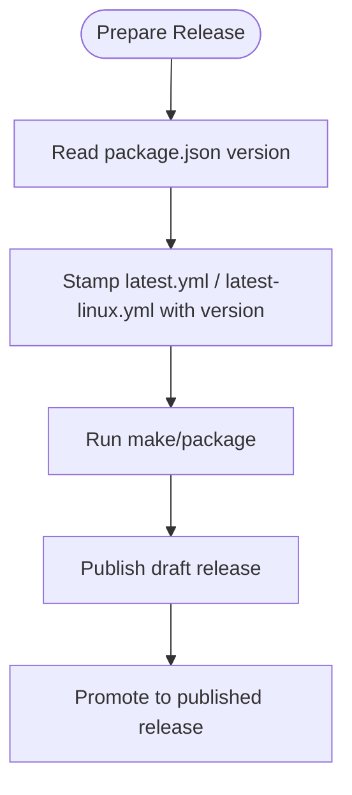
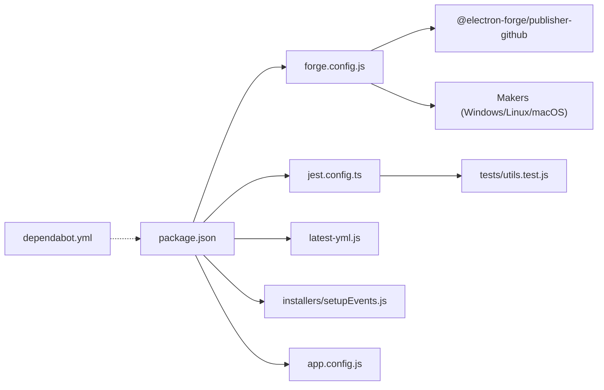

# Release Automation

<cite>
**Referenced Files in This Document**
- [package.json](file://package.json)
- [forge.config.js](file://forge.config.js)
- [build.js](file://build.js)
- [jest.config.ts](file://jest.config.ts)
- [tests/utils.test.js](file://tests/utils.test.js)
- [latest-yml.js](file://latest-yml.js)
- [installers/setupEvents.js](file://installers/setupEvents.js)
- [app.config.js](file://app.config.js)
- [.github/FUNDING.yml](file://.github/FUNDING.yml)
- [.github/dependabot.yml](file://.github/dependabot.yml)
- [README.md](file://README.md)
</cite>

## Table of Contents
1. [Introduction](#introduction)
2. [Project Structure](#project-structure)
3. [Core Components](#core-components)
4. [Architecture Overview](#architecture-overview)
5. [Detailed Component Analysis](#detailed-component-analysis)
6. [Dependency Analysis](#dependency-analysis)
7. [Performance Considerations](#performance-considerations)
8. [Troubleshooting Guide](#troubleshooting-guide)
9. [Conclusion](#conclusion)
10. [Appendices](#appendices)

## Introduction
This document explains the PharmaSpot POS release automation and CI/CD processes implemented in the repository. It covers automated building, testing, publishing, version management, semantic versioning, artifact generation, release notes automation, GitHub publisher configuration, draft release management, asset uploading, auto-update metadata generation, and platform-specific installer handling. It also outlines branching strategies, hotfix deployments, maintenance releases, and rollback procedures.

## Project Structure
The repository organizes release automation around Electron Forge configuration, GitHub Actions badges in the README, and supporting scripts for metadata generation and Windows Squirrel installer events. Key areas include:
- Application and build metadata in package.json
- Electron Forge publishers and makers configuration
- Automated test configuration and coverage collection
- Auto-update metadata generator for Windows/macOS/Linux
- Windows installer event handler for Squirrel
- Funding and dependency update automation configuration

**Diagram sources**
- [package.json:1-147](file://package.json#L1-L147)
- [forge.config.js:1-71](file://forge.config.js#L1-L71)
- [jest.config.ts:1-200](file://jest.config.ts#L1-L200)
- [tests/utils.test.js:1-191](file://tests/utils.test.js#L1-L191)
- [latest-yml.js:1-96](file://latest-yml.js#L1-L96)
- [installers/setupEvents.js:1-65](file://installers/setupEvents.js#L1-L65)
- [app.config.js:1-8](file://app.config.js#L1-L8)
- [.github/dependabot.yml:1-12](file://.github/dependabot.yml#L1-L12)
- [.github/FUNDING.yml:1-5](file://.github/FUNDING.yml#L1-L5)
- [README.md:1-91](file://README.md#L1-L91)

**Section sources**
- [package.json:1-147](file://package.json#L1-L147)
- [forge.config.js:1-71](file://forge.config.js#L1-L71)
- [README.md:1-91](file://README.md#L1-L91)

## Core Components
- Version and metadata: The application version and build metadata are defined centrally in package.json. Scripts orchestrate packaging, making, and publishing.
- Publishing pipeline: Electron Forge publishes to GitHub using @electron-forge/publisher-github with draft releases enabled.
- Artifact generation: Makers produce platform-specific installers and archives for Windows, Linux, and macOS.
- Testing: Jest configuration enables coverage collection and runs unit tests.
- Auto-update metadata: latest-yml.js generates platform-specific update metadata files consumed by electron-updater.
- Installer events: installers/setupEvents.js handles Windows Squirrel lifecycle events for install/uninstall/update.
- Update server: app.config.js defines the external update server endpoint used by the updater.

**Section sources**
- [package.json:1-147](file://package.json#L1-L147)
- [forge.config.js:40-51](file://forge.config.js#L40-L51)
- [jest.config.ts:18-29](file://jest.config.ts#L18-L29)
- [tests/utils.test.js:1-191](file://tests/utils.test.js#L1-L191)
- [latest-yml.js:18-96](file://latest-yml.js#L18-L96)
- [installers/setupEvents.js:1-65](file://installers/setupEvents.js#L1-L65)
- [app.config.js:1-8](file://app.config.js#L1-L8)

## Architecture Overview
The release pipeline integrates local build and test steps with GitHub-hosted publishing. The flow is:
- Local build and packaging via Electron Forge makers
- Draft release creation on GitHub via publisher
- Platform-specific update metadata generation for auto-updates
- Asset upload handled by the publisher and metadata generator

**Diagram sources**
- [forge.config.js:21-38](file://forge.config.js#L21-L38)
- [forge.config.js:40-51](file://forge.config.js#L40-L51)
- [latest-yml.js:18-96](file://latest-yml.js#L18-L96)
- [app.config.js:1-8](file://app.config.js#L1-L8)

## Detailed Component Analysis

### GitHub Publisher Configuration
- Publisher: @electron-forge/publisher-github configured with repository owner/name and draft releases enabled.
- Artifacts: Release assets are uploaded by the publisher after successful builds.
- Draft management: Releases are created as drafts, allowing manual verification before publishing.

**Diagram sources**
- [forge.config.js:40-51](file://forge.config.js#L40-L51)

**Section sources**
- [forge.config.js:40-51](file://forge.config.js#L40-L51)

### Artifact Generation and Makers
- Makers define platform targets:
  - Windows: Squirrel and WiX installers
  - Linux: DEB, RPM, ZIP
  - macOS: DMG (ULFO format)
  - Cross-platform: ZIP archive
- Packaging excludes development files and tests to reduce artifact size.

**Diagram sources**
- [forge.config.js:21-38](file://forge.config.js#L21-L38)

**Section sources**
- [forge.config.js:21-38](file://forge.config.js#L21-L38)

### Automated Testing Integration
- Coverage: Jest collects coverage and writes to coverage directory.
- Tests: Unit tests validate utility functions (formatting, expiry, stock status, file checks, hashing).
- Configuration: jest.config.ts sets defaults for mocks, coverage provider, and output directories.

**Diagram sources**
- [jest.config.ts:18-29](file://jest.config.ts#L18-L29)
- [tests/utils.test.js:1-191](file://tests/utils.test.js#L1-L191)

**Section sources**
- [jest.config.ts:18-29](file://jest.config.ts#L18-L29)
- [tests/utils.test.js:1-191](file://tests/utils.test.js#L1-L191)

### Auto-Update Metadata Generation
- Purpose: Generate platform-specific update metadata consumed by electron-updater.
- Windows/macOS: latest.yml generated with version, releaseDate, channel, and installer path.
- Linux: latest-linux.yml generated with version, releaseDate, platform, and per-file sha512 hashes for .deb, .rpm, .zip.
- Execution: Run after builds to ensure metadata matches produced artifacts.

**Diagram sources**
- [latest-yml.js:18-96](file://latest-yml.js#L18-L96)

**Section sources**
- [latest-yml.js:18-96](file://latest-yml.js#L18-L96)

### Windows Installer Events (Squirrel)
- Handles Squirrel lifecycle events: install, update, uninstall, obsolete.
- Creates/removes desktop/start menu shortcuts during install/update.
- Ensures proper cleanup on uninstall and obsolete events.

**Diagram sources**
- [installers/setupEvents.js:5-64](file://installers/setupEvents.js#L5-L64)

**Section sources**
- [installers/setupEvents.js:1-65](file://installers/setupEvents.js#L1-L65)

### Version Management and Semantic Versioning
- Version source: Centralized in package.json version field.
- Version-driven metadata: latest-yml.js reads package.json version to stamp release metadata.
- Recommended practice: Increment version according to semantic versioning prior to release builds to ensure accurate update channels.

**Diagram sources**
- [package.json:4](file://package.json#L4)
- [latest-yml.js:19-26](file://latest-yml.js#L19-L26)

**Section sources**
- [package.json:4](file://package.json#L4)
- [latest-yml.js:19-26](file://latest-yml.js#L19-L26)

### Release Notes Automation
- Current state: No automated release notes generation script is present in the repository.
- Recommendation: Integrate a changelog generator (e.g., conventional commits + tools) to produce release notes from commit history and attach them to GitHub releases.

[No sources needed since this section provides general guidance]

### Webhook Integrations and Notifications
- Current state: No explicit webhook configuration is present in the repository.
- Recommendation: Configure GitHub release webhooks to notify external systems or Slack channels upon release publication.

[No sources needed since this section provides general guidance]

### Rollback Procedures
- Draft releases: Releases are created as drafts; promote only after validation.
- Hotfix rollback: Publish a new patch version to supersede problematic releases; inform users to update.
- Manual intervention: If auto-update is misbehaving, temporarily remove or adjust metadata files and republish.

[No sources needed since this section provides general guidance]

### Release Branching Strategies, Hotfix Deployment, Maintenance Releases
- Recommended branching: Use semantic versioning with release branches (e.g., release/vX.Y) and hotfix branches (hotfix/vX.Y.Z+1).
- Hotfix flow: Create hotfix branch from latest release tag, merge to main and develop, increment patch version, build, publish draft, validate, and publish.
- Maintenance releases: For long-term support, create maintenance branches and cherry-pick fixes; publish with appropriate labels and metadata.

[No sources needed since this section provides general guidance]

## Dependency Analysis
The release pipeline depends on:
- Electron Forge for packaging and publishing
- GitHub publisher for draft releases and asset uploads
- Auto-update metadata generator for platform-specific update channels
- Windows Squirrel events for installer lifecycle
- Jest for automated testing and coverage

**Diagram sources**
- [package.json:1-147](file://package.json#L1-L147)
- [forge.config.js:1-71](file://forge.config.js#L1-L71)
- [jest.config.ts:1-200](file://jest.config.ts#L1-L200)
- [tests/utils.test.js:1-191](file://tests/utils.test.js#L1-L191)
- [latest-yml.js:1-96](file://latest-yml.js#L1-L96)
- [installers/setupEvents.js:1-65](file://installers/setupEvents.js#L1-L65)
- [app.config.js:1-8](file://app.config.js#L1-L8)
- [.github/dependabot.yml:1-12](file://.github/dependabot.yml#L1-L12)

**Section sources**
- [package.json:1-147](file://package.json#L1-L147)
- [forge.config.js:1-71](file://forge.config.js#L1-L71)
- [jest.config.ts:1-200](file://jest.config.ts#L1-L200)
- [tests/utils.test.js:1-191](file://tests/utils.test.js#L1-L191)
- [latest-yml.js:1-96](file://latest-yml.js#L1-L96)
- [installers/setupEvents.js:1-65](file://installers/setupEvents.js#L1-L65)
- [app.config.js:1-8](file://app.config.js#L1-L8)
- [.github/dependabot.yml:1-12](file://.github/dependabot.yml#L1-L12)

## Performance Considerations
- Minimize artifact size: Exclude unnecessary files in packagerConfig to speed up builds and downloads.
- Parallelization: Run tests and metadata generation concurrently where possible.
- Caching: Reuse build caches and dependency caches in CI runners to reduce build times.

[No sources needed since this section provides general guidance]

## Troubleshooting Guide
- Draft release not publishing: Verify publisher configuration and repository permissions; confirm draft flag is toggled appropriately.
- Missing update metadata: Ensure latest-yml.js runs after builds and that installer directory exists.
- Windows installer issues: Confirm Squirrel events are handled and shortcuts are created/removed as expected.
- Test failures blocking release: Review Jest coverage and failing tests; fix or adjust tests before promoting releases.

**Section sources**
- [forge.config.js:40-51](file://forge.config.js#L40-L51)
- [latest-yml.js:76-96](file://latest-yml.js#L76-L96)
- [installers/setupEvents.js:5-64](file://installers/setupEvents.js#L5-L64)
- [jest.config.ts:18-29](file://jest.config.ts#L18-L29)

## Conclusion
The repository implements a robust release automation foundation using Electron Forge, GitHub publishing, and platform-specific metadata generation. By adopting semantic versioning, integrating automated release notes, configuring webhooks, and establishing branching/hotfix/maintenance workflows, the team can achieve reliable, repeatable, and auditable releases with minimal manual intervention.

[No sources needed since this section summarizes without analyzing specific files]

## Appendices

### Appendix A: Version and Build Scripts
- Version: Managed in package.json.
- Scripts: Packaging, making, publishing, and testing commands are defined in package.json scripts.

**Section sources**
- [package.json:93-102](file://package.json#L93-L102)

### Appendix B: Funding and Dependency Updates
- Funding: Funding.yml lists supported platforms.
- Dependabot: dependabot.yml configures weekly automated dependency updates.

**Section sources**
- [.github/FUNDING.yml:1-5](file://.github/FUNDING.yml#L1-L5)
- [.github/dependabot.yml:1-12](file://.github/dependabot.yml#L1-L12)