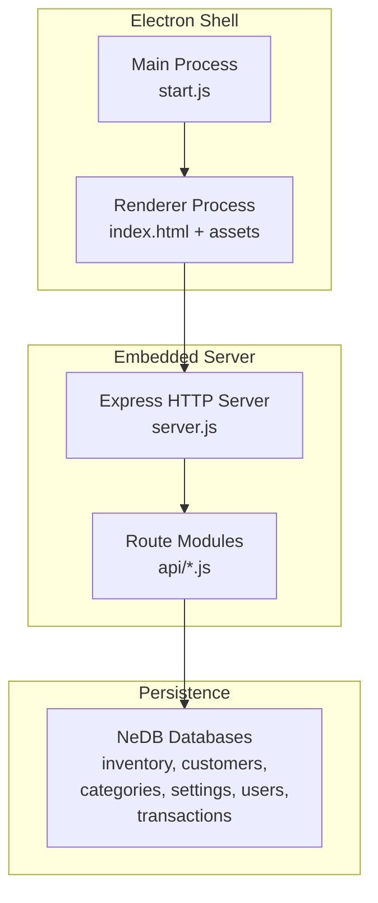
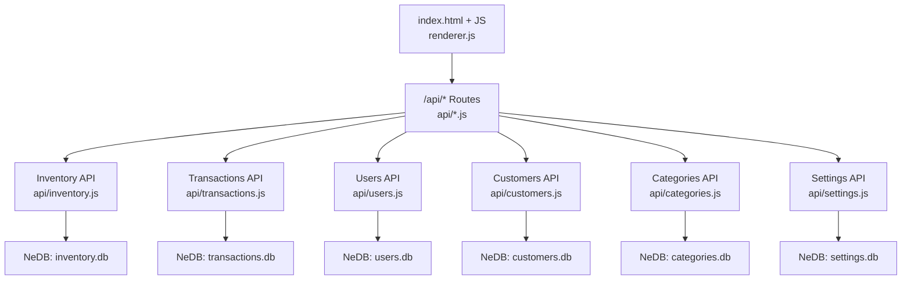
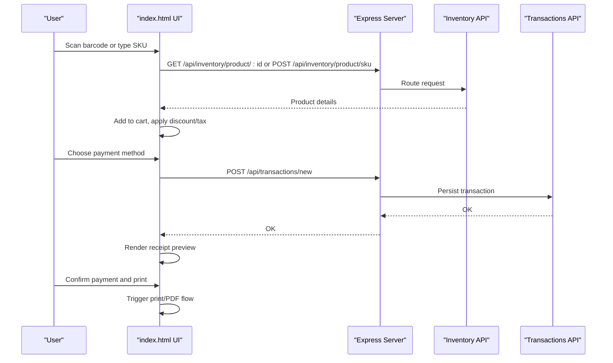
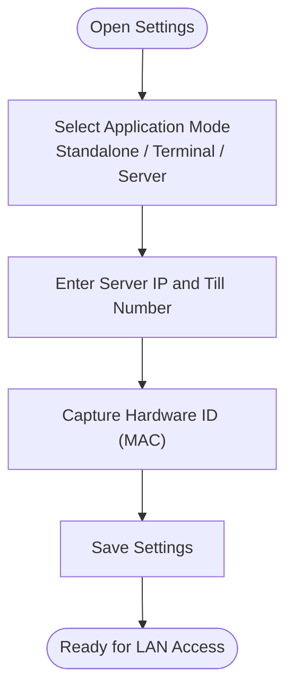
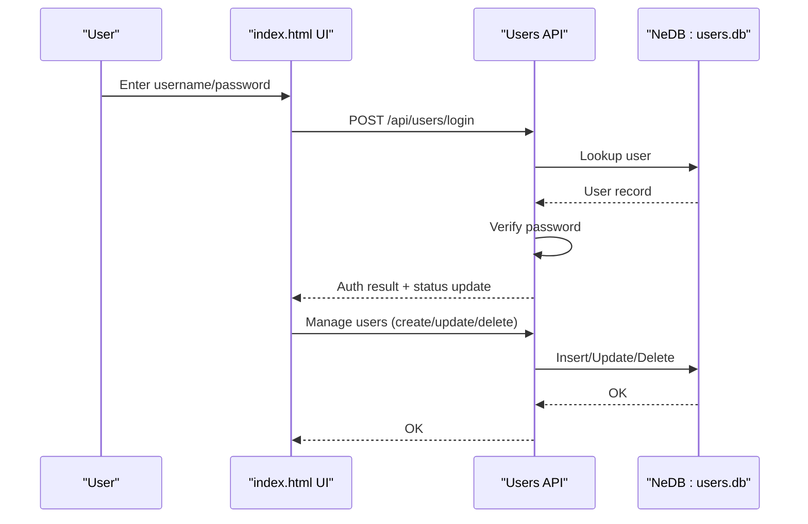
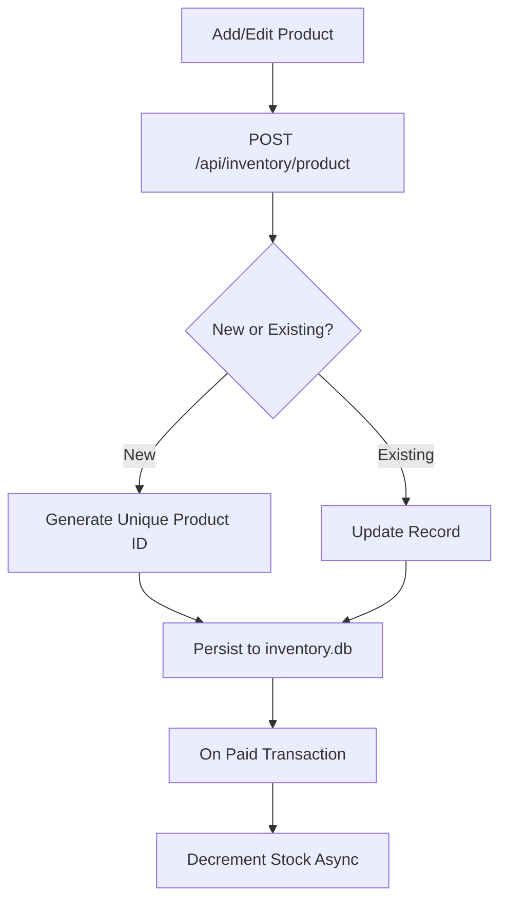
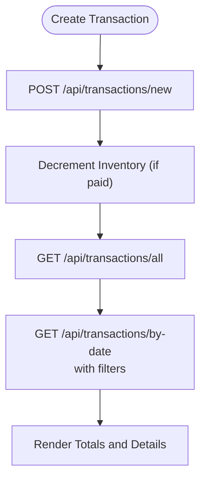
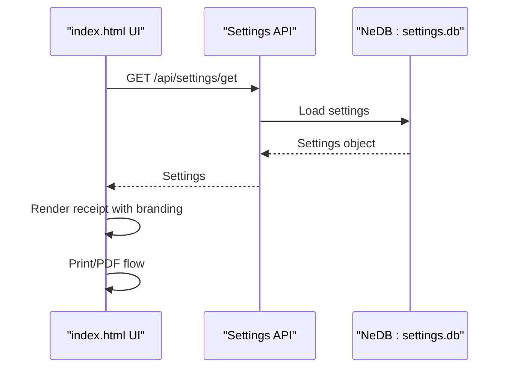
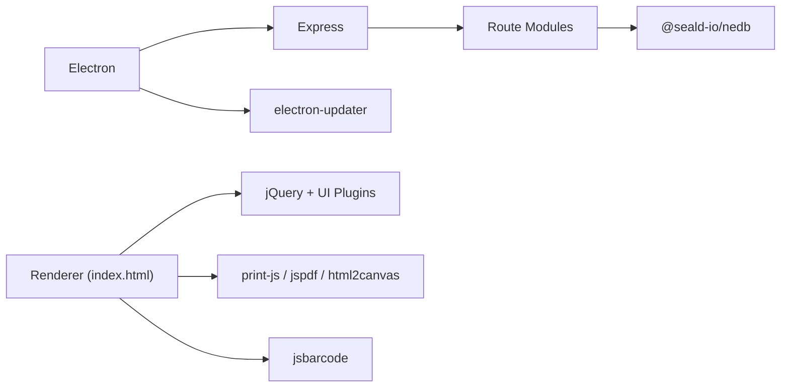

# Project Overview

<cite>
**Referenced Files in This Document**
- [README.md](file://README.md)
- [package.json](file://package.json)
- [docs/PRD.md](file://docs/PRD.md)
- [docs/TECH_STACK.md](file://docs/TECH_STACK.md)
- [server.js](file://server.js)
- [api/transactions.js](file://api/transactions.js)
- [api/inventory.js](file://api/inventory.js)
- [api/users.js](file://api/users.js)
- [api/customers.js](file://api/customers.js)
- [api/settings.js](file://api/settings.js)
- [index.html](file://index.html)
- [renderer.js](file://renderer.js)
- [app.config.js](file://app.config.js)
- [CONTRIBUTING.md](file://CONTRIBUTING.md)
- [CODE_OF_CONDUCT.md](file://CODE_OF_CONDUCT.md)
</cite>

## Table of Contents
1. [Introduction](#introduction)
2. [Project Structure](#project-structure)
3. [Core Components](#core-components)
4. [Architecture Overview](#architecture-overview)
5. [Detailed Component Analysis](#detailed-component-analysis)
6. [Dependency Analysis](#dependency-analysis)
7. [Performance Considerations](#performance-considerations)
8. [Troubleshooting Guide](#troubleshooting-guide)
9. [Conclusion](#conclusion)
10. [Appendices](#appendices)

## Introduction
PharmaSpot is a cross-platform Point of Sale system tailored for pharmacies. It streamlines daily operations by offering a modern, desktop-based interface with an embedded local server, enabling reliable multi-PC access over a LAN while maintaining data ownership on local machines. The system emphasizes operational speed, inventory safety, accountability, and user control—aligning with real-world pharmacy workflows.

Key value propositions:
- Single-store + LAN-first design: One machine runs the app and embedded API; other PCs connect to the same logical store.
- Fast, pharmacy-focused workflows: Barcode-driven sales, quick payment, and instant receipt generation.
- Local-first data: NeDB document databases stored under the user’s app data path, ensuring privacy and autonomy.
- Built-in safety: Low-stock awareness, optional expiry tracking, and expiry alerts reduce risk and waste.
- Accountability: Staff accounts, granular permissions, and transaction history with filtering by date, till, and cashier.

Target audience:
- Pharmacy owners and managers seeking a reliable, local POS solution.
- Pharmacists and pharmacy technicians who need fast, accurate sales and inventory controls.
- Developers and integrators building on or adapting the Electron + Node stack.

**Section sources**
- [README.md:1-91](file://README.md#L1-L91)
- [docs/PRD.md:13-20](file://docs/PRD.md#L13-L20)
- [docs/TECH_STACK.md:7-12](file://docs/TECH_STACK.md#L7-L12)

## Project Structure
At a high level, PharmaSpot consists of:
- Electron main process bootstrapping and packaging configuration.
- An embedded Express server exposing REST endpoints for inventory, transactions, users, customers, categories, and settings.
- A static HTML/CSS/JS UI served locally, bundled via Gulp and loaded by the Electron shell.
- Local persistence using NeDB with per-domain databases under the application data path.

**Diagram sources**
- [docs/TECH_STACK.md:9-12](file://docs/TECH_STACK.md#L9-L12)
- [server.js:40-45](file://server.js#L40-L45)
- [docs/TECH_STACK.md:39-41](file://docs/TECH_STACK.md#L39-L41)

**Section sources**
- [docs/TECH_STACK.md:5-12](file://docs/TECH_STACK.md#L5-L12)
- [server.js:1-68](file://server.js#L1-L68)
- [index.html:1-884](file://index.html#L1-L884)

## Core Components
- Point of Sale (POS): Product search by barcode or name, cart management, discount, taxes, payment methods, and receipt generation/printing.
- Receipt Printing: Integrated printing pipeline supporting both browser-native and PDF-based flows.
- Multi-PC Support: LAN-aware settings and runtime configuration enable clients to connect to a central server.
- Staff Accounts and Permissions: Role-based access control for managing products, categories, transactions, users, and settings.
- Inventory Management: CRUD for products, categories, custom barcodes, stock levels, minimum stock thresholds, and expiry tracking.
- Transaction Tracking: Full lifecycle of transactions, including paid/unpaid status, till identification, cashier attribution, and date-range filtering.
- Customer Database: Maintain customer profiles linked to orders and transactions.
- Settings: Branding (logo upload), tax configuration, currency, quick billing mode, and receipt footer customization.

**Section sources**
- [README.md:9-46](file://README.md#L9-L46)
- [docs/PRD.md:21-29](file://docs/PRD.md#L21-L29)
- [docs/TECH_STACK.md:49-54](file://docs/TECH_STACK.md#L49-L54)
- [index.html:194-289](file://index.html#L194-L289)

## Architecture Overview
PharmaSpot uses an embedded server architecture:
- Electron main process initializes the app and loads the renderer.
- The renderer serves index.html and bundles assets.
- The embedded Express server listens on a configurable port and mounts route modules for inventory, transactions, users, customers, categories, and settings.
- All APIs operate against local NeDB databases under the application data path.

**Diagram sources**
- [server.js:40-45](file://server.js#L40-L45)
- [api/inventory.js:46-49](file://api/inventory.js#L46-L49)
- [api/transactions.js:21-24](file://api/transactions.js#L21-L24)
- [api/users.js:21-24](file://api/users.js#L21-L24)
- [api/customers.js:22-25](file://api/customers.js#L22-L25)
- [api/settings.js:46-49](file://api/settings.js#L46-L49)

**Section sources**
- [docs/TECH_STACK.md:14-34](file://docs/TECH_STACK.md#L14-L34)
- [server.js:1-68](file://server.js#L1-L68)

## Detailed Component Analysis

### POS Workflow: Search, Add, Pay, Print
This sequence illustrates the typical POS flow from scanning a product to printing a receipt.

**Diagram sources**
- [index.html:211-268](file://index.html#L211-L268)
- [api/inventory.js:89-115](file://api/inventory.js#L89-L115)
- [api/inventory.js:276-294](file://api/inventory.js#L276-L294)
- [api/transactions.js:163-181](file://api/transactions.js#L163-L181)

**Section sources**
- [index.html:194-289](file://index.html#L194-L289)
- [api/inventory.js:1-333](file://api/inventory.js#L1-L333)
- [api/transactions.js:1-251](file://api/transactions.js#L1-L251)

### Multi-PC and Network Settings
PharmaSpot supports LAN deployments with configurable server IP, till number, and MAC-based identification. The settings modal captures these values and persists them locally.

**Diagram sources**
- [index.html:763-802](file://index.html#L763-L802)
- [index.html:804-874](file://index.html#L804-L874)

**Section sources**
- [index.html:763-874](file://index.html#L763-L874)
- [docs/PRD.md:15-15](file://docs/PRD.md#L15)

### Staff Accounts and Permissions
User management includes login, permission flags, and default admin initialization.

**Diagram sources**
- [api/users.js:95-131](file://api/users.js#L95-L131)
- [api/users.js:179-259](file://api/users.js#L179-L259)
- [api/users.js:268-311](file://api/users.js#L268-L311)

**Section sources**
- [api/users.js:1-311](file://api/users.js#L1-L311)
- [docs/PRD.md:28](file://docs/PRD.md#L28)

### Inventory Management and Stock Safety
Inventory endpoints handle CRUD, SKU lookup, and automatic stock decrement upon payment confirmation.

**Diagram sources**
- [api/inventory.js:124-240](file://api/inventory.js#L124-L240)
- [api/inventory.js:296-333](file://api/inventory.js#L296-L333)

**Section sources**
- [api/inventory.js:1-333](file://api/inventory.js#L1-L333)
- [docs/PRD.md:24-25](file://docs/PRD.md#L24-L25)

### Transaction Tracking and Reporting
Transactions are persisted with status, till, user, and date metadata, enabling filtering and reporting.

**Diagram sources**
- [api/transactions.js:163-181](file://api/transactions.js#L163-L181)
- [api/transactions.js:46-50](file://api/transactions.js#L46-L50)
- [api/transactions.js:91-154](file://api/transactions.js#L91-L154)

**Section sources**
- [api/transactions.js:1-251](file://api/transactions.js#L1-L251)
- [docs/PRD.md:27](file://docs/PRD.md#L27)

### Receipt Printing and Branding
Receipt rendering and printing leverage integrated libraries for print and PDF generation. Branding settings (logo, footer, currency, tax) are managed via the settings module.

**Diagram sources**
- [api/settings.js:71-80](file://api/settings.js#L71-L80)
- [api/settings.js:90-190](file://api/settings.js#L90-L190)
- [index.html:804-874](file://index.html#L804-L874)

**Section sources**
- [api/settings.js:1-192](file://api/settings.js#L1-L192)
- [docs/TECH_STACK.md:53](file://docs/TECH_STACK.md#L53)

## Dependency Analysis
- Desktop shell: Electron (main process), Electron Forge (packaging), Gulp (asset bundling).
- Web runtime: jQuery, Bootstrap, chosen, dataTables, daterangepicker, keyboard plugins.
- Backend: Express, body-parser, rate limiting, CORS handling.
- Persistence: @seald-io/nedb (NeDB) for local document storage.
- Security and utilities: bcrypt (password hashing), validator, dompurify, sanitize-filename, multer (file uploads), print-js, jspdf, html2canvas, jsbarcode.
- Updater: electron-updater for desktop auto-updates.

**Diagram sources**
- [docs/TECH_STACK.md:9-12](file://docs/TECH_STACK.md#L9-L12)
- [docs/TECH_STACK.md:49-54](file://docs/TECH_STACK.md#L49-L54)
- [package.json:18-54](file://package.json#L18-L54)

**Section sources**
- [docs/TECH_STACK.md:1-64](file://docs/TECH_STACK.md#L1-L64)
- [package.json:1-147](file://package.json#L1-L147)

## Performance Considerations
- Local-first design: NeDB databases minimize latency and avoid network overhead for most operations.
- Rate limiting: Express rate-limit middleware protects the embedded server from abuse.
- Asset bundling: Gulp concatenates and minifies CSS/JS for faster load times.
- Asynchronous stock updates: Inventory decrements occur serially per item to ensure consistency.
- Recommendations:
  - Monitor database sizes and periodically compact NeDB files.
  - Use indexing for frequently queried fields (already ensured for unique keys).
  - Consider pagination for large transaction lists.
  - Optimize barcode scanning and autocomplete for high-volume environments.

[No sources needed since this section provides general guidance]

## Troubleshooting Guide
Common issues and resolutions:
- Cannot connect from client PC: Verify server IP and till number in settings; ensure firewall allows inbound connections on the configured port.
- Login fails: Confirm username exists and password matches; default admin initialization occurs automatically if none exists.
- Printing issues: Ensure printer drivers are installed; use the print dialog to select the correct device; if stuck, refresh the page as indicated in the receipt modal.
- Large file uploads blocked: Logo and product images are limited by size and MIME type; verify file constraints and retry with supported formats.
- Transaction not recorded: Check that payment confirmed and that the transaction endpoint returned success; review transaction history for errors.

**Section sources**
- [api/users.js:268-311](file://api/users.js#L268-L311)
- [api/settings.js:90-190](file://api/settings.js#L90-L190)
- [index.html:750-762](file://index.html#L750-L762)

## Conclusion
PharmaSpot delivers a practical, local-first POS solution for pharmacies with a focus on speed, safety, and accountability. Its embedded architecture, robust APIs, and intuitive UI make it suitable for standalone stores and multi-terminal LAN setups. The modular design and clear separation of concerns facilitate maintenance and future enhancements.

[No sources needed since this section summarizes without analyzing specific files]

## Appendices

### System Requirements
- Desktop OS: Windows (as packaged), with Electron runtime support.
- Hardware: Modern x86_64 system capable of running Electron apps.
- Network: Optional LAN connectivity for multi-PC deployments; clients connect to the configured server IP and port.
- Storage: Local disk space for NeDB databases and uploaded assets under the application data path.

**Section sources**
- [docs/TECH_STACK.md:9](file://docs/TECH_STACK.md#L9)
- [server.js:10](file://server.js#L10)

### Licensing
- Licensed under the MIT License. See [LICENSE](file://LICENSE) for details.

**Section sources**
- [README.md:88-91](file://README.md#L88-L91)

### Project Roadmap and Non-Goals
- Verified in-scope capabilities include POS, catalog, inventory, customers, transactions, users/settings, and desktop auto-updates.
- Roadmap items such as backup, restore, and export to Excel are not guaranteed unless implemented in the repository.

**Section sources**
- [docs/PRD.md:21-37](file://docs/PRD.md#L21-L37)

### Original Inspiration and Adaptation
- PharmaSpot is adapted from Store-POS, tailored for pharmacy-specific workflows such as product expiry tracking, low-stock alerts, and receipt customization.

**Section sources**
- [README.md:80](file://README.md#L80)

### Developer Setup and Contribution
- Clone the repository, install dependencies, run the app, bundle assets, and execute tests as outlined in the developer guide.
- Follow the code of conduct and contribution guidelines when proposing changes.

**Section sources**
- [README.md:70-77](file://README.md#L70-L77)
- [CONTRIBUTING.md:1-69](file://CONTRIBUTING.md#L1-L69)
- [CODE_OF_CONDUCT.md:1-129](file://CODE_OF_CONDUCT.md#L1-L129)