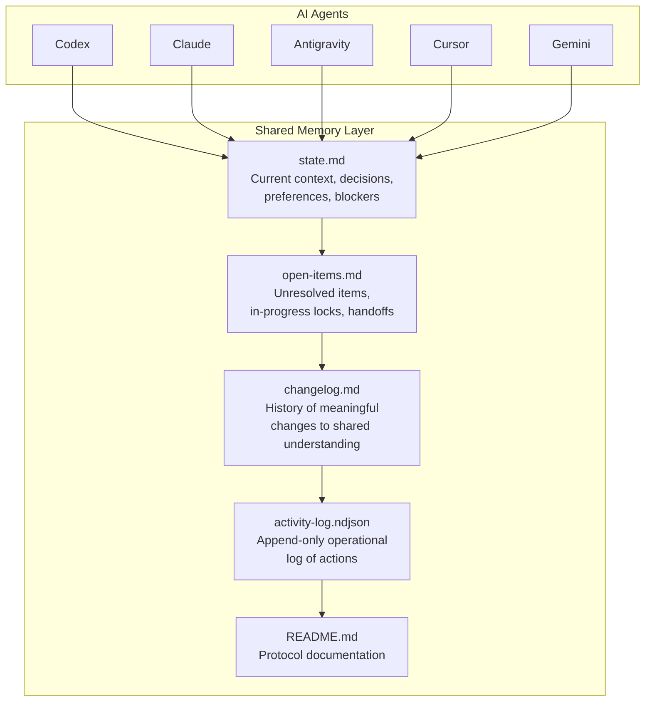
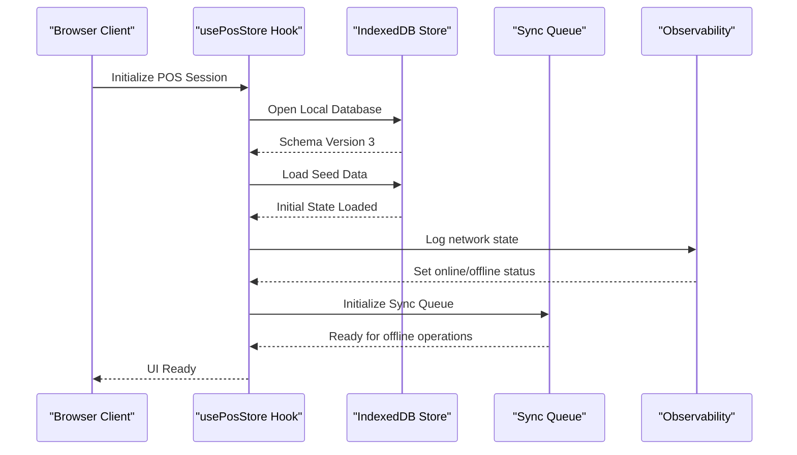
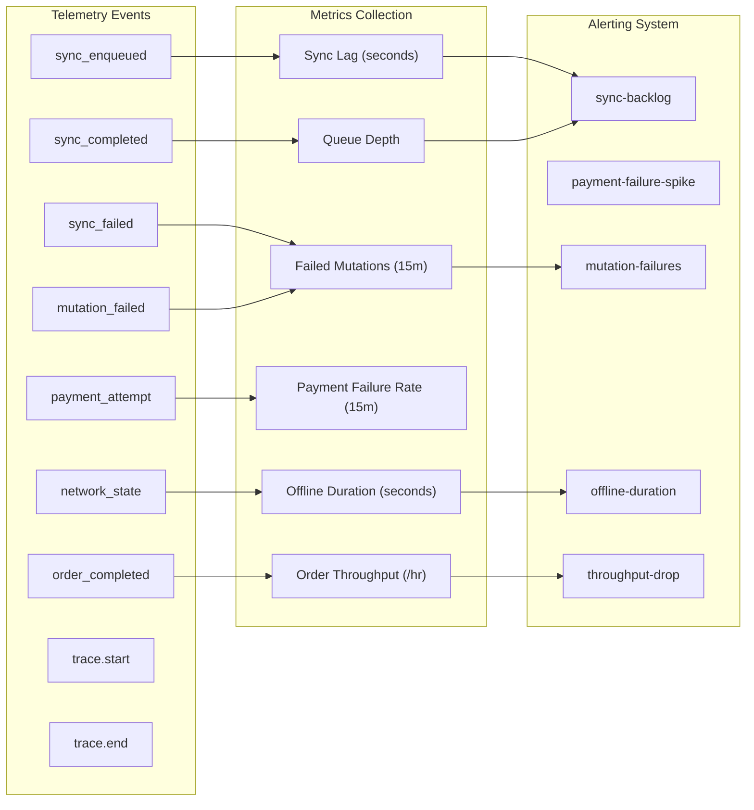
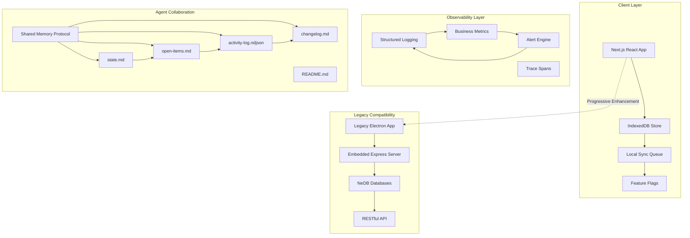
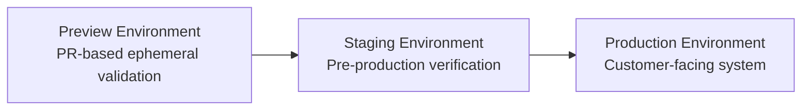

# Project Overview

<cite>
**Referenced Files in This Document**
- [README.md](file://README.md)
- [package.json](file://package.json)
- [web-prototype/README.md](file://web-prototype/README.md)
- [web-prototype/src/lib/observability.ts](file://web-prototype/src/lib/observability.ts)
- [web-prototype/src/lib/db.ts](file://web-prototype/src/lib/db.ts)
- [web-prototype/src/lib/use-pos-store.ts](file://web-prototype/src/lib/use-pos-store.ts)
- [web-prototype/src/lib/types.ts](file://web-prototype/src/lib/types.ts)
- [web-prototype/docs/observability.md](file://web-prototype/docs/observability.md)
- [web-prototype/docs/rollout-strategy.md](file://web-prototype/docs/rollout-strategy.md)
- [shared-memory/README.md](file://shared-memory/README.md)
- [AGENTS.md](file://AGENTS.md)
- [docs/PRD.md](file://docs/PRD.md)
- [docs/TECH_STACK.md](file://docs/TECH_STACK.md)
- [server.js](file://server.js)
- [api/transactions.js](file://api/transactions.js)
- [api/inventory.js](file://api/inventory.js)
- [api/users.js](file://api/users.js)
- [api/customers.js](file://api/customers.js)
- [api/settings.js](file://api/settings.js)
- [index.html](file://index.html)
- [renderer.js](file://renderer.js)
- [app.config.js](file://app.config.js)
- [CONTRIBUTING.md](file://CONTRIBUTING.md)
- [CODE_OF_CONDUCT.md](file://CODE_OF_CONDUCT.md)
</cite>

## Update Summary
**Changes Made**
- Updated architectural overview to reflect transition from desktop Electron POS to web-based multi-agent system
- Added comprehensive documentation for shared memory coordination protocol
- Documented new observability framework with SLOs and alerting
- Updated core components to include offline-first web architecture
- Revised system requirements and deployment strategy
- Enhanced multi-agent collaboration capabilities

## Table of Contents
1. [Introduction](#introduction)
2. [Architectural Transformation](#architectural-transformation)
3. [Web-Based Multi-Agent System](#web-based-multi-agent-system)
4. [Shared Memory Coordination](#shared-memory-coordination)
5. [Comprehensive Observability](#comprehensive-observability)
6. [Core Components](#core-components)
7. [System Architecture](#system-architecture)
8. [Deployment and Rollout Strategy](#deployment-and-rollout-strategy)
9. [Migration Path](#migration-path)
10. [Target Audience](#target-audience)
11. [Key Value Propositions](#key-value-propositions)
12. [System Requirements](#system-requirements)
13. [Licensing](#licensing)
14. [Project Roadmap](#project-roadmap)
15. [Original Inspiration](#original-inspiration)
16. [Developer Setup](#developer-setup)

## Introduction

PharmaSpot has evolved from a traditional desktop Point of Sale system to a sophisticated web-based multi-agent system designed for modern pharmacy operations. This transformation represents a fundamental shift toward collaborative AI-assisted development while maintaining the core pharmacy POS functionality that practitioners need.

The new architecture leverages a shared memory coordination protocol that enables multiple AI agents (Codex, Claude, Antigravity, Cursor, Gemini) to collaborate seamlessly on the project, sharing context and maintaining continuity across different development sessions. This multi-agent approach enhances development velocity while preserving the reliability and functionality of the original pharmacy POS system.

**Updated** Major architectural transformation from desktop Electron POS to web-based multi-agent system with shared memory coordination and comprehensive observability.

**Section sources**
- [README.md:1-91](file://README.md#L1-L91)
- [web-prototype/README.md:1-21](file://web-prototype/README.md#L1-L21)
- [AGENTS.md:1-50](file://AGENTS.md#L1-L50)

## Architectural Transformation

PharmaSpot has undergone a comprehensive architectural evolution that moves beyond the traditional desktop application model:

### From Desktop to Web
- **Legacy**: Electron-based desktop application with embedded Express server
- **New**: Next.js web application with offline-first architecture
- **Migration Strategy**: Progressive enhancement while maintaining backward compatibility

### Multi-Agent Development Framework
- **Shared Memory Protocol**: File-based coordination layer for AI agents
- **Context Preservation**: Persistent state management across development sessions
- **Collaborative Intelligence**: Multiple AI agents working together on the same project

### Observability-First Design
- **Structured Logging**: Comprehensive telemetry and monitoring
- **SLO-Based Operations**: Service Level Objectives for critical metrics
- **Real-time Alerting**: Automated incident detection and response

**Section sources**
- [web-prototype/README.md:1-21](file://web-prototype/README.md#L1-L21)
- [shared-memory/README.md:1-85](file://shared-memory/README.md#L1-L85)
- [web-prototype/docs/observability.md:1-35](file://web-prototype/docs/observability.md#L1-L35)

## Web-Based Multi-Agent System

The new PharmaSpot architecture centers around a sophisticated web-based multi-agent system that combines human expertise with AI assistance:

### Shared Memory Protocol
The system implements a file-based coordination layer that enables seamless collaboration between multiple AI agents:

**Diagram sources**
- [shared-memory/README.md:1-85](file://shared-memory/README.md#L1-L85)

### Offline-First Web Architecture
The web prototype demonstrates a sophisticated offline-first approach using IndexedDB for local persistence:

**Diagram sources**
- [web-prototype/src/lib/use-pos-store.ts:109-141](file://web-prototype/src/lib/use-pos-store.ts#L109-L141)
- [web-prototype/src/lib/db.ts:99-115](file://web-prototype/src/lib/db.ts#L99-L115)

**Section sources**
- [shared-memory/README.md:1-85](file://shared-memory/README.md#L1-L85)
- [web-prototype/src/lib/db.ts:1-241](file://web-prototype/src/lib/db.ts#L1-241)
- [web-prototype/src/lib/use-pos-store.ts:1-434](file://web-prototype/src/lib/use-pos-store.ts#L1-434)

## Shared Memory Coordination

The shared memory protocol establishes a standardized framework for multi-agent collaboration:

### Core Files and Responsibilities

| File | Role | Read when | Write when |
|------|------|-----------|------------|
| `state.md` | Current truth: context, decisions, preferences, blockers, next action | Before every task | When shared understanding changes |
| `open-items.md` | Unresolved items, in-progress locks, handoffs | Before every task | When claiming, finishing, opening, or closing an item |
| `changelog.md` | History of meaningful changes to shared understanding | When you need recent history or before "fixing" something odd | After any change to `state.md` |
| `activity-log.ndjson` | Append-only operational log of actions | For audit or reconciliation | After every meaningful action |
| `README.md` | Protocol documentation | When learning the protocol | Rarely — only when the protocol itself changes |

### Workflow Patterns

#### Starting Work
1. Read `state.md` and `open-items.md`
2. Claim an item in `open-items.md`: change `[ ]` to `[~] in progress by [your-agent-tag]`
3. Do the work

#### Finishing Work
1. Append a line to `activity-log.ndjson`
2. If the change affected shared understanding, update `state.md` and add a dated entry to `changelog.md`
3. Update `open-items.md`: mark `[x]` for done, add a new handoff item if you're passing something on, or revert the claim if you backed out
4. Commit with an agent-tagged message

**Section sources**
- [shared-memory/README.md:1-85](file://shared-memory/README.md#L1-L85)
- [AGENTS.md:1-50](file://AGENTS.md#L1-L50)

## Comprehensive Observability

The system implements a sophisticated observability framework with structured logging, tracing, and SLO-based alerting:

### Telemetry Events and Metrics

**Diagram sources**
- [web-prototype/src/lib/observability.ts:1-196](file://web-prototype/src/lib/observability.ts#L1-L196)

### Service Level Objectives (SLOs)

| Metric | Target | Warning Threshold | Critical Threshold |
|--------|--------|-------------------|-------------------|
| Sync Lag | ≤ 300s | 600s | 1800s |
| Queue Depth | ≤ 25 items | 50 items | 100 items |
| Failed Mutations (15m) | ≤ 5 | 10 | 20 |
| Payment Failure Rate (15m) | ≤ 5% | 10% | 20% |
| Offline Duration | ≤ 900s | 1800s | 3600s |
| Order Throughput | ≥ 12/hr | 6/hr | 3/hr |

### Alerting Policy

The system implements a tiered alerting approach:

1. **Critical Alerts**: Require immediate operator intervention
   - `mutation-failures`: Failed local mutations exceed threshold
   - High `sync-backlog`: Queue depth or lag threshold exceeded significantly
   - Payment spikes: Abnormal payment failure rates

2. **Warning Alerts**: Monitor and investigate
   - `sync-backlog`: Queue depth or lag approaching thresholds
   - `offline-duration`: Extended offline periods
   - `throughput-drop`: Reduced order processing capacity

**Section sources**
- [web-prototype/src/lib/observability.ts:1-196](file://web-prototype/src/lib/observability.ts#L1-L196)
- [web-prototype/docs/observability.md:1-35](file://web-prototype/docs/observability.md#L1-L35)

## Core Components

### Web-Based POS Interface
The new architecture maintains the core pharmacy POS functionality while adding modern web capabilities:

- **Offline-First Architecture**: All operations work offline with eventual sync
- **Real-time Collaboration**: Multiple cashiers can work simultaneously
- **Enhanced UI/UX**: Modern React-based interface with comprehensive state management
- **Responsive Design**: Works across desktop, tablet, and mobile devices

### Multi-Agent Development Environment
- **Persistent Context**: AI agents maintain shared understanding across sessions
- **Conflict Prevention**: Clear protocols for claiming and completing tasks
- **Audit Trail**: Complete activity log for all collaborative work
- **Recovery Mechanisms**: Built-in reconciliation procedures for state conflicts

### Observability Dashboard
- **Live Metrics**: Real-time monitoring of system health and performance
- **Alert Management**: Automated incident detection and escalation
- **Runbook Integration**: Direct links to resolution procedures
- **Historical Analysis**: Comprehensive audit trails for troubleshooting

**Section sources**
- [web-prototype/src/lib/use-pos-store.ts:1-434](file://web-prototype/src/lib/use-pos-store.ts#L1-434)
- [web-prototype/src/components/pos-prototype.tsx](file://web-prototype/src/components/pos-prototype.tsx)
- [AGENTS.md:1-50](file://AGENTS.md#L1-L50)

## System Architecture

The new architecture combines web technologies with AI collaboration frameworks:

**Diagram sources**
- [web-prototype/src/lib/db.ts:1-241](file://web-prototype/src/lib/db.ts#L1-L241)
- [web-prototype/src/lib/observability.ts:1-196](file://web-prototype/src/lib/observability.ts#L1-L196)
- [shared-memory/README.md:1-85](file://shared-memory/README.md#L1-L85)

**Section sources**
- [web-prototype/src/lib/db.ts:1-241](file://web-prototype/src/lib/db.ts#L1-L241)
- [web-prototype/src/lib/observability.ts:1-196](file://web-prototype/src/lib/observability.ts#L1-L196)
- [shared-memory/README.md:1-85](file://shared-memory/README.md#L1-L85)

## Deployment and Rollout Strategy

The system implements a comprehensive deployment strategy with environment isolation and rollback verification:

### Environment Strategy

### Backward-Compatible Migration Approach

1. **Additive Migrations**: Expand schema without removing existing data
2. **Feature Flags**: Runtime kill-switches for risky features
3. **Gradual Rollout**: Enable features incrementally with monitoring
4. **Rollback Capability**: Quick disable and redeploy of problematic features

### Rollout Verification

The system includes automated verification procedures:

- **Feature Flag Testing**: `npm run verify:rollback` validates kill-switch functionality
- **Integration Testing**: End-to-end validation of migration paths
- **Performance Monitoring**: SLO-based validation of system health
- **User Acceptance Testing**: Manual verification of critical workflows

**Section sources**
- [web-prototype/docs/rollout-strategy.md:1-23](file://web-prototype/docs/rollout-strategy.md#L1-L23)

## Migration Path

PharmaSpot follows a progressive migration strategy that preserves existing functionality while introducing new capabilities:

### Phase 1: Web Prototype
- Next.js web application with offline-first architecture
- IndexedDB for local persistence
- Feature flags for gradual feature activation
- Observability framework implementation

### Phase 2: Multi-Agent Integration
- Shared memory protocol implementation
- AI agent collaboration framework
- Context preservation across development sessions
- Audit trail for collaborative work

### Phase 3: Full Feature Parity
- Complete replacement of legacy Electron features
- Advanced observability and alerting
- Production-ready deployment pipeline
- Comprehensive testing and validation

### Phase 4: Optimization and Enhancement
- Performance optimization for production scale
- Advanced analytics and reporting
- Enhanced security and compliance features
- Continuous improvement through AI collaboration

**Section sources**
- [web-prototype/README.md:1-21](file://web-prototype/README.md#L1-L21)
- [web-prototype/docs/rollout-strategy.md:1-23](file://web-prototype/docs/rollout-strategy.md#L1-L23)

## Target Audience

### Primary Users
- **Pharmacy Professionals**: Pharmacists, pharmacy technicians, and pharmacy managers
- **Development Teams**: Maintaining and extending the POS system
- **AI Collaborators**: Multiple AI agents working together on the project

### Secondary Users
- **System Administrators**: Managing deployments and monitoring
- **Quality Assurance**: Testing and validating system functionality
- **Business Analysts**: Analyzing sales data and operational metrics

## Key Value Propositions

### For Pharmacy Professionals
- **Reliable Operations**: Proven POS functionality with enhanced reliability
- **Modern Interface**: Intuitive web-based interface accessible from multiple devices
- **Advanced Analytics**: Real-time insights into sales, inventory, and operations
- **Multi-Cashier Support**: Concurrent operation by multiple staff members

### For Development Teams
- **Collaborative Development**: AI agents working together on the same project
- **Context Preservation**: Shared understanding maintained across development sessions
- **Observability-First**: Comprehensive monitoring and alerting capabilities
- **Gradual Feature Delivery**: Safe, incremental feature deployment

### For AI Research
- **Multi-Agent Framework**: Real-world example of AI collaboration
- **Shared Memory Protocol**: Practical implementation of distributed context
- **Observability Model**: Production-ready monitoring and alerting system
- **Migration Strategy**: Proven approach to evolving legacy systems

## System Requirements

### Hardware Requirements
- **Desktop Systems**: Modern x86_64 processors with sufficient RAM for development
- **Mobile Devices**: Smartphones and tablets for POS operations
- **Network Connectivity**: Reliable internet connection for synchronization

### Software Requirements
- **Web Browser**: Modern browser supporting IndexedDB and service workers
- **Development Tools**: Node.js, npm, and Next.js development environment
- **AI Agents**: Various AI platforms for collaborative development

### Network Requirements
- **Offline Operation**: Full functionality without internet connectivity
- **Synchronization**: Automatic sync when network becomes available
- **Conflict Resolution**: Intelligent handling of concurrent modifications

**Section sources**
- [web-prototype/src/lib/db.ts:22-241](file://web-prototype/src/lib/db.ts#L22-L241)
- [web-prototype/src/lib/use-pos-store.ts:109-141](file://web-prototype/src/lib/use-pos-store.ts#L109-L141)

## Licensing

PharmaSpot is licensed under the MIT License, providing broad rights for use, modification, and distribution while maintaining attribution requirements.

**Section sources**
- [README.md:88-91](file://README.md#L88-L91)

## Project Roadmap

### Immediate Priorities
- **Web Prototype Completion**: Finalize Next.js migration and feature parity
- **Multi-Agent Integration**: Implement shared memory protocol across all AI agents
- **Observability Enhancement**: Expand monitoring capabilities and alerting
- **Testing and Validation**: Comprehensive QA across all environments

### Short-term Goals
- **Feature Flag Implementation**: Complete rollout of runtime feature control
- **Deployment Pipeline**: Automated CI/CD with environment isolation
- **Documentation**: Comprehensive guides for multi-agent collaboration
- **Performance Optimization**: Scale to support multiple concurrent users

### Long-term Vision
- **Advanced AI Integration**: Enhanced AI assistance for complex pharmacy operations
- **Analytics Platform**: Comprehensive business intelligence and reporting
- **Mobile First**: Optimized mobile experience for pharmacy staff
- **Cloud Integration**: Optional cloud synchronization for multi-location pharmacies

**Section sources**
- [web-prototype/docs/rollout-strategy.md:1-23](file://web-prototype/docs/rollout-strategy.md#L1-L23)
- [docs/PRD.md:21-37](file://docs/PRD.md#L21-L37)

## Original Inspiration

PharmaSpot was adapted from Store-POS, specifically tailored for pharmacy-specific workflows including:

- **Product Expiry Tracking**: Critical for pharmaceutical inventory management
- **Low Stock Alerts**: Preventing medication shortages
- **Receipt Customization**: Professional documentation requirements
- **Multi-PC Support**: Network deployment for larger pharmacy operations

The new web-based architecture maintains these core pharmacy workflows while adding modern capabilities for AI-assisted development and enhanced observability.

**Section sources**
- [README.md:80](file://README.md#L80)

## Developer Setup

### Prerequisites
- **Node.js**: Version 16 or higher for development
- **npm**: Package manager for dependency installation
- **Git**: Version control for collaborative development
- **Modern Browser**: Latest Chrome, Firefox, or Edge for testing

### Installation Steps
1. Clone the repository from GitHub
2. Install dependencies using `npm install`
3. Start the development server with `npm run dev`
4. Access the web interface at `http://localhost:3000`
5. Explore the shared memory protocol in the `shared-memory/` directory

### Development Environment
- **Next.js**: React-based web framework for the POS interface
- **TypeScript**: Type-safe development for better code quality
- **Jest**: Unit testing framework for component validation
- **ESLint**: Code quality and consistency enforcement

### Multi-Agent Development
- **Shared Memory**: Use the shared memory protocol for context preservation
- **Agent Tags**: Include agent-specific tags in commit messages
- **Documentation**: Update shared memory files when changing project state
- **Conflict Resolution**: Follow established protocols for task claiming and completion

**Section sources**
- [web-prototype/README.md:5-21](file://web-prototype/README.md#L5-L21)
- [AGENTS.md:22-50](file://AGENTS.md#L22-L50)
- [shared-memory/README.md:15-85](file://shared-memory/README.md#L15-L85)