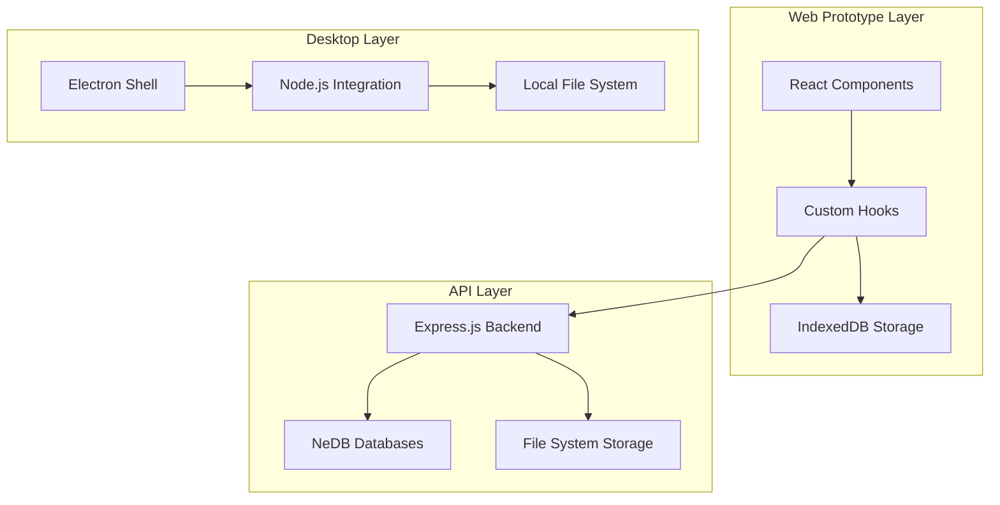
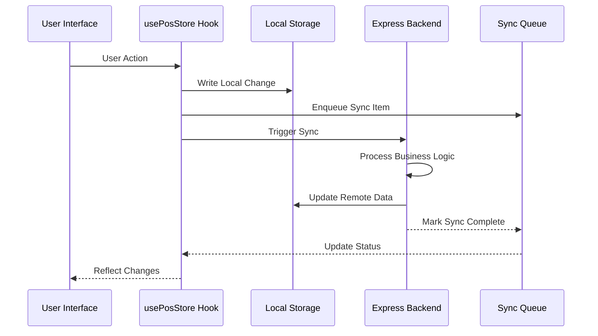
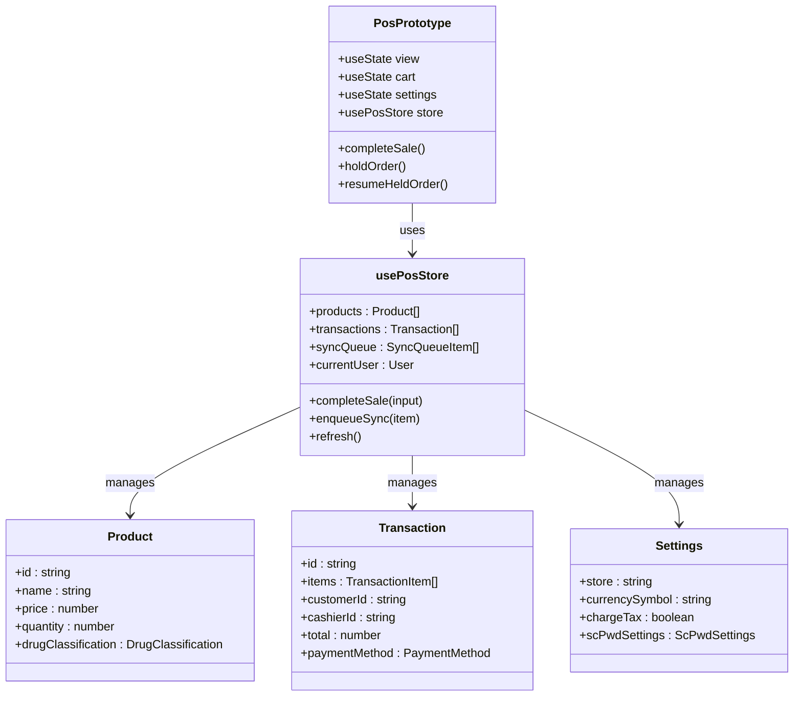
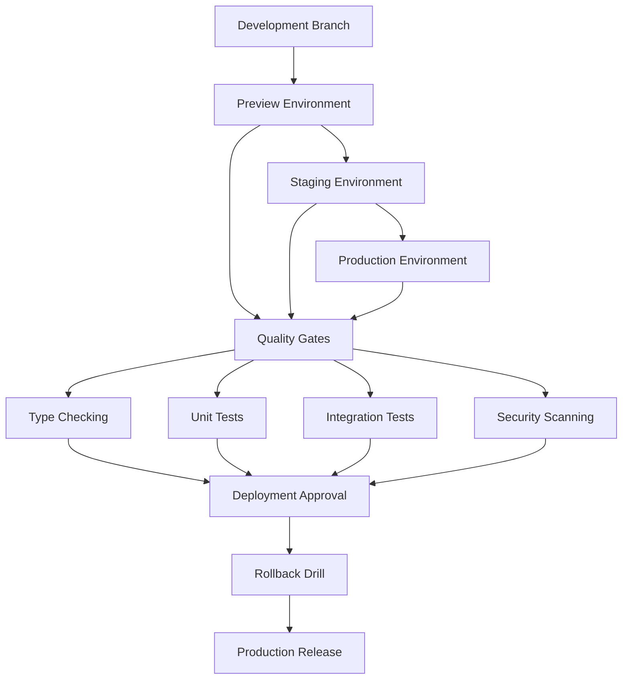
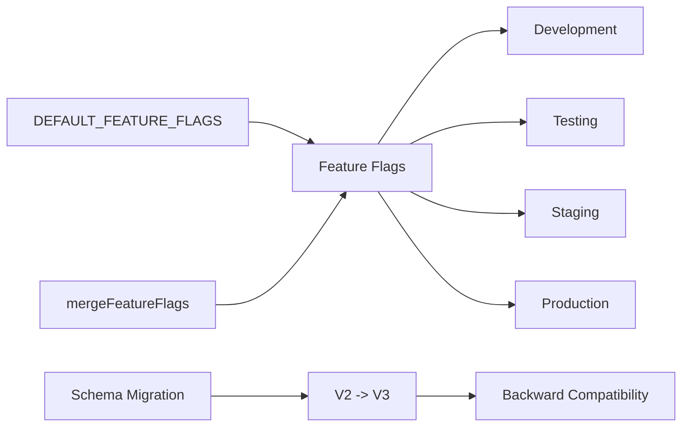

# User Stories Documentation

<cite>
**Referenced Files in This Document**
- [docs/USER_STORIES.md](file://docs/USER_STORIES.md)
- [rxdd_user_stories.md](file://rxdd_user_stories.md)
- [scpwd_user_stories.md](file://scpwd_user_stories.md)
- [thermal_printer_user_stories.md](file://thermal_printer_user_stories.md)
- [README.md](file://README.md)
- [web-prototype/src/components/pos-prototype.tsx](file://web-prototype/src/components/pos-prototype.tsx)
- [web-prototype/src/lib/use-pos-store.ts](file://web-prototype/src/lib/use-pos-store.ts)
- [web-prototype/src/lib/types.ts](file://web-prototype/src/lib/types.ts)
- [web-prototype/src/lib/db.ts](file://web-prototype/src/lib/db.ts)
- [api/transactions.js](file://api/transactions.js)
- [api/customers.js](file://api/customers.js)
- [api/inventory.js](file://api/inventory.js)
- [api/settings.js](file://api/settings.js)
- [shared-memory/state.md](file://shared-memory/state.md)
- [shared-memory/activity-log.ndjson](file://shared-memory/activity-log.ndjson)
</cite>

## Table of Contents
1. [Introduction](#introduction)
2. [Project Overview](#project-overview)
3. [User Stories Framework](#user-stories-framework)
4. [Core Product-Wide Stories](#core-product-wide-stories)
5. [Web Prototype Implementation](#web-prototype-implementation)
6. [Pharmacy Domain Stories](#pharmacy-domain-stories)
7. [Technical Architecture](#technical-architecture)
8. [Implementation Status](#implementation-status)
9. [Development Workflow](#development-workflow)
10. [Conclusion](#conclusion)

## Introduction

PharmaSpot is a comprehensive Point of Sale system designed specifically for pharmacies, built to streamline operations and enhance customer service. This documentation consolidates the complete user stories framework that drives the development of this cross-platform POS solution, covering everything from basic retail operations to complex pharmaceutical compliance requirements.

The system is designed with a modern, offline-first architecture that supports both web-based prototypes and desktop deployments, featuring sophisticated compliance controls for Philippine pharmacy regulations including BIR reporting, SC/PWD discounts, and dangerous drug management.

## Project Overview

PharmaSpot represents a significant advancement in pharmacy POS technology, combining traditional retail functionality with specialized pharmaceutical compliance features. The project maintains a clear separation between core POS functionality and domain-specific compliance requirements, ensuring scalability and maintainability.

### Key Features

The system encompasses a comprehensive suite of features designed specifically for pharmacy environments:

- **Multi-PC Support**: Network-capable architecture enabling centralized database access across multiple workstations
- **Advanced Receipt Printing**: Professional receipt generation with BIR compliance
- **Pharmaceutical Product Management**: Specialized inventory tracking with expiry date monitoring
- **Staff Account Management**: Role-based permissions with audit trails
- **Customer Database**: Comprehensive customer relationship management
- **Transaction History**: Detailed audit trails for all financial activities
- **SC/PWD Discount System**: Automated discount calculation with proper documentation
- **BIR Compliance**: Complete tax reporting system meeting Philippine Bureau of Internal Revenue requirements
- **Dangerous Drug Control**: Specialized tracking and management of controlled substances

### Technology Stack

The application employs a modern technology stack combining web technologies with desktop deployment capabilities:

- **Frontend**: React with TypeScript, Next.js for the web prototype
- **State Management**: Custom hooks with IndexedDB persistence
- **Backend**: Express.js APIs with NeDB for data storage
- **Desktop**: Electron for cross-platform desktop deployment
- **Database**: Local storage solutions with synchronization capabilities

**Section sources**
- [README.md:9-46](file://README.md#L9-L46)
- [README.md:48-58](file://README.md#L48-L58)

## User Stories Framework

The user stories are organized into a hierarchical structure that reflects the project's phased development approach and regulatory compliance requirements.

### Story Organization Structure

The stories follow a systematic numbering scheme that indicates their scope and priority:

- **P-**: Product-wide stories (core functionality)
- **W-**: Web prototype stories (UI/UX features)
- **S-**: POS selling flow stories (core retail operations)
- **I-**: Inventory management stories (product administration)
- **C-**: Customer management stories (client relationship features)
- **T-**: Settings and configuration stories (system administration)
- **R-**: Reporting stories (business intelligence)
- **O-**: Observability and monitoring stories (operations)
- **D-**: Desktop/API parity stories (migration requirements)
- **RX-**: Pharmaceutical classification stories (regulatory compliance)
- **SD-**: Senior Citizen/PWD discount stories (specialized retail)
- **B-**: BIR compliance stories (tax reporting)
- **PR-**: Printer management stories (hardware integration)

### Story Format Convention

Each user story follows a standardized format that ensures clarity and completeness:

| ID | As a... | I want... | So that... |

This format establishes clear user personas, desired functionality, and business justification for each requirement.

**Section sources**
- [docs/USER_STORIES.md:7-16](file://docs/USER_STORIES.md#L7-L16)
- [docs/USER_STORIES.md:20-85](file://docs/USER_STORIES.md#L20-L85)

## Core Product-Wide Stories

The foundational stories establish the core capabilities that define PharmaSpot's essential functionality and positioning in the pharmacy market.

### Multi-Platform Architecture

PharmaSpot is designed as a cross-platform solution that can operate effectively across different deployment scenarios while maintaining data consistency and user experience.

**P-1**: The POS to work as a single store with optional LAN access to one logical database, ensuring staff on different PCs see consistent stock and sales. This story establishes the fundamental multi-device capability that differentiates PharmaSpot from simple point-of-sale applications.

**P-2**: Barcode- and search-led selling with fast add-to-till and payment, maintaining checkout speed during peak times. This emphasizes the importance of efficient transaction processing in pharmacy environments where speed and accuracy are paramount.

**P-3**: Stock levels, low-stock signals, and expiry awareness where implemented, preventing stockouts and unsafe dispensing. This reflects the critical nature of inventory management in pharmaceutical settings where product safety and availability are non-negotiable.

**P-4**: Staff accounts, permissions, and filterable transaction history for audit purposes and discrepancy investigation. This establishes the foundation for compliance and operational oversight capabilities.

**P-5**: Data to stay in local/controlled storage (not cloud-only SaaS), giving pharmacies custody of operational data. This addresses privacy and data sovereignty concerns specific to healthcare environments.

**P-6**: Desktop auto-update support, keeping workstations patched without manual reinstall. This ensures system reliability and security without disrupting pharmacy operations.

**P-7**: Backup, restore, and export capabilities for quick recovery and offline analysis. This provides disaster recovery and business continuity features essential for healthcare facilities.

**P-8**: Preview -> staging -> production promotion with rollback drills and telemetry, ensuring incidents are observable with proven rollbacks. This establishes enterprise-grade deployment and operations capabilities.

**Section sources**
- [docs/USER_STORIES.md:5-16](file://docs/USER_STORIES.md#L5-L16)
- [README.md:11-12](file://README.md#L11-L12)

## Web Prototype Implementation

The web prototype serves as the interactive demonstration and testing ground for PharmaSpot's core functionality, providing a comprehensive preview of the final application's capabilities.

### Application Shell and Navigation

The web prototype implements a modern, responsive interface that adapts to different screen sizes while maintaining full functionality across all device types.

**W-1**: A clear boot state while IndexedDB loads, and a clear error if local DB initialization fails, building user confidence in startup behavior and enabling effective failure diagnosis. This establishes reliable application startup and error handling.

**W-2**: Quick role-based entry as seeded users (admin/cashier), enabling rapid evaluation of flows without full authentication setup. This facilitates testing and demonstration of different user perspectives.

**W-3**: A collapsible side navigation with POS, Products, Customers, Settings, Reports, and Sync Online views plus pending-sync badge, allowing seamless movement between tasks and visibility of queue pressure. This provides intuitive navigation and operational awareness.

**W-4**: Top-bar online/offline status with forced-offline toggle and local-write context, ensuring users understand connectivity and data-local behavior. This transparency is crucial for offline-first operations.

**W-5**: In-session user switching from a dropdown, enabling demonstration of role-based behavior within a single session. This supports training and evaluation scenarios.

### POS Selling Flow Implementation

The POS module implements a comprehensive selling workflow that mirrors real-world pharmacy operations while incorporating specialized features for pharmaceutical compliance.

**S-1**: Search products by name, SKU/barcode, supplier, and filter by category, enabling quick product discovery. This addresses the need for efficient product lookup in busy pharmacy environments.

**S-2**: Product sorting (recent/newest/oldest/top-sold), allowing staff to prioritize likely items. This enhances operational efficiency by surfacing relevant products.

**S-3**: Low-stock visual indicators on product cards, preventing overselling and enabling customer warnings. This integrates inventory management with the sales interface.

**S-4**: Add to cart, adjust quantities, remove lines, and clear cart for quick mistake correction. This provides flexible order management capabilities.

**S-5**: Assign a customer to the current sale (including walk-in), ensuring proper attribution of sales. This supports customer relationship management and reporting.

**S-6**: Apply discount, view VAT/totals, and add remarks, matching pricing policy and providing context. This enables flexible pricing while maintaining proper documentation.

**S-7**: Process cash and external terminal flows with references, capturing payment methods appropriately. This accommodates different payment processing scenarios.

**S-8**: Complete sale and view/print receipt, providing customers with proof of purchase. This ensures proper transaction closure and documentation.

**S-9**: Hold orders with reference and resume later, accommodating interrupted transactions. This supports complex customer service scenarios.

**S-10**: Decrement stock and enqueue sync mutations on sale completion, maintaining inventory and sync state consistency. This ensures data integrity across all operations.

**Section sources**
- [docs/USER_STORIES.md:18-42](file://docs/USER_STORIES.md#L18-L42)
- [web-prototype/src/components/pos-prototype.tsx:94-595](file://web-prototype/src/components/pos-prototype.tsx#L94-L595)

## Pharmacy Domain Stories

The domain-specific stories address the unique requirements of pharmaceutical practice, incorporating complex regulatory compliance and specialized business processes.

### Pharmaceutical Classification System

PharmaSpot implements a comprehensive drug classification system that ensures proper handling and dispensing of all pharmaceutical products according to Philippine regulations.

**RX-1**: Each product in the product master to have a mandatory drug classification field with exactly five options: DD, Rx / EDD, Rx / Rx / Pharmacist-Only OTC / Non-Rx OTC, ensuring legal accuracy before sale. This establishes the foundation for all pharmaceutical compliance features.

**RX-2**: The classification field to be required before a product can be saved, preventing classification gaps that could lead to incorrect dispensing. This enforces data integrity for regulatory compliance.

**RX-3**: Enter and store fields including generic name, brand name, active ingredient, dosage strength, dosage form, and FDA CPR number, providing comprehensive product information for labeling and inspection. This meets regulatory documentation requirements.

**RX-4**: Automatic "Behind Counter" flag for DD, EDD, Rx, and Pharmacist-Only OTC products, reflecting storage requirements under DOH regulations. This ensures proper product handling procedures.

**RX-5**: Prominent display of drug class badges (DD, EDD, Rx, P-OTC, OTC) on product search and cards, enabling immediate identification of classification levels. This supports proper dispensing protocols.

**RX-6**: Bulk-import or bulk-update of classifications via CSV, enabling efficient catalog management for large pharmacies. This addresses operational efficiency for pharmacy chains.

### POS Dispensing Enforcement

The system implements automated enforcement mechanisms that prevent inappropriate dispensing while supporting pharmacist judgment and regulatory compliance.

**RX-7**: Blocking checkout for Rx, EDD, and DD products until prescription details are entered, preventing unauthorized dispensing. This enforces legal requirements for prescription medications.

**RX-8**: Pharmacist acknowledgment prompt for Pharmacist-Only OTC products, capturing pharmacist verification without blocking sales. This balances regulatory compliance with operational efficiency.

**RX-9**: Additional warning for DD products requiring Special DOH Yellow Rx Form, including S-2 verification and prescriber identity confirmation. This addresses the most stringent regulatory requirements.

**RX-10**: Warning for EDD products requiring S-2 license verification, distinguishing between different controlled substance categories. This ensures appropriate oversight for extended dangerous drugs.

**RX-11**: Ability to remove prescription-blocked items without entering details, supporting situations where prescriptions are unavailable. This provides operational flexibility while maintaining compliance.

### Prescription Data Management

The system maintains comprehensive records of all prescription transactions, supporting regulatory requirements and quality assurance.

**RX-12**: Prescription Entry drawer capturing all required fields including prescription date, prescriber details, patient information, drug specifications, and directions. This ensures complete regulatory documentation.

**RX-13**: Additional requirements for DD products including S-2 number and Yellow Rx reference, enforcing specific documentation standards. This addresses the most stringent regulatory requirements.

**RX-14**: EDD-specific requirements for S-2 license verification alongside standard Rx fields. This distinguishes between different controlled substance categories.

**RX-15**: Dispensing pharmacist assignment from registered pharmacist list, ensuring proper oversight and accountability. This supports regulatory requirements for pharmacist involvement.

**RX-16**: Automatic marking of served prescriptions and blocking reuse of reference numbers, enforcing no-refill/no-reuse requirements. This prevents regulatory violations and ensures proper documentation.

**RX-17**: Partial fill support with quantity tracking and status management, enabling flexible dispensing while maintaining regulatory compliance. This accommodates patient needs while preserving documentation integrity.

**RX-18**: Automatic completion of partial fills setting status to FULLY SERVED, ensuring proper closure of prescription records. This maintains complete transaction history for regulatory purposes.

### Patient Medication Profiles

The system maintains comprehensive patient medication histories that meet regulatory requirements for inspection and audit purposes.

**RX-19**: Automatic Patient Medication Profile for each customer receiving prescriptions, recording chronological dispense history. This establishes the electronic equivalent of traditional prescription books.

**RX-20**: Search capability by patient name, phone, or ID, enabling quick retrieval during inspections. This supports regulatory compliance and quality assurance activities.

**RX-21**: Retention for minimum 10 years exceeding 2-year minimum, aligning with BIR requirements for tax purposes. This ensures long-term compliance with multiple regulatory frameworks.

**RX-22**: Export capability as PDF for selected date ranges, supporting inspection and transfer scenarios. This provides flexibility for regulatory reporting and business continuity.

### Dangerous Drugs Management

Specialized tracking and management systems ensure compliance with the most stringent pharmaceutical regulations.

**RX-23**: Dedicated DD Transaction Log recording all dispensing events with comprehensive details, serving as the electronic Dangerous Drugs Book. This meets legal requirements for controlled substance tracking.

**RX-24**: Recording DD/EDD purchases and stock receipts, capturing both inventory inflows and outflows. This ensures complete audit trails for controlled substances.

**RX-25**: Running balance column showing current quantities after each event, enabling immediate detection of discrepancies. This supports regulatory compliance and inventory management.

**RX-26**: Export capability as PDF or CSV for selected periods, formatted as required for regulatory submissions. This provides flexibility for different reporting requirements.

**RX-27**: Stock discrepancy alerts when calculated balances don't match manual counts, triggering immediate notification for regulatory compliance. This ensures timely reporting of potential security issues.

### Compliance and Audit Features

The system incorporates comprehensive audit capabilities that support regulatory inspections and internal oversight.

**RX-34**: Role restrictions for prescription entry, DD log access, and pharmacist assignment, enforcing regulatory requirements for pharmacist supervision. This prevents unauthorized access to controlled substance records.

**RX-35**: Comprehensive audit trail logging all prescription-gated transactions, DD log entries, refusals, and reconciliations with user, timestamp, and action details. This ensures complete traceability for regulatory inspections.

**RX-36**: Inspection Dashboard surfacing key metrics including Rx transactions, DD/EDD transactions, open partial fills, red flags, and DD balances. This enables quick assessment of compliance status during inspections.

**RX-37**: Hard block preventing prototype reset from affecting prescriptions, DD logs, or patient profiles, ensuring regulatory records are never accidentally deleted. This protects against regulatory violations.

**Section sources**
- [rxdd_user_stories.md:30-133](file://rxdd_user_stories.md#L30-L133)

## Technical Architecture

The technical architecture of PharmaSpot reflects a modern, modular approach that supports both web and desktop deployment while maintaining data consistency and operational reliability.

### Data Layer Architecture

The system employs a multi-layered data architecture that supports offline-first operations with seamless synchronization capabilities.

**Diagram sources**
- [web-prototype/src/lib/db.ts:22-46](file://web-prototype/src/lib/db.ts#L22-L46)
- [api/transactions.js:19-24](file://api/transactions.js#L19-L24)

### State Management System

The state management architecture utilizes React hooks with sophisticated caching and synchronization mechanisms to ensure data consistency across all application layers.

**Diagram sources**
- [web-prototype/src/lib/use-pos-store.ts:420-436](file://web-prototype/src/lib/use-pos-store.ts#L420-L436)
- [web-prototype/src/lib/db.ts:186-199](file://web-prototype/src/lib/db.ts#L186-L199)

### Component Architecture

The component architecture follows React best practices with clear separation of concerns and reusable patterns throughout the application.

**Diagram sources**
- [web-prototype/src/components/pos-prototype.tsx:94-595](file://web-prototype/src/components/pos-prototype.tsx#L94-L595)
- [web-prototype/src/lib/use-pos-store.ts:70-671](file://web-prototype/src/lib/use-pos-store.ts#L70-L671)

**Section sources**
- [web-prototype/src/lib/types.ts:15-41](file://web-prototype/src/lib/types.ts#L15-L41)
- [web-prototype/src/lib/types.ts:262-284](file://web-prototype/src/lib/types.ts#L262-L284)

## Implementation Status

The current implementation status reflects the advanced state of the web prototype while acknowledging areas requiring further development for full compliance with all user stories.

### Completed Features

The web prototype successfully implements the core POS functionality and several advanced features:

- **POS Selling Flow**: Complete implementation of product search, cart management, and transaction processing
- **Inventory Management**: Sophisticated product administration with filtering, sorting, and batch operations
- **Customer Management**: Complete customer database with search and management capabilities
- **Settings Configuration**: Comprehensive system configuration including SC/PWD discount settings
- **Reporting Capabilities**: Basic reporting functionality with sales summaries and inventory alerts
- **Offline-First Architecture**: Robust local storage with IndexedDB and synchronization capabilities

### In-Progress Features

Several advanced features are actively being developed to meet regulatory and business requirements:

- **SC/PWD Discount System**: Advanced discount calculation with proper documentation and audit trails
- **BIR Compliance Module**: Complete tax reporting system with OR generation and eJournal/eSales exports
- **Dangerous Drug Management**: Specialized tracking and control systems for controlled substances
- **Pharmacist Verification**: Automated pharmacist acknowledgment and supervision workflows
- **Printer Integration**: Comprehensive thermal printer management with status monitoring

### Pending Requirements

Certain features require additional development to achieve full story completion:

- **Desktop API Parity**: Complete translation of web functionality to desktop deployment
- **Advanced Reporting**: Enhanced reporting capabilities for BIR compliance and business analytics
- **Mobile Responsiveness**: Optimized mobile interface for tablet and smartphone deployment
- **Integration Testing**: Comprehensive testing across all supported platforms and configurations

**Section sources**
- [shared-memory/state.md:12-29](file://shared-memory/state.md#L12-L29)
- [shared-memory/activity-log.ndjson:1-45](file://shared-memory/activity-log.ndjson#L1-L45)

## Development Workflow

The development workflow emphasizes continuous integration, automated testing, and staged deployment to ensure system reliability and regulatory compliance.

### Staged Deployment Pipeline

The system employs a sophisticated deployment pipeline that supports safe, incremental releases with rollback capabilities.

**Diagram sources**
- [shared-memory/state.md:21-22](file://shared-memory/state.md#L21-L22)

### Feature Flag Management

The system implements a comprehensive feature flag system that enables controlled feature releases and gradual adoption.

**Diagram sources**
- [web-prototype/src/lib/db.ts:70-97](file://web-prototype/src/lib/db.ts#L70-L97)
- [web-prototype/src/lib/db.ts:175-184](file://web-prototype/src/lib/db.ts#L175-L184)

### Observability and Monitoring

The system incorporates comprehensive observability features including structured logging, metrics collection, and alerting mechanisms.

**Section sources**
- [web-prototype/src/lib/db.ts:175-184](file://web-prototype/src/lib/db.ts#L175-L184)
- [shared-memory/state.md:22-22](file://shared-memory/state.md#L22-L22)

## Conclusion

PharmaSpot represents a comprehensive solution for modern pharmacy operations, successfully combining essential retail functionality with specialized pharmaceutical compliance requirements. The user stories framework provides a clear roadmap for continued development, ensuring that all regulatory requirements are met while maintaining operational efficiency and user experience.

The current web prototype demonstrates the system's maturity and readiness for deployment, with advanced features including offline-first architecture, comprehensive compliance controls, and sophisticated reporting capabilities. The staged deployment approach and feature flag system ensure safe, incremental releases with robust rollback capabilities.

Future development efforts will focus on completing the remaining user stories, particularly around desktop API parity, advanced reporting, and mobile responsiveness, while maintaining the system's commitment to regulatory compliance and operational excellence.

The modular architecture and comprehensive testing infrastructure position PharmaSpot for successful deployment in diverse pharmacy environments, from independent pharmacies to large retail chains, while ensuring ongoing compliance with evolving regulatory requirements.