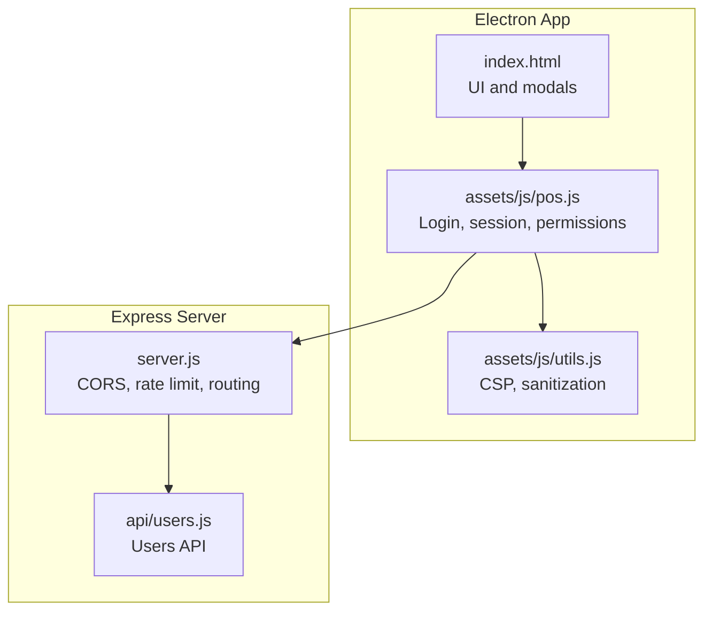
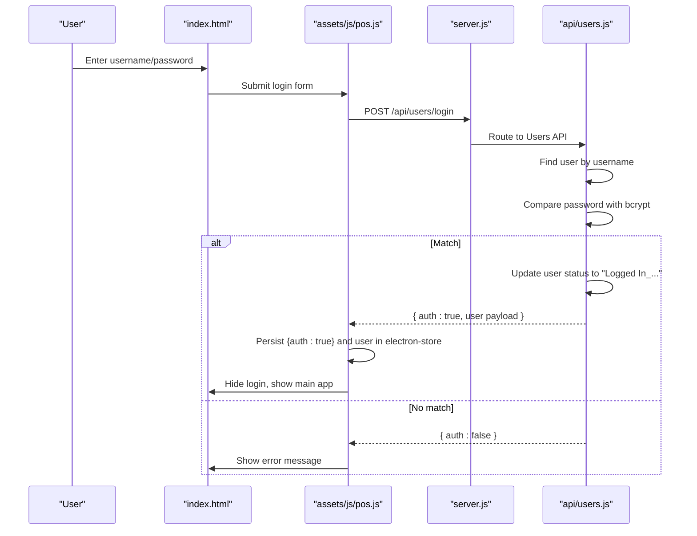
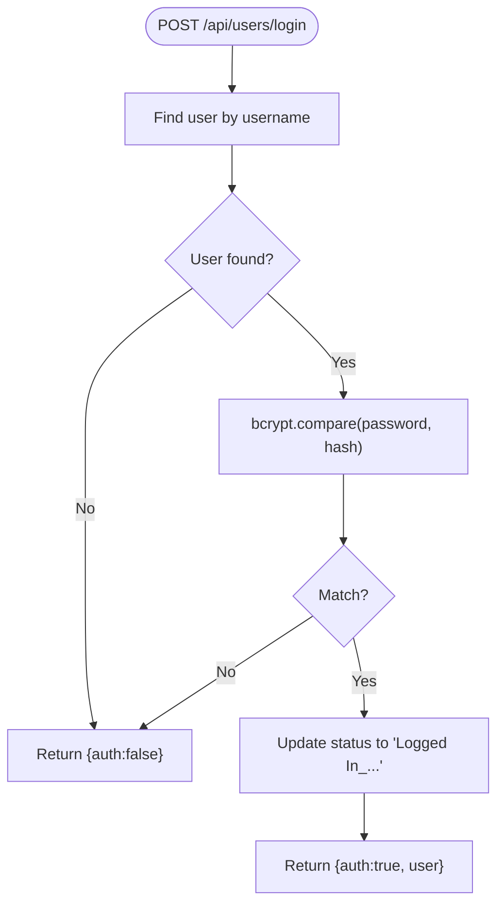
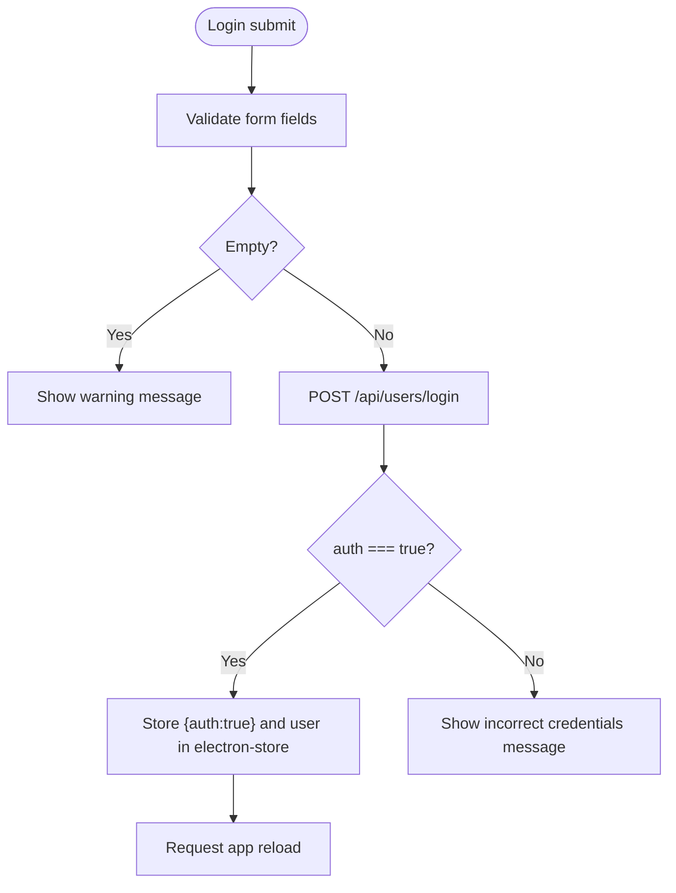
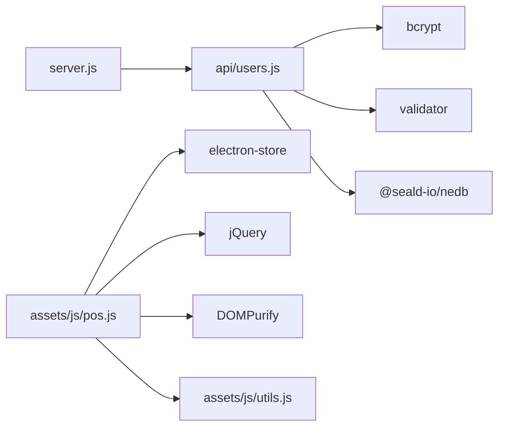

# Authentication and Authorization

<cite>
**Referenced Files in This Document**
- [server.js](file://server.js)
- [users.js](file://api/users.js)
- [pos.js](file://assets/js/pos.js)
- [utils.js](file://assets/js/utils.js)
- [index.html](file://index.html)
- [start.js](file://start.js)
</cite>

## Table of Contents
1. [Introduction](#introduction)
2. [Project Structure](#project-structure)
3. [Core Components](#core-components)
4. [Architecture Overview](#architecture-overview)
5. [Detailed Component Analysis](#detailed-component-analysis)
6. [Dependency Analysis](#dependency-analysis)
7. [Performance Considerations](#performance-considerations)
8. [Troubleshooting Guide](#troubleshooting-guide)
9. [Conclusion](#conclusion)

## Introduction
This document explains the authentication and authorization model for PharmaSpot POS. It covers how users log in, how passwords are hashed and stored, how sessions are maintained client-side, and how role-based permissions are enforced. It also documents the default administrator initialization, logout behavior, and security measures such as Content Security Policy and input sanitization.

PharmaSpot POS is an Electron desktop application with a local Express server exposing REST endpoints for user management and authentication. The client-side application (jQuery + Electron) handles login, stores a lightweight session flag locally, and enforces permissions via UI toggles and backend endpoints.

## Project Structure
The authentication and authorization logic spans three layers:
- Server: Express routes under /api/users for login, logout, user CRUD, and default admin initialization.
- Client: jQuery-based UI that submits credentials, persists a minimal session flag, and hides/shows UI elements based on permissions.
- Utilities: Security helpers for CSP and input sanitization.

**Diagram sources**
- [server.js:1-68](file://server.js#L1-L68)
- [users.js:1-311](file://api/users.js#L1-L311)
- [pos.js:1-2538](file://assets/js/pos.js#L1-L2538)
- [utils.js:1-112](file://assets/js/utils.js#L1-L112)
- [index.html:1-884](file://index.html#L1-L884)

**Section sources**
- [server.js:1-68](file://server.js#L1-L68)
- [users.js:1-311](file://api/users.js#L1-L311)
- [pos.js:1-2538](file://assets/js/pos.js#L1-L2538)
- [utils.js:1-112](file://assets/js/utils.js#L1-L112)
- [index.html:1-884](file://index.html#L1-L884)

## Core Components
- Users API (/api/users): Provides endpoints for login, logout, fetching all users, deleting a user, and creating/updating a user with permission flags.
- Client Session Manager (pos.js): Handles login submission, stores a minimal session flag, loads user data, and enforces UI permissions.
- Default Admin Initialization: Ensures an administrator account exists with full permissions.
- Security Utilities (utils.js): Applies Content Security Policy and sanitizes output to mitigate XSS risks.

Key responsibilities:
- Password hashing: bcrypt with a fixed number of rounds.
- Session persistence: electron-store key-value store for a small auth flag and user payload.
- Permission enforcement: UI visibility toggles and backend endpoints.

**Section sources**
- [users.js:88-131](file://api/users.js#L88-L131)
- [users.js:179-259](file://api/users.js#L179-L259)
- [users.js:268-311](file://api/users.js#L268-L311)
- [pos.js:2479-2514](file://assets/js/pos.js#L2479-L2514)
- [utils.js:89-112](file://assets/js/utils.js#L89-L112)

## Architecture Overview
The authentication flow connects the client UI to the Users API and database. The server exposes endpoints for login and logout, while the client manages a lightweight session and applies permission-based UI controls.

**Diagram sources**
- [pos.js:2485-2514](file://assets/js/pos.js#L2485-L2514)
- [users.js:95-131](file://api/users.js#L95-L131)
- [server.js:40-45](file://server.js#L40-L45)

## Detailed Component Analysis

### Users API
Responsibilities:
- Login: Validates credentials against stored bcrypt hash and updates user status.
- Logout: Updates user status to "Logged Out_...".
- User CRUD: Create/update user with permission flags; delete user by ID.
- Default Admin: Creates an admin user with all permissions if none exists.

Important behaviors:
- Password hashing: bcrypt.hash with configured rounds.
- Permission flags: Four permission keys are recognized and normalized to numeric values.
- Status tracking: Stores login/logout timestamps in a status field.

**Diagram sources**
- [users.js:95-131](file://api/users.js#L95-L131)

**Section sources**
- [users.js:88-131](file://api/users.js#L88-L131)
- [users.js:179-259](file://api/users.js#L179-L259)
- [users.js:268-311](file://api/users.js#L268-L311)

### Client Session Management (pos.js)
Responsibilities:
- Login flow: Serializes form data and posts to /api/users/login.
- Session persistence: Stores an auth flag and user object in electron-store.
- Permission enforcement: Hides UI sections based on user permission flags.
- Logout: Calls /api/users/logout/:userId and clears local storage.

**Diagram sources**
- [pos.js:2485-2514](file://assets/js/pos.js#L2485-L2514)

Additional behaviors:
- Permission-driven UI: On load, hides UI sections whose permission flags are zero.
- Logout confirmation dialog triggers a GET to /api/users/logout/:userId and clears local keys.

**Section sources**
- [pos.js:2479-2514](file://assets/js/pos.js#L2479-L2514)
- [pos.js:1808-1829](file://assets/js/pos.js#L1808-L1829)
- [index.html:685-707](file://index.html#L685-L707)

### Default Administrator Initialization
On startup, the client calls /api/users/check/. If no user with ID 1 exists, the server creates an admin user with:
- Username: admin
- Fullname: Administrator
- All permission flags set to granted
- Hashed password generated server-side

This ensures the system always has an administrator account.

**Section sources**
- [users.js:268-311](file://api/users.js#L268-L311)
- [pos.js:189-192](file://assets/js/pos.js#L189-L192)

### Security Utilities (CSP and Sanitization)
- Content Security Policy: Dynamically computes hashes of bundled assets and injects a CSP meta tag to restrict script/style sources.
- Output sanitization: Uses DOMPurify to sanitize rendered receipts and transaction views to prevent DOM-based XSS.

**Section sources**
- [utils.js:89-112](file://assets/js/utils.js#L89-L112)
- [pos.js:921-954](file://assets/js/pos.js#L921-L954)
- [pos.js:2446](file://assets/js/pos.js#L2446)

## Dependency Analysis
High-level dependencies:
- server.js depends on Express, rate limiting, and routes to API modules.
- api/users.js depends on bcrypt, validator, NeDB datastore, and defines user endpoints.
- assets/js/pos.js depends on jQuery, electron-store, DOMPurify, and interacts with server endpoints.
- assets/js/utils.js provides CSP and sanitization utilities used by pos.js.

**Diagram sources**
- [server.js:1-14](file://server.js#L1-L14)
- [users.js:4-7](file://api/users.js#L4-L7)
- [pos.js:16-12](file://assets/js/pos.js#L16-L12)
- [utils.js:1-3](file://assets/js/utils.js#L1-L3)

**Section sources**
- [server.js:1-68](file://server.js#L1-L68)
- [users.js:1-311](file://api/users.js#L1-L311)
- [pos.js:1-2538](file://assets/js/pos.js#L1-L2538)
- [utils.js:1-112](file://assets/js/utils.js#L1-L112)

## Performance Considerations
- Password hashing cost: bcrypt uses a fixed number of rounds; increasing rounds improves security but adds CPU overhead on login and user creation.
- Database queries: The Users API performs indexed lookups by username and simple updates for login/logout; ensure the username index remains intact.
- Client-side rendering: Permission toggles occur on initial load; avoid unnecessary re-renders by caching permission flags.

## Troubleshooting Guide
Common issues and resolutions:
- Login fails with invalid credentials:
  - Verify username exists and password matches bcrypt hash.
  - Confirm the server route is reachable and CORS headers are set.
- User creation errors:
  - Ensure permission flags are properly normalized to numeric values.
  - Check for database insert/update errors and server logs.
- Logout does not persist:
  - Confirm the client calls /api/users/logout/:userId and clears electron-store keys.
- Permission UI not hiding sections:
  - Verify user permission flags are present and non-zero.
  - Check that the client initializes UI visibility on load.

**Section sources**
- [users.js:95-131](file://api/users.js#L95-L131)
- [users.js:179-259](file://api/users.js#L179-L259)
- [users.js:68-86](file://api/users.js#L68-L86)
- [pos.js:1808-1829](file://assets/js/pos.js#L1808-L1829)
- [pos.js:250-2508](file://assets/js/pos.js#L250-L2508)

## Conclusion
PharmaSpot POS implements a straightforward, local-first authentication and authorization model:
- Credentials are verified using bcrypt.
- Sessions are lightweight and client-managed via electron-store.
- Permissions are enforced both on the client (UI) and via backend endpoints.
- Security is strengthened by CSP and output sanitization.

For production hardening, consider adding server-side session management, secure cookie policies, rate-limiting on login attempts, and encrypted local storage for sensitive session data.