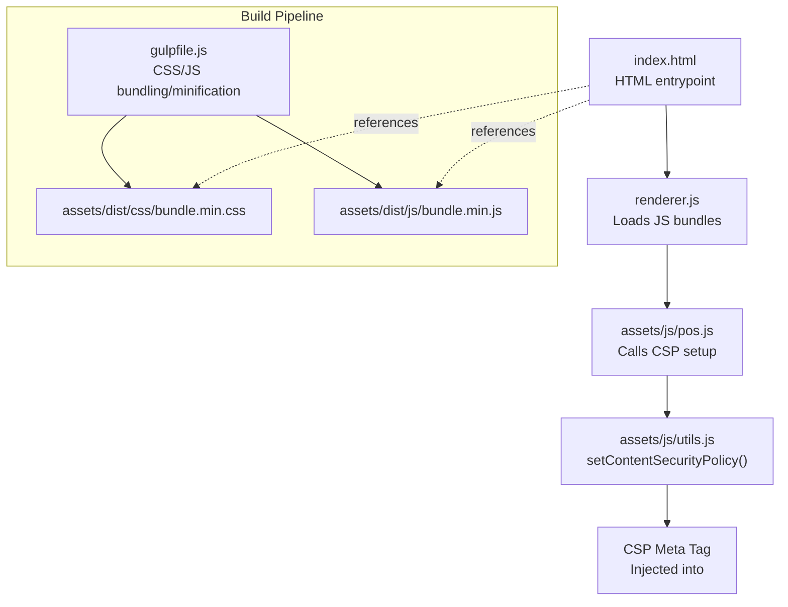
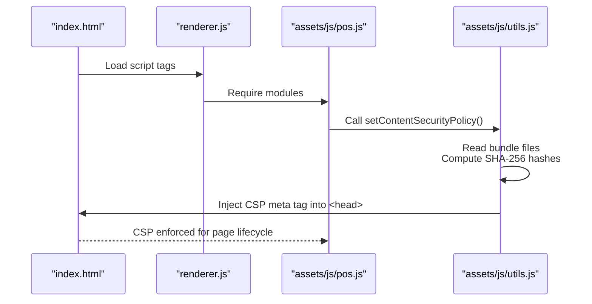
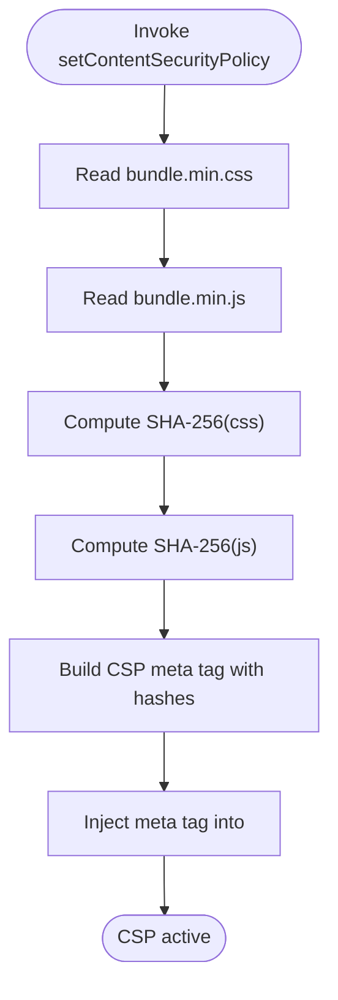
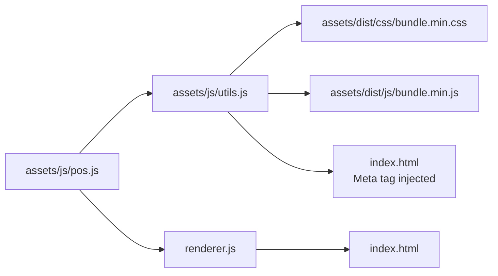

# Content Security Policy Implementation

<cite>
**Referenced Files in This Document**
- [index.html](file://index.html)
- [pos.js](file://assets/js/pos.js)
- [utils.js](file://assets/js/utils.js)
- [gulpfile.js](file://gulpfile.js)
- [package.json](file://package.json)
- [forge.config.js](file://forge.config.js)
- [build.js](file://build.js)
- [app.config.js](file://app.config.js)
</cite>

## Table of Contents
1. [Introduction](#introduction)
2. [Project Structure](#project-structure)
3. [Core Components](#core-components)
4. [Architecture Overview](#architecture-overview)
5. [Detailed Component Analysis](#detailed-component-analysis)
6. [Dependency Analysis](#dependency-analysis)
7. [Performance Considerations](#performance-considerations)
8. [Troubleshooting Guide](#troubleshooting-guide)
9. [Conclusion](#conclusion)

## Introduction
This document explains the Content Security Policy (CSP) implementation for PharmaSpot POS. It covers how CSP is configured, how dynamic policy generation works using file hash calculation for bundled assets, and how the build pipeline integrates with CSP. It also documents directive coverage, development versus production differences, and browser compatibility considerations.

## Project Structure
PharmaSpot POS is an Electron-based desktop application. CSP is enforced in the renderer process via a dedicated utility that calculates hashes of bundled assets and injects a CSP meta tag into the HTML head. Build tasks concatenate and minify CSS/JS assets, enabling deterministic hashing for CSP.

**Diagram sources**
- [index.html](file://index.html)
- [renderer.js](file://renderer.js)
- [pos.js](file://assets/js/pos.js)
- [utils.js](file://assets/js/utils.js)
- [gulpfile.js](file://gulpfile.js)

**Section sources**
- [index.html](file://index.html)
- [renderer.js](file://renderer.js)
- [gulpfile.js](file://gulpfile.js)

## Core Components
- CSP setup invocation: The renderer initializes CSP by calling a utility function during startup.
- CSP utility: Calculates SHA-256 hashes for bundled CSS and JS and generates a CSP meta tag with strict directives.
- Build pipeline: Concatenates and minifies CSS/JS assets to produce deterministic bundle filenames consumed by CSP.

Key implementation references:
- CSP setup call site: [pos.js:93–97:93-97](file://assets/js/pos.js#L93-L97)
- CSP meta tag generation: [utils.js:93](file://assets/js/utils.js#L93)
- Bundle references in HTML: [index.html:7](file://index.html#L7), [index.html:881](file://index.html#L881)
- Build tasks: [gulpfile.js:51–66:51-66](file://gulpfile.js#L51-L66)

**Section sources**
- [pos.js](file://assets/js/pos.js)
- [utils.js](file://assets/js/utils.js)
- [index.html](file://index.html)
- [gulpfile.js](file://gulpfile.js)

## Architecture Overview
The CSP architecture integrates with the renderer lifecycle and the build pipeline. On startup, the renderer requests CSP configuration from a utility module. The utility reads the built CSS/JS bundles, computes their SHA-256 hashes, and injects a CSP meta tag into the page head. The build pipeline ensures the bundle filenames remain stable so hashes remain consistent across builds.

**Diagram sources**
- [index.html](file://index.html)
- [renderer.js](file://renderer.js)
- [pos.js](file://assets/js/pos.js)
- [utils.js](file://assets/js/utils.js)

## Detailed Component Analysis

### CSP Utility and Hash Calculation
The CSP utility performs the following:
- Reads the minified CSS and JS bundles produced by the build pipeline.
- Computes SHA-256 digests of the bundle contents.
- Constructs a CSP meta tag with:
  - default-src 'self'
  - img-src 'self' data:
  - script-src 'self' 'unsafe-eval' 'unsafe-inline' sha256-<css-hash> sha256-<js-hash>
  - style-src 'self' 'unsafe-inline' sha256-<css-hash>
  - font-src 'self'
  - base-uri 'self'
  - form-action 'self'
  - connect-src 'self' http://localhost:<port>
- Injects the meta tag into the document head.

**Diagram sources**
- [utils.js](file://assets/js/utils.js)
- [gulpfile.js](file://gulpfile.js)
- [index.html](file://index.html)

**Section sources**
- [utils.js](file://assets/js/utils.js)
- [gulpfile.js](file://gulpfile.js)
- [index.html](file://index.html)

### Dynamic CSP Generation and Asset Hashing
- Deterministic bundles: The build pipeline concatenates and minifies CSS/JS into fixed filenames, ensuring stable content for hashing.
- Hash calculation: The utility reads the exact bytes of the built files and computes SHA-256 digests used in CSP directives.
- Meta tag injection: The CSP meta tag is inserted early in the page lifecycle to protect all subsequent resource loads.

References:
- CSP meta tag construction: [utils.js:93](file://assets/js/utils.js#L93)
- Bundle references in HTML: [index.html:7](file://index.html#L7), [index.html:881](file://index.html#L881)
- Build tasks: [gulpfile.js:51–66:51-66](file://gulpfile.js#L51-L66)

**Section sources**
- [utils.js](file://assets/js/utils.js)
- [index.html](file://index.html)
- [gulpfile.js](file://gulpfile.js)

### Policy Directives and Coverage
The generated CSP meta tag enforces:
- default-src 'self': Restricts default resource loading to same-origin.
- img-src 'self' data: Allows images from same-origin and data URLs.
- script-src 'self' 'unsafe-eval' 'unsafe-inline' sha256-<css-hash> sha256-<js-hash>: Loads scripts from same-origin, allows eval and inline for legacy libraries, and whitelists specific hashed bundles.
- style-src 'self' 'unsafe-inline' sha256-<css-hash>: Loads styles from same-origin, allows inline for legacy libraries, and whitelists the hashed stylesheet.
- font-src 'self': Loads fonts from same-origin.
- base-uri 'self': Restricts base URI changes.
- form-action 'self': Restricts form actions to same-origin.
- connect-src 'self' http://localhost:<port>: Restricts network requests to same-origin plus local API endpoint.

Notes:
- 'unsafe-eval' and 'unsafe-inline' are used to support legacy libraries loaded via CDN and inline event handlers. These should be reviewed for hardening in future iterations.
- The connect-src directive restricts API communication to localhost, aligning with the Electron app’s embedded server pattern.

**Section sources**
- [utils.js](file://assets/js/utils.js)

### Integration Between CSP and Build Process
- Build artifacts: The build pipeline produces assets at assets/dist/css/bundle.min.css and assets/dist/js/bundle.min.js.
- CSP consumption: The CSP utility reads these exact files to compute hashes.
- Versioning: The build pipeline does not append content hashes to filenames; therefore, the CSP meta tag relies on the stable bundle content itself.

References:
- CSS/JS build tasks: [gulpfile.js:51–66:51-66](file://gulpfile.js#L51-L66)
- HTML references to bundles: [index.html:7](file://index.html#L7), [index.html:881](file://index.html#L881)

**Section sources**
- [gulpfile.js](file://gulpfile.js)
- [index.html](file://index.html)

### Development vs Production Configurations
- Development mode: Browser Sync and watch tasks enable rapid iteration. CSP remains active and uses the same hashing mechanism against the current build artifacts.
- Production mode: Electron packaging and distribution rely on the packaged app’s resources. CSP continues to use the same hashing approach against the final bundled assets.

References:
- Watch and sync tasks: [gulpfile.js:68–79:68-79](file://gulpfile.js#L68-L79)
- Packaging configuration: [forge.config.js](file://forge.config.js), [build.js](file://build.js)

**Section sources**
- [gulpfile.js](file://gulpfile.js)
- [forge.config.js](file://forge.config.js)
- [build.js](file://build.js)

### Browser Compatibility Considerations
- Electron runtime: CSP is enforced by Chromium, which supports modern CSP features. The policy leverages SHA-256 hashes for strict allowlisting.
- Inline scripts and eval: The policy includes 'unsafe-inline' and 'unsafe-eval' to accommodate legacy libraries. Future hardening should aim to eliminate these where possible.
- Data URLs: Images are permitted via data: to support runtime-generated images.

**Section sources**
- [utils.js](file://assets/js/utils.js)

## Dependency Analysis
CSP depends on:
- Renderer initialization: The CSP setup is invoked during application startup.
- Build artifacts: The CSP utility depends on the presence of assets/dist/css/bundle.min.css and assets/dist/js/bundle.min.js.
- Port configuration: The connect-src directive references http://localhost:<port>, where port is derived from environment variables.

**Diagram sources**
- [pos.js](file://assets/js/pos.js)
- [utils.js](file://assets/js/utils.js)
- [index.html](file://index.html)
- [renderer.js](file://renderer.js)

**Section sources**
- [pos.js](file://assets/js/pos.js)
- [utils.js](file://assets/js/utils.js)
- [index.html](file://index.html)
- [renderer.js](file://renderer.js)

## Performance Considerations
- Hash computation cost: Computing SHA-256 on large bundles occurs once per app launch. This is negligible compared to page load time.
- Minified assets: Using minified CSS/JS reduces payload size and speeds up hashing and loading.
- CSP enforcement overhead: Once injected, CSP adds minimal runtime overhead.

## Troubleshooting Guide
Common issues and resolutions:
- CSP violations in console: Confirm that assets/dist/css/bundle.min.css and assets/dist/js/bundle.min.js exist and match the CSP meta tag hashes. Rebuild bundles if hashes drift.
- Inline scripts blocked: The policy intentionally allows 'unsafe-inline' for legacy libraries. If third-party inline scripts are added, include their hashes or refactor to external scripts.
- Network errors: Verify connect-src allows http://localhost:<port> and that the port variable resolves correctly at runtime.
- Meta tag missing: Ensure setContentSecurityPolicy() runs before any heavy DOM manipulation and that the meta tag is injected into the head element.

References:
- CSP meta tag generation: [utils.js:93](file://assets/js/utils.js#L93)
- CSP call site: [pos.js:93–97:93-97](file://assets/js/pos.js#L93-L97)
- Bundle references: [index.html:7](file://index.html#L7), [index.html:881](file://index.html#L881)

**Section sources**
- [utils.js](file://assets/js/utils.js)
- [pos.js](file://assets/js/pos.js)
- [index.html](file://index.html)

## Conclusion
PharmaSpot POS implements CSP by dynamically computing SHA-256 hashes of bundled CSS and JS assets and injecting a restrictive CSP meta tag at runtime. The build pipeline produces deterministic bundles that enable reliable hashing. While the current policy includes 'unsafe-inline' and 'unsafe-eval' for compatibility, future enhancements should aim to remove these allowances and further harden the policy for improved security posture.