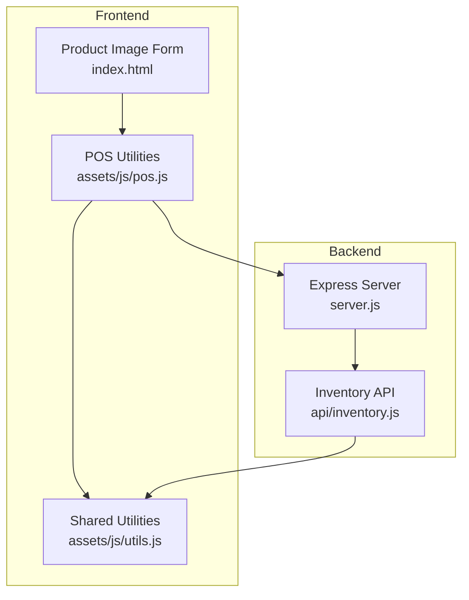
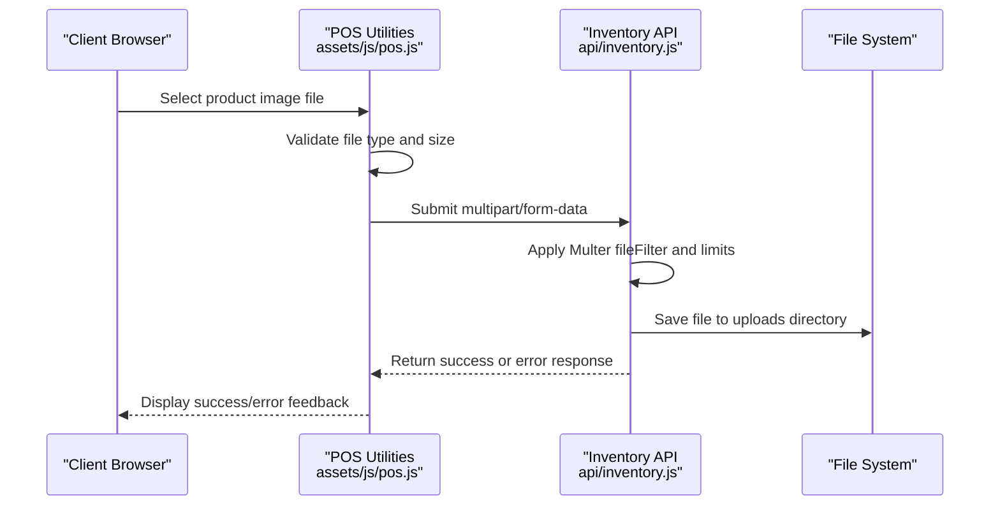
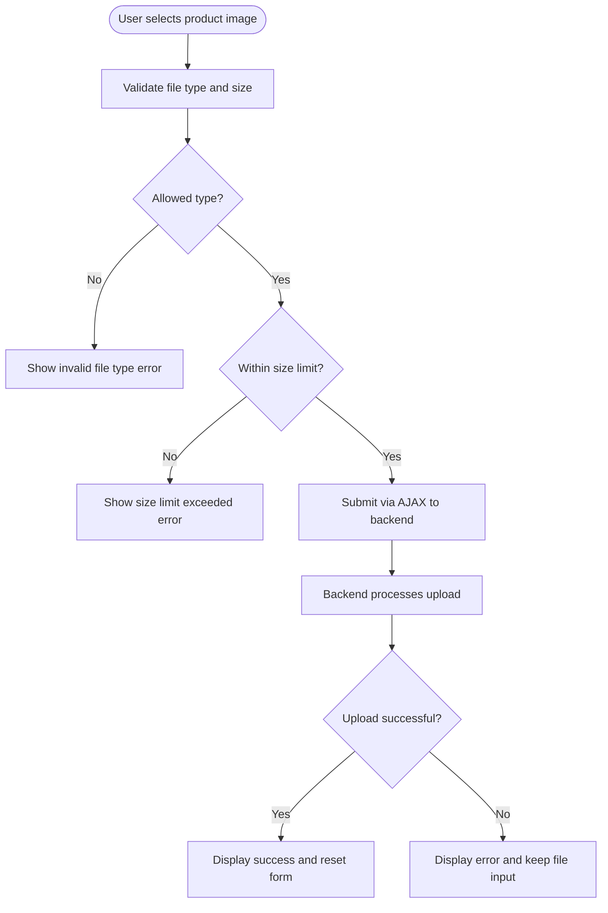
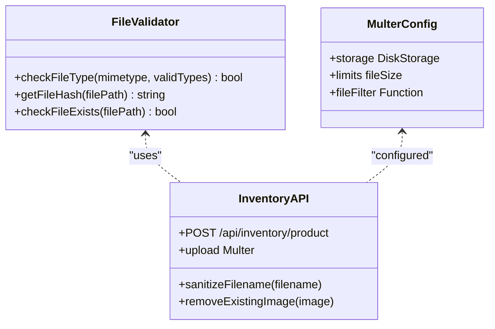
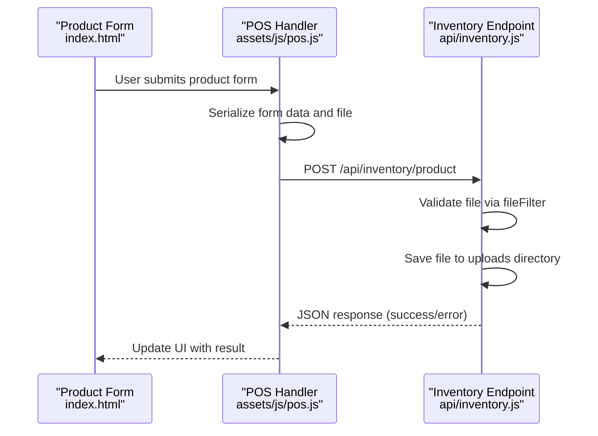
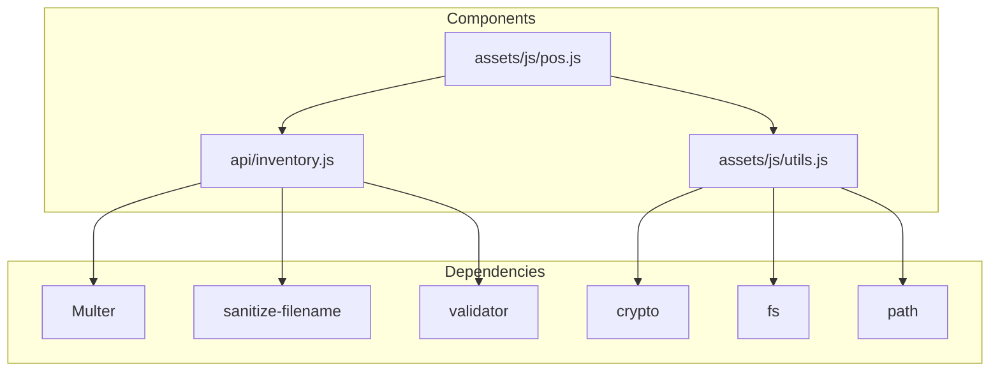

# File Upload and Storage Security

<cite>
**Referenced Files in This Document**
- [index.html](file://index.html)
- [server.js](file://server.js)
- [api/inventory.js](file://api/inventory.js)
- [assets/js/utils.js](file://assets/js/utils.js)
- [assets/js/pos.js](file://assets/js/pos.js)
- [assets/js/product-filter.js](file://assets/js/product-filter.js)
- [assets/js/checkout.js](file://assets/js/checkout.js)
- [package.json](file://package.json)
</cite>

## Table of Contents
1. [Introduction](#introduction)
2. [Project Structure](#project-structure)
3. [Core Components](#core-components)
4. [Architecture Overview](#architecture-overview)
5. [Detailed Component Analysis](#detailed-component-analysis)
6. [Dependency Analysis](#dependency-analysis)
7. [Performance Considerations](#performance-considerations)
8. [Troubleshooting Guide](#troubleshooting-guide)
9. [Conclusion](#conclusion)

## Introduction
This document provides comprehensive file upload and storage security documentation for PharmaSpot POS. It covers the complete file upload validation system, including MIME type checking, file size limits, supported image formats, filtering mechanisms, hash-based file integrity verification, and secure storage practices. It also details the product image upload workflow, file naming conventions, directory structure security, and the integration between frontend file selection and backend validation, including error handling and security restrictions. Finally, it addresses potential security risks in file uploads, mitigation strategies, and best practices for secure file handling in desktop applications.

## Project Structure
PharmaSpot POS is a desktop application built with Electron and Express. The file upload and storage security implementation spans three primary areas:
- Frontend: Product image selection and submission via HTML forms and jQuery AJAX.
- Backend: Express server with Multer for file handling and validation.
- Shared utilities: Cross-platform file validation and security helpers.

**Diagram sources**
- [index.html:510-556](file://index.html#L510-L556)
- [assets/js/pos.js:1361-1403](file://assets/js/pos.js#L1361-L1403)
- [assets/js/utils.js:1-112](file://assets/js/utils.js#L1-L112)
- [server.js:1-68](file://server.js#L1-L68)
- [api/inventory.js:1-333](file://api/inventory.js#L1-L333)

**Section sources**
- [index.html:510-556](file://index.html#L510-L556)
- [assets/js/pos.js:1361-1403](file://assets/js/pos.js#L1361-L1403)
- [server.js:1-68](file://server.js#L1-L68)
- [api/inventory.js:1-333](file://api/inventory.js#L1-L333)

## Core Components
This section outlines the core components responsible for secure file upload and storage in PharmaSpot POS.

- Frontend Product Image Form
  - Provides a file input for selecting product images.
  - Submits via AJAX to the backend inventory API endpoint.
  - Supports removing existing images during updates.

- Backend Inventory API
  - Validates file types and enforces size limits.
  - Stores uploaded files to a dedicated directory under the application data path.
  - Sanitizes filenames and handles removal of existing images.

- Shared Utilities
  - Implements MIME type validation against allowed formats.
  - Provides file existence checks and SHA-256 hashing for integrity verification.
  - Sets Content Security Policy to mitigate XSS risks.

**Section sources**
- [index.html:510-556](file://index.html#L510-L556)
- [api/inventory.js:10-40](file://api/inventory.js#L10-L40)
- [assets/js/utils.js:55-111](file://assets/js/utils.js#L55-L111)

## Architecture Overview
The file upload and storage security architecture integrates frontend and backend components to enforce validation, sanitization, and secure storage.

**Diagram sources**
- [assets/js/pos.js:1361-1403](file://assets/js/pos.js#L1361-L1403)
- [api/inventory.js:124-240](file://api/inventory.js#L124-L240)
- [assets/js/utils.js:76-87](file://assets/js/utils.js#L76-L87)

## Detailed Component Analysis

### Frontend Product Image Upload Workflow
The frontend handles product image selection and submission through a modal form. The workflow ensures proper validation and user feedback.

**Diagram sources**
- [index.html:510-556](file://index.html#L510-L556)
- [assets/js/pos.js:1361-1403](file://assets/js/pos.js#L1361-L1403)

**Section sources**
- [index.html:510-556](file://index.html#L510-L556)
- [assets/js/pos.js:1361-1403](file://assets/js/pos.js#L1361-L1403)

### Backend File Validation and Storage
The backend enforces strict validation and secure storage practices for uploaded files.

**Diagram sources**
- [assets/js/utils.js:65-87](file://assets/js/utils.js#L65-L87)
- [api/inventory.js:10-40](file://api/inventory.js#L10-L40)
- [api/inventory.js:124-240](file://api/inventory.js#L124-L240)

**Section sources**
- [assets/js/utils.js:65-87](file://assets/js/utils.js#L65-L87)
- [api/inventory.js:10-40](file://api/inventory.js#L10-L40)
- [api/inventory.js:124-240](file://api/inventory.js#L124-L240)

### Supported Image Formats and MIME Types
The system supports the following image formats with their corresponding MIME types:
- JPEG: image/jpeg
- PNG: image/png
- WEBP: image/webp

Note: GIF support is present in the frontend validation but not included in the backend allowed types array.

**Section sources**
- [assets/js/utils.js:11-15](file://assets/js/utils.js#L11-L15)
- [api/inventory.js:11-15](file://api/inventory.js#L11-L15)

### File Size Limits
The backend enforces a maximum file size of 2 MB for uploaded images.

**Section sources**
- [api/inventory.js:16](file://api/inventory.js#L16)

### File Naming Conventions and Directory Structure
Uploaded files are stored in a directory under the application data path with a timestamp-based filename to prevent collisions and maintain uniqueness.

- Destination: `{APPDATA}/{APPNAME}/uploads/`
- Filename pattern: `{timestamp}{originalExtension}`

This approach prevents predictable filenames and reduces the risk of path traversal attacks.

**Section sources**
- [api/inventory.js:28-33](file://api/inventory.js#L28-L33)

### Hash-Based File Integrity Verification
The system implements SHA-256 hashing for integrity verification and CSP generation:
- getFileHash reads file contents and computes a SHA-256 hash.
- setContentSecurityPolicy generates CSP hashes for bundled scripts and styles.

**Section sources**
- [assets/js/utils.js:69-99](file://assets/js/utils.js#L69-L99)

### Secure File Storage Practices
Several security measures protect uploaded files:
- File type validation using MIME types.
- Size limit enforcement.
- Sanitized filenames using sanitize-filename.
- Application data path isolation.
- Existence checks before serving files.

**Section sources**
- [assets/js/utils.js:65-67](file://assets/js/utils.js#L65-L67)
- [api/inventory.js:143-151](file://api/inventory.js#L143-L151)
- [assets/js/pos.js:316-324](file://assets/js/pos.js#L316-L324)

### Integration Between Frontend and Backend
The frontend and backend integrate through AJAX submission and standardized error handling.

**Diagram sources**
- [index.html:510-556](file://index.html#L510-L556)
- [assets/js/pos.js:1361-1403](file://assets/js/pos.js#L1361-L1403)
- [api/inventory.js:124-240](file://api/inventory.js#L124-L240)

**Section sources**
- [index.html:510-556](file://index.html#L510-L556)
- [assets/js/pos.js:1361-1403](file://assets/js/pos.js#L1361-L1403)
- [api/inventory.js:124-240](file://api/inventory.js#L124-L240)

## Dependency Analysis
The file upload and storage security implementation relies on several key dependencies and their interactions.

**Diagram sources**
- [assets/js/utils.js:1-6](file://assets/js/utils.js#L1-L6)
- [api/inventory.js:6-17](file://api/inventory.js#L6-L17)
- [assets/js/pos.js:94](file://assets/js/pos.js#L94)

**Section sources**
- [assets/js/utils.js:1-6](file://assets/js/utils.js#L1-L6)
- [api/inventory.js:6-17](file://api/inventory.js#L6-L17)
- [assets/js/pos.js:94](file://assets/js/pos.js#L94)

## Performance Considerations
- File size limits reduce memory usage and storage overhead.
- SHA-256 hashing is performed only when necessary (CSP generation and integrity checks).
- Existence checks prevent unnecessary filesystem operations.
- Timestamp-based filenames minimize collision risks without additional metadata.

## Troubleshooting Guide
Common issues and their resolutions:

- Invalid file type errors
  - Cause: Unsupported MIME type or missing extension.
  - Resolution: Ensure files are JPEG, PNG, or WEBP format.

- File too large errors
  - Cause: Exceeds 2 MB limit.
  - Resolution: Compress images or resize before upload.

- File not found errors
  - Cause: Corrupted or deleted uploads directory.
  - Resolution: Verify directory exists and has write permissions.

- CSP violations
  - Cause: Modified bundle files without updating hashes.
  - Resolution: Recompile bundles and regenerate CSP hashes.

**Section sources**
- [assets/js/utils.js:76-87](file://assets/js/utils.js#L76-L87)
- [api/inventory.js:127-141](file://api/inventory.js#L127-L141)
- [assets/js/utils.js:91-99](file://assets/js/utils.js#L91-L99)

## Conclusion
PharmaSpot POS implements a robust file upload and storage security system that combines frontend validation, backend enforcement, and secure storage practices. The system validates file types and sizes, sanitizes filenames, stores files in isolated directories, and provides integrity verification through hashing. By following the documented workflows and best practices, the application maintains security while supporting essential product image management functionality.