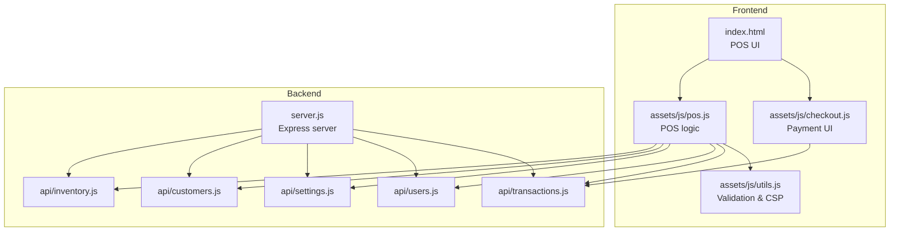
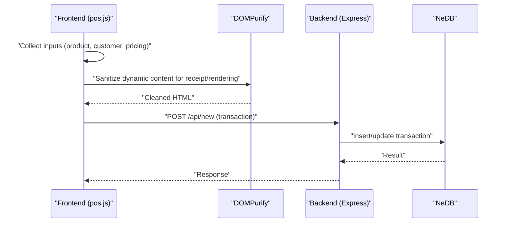
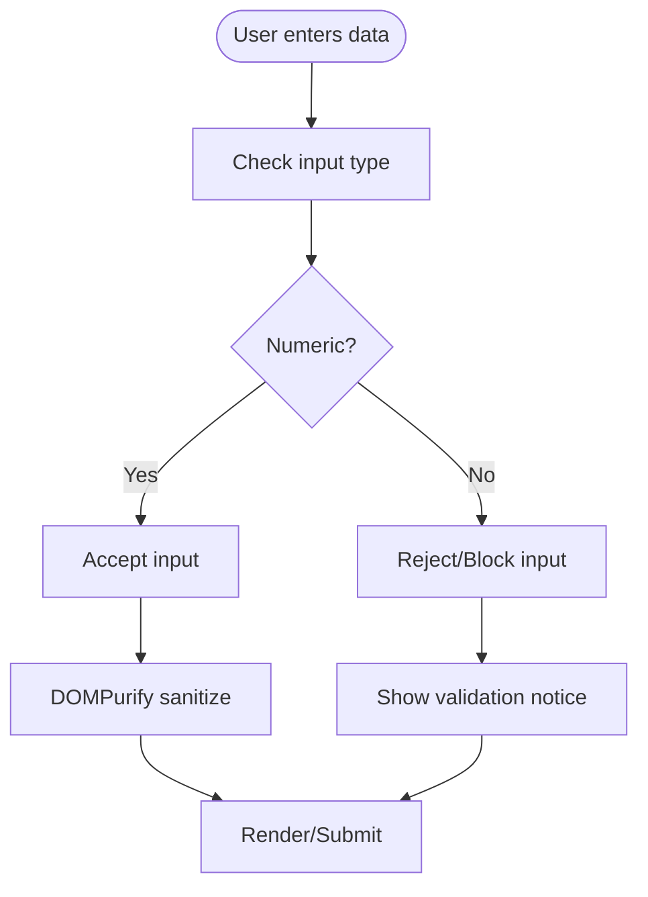
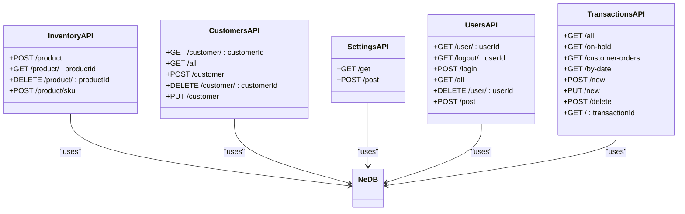
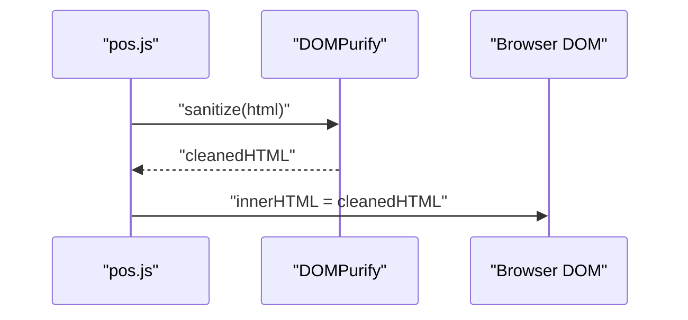
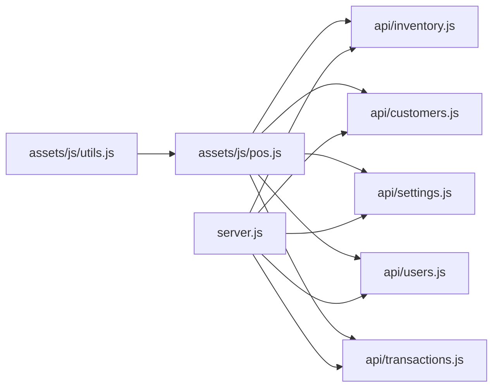

# Input Validation and Sanitization

<cite>
**Referenced Files in This Document**
- [index.html](file://index.html)
- [server.js](file://server.js)
- [utils.js](file://assets/js/utils.js)
- [pos.js](file://assets/js/pos.js)
- [checkout.js](file://assets/js/checkout.js)
- [inventory.js](file://api/inventory.js)
- [customers.js](file://api/customers.js)
- [settings.js](file://api/settings.js)
- [users.js](file://api/users.js)
- [transactions.js](file://api/transactions.js)
- [utils.test.js](file://tests/utils.test.js)
</cite>

## Table of Contents
1. [Introduction](#introduction)
2. [Project Structure](#project-structure)
3. [Core Components](#core-components)
4. [Architecture Overview](#architecture-overview)
5. [Detailed Component Analysis](#detailed-component-analysis)
6. [Dependency Analysis](#dependency-analysis)
7. [Performance Considerations](#performance-considerations)
8. [Troubleshooting Guide](#troubleshooting-guide)
9. [Conclusion](#conclusion)

## Introduction
This document describes the input validation and sanitization mechanisms implemented in PharmaSpot POS. It covers backend validation strategies, frontend input handling, and the integration of DOMPurify to prevent cross-site scripting (XSS) during rendering. It also documents validation rules for product names, customer information, pricing, quantities, and monetary values, along with examples of validated API endpoints and frontend input handling.

## Project Structure
PharmaSpot POS is an Electron-based desktop application with a web-like frontend and a Node.js/Express backend. Validation and sanitization are implemented across:
- Frontend JavaScript modules for input handling and rendering
- Backend API endpoints for data persistence and retrieval
- Utility modules for shared validation and sanitization helpers
- Tests validating core utility functions

**Diagram sources**
- [index.html](file://index.html)
- [server.js](file://server.js)
- [utils.js](file://assets/js/utils.js)
- [pos.js](file://assets/js/pos.js)
- [checkout.js](file://assets/js/checkout.js)
- [inventory.js](file://api/inventory.js)
- [customers.js](file://api/customers.js)
- [settings.js](file://api/settings.js)
- [users.js](file://api/users.js)
- [transactions.js](file://api/transactions.js)

**Section sources**
- [index.html](file://index.html)
- [server.js](file://server.js)

## Core Components
- Frontend input handling and sanitization:
  - Numeric-only input enforcement for quantity and payment fields
  - DOMPurify-based sanitization for dynamic HTML generation
  - Frontend checks for numeric-only inputs and basic UI validations
- Backend validation and sanitization:
  - Body parsing and rate limiting middleware
  - Datastore-backed CRUD endpoints with escaping and sanitization
  - File upload filtering and image handling
  - Monetary value processing and tax calculations
- Utilities:
  - Content Security Policy (CSP) injection via SHA hashes
  - Money formatting and stock/expiry status helpers

**Section sources**
- [utils.js](file://assets/js/utils.js)
- [pos.js](file://assets/js/pos.js)
- [checkout.js](file://assets/js/checkout.js)
- [inventory.js](file://api/inventory.js)
- [customers.js](file://api/customers.js)
- [settings.js](file://api/settings.js)
- [users.js](file://api/users.js)
- [transactions.js](file://api/transactions.js)

## Architecture Overview
The validation and sanitization pipeline spans the frontend and backend:

**Diagram sources**
- [pos.js](file://assets/js/pos.js)
- [transactions.js](file://api/transactions.js)

## Detailed Component Analysis

### Frontend Input Validation and Sanitization
- Numeric-only enforcement:
  - Restricts input fields to numeric characters for quantities and payments, preventing invalid characters from entering the cart or payment amounts.
- DOMPurify integration:
  - Used to sanitize product names, quantities, prices, and receipt HTML before insertion into the DOM to mitigate XSS risks.
- Receipt generation:
  - Receipt HTML is sanitized before being displayed or printed, ensuring safe rendering of dynamic content.

**Diagram sources**
- [pos.js](file://assets/js/pos.js)

**Section sources**
- [pos.js](file://assets/js/pos.js)
- [checkout.js](file://assets/js/checkout.js)

### Backend Validation and Sanitization
- Middleware:
  - Body parser for JSON and URL-encoded payloads
  - Rate limiting to protect against abuse
  - CORS headers for cross-origin requests
- Data sanitization:
  - Escaping of user-provided identifiers and values before datastore operations
  - File upload filtering for images with allowed MIME types and size limits
- Endpoint-specific validation:
  - Product creation/update: sanitizes product fields, generates unique IDs, handles image removal and upload
  - Customer creation/update: escapes IDs and validates presence of required fields
  - Settings update: sanitizes configuration fields and manages logo image updates/removal
  - Users login: escapes username, compares hashed passwords
  - Transactions: inserts or updates transaction records and decrements inventory quantities when applicable

**Diagram sources**
- [inventory.js](file://api/inventory.js)
- [customers.js](file://api/customers.js)
- [settings.js](file://api/settings.js)
- [users.js](file://api/users.js)
- [transactions.js](file://api/transactions.js)

**Section sources**
- [server.js](file://server.js)
- [inventory.js](file://api/inventory.js)
- [customers.js](file://api/customers.js)
- [settings.js](file://api/settings.js)
- [users.js](file://api/users.js)
- [transactions.js](file://api/transactions.js)

### DOMPurify Implementation for HTML Sanitization
- Purpose:
  - Prevent XSS by sanitizing dynamic HTML generated for receipts and cart items.
- Usage:
  - Applied to product names, quantities, prices, and receipt templates before DOM insertion.
- Safe rendering:
  - Ensures only allowed tags and attributes are retained, mitigating script injection.

**Diagram sources**
- [pos.js](file://assets/js/pos.js)

**Section sources**
- [pos.js](file://assets/js/pos.js)

### Validation Rules by Data Type
- Product name and description:
  - Sanitized via escaping before datastore insert/update.
- Product barcode:
  - Converted to integer for lookup; validated as numeric before database queries.
- Pricing and quantities:
  - Frontend restricts to numeric input; backend stores sanitized values; monetary formatting handled by utilities.
- Customer information:
  - Names, phones, emails, and addresses sanitized; phone numbers validated via frontend numeric restriction.
- Monetary values:
  - Stored as sanitized strings; formatted for display; taxes computed safely.

**Section sources**
- [inventory.js](file://api/inventory.js)
- [customers.js](file://api/customers.js)
- [pos.js](file://assets/js/pos.js)
- [utils.js](file://assets/js/utils.js)

### Examples of Validated API Endpoints
- POST /api/inventory/product
  - Validates and sanitizes product fields, handles image upload/removal, generates unique IDs.
- POST /api/customers/customer
  - Inserts or updates customer records with sanitized fields.
- POST /api/settings/post
  - Updates settings with sanitized fields and manages logo image handling.
- POST /api/users/login
  - Escapes username, compares hashed password.
- POST /api/transactions/new
  - Inserts transaction; decrements inventory when paid.

**Section sources**
- [inventory.js](file://api/inventory.js)
- [customers.js](file://api/customers.js)
- [settings.js](file://api/settings.js)
- [users.js](file://api/users.js)
- [transactions.js](file://api/transactions.js)

### Frontend Input Handling Examples
- Barcode search:
  - Submits barcode as integer after escaping; displays errors for not found or expired items.
- Payment input:
  - Keypad input restricted to numeric; decimal point handling; change calculation.
- Receipt rendering:
  - Dynamic HTML sanitized before display/print.

**Section sources**
- [pos.js](file://assets/js/pos.js)
- [checkout.js](file://assets/js/checkout.js)

## Dependency Analysis
- Frontend-to-backend dependencies:
  - pos.js depends on utils.js for CSP and formatting; interacts with inventory, customers, settings, users, and transactions APIs.
- Backend dependencies:
  - Express server registers API routes and applies middleware.
  - APIs depend on NeDB for persistence and validator/multer for sanitization and uploads.

**Diagram sources**
- [pos.js](file://assets/js/pos.js)
- [utils.js](file://assets/js/utils.js)
- [server.js](file://server.js)
- [inventory.js](file://api/inventory.js)
- [customers.js](file://api/customers.js)
- [settings.js](file://api/settings.js)
- [users.js](file://api/users.js)
- [transactions.js](file://api/transactions.js)

**Section sources**
- [pos.js](file://assets/js/pos.js)
- [utils.js](file://assets/js/utils.js)
- [server.js](file://server.js)

## Performance Considerations
- Frontend:
  - Numeric-only input reduces unnecessary reflows and prevents invalid computations.
  - DOMPurify runs on small HTML fragments; keep dynamic content minimal for optimal performance.
- Backend:
  - Rate limiting protects resources; ensure database indexes are used for frequent lookups (e.g., barcode).
  - File upload filtering prevents large or unsupported files from consuming bandwidth and disk.

## Troubleshooting Guide
- Common validation failures:
  - Numeric input blocked: Verify numeric-only fields and ensure decimal point handling is configured.
  - Product not found by barcode: Confirm barcode is stored as integer and matches input after escaping.
  - Payment amount issues: Ensure decimal point is appended correctly and thousands separators are stripped before submission.
- Sanitization issues:
  - Receipt rendering problems: Confirm DOMPurify is applied to all dynamic HTML segments.
- Backend errors:
  - Upload errors: Check file type and size limits; verify allowed MIME types and file filters.
  - Transaction insert/update failures: Validate sanitized fields and ensure required keys are present.

**Section sources**
- [pos.js](file://assets/js/pos.js)
- [checkout.js](file://assets/js/checkout.js)
- [inventory.js](file://api/inventory.js)
- [transactions.js](file://api/transactions.js)

## Conclusion
PharmaSpot POS employs a layered validation and sanitization strategy:
- Frontend enforces numeric-only inputs and sanitizes dynamic HTML with DOMPurify.
- Backend sanitizes and escapes inputs, validates uploads, and persists data securely.
- Utilities provide CSP and formatting helpers to support safe rendering and consistent display.
These measures collectively reduce XSS risks and improve data integrity across product, customer, and transaction workflows.