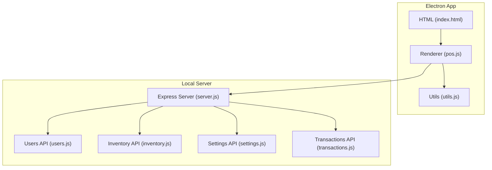
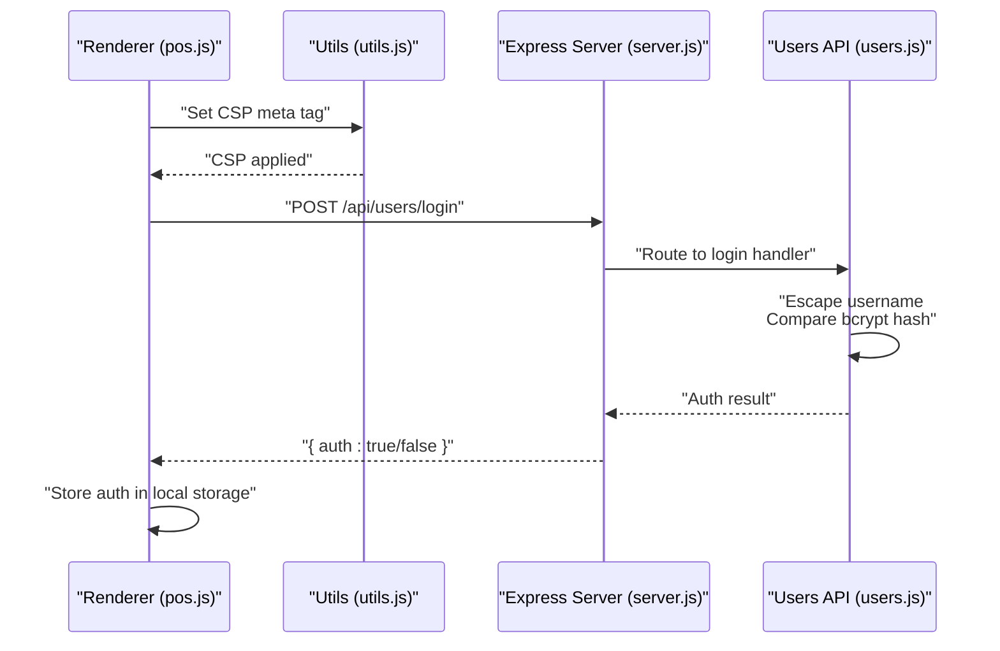
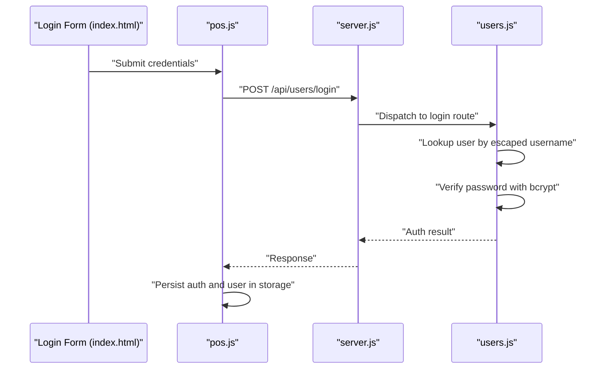
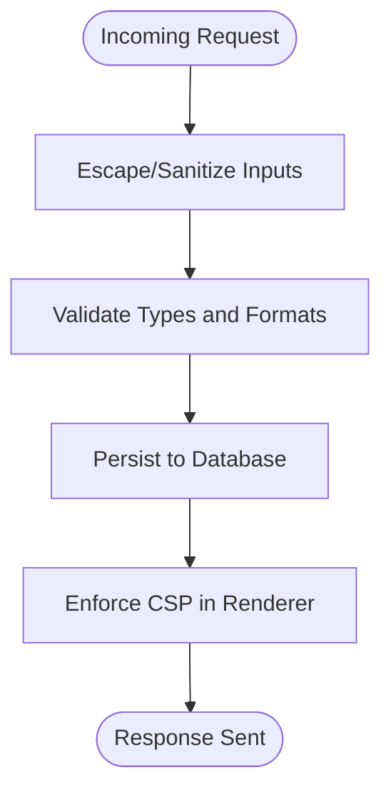
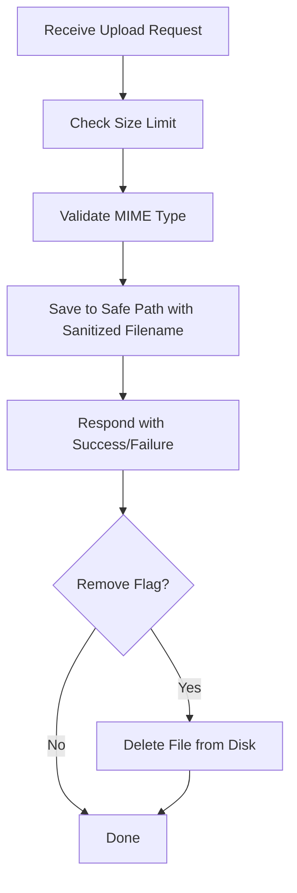
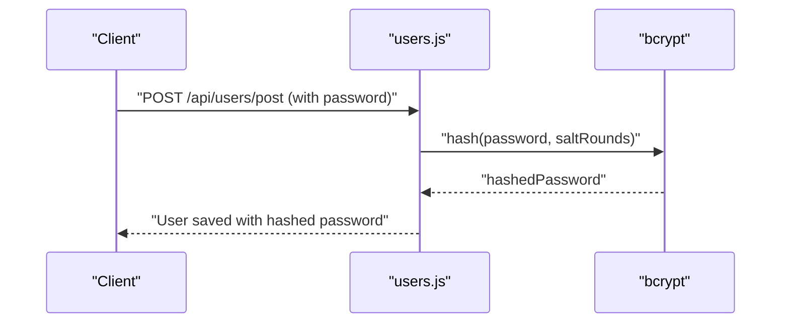
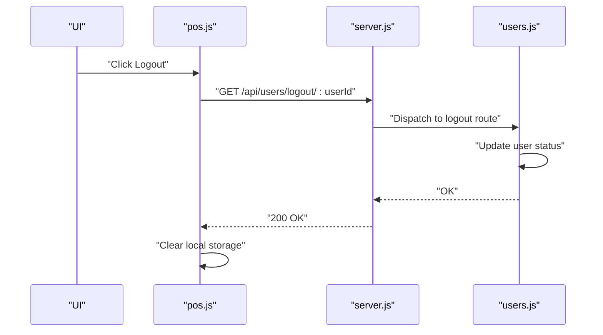
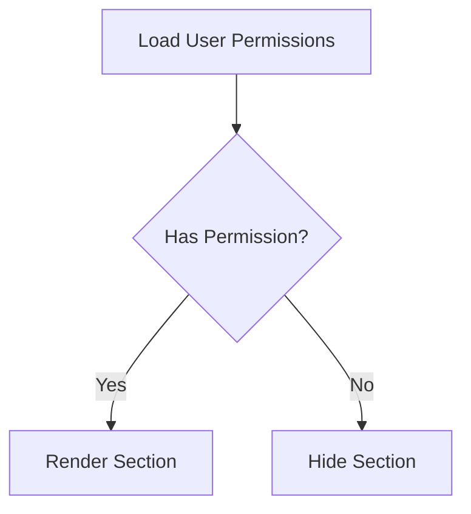
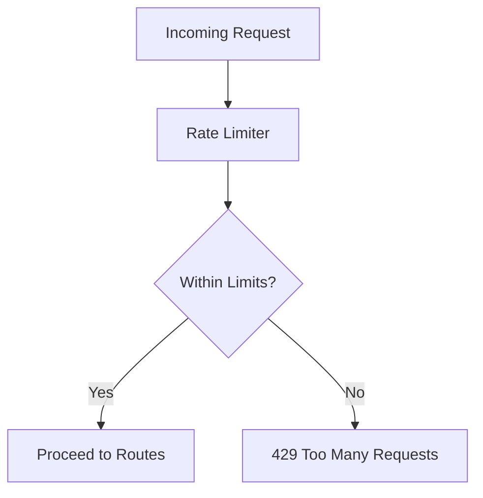
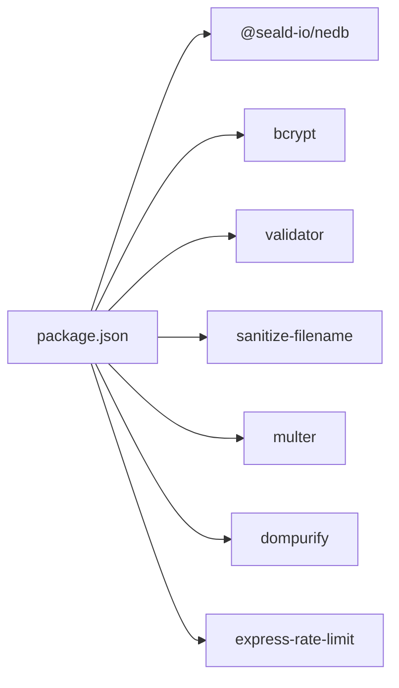

# Security Implementation

<cite>
**Referenced Files in This Document**
- [server.js](file://server.js)
- [users.js](file://api/users.js)
- [settings.js](file://api/settings.js)
- [inventory.js](file://api/inventory.js)
- [transactions.js](file://api/transactions.js)
- [utils.js](file://assets/js/utils.js)
- [pos.js](file://assets/js/pos.js)
- [index.html](file://index.html)
- [package.json](file://package.json)
- [app.config.js](file://app.config.js)
</cite>

## Table of Contents
1. [Introduction](#introduction)
2. [Project Structure](#project-structure)
3. [Core Components](#core-components)
4. [Architecture Overview](#architecture-overview)
5. [Detailed Component Analysis](#detailed-component-analysis)
6. [Dependency Analysis](#dependency-analysis)
7. [Performance Considerations](#performance-considerations)
8. [Troubleshooting Guide](#troubleshooting-guide)
9. [Conclusion](#conclusion)
10. [Appendices](#appendices)

## Introduction
This document provides comprehensive security documentation for PharmaSpot POS. It covers authentication and authorization, input validation and sanitization, Content Security Policy (CSP), file upload and image handling, password hashing, session management, secure credential storage, and protections against common vulnerabilities such as XSS and injection attacks. It also includes best practices for desktop applications, network security considerations, and operational guidance for secure deployment and maintenance.

## Project Structure
PharmaSpot POS is an Electron-based desktop application with a local Express server exposing REST APIs. The frontend is a browser-like renderer that communicates with the local server via HTTP. Security controls are implemented at the server, API, and client layers.

**Diagram sources**
- [server.js:1-68](file://server.js#L1-L68)
- [users.js:1-311](file://api/users.js#L1-L311)
- [inventory.js:1-333](file://api/inventory.js#L1-L333)
- [settings.js:1-192](file://api/settings.js#L1-L192)
- [transactions.js:1-251](file://api/transactions.js#L1-L251)
- [utils.js:1-112](file://assets/js/utils.js#L1-L112)
- [pos.js:1-2538](file://assets/js/pos.js#L1-L2538)
- [index.html:1-884](file://index.html#L1-L884)

**Section sources**
- [server.js:1-68](file://server.js#L1-L68)
- [users.js:1-311](file://api/users.js#L1-L311)
- [inventory.js:1-333](file://api/inventory.js#L1-L333)
- [settings.js:1-192](file://api/settings.js#L1-L192)
- [transactions.js:1-251](file://api/transactions.js#L1-L251)
- [utils.js:1-112](file://assets/js/utils.js#L1-L112)
- [pos.js:1-2538](file://assets/js/pos.js#L1-L2538)
- [index.html:1-884](file://index.html#L1-L884)

## Core Components
- Authentication and Authorization
  - Local user database with bcrypt password hashing and permission flags.
  - Login flow stores lightweight session state in local storage and updates user status on successful login.
- Input Validation and Sanitization
  - Server-side escaping and sanitization for user-provided data.
  - Client-side CSP enforcement and DOMPurify usage for rendering.
- Content Security Policy
  - Dynamic CSP generation using SHA-256 hashes of bundled assets.
- File Upload Security
  - Multer-based upload with strict MIME type filtering and filename sanitization.
- Session Management
  - Minimal session state stored locally; no server-side sessions.
- Secure Credential Storage
  - Passwords hashed with bcrypt; sensitive data sanitized before persistence.

**Section sources**
- [users.js:5-131](file://api/users.js#L5-L131)
- [utils.js:91-99](file://assets/js/utils.js#L91-L99)
- [inventory.js:10-39](file://api/inventory.js#L10-L39)
- [settings.js:28-39](file://api/settings.js#L28-L39)
- [pos.js:185-2514](file://assets/js/pos.js#L185-L2514)

## Architecture Overview
The security architecture integrates client-side CSP, server-side input sanitization, and backend APIs secured by rate limiting and CORS headers.

**Diagram sources**
- [utils.js:91-99](file://assets/js/utils.js#L91-L99)
- [server.js:11-34](file://server.js#L11-L34)
- [users.js:95-131](file://api/users.js#L95-L131)
- [pos.js:2485-2514](file://assets/js/pos.js#L2485-L2514)

## Detailed Component Analysis

### Authentication and Authorization
- Password Hashing
  - bcrypt is used to hash passwords before storage. Salt rounds are configured for balanced security/performance.
- Permission Model
  - Users have granular permissions (e.g., manage products, categories, transactions, users, settings). The client hides UI sections based on permission flags.
- Login Flow
  - Client sends credentials to the server. On success, the server updates user status and returns an authenticated payload. The client persists minimal session state locally.
- Logout Flow
  - Client triggers a logout endpoint that updates user status, then clears local storage.

**Diagram sources**
- [index.html:19-27](file://index.html#L19-L27)
- [pos.js:2485-2514](file://assets/js/pos.js#L2485-L2514)
- [server.js:40-45](file://server.js#L40-L45)
- [users.js:95-131](file://api/users.js#L95-L131)

**Section sources**
- [users.js:5-131](file://api/users.js#L5-L131)
- [pos.js:2485-2514](file://assets/js/pos.js#L2485-L2514)
- [index.html:19-27](file://index.html#L19-L27)

### Input Validation, Sanitization, and CSP
- Server-side Escaping and Validation
  - The validator library is used to escape user inputs before database queries and updates.
- CSP Enforcement
  - The CSP is dynamically computed using SHA-256 hashes of the bundled JS/CSS and injected as a meta tag. This mitigates XSS risks from inline scripts and enforces trusted sources.
- Client-side DOMPurify
  - DOMPurify is imported in the renderer to sanitize HTML before insertion.

**Diagram sources**
- [utils.js:91-99](file://assets/js/utils.js#L91-L99)
- [users.js:96-98](file://api/users.js#L96-L98)
- [pos.js:7](file://assets/js/pos.js#L7)

**Section sources**
- [users.js:96-98](file://api/users.js#L96-L98)
- [utils.js:91-99](file://assets/js/utils.js#L91-L99)
- [pos.js:7](file://assets/js/pos.js#L7)

### File Upload Security, Image Handling, and Storage Protection
- Upload Handling
  - Multer is configured with a file size limit and a custom MIME-type filter to restrict uploads to allowed image types.
- Filename Sanitization
  - sanitize-filename ensures safe filenames are used for persisted files.
- Removal Logic
  - When requested, images are removed from disk after validating the intended file path.
- Storage Location
  - Uploads are stored under the application data directory, scoped to the app name and app data path.

**Diagram sources**
- [inventory.js:28-39](file://api/inventory.js#L28-L39)
- [settings.js:28-39](file://api/settings.js#L28-L39)
- [utils.js:76-87](file://assets/js/utils.js#L76-L87)

**Section sources**
- [inventory.js:10-39](file://api/inventory.js#L10-L39)
- [settings.js:12-39](file://api/settings.js#L12-L39)
- [utils.js:55-87](file://assets/js/utils.js#L55-L87)

### Password Hashing with bcrypt
- Hashing Strategy
  - Passwords are hashed using bcrypt with a configured number of salt rounds prior to storage.
- Verification
  - During login, the submitted password is compared against the stored hash.

**Diagram sources**
- [users.js:180-184](file://api/users.js#L180-L184)

**Section sources**
- [users.js:5-6](file://api/users.js#L5-L6)
- [users.js:180-184](file://api/users.js#L180-L184)

### Session Management and Secure Credential Storage
- Minimal Sessions
  - The application uses local storage to persist a small amount of session data (auth flag and user object). There is no server-side session management.
- Logout Behavior
  - Logout updates user status on the server and clears local storage on the client.

**Diagram sources**
- [pos.js:1808-1829](file://assets/js/pos.js#L1808-L1829)
- [users.js:68-86](file://api/users.js#L68-L86)

**Section sources**
- [pos.js:1808-1829](file://assets/js/pos.js#L1808-L1829)
- [users.js:68-86](file://api/users.js#L68-L86)

### Access Control Mechanisms
- Permission Flags
  - Users have permission flags for managing products, categories, transactions, users, and settings. The client conditionally renders UI sections based on these flags.
- Default Admin Initialization
  - On first run, a default administrator account is created with elevated permissions if none exists.

**Diagram sources**
- [pos.js:251-265](file://assets/js/pos.js#L251-L265)
- [users.js:268-311](file://api/users.js#L268-L311)

**Section sources**
- [pos.js:251-265](file://assets/js/pos.js#L251-L265)
- [users.js:268-311](file://api/users.js#L268-L311)

### Network Security and Rate Limiting
- Rate Limiting
  - Express rate limiter is enabled globally to mitigate brute-force and abuse attempts.
- CORS Headers
  - The server sets generous CORS headers for development convenience. In production, tighten origins and headers.

**Diagram sources**
- [server.js:11-14](file://server.js#L11-L14)
- [server.js:22-34](file://server.js#L22-L34)

**Section sources**
- [server.js:11-14](file://server.js#L11-L14)
- [server.js:22-34](file://server.js#L22-L34)

### Audit Logging
- Logging Practices
  - Several endpoints log errors to the console. For production hardening, integrate structured logging and audit trails for authentication events and administrative actions.

**Section sources**
- [users.js:159-160](file://api/users.js#L159-L160)
- [settings.js:95-106](file://api/settings.js#L95-L106)
- [inventory.js:134-136](file://api/inventory.js#L134-L136)

## Dependency Analysis
Security-related dependencies and their roles:
- bcrypt: Password hashing
- validator: Input escaping and validation helpers
- sanitize-filename: Safe filename handling
- multer: Controlled file uploads with limits and filters
- dompurify: HTML sanitization in the renderer
- express-rate-limit: Request throttling

**Diagram sources**
- [package.json:18-54](file://package.json#L18-L54)

**Section sources**
- [package.json:18-54](file://package.json#L18-L54)

## Performance Considerations
- CSP Computation
  - Computing CSP hashes at runtime incurs overhead. Consider precomputing hashes during build and injecting static policies.
- File Uploads
  - Enforce strict size limits and consider streaming uploads for very large files.
- Database Indexes
  - Ensure unique indexes on usernames and IDs to avoid unnecessary scans.

## Troubleshooting Guide
- Login Failures
  - Verify bcrypt installation and that the user record exists. Check console logs for error messages returned by the server.
- Upload Errors
  - Confirm MIME type matches allowed types and file size does not exceed the configured limit. Review error responses for Multer-specific messages.
- CSP Violations
  - Inspect the injected CSP meta tag and ensure bundled asset paths match the computed hashes.

**Section sources**
- [users.js:123-125](file://api/users.js#L123-L125)
- [settings.js:94-106](file://api/settings.js#L94-L106)
- [utils.js:91-99](file://assets/js/utils.js#L91-L99)

## Conclusion
PharmaSpot POS implements layered security controls including bcrypt-based password hashing, input sanitization, CSP enforcement, and controlled file uploads. While the application currently relies on local storage for session state, the backend provides robust input handling and rate limiting. Production hardening should focus on tightening CORS, enforcing stricter CSP, adding structured audit logging, and securing the application data directory.

## Appendices

### Deployment and Maintenance Guidelines
- Environment Hardening
  - Lock down CORS origins and headers in production.
  - Use HTTPS for any external communications and enforce TLS.
- Secrets Management
  - Avoid embedding secrets in the renderer. Use secure configuration management for update servers and other environment-specific values.
- Monitoring and Auditing
  - Integrate centralized logging and alerting for authentication failures and administrative actions.
- Patch Management
  - Regularly update dependencies and rebuild bundles to keep CSP hashes current.

**Section sources**
- [app.config.js:1-8](file://app.config.js#L1-L8)
- [server.js:22-34](file://server.js#L22-L34)