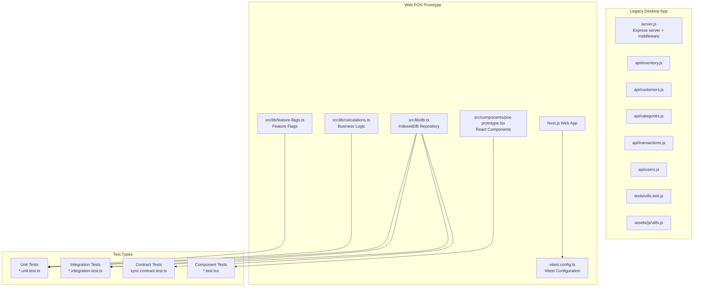
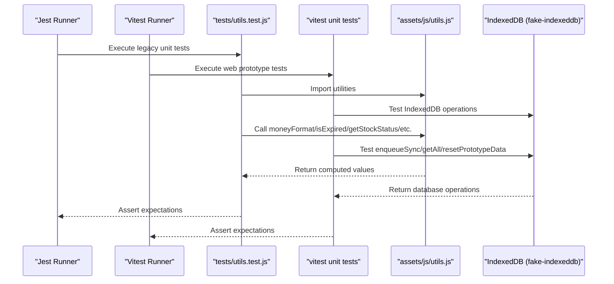
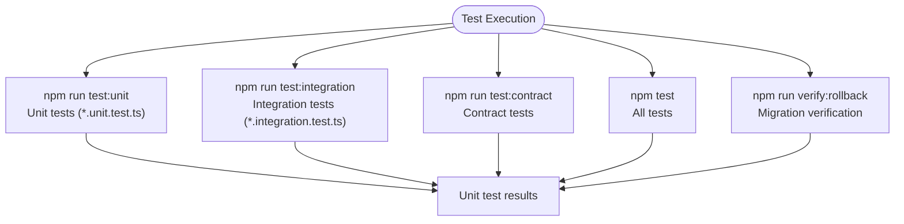
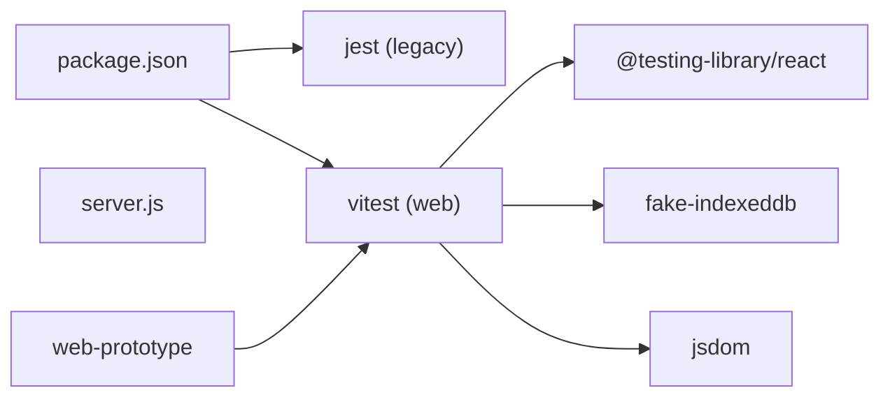

# Testing Strategy

<cite>
**Referenced Files in This Document**
- [jest.config.ts](file://jest.config.ts)
- [package.json](file://package.json)
- [tests/utils.test.js](file://tests/utils.test.js)
- [assets/js/utils.js](file://assets/js/utils.js)
- [server.js](file://server.js)
- [api/inventory.js](file://api/inventory.js)
- [api/customers.js](file://api/customers.js)
- [api/categories.js](file://api/categories.js)
- [api/transactions.js](file://api/transactions.js)
- [api/users.js](file://api/users.js)
- [.eslintrc.yml](file://.eslintrc.yml)
- [README.md](file://README.md)
- [web-prototype/vitest.config.ts](file://web-prototype/vitest.config.ts)
- [web-prototype/package.json](file://web-prototype/package.json)
- [web-prototype/src/lib/db.test.ts](file://web-prototype/src/lib/db.test.ts)
- [web-prototype/src/lib/db.integration.test.ts](file://web-prototype/src/lib/db.integration.test.ts)
- [web-prototype/src/lib/calculations.test.ts](file://web-prototype/src/lib/calculations.test.ts)
- [web-prototype/src/contracts/sync.contract.test.ts](file://web-prototype/src/contracts/sync.contract.test.ts)
- [web-prototype/src/lib/migrations.integration.test.ts](file://web-prototype/src/lib/migrations.integration.test.ts)
- [web-prototype/src/lib/feature-flags.unit.test.ts](file://web-prototype/src/lib/feature-flags.unit.test.ts)
- [web-prototype/src/components/pos-prototype.test.tsx](file://web-prototype/src/components/pos-prototype.test.tsx)
- [web-prototype/src/lib/db.ts](file://web-prototype/src/lib/db.ts)
- [web-prototype/src/lib/feature-flags.ts](file://web-prototype/src/lib/feature-flags.ts)
- [web-prototype/src/lib/calculations.ts](file://web-prototype/src/lib/calculations.ts)
- [web-prototype/src/lib/use-pos-store.ts](file://web-prototype/src/lib/use-pos-store.ts)
- [web-prototype/src/components/pos-prototype.tsx](file://web-prototype/src/components/pos-prototype.tsx)
- [web-prototype/src/lib/printer/escpos-commands.test.ts](file://web-prototype/src/lib/printer/escpos-commands.test.ts)
- [web-prototype/src/lib/printer/receipt-content.test.ts](file://web-prototype/src/lib/printer/receipt-content.test.ts)
- [web-prototype/src/lib/printer/print-queue.test.ts](file://web-prototype/src/lib/printer/print-queue.test.ts)
- [web-prototype/src/lib/printer/printer-config.test.ts](file://web-prototype/src/lib/printer/printer-config.test.ts)
- [web-prototype/src/components/receipt-preview.test.tsx](file://web-prototype/src/components/receipt-preview.test.tsx)
- [web-prototype/src/components/reprint-queue.test.tsx](file://web-prototype/src/components/reprint-queue.test.tsx)
- [web-prototype/src/lib/server/auth.test.ts](file://web-prototype/src/lib/server/auth.test.ts)
- [web-prototype/src/lib/server/db.test.ts](file://web-prototype/src/lib/server/db.test.ts)
</cite>

## Update Summary
**Changes Made**
- Added printer subsystem tests: `printer-config.test.ts` (role resolution, defaults), `print-queue.test.ts` (durable queue, expiry), `receipt-content.test.ts` (all receipt variants), `receipt-preview.test.tsx` (React preview component), `reprint-queue.test.tsx` (queue UI component)
- 12 new unit tests for OR series logic and X-Reading computation in `db.test.ts`
- ESC/POS command builder tests: 33 unit tests in `escpos-commands.test.ts`
- Enhanced confirmation dialog mocking with `vi.spyOn` for `window.confirm` in POS prototype tests
- Server-side tests: `auth.test.ts`, `db.test.ts`, `db.integration.test.ts`, `migrations.integration.test.ts` in `src/lib/server/`

## Table of Contents
1. [Introduction](#introduction)
2. [Project Structure](#project-structure)
3. [Core Testing Frameworks](#core-testing-frameworks)
4. [Architecture Overview](#architecture-overview)
5. [Detailed Component Analysis](#detailed-component-analysis)
6. [Enhanced Testing Infrastructure](#enhanced-testing-infrastructure)
7. [Web POS Prototype Testing](#web-pos-prototype-testing)
8. [Dependency Analysis](#dependency-analysis)
9. [Performance Considerations](#performance-considerations)
10. [Troubleshooting Guide](#troubleshooting-guide)
11. [Conclusion](#conclusion)
12. [Appendices](#appendices)

## Introduction
This document defines a comprehensive testing strategy for PharmaSpot POS, encompassing both the legacy Electron + Express + NeDB stack and the new Next.js web POS prototype. The strategy covers Jest configuration for legacy components, Vitest configuration for the web prototype, test structure organization, unit and integration testing approaches, mock implementations, test data management, best practices, continuous integration, and automated quality assurance. It addresses performance, security, and user acceptance testing considerations tailored to both stacks.

## Project Structure
PharmaSpot POS consists of two distinct testing environments: the legacy Electron desktop application and the new Next.js web POS prototype. The legacy system uses Jest for unit and integration tests, while the web prototype uses Vitest with specialized configurations for different test types.

**Diagram sources**
- [server.js:1-68](file://server.js#L1-L68)
- [web-prototype/vitest.config.ts:1-16](file://web-prototype/vitest.config.ts#L1-L16)
- [web-prototype/src/lib/db.ts:1-241](file://web-prototype/src/lib/db.ts#L1-L241)
- [web-prototype/src/lib/calculations.ts:1-78](file://web-prototype/src/lib/calculations.ts#L1-L78)
- [web-prototype/src/lib/feature-flags.ts:1-17](file://web-prototype/src/lib/feature-flags.ts#L1-L17)
- [web-prototype/src/components/pos-prototype.test.tsx:1-211](file://web-prototype/src/components/pos-prototype.test.tsx#L1-L211)

**Section sources**
- [server.js:1-68](file://server.js#L1-L68)
- [web-prototype/vitest.config.ts:1-16](file://web-prototype/vitest.config.ts#L1-L16)
- [README.md:70-77](file://README.md#L70-L77)

## Core Testing Frameworks

### Legacy System - Jest Configuration
The legacy system maintains its existing Jest configuration with coverage collection, automatic mock clearing, and test directory targeting. Scripts define comprehensive test commands for different test types.

### Web Prototype - Vitest Configuration
The web POS prototype introduces Vitest as the primary testing framework with specialized configurations for different test types:

- **Unit Tests**: Isolated business logic testing for calculations, feature flags, and utility functions
- **Integration Tests**: Database operations and feature flag migrations using fake-indexeddb
- **Contract Tests**: API contract validation for offline synchronization
- **Component Tests**: React component testing with Testing Library

**Section sources**
- [jest.config.ts:18-39](file://jest.config.ts#L18-L39)
- [jest.config.ts:125-131](file://jest.config.ts#L125-L131)
- [jest.config.ts:157-161](file://jest.config.ts#L157-L161)
- [web-prototype/vitest.config.ts:1-16](file://web-prototype/vitest.config.ts#L1-L16)
- [web-prototype/package.json:5-17](file://web-prototype/package.json#L5-L17)

## Architecture Overview
The testing architecture implements a multi-layered approach with both legacy and modern testing strategies. The legacy system focuses on mocking external dependencies for deterministic unit tests, while the web prototype emphasizes realistic database testing with IndexedDB and comprehensive component testing.

**Diagram sources**
- [tests/utils.test.js:1-191](file://tests/utils.test.js#L1-L191)
- [web-prototype/src/lib/db.test.ts:1-31](file://web-prototype/src/lib/db.test.ts#L1-L31)
- [assets/js/utils.js:1-112](file://assets/js/utils.js#L1-L112)

## Detailed Component Analysis

### Legacy System Testing Strategy
The legacy system maintains its proven testing approach with comprehensive coverage of utilities, API endpoints, and database operations.

#### Jest Configuration and Coverage
- Coverage collection enabled with V8 provider and output to coverage/
- Automatic mock clearing prevents state leakage between tests
- Test command runs Jest globally via devDependencies
- Scripts define comprehensive test commands for different components

#### Unit Testing Strategy for JavaScript Utilities
Demonstrates robust mocking and assertion patterns:
- Mocking fs and crypto to isolate filesystem and cryptographic operations
- Overriding moment to fixed date for deterministic date comparisons
- Comprehensive assertions for currency formatting, expiry calculation, stock status logic
- Edge case coverage for zero/negative values, string-to-number conversions, invalid inputs

**Section sources**
- [jest.config.ts:18-39](file://jest.config.ts#L18-L39)
- [jest.config.ts:157-161](file://jest.config.ts#L157-L161)
- [tests/utils.test.js:1-191](file://tests/utils.test.js#L1-L191)

### API Endpoint Testing Strategy
API modules expose CRUD endpoints backed by NeDB with recommended testing approaches:
- Unit tests for exported helper functions using isolated mocks
- Integration tests mounting Express app with controlled request bodies
- Database isolation using temporary databases for cross-test contamination prevention
- Validation of error responses and HTTP status codes for malformed inputs

**Section sources**
- [api/inventory.js:1-333](file://api/inventory.js#L1-L333)
- [api/customers.js:1-151](file://api/customers.js#L1-L151)
- [api/categories.js:1-124](file://api/categories.js#L1-L124)
- [api/transactions.js:1-251](file://api/transactions.js#L1-L251)
- [api/users.js:1-311](file://api/users.js#L1-L311)

## Enhanced Testing Infrastructure

### New Testing Infrastructure Overview
The enhanced testing infrastructure introduces four distinct test categories for the web POS prototype:

1. **Unit Tests**: Isolated business logic testing for pure functions
2. **Integration Tests**: Database operations and feature flag migrations
3. **Contract Tests**: API contract validation for offline synchronization
4. **Migration Verification**: Database schema migration testing

### Test Command Structure
The web prototype implements specialized test commands for different testing scenarios:

**Diagram sources**
- [web-prototype/package.json:9-16](file://web-prototype/package.json#L9-L16)

**Section sources**
- [web-prototype/package.json:5-17](file://web-prototype/package.json#L5-L17)

## Web POS Prototype Testing

### Unit Testing Strategy
Unit tests focus on pure business logic functions with comprehensive edge case coverage:

#### Business Logic Testing
- **Calculations**: Cart totals, change calculation, stock decrement, expiry detection
- **Feature Flags**: Default values, merging partial configurations
- **Money Functions**: Proper rounding and precision handling

#### Test Organization
- Separate test files for each functional area
- Comprehensive test coverage for edge cases and boundary conditions
- Type-safe testing with TypeScript interfaces

**Section sources**
- [web-prototype/src/lib/calculations.test.ts:1-107](file://web-prototype/src/lib/calculations.test.ts#L1-L107)
- [web-prototype/src/lib/feature-flags.unit.test.ts:1-21](file://web-prototype/src/lib/feature-flags.unit.test.ts#L1-L21)

### Integration Testing Strategy
Integration tests validate database operations and feature flag management using fake-indexeddb for realistic testing:

#### Database Testing
- **Seed Operations**: Initial data population and validation
- **Sync Queue Management**: Pending/synced status transitions
- **Feature Flag Migrations**: Backward compatibility and staged rollouts
- **OR Series Logic**: BIR OR number auto-increment and series exhaustion detection
- **X-Reading Computation**: Sales snapshot calculations from transaction data

#### Migration Testing
- **Schema Versioning**: Database schema upgrade validation through v5
- **Rollback Procedures**: Kill-switch functionality testing
- **Data Integrity**: Ensuring data consistency during migrations
- **New Store Creation**: Verification that all 18 IndexedDB stores are created on upgrade

**Section sources**
- [web-prototype/src/lib/db.test.ts:1-31](file://web-prototype/src/lib/db.test.ts#L1-L31)
- [web-prototype/src/lib/db.integration.test.ts:1-20](file://web-prototype/src/lib/db.integration.test.ts#L1-L20)
- [web-prototype/src/lib/migrations.integration.test.ts:1-18](file://web-prototype/src/lib/migrations.integration.test.ts#L1-L18)

### Contract Testing Strategy
Contract tests ensure the offline synchronization system maintains consistent data structures:

#### Sync Queue Contract
- **Data Structure Validation**: Ensures consistent queue item format
- **Status Management**: Pending/synced state transitions
- **Timestamp Consistency**: ISO format timestamp validation
- **Retry Mechanism**: Retry count and error tracking

**Section sources**
- [web-prototype/src/contracts/sync.contract.test.ts:1-25](file://web-prototype/src/contracts/sync.contract.test.ts#L1-L25)

### Component Testing Strategy
React component testing validates UI behavior and user interactions:

#### Admin Interface Testing
- **Product Management**: Search, filter, sort, and CRUD operations
- **Table Rendering**: Pagination, record counts, and data presentation
- **User Interactions**: Featured toggling, edit/delete operations
- **Mock Integration**: Store integration testing with comprehensive mocking

#### Enhanced Confirmation Dialog Testing
**Updated** The component testing now includes sophisticated confirmation dialog mocking for delete operations:

- **Window.confirm Mocking**: Uses `vi.spyOn(window, "confirm").mockReturnValue(true)` to simulate user confirmation
- **Delete Flow Validation**: Verifies that confirmed deletions trigger `removeEntity` calls
- **Cleanup Procedures**: Properly restores the original `window.confirm` function after tests
- **Edge Case Coverage**: Tests both confirmed and unconfirmed deletion scenarios

#### Testing Library Integration
- **DOM Queries**: Role-based and text-based element selection
- **Event Simulation**: Realistic user interaction simulation
- **State Validation**: Component state and prop validation

**Section sources**
- [web-prototype/src/components/pos-prototype.test.tsx:1-211](file://web-prototype/src/components/pos-prototype.test.tsx#L1-L211)

### Database Testing with IndexedDB
The web prototype implements comprehensive IndexedDB testing using fake-indexeddb:

#### Database Operations
- **Connection Management**: Promise-based database connections
- **Transaction Handling**: Read-write transaction patterns
- **Query Operations**: Get all, get one, put operations
- **Migration Support**: Schema versioning and data migration

#### Test Environment Setup
- **Automatic Seeding**: Demo data population on first load
- **Isolation**: Per-test database reset and cleanup
- **Realistic Behavior**: Fake IndexedDB mimics real database behavior

**Section sources**
- [web-prototype/src/lib/db.ts:1-241](file://web-prototype/src/lib/db.ts#L1-L241)

### Feature Flag Testing
Comprehensive feature flag testing ensures safe progressive rollouts:

#### Default Configuration
- **Safe Defaults**: All features disabled by default
- **Type Safety**: Strict typing for feature flag keys
- **Merge Strategy**: Safe merging of partial configurations

#### Rollout Testing
- **Staged Rollouts**: Individual feature enablement testing
- **Kill Switches**: Rollback and emergency disable functionality
- **Backward Compatibility**: Migration testing for new features

**Section sources**
- [web-prototype/src/lib/feature-flags.ts:1-17](file://web-prototype/src/lib/feature-flags.ts#L1-L17)
- [web-prototype/src/lib/feature-flags.unit.test.ts:1-21](file://web-prototype/src/lib/feature-flags.unit.test.ts#L1-L21)

### Observability and Monitoring Testing
The prototype includes comprehensive observability testing:

#### Telemetry Events
- **Event Recording**: Structured logging of user actions
- **Performance Metrics**: Sync lag, queue depth monitoring
- **Alert Generation**: SLO-based alerting system

#### Testing Approach
- **Snapshot Validation**: Observability metrics snapshot testing
- **Alert Evaluation**: SLA compliance testing
- **Integration Testing**: End-to-end observability flow validation

**Section sources**
- [web-prototype/src/lib/use-pos-store.ts:374-387](file://web-prototype/src/lib/use-pos-store.ts#L374-L387)

## Dependency Analysis
The enhanced testing infrastructure introduces new dependencies and configurations:

### Legacy Dependencies
- Jest remains configured as dev dependency
- Existing server and API module dependencies preserved
- Package manager scripts maintained for backward compatibility

### Web Prototype Dependencies
- **Vitest**: Primary testing framework with TypeScript support
- **Testing Library**: React component testing utilities
- **Fake IndexedDB**: Realistic IndexedDB testing environment
- **JS DOM**: Browser environment simulation for component tests

**Diagram sources**
- [package.json:115-145](file://package.json#L115-L145)
- [web-prototype/package.json:23-32](file://web-prototype/package.json#L23-L32)

**Section sources**
- [package.json:115-145](file://package.json#L115-L145)
- [web-prototype/package.json:23-32](file://web-prototype/package.json#L23-L32)

## Performance Considerations
Enhanced performance considerations for the multi-framework testing approach:

### Legacy System Optimization
- Lightweight mocks for filesystem and crypto operations
- In-memory NeDB databases for integration tests
- Parallel test execution where possible

### Web Prototype Optimization
- **Fake IndexedDB**: Fast in-memory database for testing
- **Component Testing**: Efficient DOM queries with Testing Library
- **TypeScript Compilation**: Fast incremental compilation for unit tests
- **Test Isolation**: Per-test database reset minimizes cleanup overhead

### CI/CD Performance
- **Parallel Execution**: Separate test suites can run concurrently
- **Selective Testing**: Test-specific commands for faster feedback
- **Caching**: Test dependency caching in CI environments

## Troubleshooting Guide

### Legacy System Issues
- **Filesystem Access Failures**: Ensure fs/crypto mocks are properly configured
- **Date-Dependent Flakiness**: Mock moment to fixed dates in tests
- **CORS/Rate Limit Errors**: Configure appropriate headers in test environments

### Web Prototype Issues
- **IndexedDB Test Failures**: Verify fake-indexeddb auto-import is working
- **Component Test Crashes**: Check JSDOM environment configuration
- **Feature Flag Conflicts**: Validate merge strategy in test setup
- **Sync Queue Contract Violations**: Review queue item structure validation
- **Confirmation Dialog Issues**: Ensure `window.confirm` mocking is properly restored after tests

### Multi-Framework Issues
- **Test Command Conflicts**: Use framework-specific test scripts
- **Coverage Reporting**: Configure separate coverage reports for each framework
- **CI Integration**: Implement proper test gating for both frameworks

**Section sources**
- [tests/utils.test.js:14-16](file://tests/utils.test.js#L14-L16)
- [web-prototype/src/lib/db.test.ts:1-31](file://web-prototype/src/lib/db.test.ts#L1-L31)
- [web-prototype/src/components/pos-prototype.test.tsx:1-211](file://web-prototype/src/components/pos-prototype.test.tsx#L1-L211)

## Conclusion
The enhanced testing strategy successfully integrates both legacy and modern testing approaches for PharmaSpot POS. The addition of Vitest for the web POS prototype, comprehensive test types (unit, integration, contract, migration), and specialized testing infrastructure significantly strengthens the project's quality assurance capabilities. The multi-framework approach provides both backward compatibility with existing legacy tests and forward-looking testing practices for the new web prototype.

**Updated** The printer subsystem has introduced several new test files: `printer-config.test.ts` validates role resolution and default printer assignment, `print-queue.test.ts` tests durable queue persistence and expiry behavior, `receipt-content.test.ts` covers all receipt variants with 22 unit tests, and `escpos-commands.test.ts` provides 33 unit tests for the ESC/POS builder. Component tests for `receipt-preview.test.tsx` and `reprint-queue.test.tsx` validate the React UI components. Additionally, 12 new unit tests in `db.test.ts` cover OR series logic and X-Reading computation from real transaction data.

## Appendices

### Testing Checklist Matrix
| Test Type | Legacy System | Web Prototype | Coverage |
|-----------|---------------|---------------|----------|
| Unit Tests | ✅ Jest | ✅ Vitest | Business Logic |
| Integration Tests | ✅ NeDB | ✅ IndexedDB | Database Ops |
| Contract Tests | ❌ | ✅ Vitest | API Contracts |
| Component Tests | ❌ | ✅ Testing Library | UI Behavior |
| Migration Tests | ❌ | ✅ Vitest | Schema Changes |
| Feature Flag Tests | ❌ | ✅ Vitest | Progressive Rollout |
| Printer Tests | ❌ | ✅ Vitest | ESC/POS, Config, Queue |

### CI/CD Integration
- **GitHub Actions**: Build and release workflows support both test frameworks
- **Coverage Thresholds**: Separate coverage requirements for each framework
- **Test Gating**: CI gates for both legacy and web prototype tests
- **Artifact Publishing**: Separate test result artifacts for each framework

### Security Testing Considerations
- **Legacy System**: Input sanitization and authentication flow testing
- **Web Prototype**: XSS prevention, CSRF protection, and secure feature flag management
- **Database Security**: IndexedDB security and data encryption testing
- **Observability Security**: Telemetry data privacy and access control

### User Acceptance Testing (UAT) Considerations
- **Legacy System**: Electron-based testing for desktop user experience
- **Web Prototype**: Cross-browser testing and responsive design validation
- **End-to-End Flows**: Complete POS workflow testing for both platforms
- **Performance Testing**: Load testing and user experience validation

### Enhanced Testing Infrastructure Benefits
**Updated** The enhanced testing infrastructure provides several key benefits:

- **Printer Subsystem Coverage**: Comprehensive tests for ESC/POS commands, receipt content, print queue, and printer config
- **OR Series Validation**: 12 unit tests covering BIR OR number auto-increment and series exhaustion
- **X-Reading Computation**: Tests verify correct sales snapshot calculation from transaction data
- **Durable Queue Testing**: Print queue persistence, expiry, and status transitions are tested
- **Receipt Variant Coverage**: All receipt types (normal, void, reprint, x-reading, z-reading, daily-summary) are tested
- **Improved Reliability**: Sophisticated mocking of browser APIs like `window.confirm`
- **Better Test Coverage**: Comprehensive validation of user confirmation flows
- **Maintained Clean State**: Proper cleanup of global mocks after tests
- **Future-Proof Testing**: Strong foundation for additional component testing scenarios
- **Developer Experience**: Clear patterns for testing interactive UI components