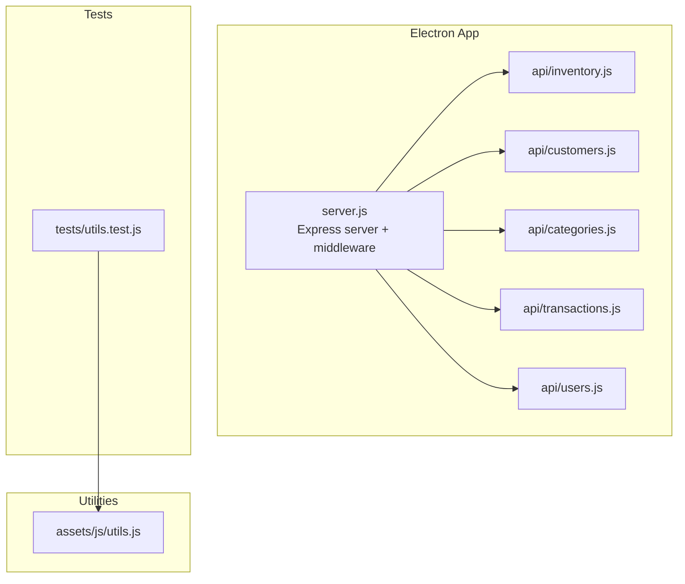
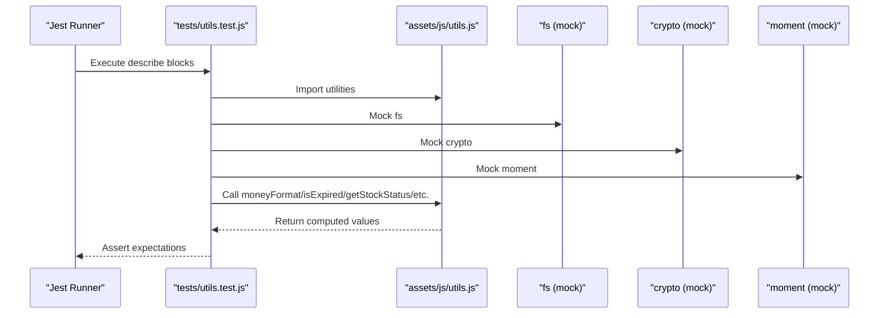
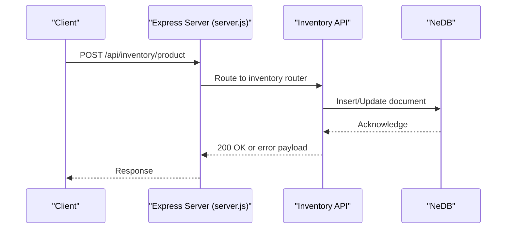
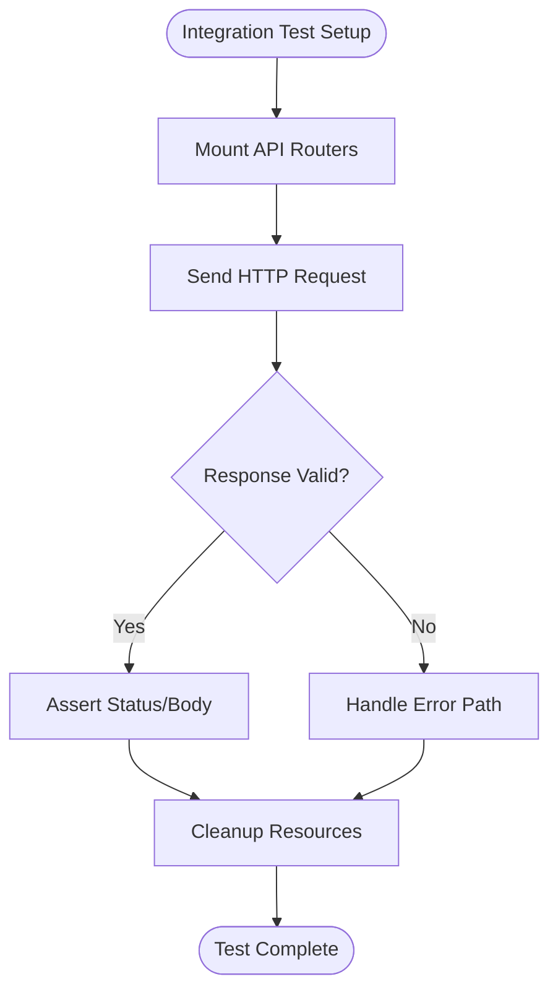
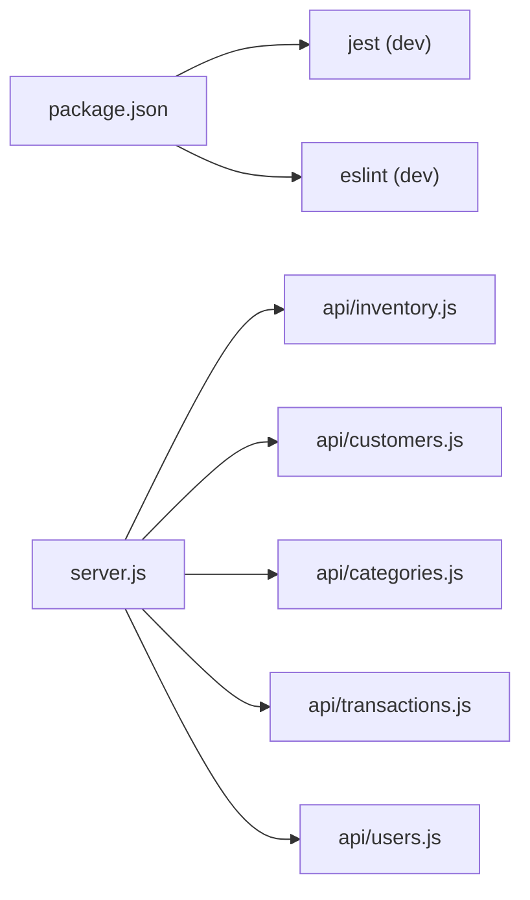

# Testing Strategy

<cite>
**Referenced Files in This Document**
- [jest.config.ts](file://jest.config.ts)
- [package.json](file://package.json)
- [tests/utils.test.js](file://tests/utils.test.js)
- [assets/js/utils.js](file://assets/js/utils.js)
- [server.js](file://server.js)
- [api/inventory.js](file://api/inventory.js)
- [api/customers.js](file://api/customers.js)
- [api/categories.js](file://api/categories.js)
- [api/transactions.js](file://api/transactions.js)
- [api/users.js](file://api/users.js)
- [.eslintrc.yml](file://.eslintrc.yml)
- [README.md](file://README.md)
</cite>

## Table of Contents
1. [Introduction](#introduction)
2. [Project Structure](#project-structure)
3. [Core Components](#core-components)
4. [Architecture Overview](#architecture-overview)
5. [Detailed Component Analysis](#detailed-component-analysis)
6. [Dependency Analysis](#dependency-analysis)
7. [Performance Considerations](#performance-considerations)
8. [Troubleshooting Guide](#troubleshooting-guide)
9. [Conclusion](#conclusion)
10. [Appendices](#appendices)

## Introduction
This document defines a comprehensive testing strategy for PharmaSpot POS. It covers the Jest configuration, test structure, unit and integration testing approaches, mock implementations, test data management, best practices, continuous integration, and automated quality assurance. It also outlines performance, security, and user acceptance testing considerations tailored to the Electron + Express + NeDB stack.

## Project Structure
PharmaSpot POS is an Electron desktop application with a Node.js/Express backend exposing REST APIs backed by NeDB databases. Tests are organized under a dedicated tests directory and leverage Jest for unit and integration-style tests. The server initializes rate limiting, CORS headers, and routes API endpoints grouped by domain (inventory, customers, categories, transactions, users).

**Diagram sources**
- [server.js:1-68](file://server.js#L1-L68)
- [api/inventory.js:1-333](file://api/inventory.js#L1-L333)
- [api/customers.js:1-151](file://api/customers.js#L1-L151)
- [api/categories.js:1-124](file://api/categories.js#L1-L124)
- [api/transactions.js:1-251](file://api/transactions.js#L1-L251)
- [api/users.js:1-311](file://api/users.js#L1-L311)
- [tests/utils.test.js:1-191](file://tests/utils.test.js#L1-L191)
- [assets/js/utils.js:1-112](file://assets/js/utils.js#L1-L112)

**Section sources**
- [server.js:1-68](file://server.js#L1-L68)
- [README.md:70-77](file://README.md#L70-L77)

## Core Components
- Jest configuration enables coverage collection with V8, clears mocks between tests, and targets the tests directory. Scripts define a test command invoking Jest.
- Utilities under assets/js/utils.js provide formatting, date calculations, stock status evaluation, file existence checks, hashing, and CSP generation helpers.
- API modules encapsulate CRUD endpoints and business logic (e.g., inventory decrementing, user authentication, transaction creation).
- The server sets up CORS, rate limiting, and mounts API routers.

Key testing configuration highlights:
- Coverage enabled with V8 provider and output directory coverage.
- Automatic mock clearing configured.
- Test command mapped to jest.

**Section sources**
- [jest.config.ts:18-39](file://jest.config.ts#L18-L39)
- [jest.config.ts:125-131](file://jest.config.ts#L125-L131)
- [jest.config.ts:157-161](file://jest.config.ts#L157-L161)
- [package.json:93-102](file://package.json#L93-L102)

## Architecture Overview
The testing architecture centers on isolating business logic in utilities and mocking external dependencies (filesystem, crypto, date libraries) for deterministic unit tests. API tests validate request/response behavior and database interactions using NeDB. Integration tests can spin up the server and exercise endpoints with in-memory or temporary databases.

**Diagram sources**
- [tests/utils.test.js:1-191](file://tests/utils.test.js#L1-L191)
- [assets/js/utils.js:1-112](file://assets/js/utils.js#L1-L112)

## Detailed Component Analysis

### Jest Configuration and Coverage
- Coverage collection is enabled with V8 and output to coverage/.
- Automatic mock clearing is enabled to prevent state leakage.
- Default test match patterns target spec/test files; roots and setup hooks are configurable but not customized in this project.
- The test script runs Jest globally installed via devDependencies.

Recommendations:
- Enforce coverage thresholds for critical modules.
- Add coverageReporters for CI-friendly formats (e.g., lcov, text-summary).
- Consider adding setupFilesAfterEnv for shared test utilities.

**Section sources**
- [jest.config.ts:18-39](file://jest.config.ts#L18-L39)
- [jest.config.ts:157-161](file://jest.config.ts#L157-L161)
- [jest.config.ts:125-131](file://jest.config.ts#L125-L131)
- [package.json:93-102](file://package.json#L93-L102)

### Unit Testing Strategy for JavaScript Utilities
The tests for assets/js/utils.js demonstrate robust mocking and assertion patterns:
- Mocking fs and crypto to isolate filesystem and cryptographic operations.
- Overriding moment to a fixed date for deterministic date comparisons.
- Comprehensive assertions for currency formatting, expiry calculation, stock status logic, file existence, and hash computation.
- Edge cases covered: zero/negative values, string-to-number conversions, invalid inputs, and large numbers.

Best practices demonstrated:
- Use jest.mock for external modules.
- Use beforeEach/afterEach to reset mocks between tests.
- Prefer descriptive test names and group related tests in describe blocks.
- Validate both success paths and error conditions.

**Section sources**
- [tests/utils.test.js:1-191](file://tests/utils.test.js#L1-L191)
- [assets/js/utils.js:1-112](file://assets/js/utils.js#L1-L112)

### API Endpoint Testing Strategy
API modules expose CRUD endpoints backed by NeDB. Recommended testing approaches:
- Unit tests for exported helper functions (e.g., inventory decrement logic) using isolated mocks.
- Integration tests that mount the Express app and hit endpoints with controlled request bodies and query parameters.
- Database isolation using temporary or in-memory databases to avoid cross-test contamination.
- Validation of error responses and HTTP status codes for malformed inputs and server errors.

Representative modules to test:
- Inventory: product creation/update, deletion, SKU lookup, and inventory decrement.
- Customers: retrieval, creation, update, deletion.
- Categories: CRUD operations with unique indexing.
- Transactions: creation, updates, deletions, filtering by date/user/till/status.
- Users: login, logout, creation/update, default admin initialization.

**Diagram sources**
- [server.js:40-45](file://server.js#L40-L45)
- [api/inventory.js:124-240](file://api/inventory.js#L124-L240)

**Section sources**
- [api/inventory.js:1-333](file://api/inventory.js#L1-L333)
- [api/customers.js:1-151](file://api/customers.js#L1-L151)
- [api/categories.js:1-124](file://api/categories.js#L1-L124)
- [api/transactions.js:1-251](file://api/transactions.js#L1-L251)
- [api/users.js:1-311](file://api/users.js#L1-L311)
- [server.js:1-68](file://server.js#L1-L68)

### Database Operations Testing Strategy
NeDB is used for local persistence. Recommended practices:
- Use separate database filenames per test suite or in-memory databases for isolation.
- Seed test data before running tests and clean up after.
- Mock NeDB queries only when testing pure logic; otherwise, test actual persistence behavior.
- Verify unique indexes and constraints (e.g., unique _id) in tests.

**Section sources**
- [api/inventory.js:46-49](file://api/inventory.js#L46-L49)
- [api/customers.js:22-25](file://api/customers.js#L22-L25)
- [api/categories.js:21-24](file://api/categories.js#L21-L24)
- [api/users.js:21-24](file://api/users.js#L21-L24)

### Integration Testing Approaches
- Spin up the Express server programmatically in a test harness and mount API routers.
- Use supertest or similar to send HTTP requests and assert responses.
- Mock external dependencies (filesystem, crypto, date libraries) to control inputs and outputs.
- For transactional integrity, test the decrementInventory flow by triggering transaction creation and verifying inventory updates.

[No sources needed since this diagram shows conceptual workflow, not actual code structure]

### Mock Implementations and Test Data Management
- Mock fs and crypto in utility tests to avoid real filesystem access and cryptographic overhead.
- Override moment to a fixed date for predictable date arithmetic.
- Manage test data via seeded documents or generated fixtures; ensure cleanup after each test.
- For file upload scenarios, mock multer and fs.unlinkSync to simulate successful and failure paths.

**Section sources**
- [tests/utils.test.js:14-16](file://tests/utils.test.js#L14-L16)
- [tests/utils.test.js:28-31](file://tests/utils.test.js#L28-L31)
- [api/inventory.js:124-240](file://api/inventory.js#L124-L240)

### Continuous Integration and Automated Quality Assurance
- The repository README indicates GitHub Actions workflows for build and release, implying CI support.
- Configure Jest to run in CI with coverage thresholds and fail builds on coverage or test failures.
- Integrate ESLint to enforce code quality and consistent testing patterns.

Recommended CI steps:
- Install dependencies.
- Run linting.
- Run tests with coverage.
- Publish coverage artifacts.

**Section sources**
- [README.md:1-3](file://README.md#L1-L3)
- [package.json:115-145](file://package.json#L115-L145)
- [.eslintrc.yml:1-8](file://.eslintrc.yml#L1-L8)

### Writing Effective Tests and Maintaining Test Suites
Guidelines:
- Use clear, descriptive test names that explain intent.
- Group related tests with describe blocks and organize files by feature.
- Keep tests independent; avoid shared mutable state.
- Prefer small, focused tests that validate a single behavior.
- Use beforeEach/afterEach for setup/cleanup.
- Maintain a balance between unit and integration tests; favor unit tests for pure logic and integration tests for end-to-end flows.

**Section sources**
- [tests/utils.test.js:18-23](file://tests/utils.test.js#L18-L23)
- [tests/utils.test.js:33-51](file://tests/utils.test.js#L33-L51)
- [tests/utils.test.js:56-74](file://tests/utils.test.js#L56-L74)
- [tests/utils.test.js:77-120](file://tests/utils.test.js#L77-L120)

## Dependency Analysis
Jest is configured as a dev dependency and invoked via npm scripts. The server depends on Express, body-parser, rate-limit, and CORS middleware. API modules depend on NeDB, validators, sanitizers, and upload handlers.

**Diagram sources**
- [package.json:115-145](file://package.json#L115-L145)
- [server.js:40-45](file://server.js#L40-L45)
- [api/inventory.js:1-333](file://api/inventory.js#L1-L333)
- [api/customers.js:1-151](file://api/customers.js#L1-L151)
- [api/categories.js:1-124](file://api/categories.js#L1-L124)
- [api/transactions.js:1-251](file://api/transactions.js#L1-L251)
- [api/users.js:1-311](file://api/users.js#L1-L311)

**Section sources**
- [package.json:115-145](file://package.json#L115-L145)
- [server.js:1-68](file://server.js#L1-L68)

## Performance Considerations
- Use lightweight mocks for filesystem and crypto to reduce test runtime.
- Avoid real database writes in unit tests; prefer in-memory or temporary databases for integration tests.
- Parallelize independent tests; avoid heavy synchronous operations in tests.
- Profile slow tests and refactor complex setups into smaller, focused units.

[No sources needed since this section provides general guidance]

## Troubleshooting Guide
Common issues and resolutions:
- Tests failing due to filesystem access: Ensure fs/crypto are mocked in tests.
- Date-dependent tests flaking: Mock moment to a fixed date.
- CORS or rate limit errors in integration tests: Configure appropriate headers and disable rate limiting in test environments.
- NeDB concurrency issues: Use isolated databases per test or suite.

**Section sources**
- [tests/utils.test.js:14-16](file://tests/utils.test.js#L14-L16)
- [tests/utils.test.js:28-31](file://tests/utils.test.js#L28-L31)
- [server.js:11-20](file://server.js#L11-L20)

## Conclusion
This testing strategy leverages Jest’s built-in capabilities to test utilities and APIs effectively. By mocking external dependencies, organizing tests by feature, and integrating coverage reporting, PharmaSpot POS can maintain high-quality, reliable code. Extending the strategy to include integration tests, CI enforcement, and coverage thresholds will further strengthen the project’s stability and developer confidence.

## Appendices

### API Testing Checklist
- Verify CRUD endpoints return correct status codes and payloads.
- Validate error handling for missing parameters and invalid inputs.
- Test database constraints (unique indexes) and edge cases.
- Confirm middleware effects (CORS, rate limiting) in integration tests.

**Section sources**
- [api/inventory.js:124-240](file://api/inventory.js#L124-L240)
- [api/customers.js:82-95](file://api/customers.js#L82-L95)
- [api/categories.js:59-97](file://api/categories.js#L59-L97)
- [api/transactions.js:163-181](file://api/transactions.js#L163-L181)
- [api/users.js:95-131](file://api/users.js#L95-L131)

### Security Testing Considerations
- Validate Content-Security-Policy generation and hash computation for bundled assets.
- Ensure input sanitization and escaping are applied consistently across APIs.
- Test authentication flows and permission checks.

**Section sources**
- [assets/js/utils.js:91-99](file://assets/js/utils.js#L91-L99)
- [api/users.js:95-131](file://api/users.js#L95-L131)
- [api/inventory.js:178-193](file://api/inventory.js#L178-L193)

### User Acceptance Testing (UAT) Considerations
- Automate end-to-end flows using Electron-based test frameworks to simulate real user interactions.
- Validate receipt printing, transaction history, and inventory updates.
- Perform smoke tests across supported platforms.

[No sources needed since this section provides general guidance]