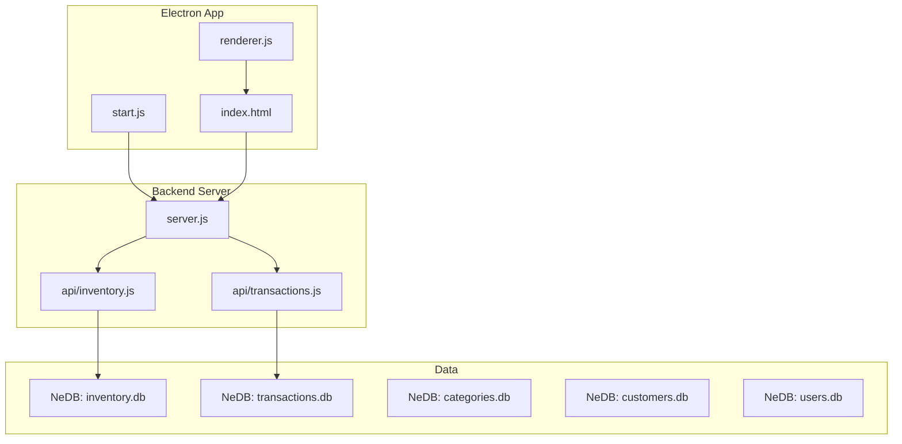
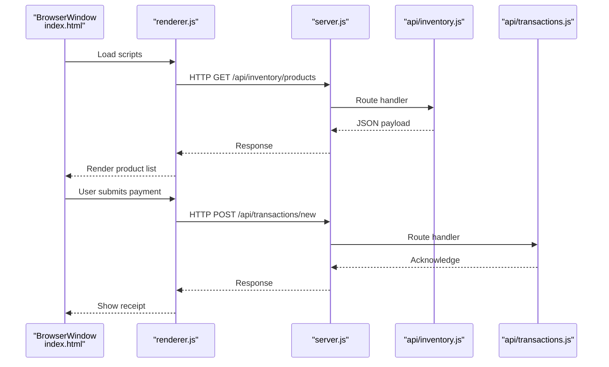
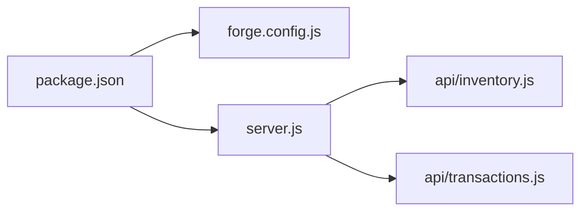

# Troubleshooting and FAQ

<cite>
**Referenced Files in This Document**
- [README.md](file://README.md)
- [package.json](file://package.json)
- [app.config.js](file://app.config.js)
- [server.js](file://server.js)
- [start.js](file://start.js)
- [forge.config.js](file://forge.config.js)
- [installers/setupEvents.js](file://installers/setupEvents.js)
- [api/inventory.js](file://api/inventory.js)
- [api/transactions.js](file://api/transactions.js)
- [assets/js/utils.js](file://assets/js/utils.js)
- [assets/js/pos.js](file://assets/js/pos.js)
- [index.html](file://index.html)
- [yarn-error.log](file://yarn-error.log)
</cite>

## Table of Contents
1. [Introduction](#introduction)
2. [Project Structure](#project-structure)
3. [Core Components](#core-components)
4. [Architecture Overview](#architecture-overview)
5. [Detailed Component Analysis](#detailed-component-analysis)
6. [Dependency Analysis](#dependency-analysis)
7. [Performance Considerations](#performance-considerations)
8. [Troubleshooting Guide](#troubleshooting-guide)
9. [Conclusion](#conclusion)
10. [Appendices](#appendices)

## Introduction
This document provides comprehensive troubleshooting guidance for PharmaSpot POS, covering installation issues, runtime errors, configuration problems, platform-specific concerns, performance optimization, memory management, resource monitoring, error interpretation, log analysis, debugging procedures, network connectivity, database issues, and printer configuration. It also includes FAQs about system requirements, feature limitations, and upgrade procedures, along with escalation and support resources.

## Project Structure
PharmaSpot POS is a cross-platform Electron application with a Node.js/Express backend serving APIs consumed by the frontend. The backend persists data locally using NeDB and exposes endpoints for inventory, transactions, categories, customers, users, and settings. Packaging and distribution are handled via Electron Forge with platform-specific makers.

**Diagram sources**
- [start.js:1-107](file://start.js#L1-L107)
- [server.js:1-68](file://server.js#L1-L68)
- [api/inventory.js:1-333](file://api/inventory.js#L1-L333)
- [api/transactions.js:1-251](file://api/transactions.js#L1-L251)

**Section sources**
- [README.md:1-91](file://README.md#L1-L91)
- [package.json:1-147](file://package.json#L1-L147)
- [forge.config.js:1-71](file://forge.config.js#L1-L71)

## Core Components
- Electron bootstrap and lifecycle: Initializes the app, sets up menus, handles squirrel installer events, and loads the renderer.
- Backend HTTP server: Express server with CORS, rate limiting, and API routes for inventory and transactions.
- Local databases: NeDB-backed stores for inventory, transactions, categories, customers, and users.
- Frontend: HTML/JS UI that communicates with the backend via HTTP, handles payments, printing, and settings.

Key runtime environment variables and ports:
- Port is derived from process.env.PORT or defaults to 3210.
- APPDATA and APPNAME are set from Electron’s app paths.

**Section sources**
- [start.js:1-107](file://start.js#L1-L107)
- [server.js:1-68](file://server.js#L1-L68)
- [api/inventory.js:1-333](file://api/inventory.js#L1-L333)
- [api/transactions.js:1-251](file://api/transactions.js#L1-L251)

## Architecture Overview
The system runs as a single-process Electron app with an embedded HTTP server. The renderer loads index.html and communicates with the backend APIs exposed by server.js. Data is persisted locally using NeDB.

**Diagram sources**
- [index.html:1-884](file://index.html#L1-L884)
- [assets/js/pos.js:1-800](file://assets/js/pos.js#L1-L800)
- [server.js:1-68](file://server.js#L1-L68)
- [api/inventory.js:1-333](file://api/inventory.js#L1-L333)
- [api/transactions.js:1-251](file://api/transactions.js#L1-L251)

## Detailed Component Analysis

### Installation and Packaging
- Packaging targets Windows (.exe), Linux (deb/rpm), and macOS (dmg).
- Hooks prune node_gyp_bins on Linux to fix packaging issues.
- Squirrel installer event handling supports install/update/uninstall.

Platform-specific notes:
- Windows: Installer shortcuts managed via Squirrel events.
- Linux: Maker hooks remove node_gyp_bins to avoid packaging bloat.
- macOS: DMG builder configured with ULFO format.

**Section sources**
- [forge.config.js:1-71](file://forge.config.js#L1-L71)
- [installers/setupEvents.js:1-65](file://installers/setupEvents.js#L1-L65)

### Backend Server and APIs
- Express server initializes body parsing, rate limiting, and CORS.
- Routes mounted under /api for inventory, customers, categories, settings, users, and transactions.
- Restart mechanism clears module cache and re-requires server module.

Common backend endpoints:
- GET /api/inventory/products
- POST /api/inventory/product
- POST /api/inventory/product/sku
- POST /api/transactions/new
- GET /api/transactions/on-hold
- GET /api/transactions/by-date

**Section sources**
- [server.js:1-68](file://server.js#L1-L68)
- [api/inventory.js:1-333](file://api/inventory.js#L1-L333)
- [api/transactions.js:1-251](file://api/transactions.js#L1-L251)

### Frontend Runtime and Printing
- Renderer loads jQuery, POS logic, product filtering, checkout, and print-js.
- Content Security Policy is injected dynamically to allow local connect-src to localhost:PORT.
- Printing uses print-js for receipts.

Printer configuration:
- Ensure print-js is available and accessible in the packaged app.
- If printing fails, verify the printer driver and permissions.

**Section sources**
- [renderer.js:1-5](file://renderer.js#L1-L5)
- [assets/js/utils.js:91-99](file://assets/js/utils.js#L91-L99)
- [assets/js/pos.js:715-717](file://assets/js/pos.js#L715-L717)

### Data Persistence and Paths
- NeDB databases are stored under process.env.APPDATA + process.env.APPNAME + "/server/databases".
- Inventory and transactions endpoints reference these paths.

Potential issues:
- Missing APPDATA or APPNAME environment variables.
- Permission errors writing to user profile directory.

**Section sources**
- [api/inventory.js:20-26](file://api/inventory.js#L20-L26)
- [api/transactions.js:9-15](file://api/transactions.js#L9-L15)

## Dependency Analysis
Electron Forge configuration defines platform-specific makers and publishers. The app depends on Express, NeDB, and several UI/printing libraries.

**Diagram sources**
- [package.json:1-147](file://package.json#L1-L147)
- [forge.config.js:1-71](file://forge.config.js#L1-L71)
- [server.js:1-68](file://server.js#L1-L68)
- [api/inventory.js:1-333](file://api/inventory.js#L1-L333)
- [api/transactions.js:1-251](file://api/transactions.js#L1-L251)

**Section sources**
- [package.json:1-147](file://package.json#L1-L147)
- [forge.config.js:1-71](file://forge.config.js#L1-L71)

## Performance Considerations
- Rate limiting: Express rate limiter restricts requests to 100 per 15 minutes. High-volume operations may trigger throttling.
- Local databases: NeDB is lightweight but not optimized for very large datasets. Consider indexing and query optimization.
- Rendering: Large product lists can impact UI responsiveness; virtualization or pagination could help.
- Printing: print-js operations can block UI; offload heavy rendering to background threads if needed.

[No sources needed since this section provides general guidance]

## Troubleshooting Guide

### Installation Issues
- Windows installer shortcuts not created:
  - Verify Squirrel event handling is executed during install/update.
  - Check Windows Event Viewer for installer errors.
- Linux packaging failures:
  - Ensure node_gyp_bins are pruned via the hook in forge.config.js.
  - Confirm dependencies are installed and writable in the target environment.
- macOS DMG creation:
  - Validate certificate and notarization settings if publishing is enabled.

**Section sources**
- [installers/setupEvents.js:1-65](file://installers/setupEvents.js#L1-L65)
- [forge.config.js:54-69](file://forge.config.js#L54-L69)

### Runtime Errors and Crashes
- Application fails to start:
  - Check uncaught exceptions and unhandled rejections captured in start.js.
  - Verify Electron initialization and BrowserWindow creation.
- Backend server not responding:
  - Confirm port binding and rate limit configuration.
  - Validate route mounting and module exports.

**Section sources**
- [start.js:67-73](file://start.js#L67-L73)
- [server.js:47-50](file://server.js#L47-L50)

### Configuration Problems
- API base URL mismatch:
  - Frontend constructs API URL using host/port from environment variables.
  - Network terminals should set platform IP/port in settings to point to the server machine.
- Content Security Policy:
  - CSP allows connect-src to http://localhost:PORT; ensure the backend is reachable on that port.

**Section sources**
- [assets/js/pos.js:45-48](file://assets/js/pos.js#L45-L48)
- [assets/js/utils.js:91-99](file://assets/js/utils.js#L91-L99)

### Platform-Specific Troubleshooting
- Windows:
  - If bcrypt-related errors occur during install, ensure compatible Node and Python versions for native builds.
  - Review Yarn error logs for permission or unlink errors.
- Linux:
  - Packaging hook removes node_gyp_bins; ensure the target system has necessary build tools if rebuilding.
- macOS:
  - DMG builder configured; verify signing and notarization steps if distributing.

**Section sources**
- [yarn-error.log:1-800](file://yarn-error.log#L1-L800)
- [forge.config.js:54-69](file://forge.config.js#L54-L69)

### Network Connectivity
- Cannot reach backend:
  - Confirm process.env.PORT is set and server listens on the expected port.
  - From client machines, ensure firewall allows connections to the backend port.
- Cross-origin issues:
  - CORS headers are set globally; verify requests originate from allowed origins.

**Section sources**
- [server.js:10-34](file://server.js#L10-L34)
- [server.js:47-50](file://server.js#L47-L50)

### Database Problems
- NeDB path resolution:
  - Ensure APPDATA and APPNAME are correctly set by Electron.
  - Check write permissions to the user profile directory.
- Data corruption or missing indices:
  - Re-create indices if needed; NeDB ensures unique constraints on keys.

**Section sources**
- [api/inventory.js:20-26](file://api/inventory.js#L20-L26)
- [api/transactions.js:9-15](file://api/transactions.js#L9-L15)

### Printer Configuration Challenges
- Printing does not work:
  - Verify print-js availability and printer drivers.
  - On Windows/Linux/macOS, ensure default printer is configured and accessible to the app.
- Receipt rendering:
  - If receipt appears blank, confirm print job completion callback and printer queue.

**Section sources**
- [assets/js/pos.js:715-717](file://assets/js/pos.js#L715-L717)
- [renderer.js:1-5](file://renderer.js#L1-L5)

### Error Message Interpretation and Log Analysis
- Uncaught exceptions and unhandled rejections are logged in start.js; inspect logs for stack traces.
- Yarn error logs capture permission and unlink errors during dependency installation.
- Backend routes return structured error messages; check HTTP status codes and JSON bodies.

**Section sources**
- [start.js:67-73](file://start.js#L67-L73)
- [yarn-error.log:1-800](file://yarn-error.log#L1-L800)
- [api/inventory.js:124-141](file://api/inventory.js#L124-L141)
- [api/transactions.js:163-180](file://api/transactions.js#L163-L180)

### Debugging Procedures
- Enable live reload during development (start.js checks app.isPackaged).
- Use developer tools context menu to refresh the app.
- Inspect network requests in DevTools to verify API responses.

**Section sources**
- [start.js:99-104](file://start.js#L99-L104)
- [start.js:88-97](file://start.js#L88-L97)

### Frequently Asked Questions

- System requirements:
  - PharmaSpot POS is a cross-platform Electron app. Minimum OS versions depend on Electron Forge makers; refer to the repository’s supported platforms.
- Feature limitations:
  - Multi-PC support relies on a central server; clients must specify server IP/port in settings.
  - Receipt printing depends on local printer configuration.
- Upgrade procedures:
  - Auto-updater events are wired in the native menu controller; ensure update server is reachable and properly configured.

**Section sources**
- [README.md:61-82](file://README.md#L61-L82)
- [assets/js/pos.js:196-204](file://assets/js/pos.js#L196-L204)
- [assets/js/native_menu/menuController.js:125-132](file://assets/js/native_menu/menuController.js#L125-L132)

### Escalation Procedures and Support Resources
- Report issues via GitHub Issues as indicated in the repository.
- Include environment details, logs, and reproduction steps.

**Section sources**
- [README.md:82-82](file://README.md#L82-L82)

## Conclusion
This guide consolidates troubleshooting strategies for PharmaSpot POS across installation, runtime, configuration, networking, databases, and printing. By following the platform-specific steps, interpreting error messages, and leveraging logs, most issues can be resolved quickly. For persistent problems, escalate via the repository’s issue tracker with detailed diagnostics.

[No sources needed since this section summarizes without analyzing specific files]

## Appendices

### Appendix A: Environment Variables and Ports
- PORT: Backend listening port (defaults to 3210).
- APPDATA: User application data directory.
- APPNAME: Application name used to construct data paths.

**Section sources**
- [server.js:8-10](file://server.js#L8-L10)
- [api/inventory.js:18-19](file://api/inventory.js#L18-L19)
- [api/transactions.js:7-8](file://api/transactions.js#L7-L8)